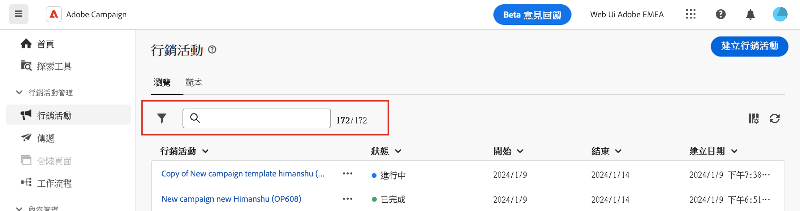

# Discover the interface {#user-interface}

>[!CONTEXTUALHELP]
>id="acw_homepage_learnmore"
>title="Discover the interface"
>abstract="The new Campaign v8 Web interface offers an integrated, intuitive and consistent user experience."

The new Campaign v8 Web interface offers a modern and intuitive user experience to simplify marketing campaign design and delivery. This new interface is integrated with Adobe Experience Platform. 

<!--
Key concepts when browsing the user interface are common with Adobe Experience Platform. Refer to [Adobe Experience Platform documentation](https://experienceleague.adobe.com/docs/experience-platform/landing/platform-ui/ui-guide.html#adobe-experience-platform-ui-guide) for more details.
-->

>[!NOTE]
>
>This documentation is frequently updated to reflect latest changes in the product user interface. However, some screenshots can slightly differ from your user interface.

<!--
* console + web interface (overview, why use each of them)
* web UI made up of read-only lists that can be configured, show how to add columns
-->

## Left navigation menu

Browse the links on the left to access Campaign v8 Web capabilities. Several links display lists of objects which can be sorted and filtered. You can also configure columns to display all the information you need. See this [section](#list-screens). All list screens are read-only, except the email delivery list. Clicking on any list item for edition/viewing is not available in Alpha. All lists will be editable in future versions. The items displayed in the left navigation menu depend on your user permissions.

### Home

This screen includes key links and resources for a quick access to the main Campaign v8 Web features. The **Recents** list provides shortcuts to the recently created and modified deliveries. This list shows their creation and modification dates and status.

<!--
* Banner
* KPIs on email channel (cross-deliveries): open rate, delivery rate, etc
* Recent items
* Learning cards
-->

Access Campaign v8 Web key help pages from the lower section of the home page.

<!--
show global KPIs, recent items + left menu to access features)
CONTROL PANEL not alpha
Global report not alpha
-->

### Explorer

>[!CONTEXTUALHELP]
>id="acw_explorer"
>title="Explorer"
>abstract="The **Explorer** menu displays the same folder hierarchy as the one in the client console. Browse all your Campaign v8 components, folders and schemas. All list screens are read-only, except the email delivery list."

The **Explorer** menu displays the same folder hierarchy as the one in the client console. Browse all your Campaign v8 components, folders and schemas. All list screens are read-only, except the email delivery list. 

The items displayed in the Explorer depend on your user permissions. 

Like in any list screen, you can configure columns to personalize the display to view all the information you need. See this [section](#list-screens).

For more information on the Campaign explorer, refer to this [documentation](https://experienceleague.adobe.com/docs/campaign/campaign-v8/new/ac-ui/campaign-ui.html#ac-explorer-ui){target="_blank"}.
<!--
Explorer' menu in web UI to navigate through console content: console navtree second view in addition to the left menu lists with filters. The Explorer gives the real folder hierarchy from the console. Make sure you find your deliveries in sub-folders. All lists can be accessed in read-only. No Create/Edit. You can configure lists (colums). All schema fields, linked tables are available. 

If you need to view your lists of recipients (age, gender), transactions or live transactional messages. To view each/edit -> console.

Navtree view depends on permissions (same as console).
-->

### Campaign Management

>[!CONTEXTUALHELP]
>id="acw_campaigns_list"
>title="Campaigns"
>abstract="This is the list of your campaigns. You can view useful information such as their start/end/last modification dates, as well as their status. You can filter the list by status or start/end dates. Campaign templates are also available. These lists are read-only."

>[!CONTEXTUALHELP]
>id="acw_deliveries_list"
>title="Deliveries"
>abstract="Browse through your list of deliveries. You can view their state, last modification date as well as key KPIs. You can filter the list by state, contact date or channel. Click an email delivery to open its dashboard. Other items are read-only. Delivery templates are also available."

* **Campaigns** - This is the list of your campaigns. By default, you can view their start/end/last modification dates, as well as their status. You can filter the list by status or start/end dates. Campaign templates are also available. These lists are read-only. 

* **Deliveries** - Browse through your list of deliveries. By default, you can view their state, last modification date as well as key KPIs. You can filter the list by state, contact date or channel. Click an email delivery to open its dashboard to get an overview of the delivery details. Deliveries on other channels are read-only. Delivery templates are also available in read-only mode. You can use the Client Console to edit them. See this [documentation](https://experienceleague.adobe.com/docs/campaign/campaign-v8/campaigns/send/create-templates.html){target="_blank"}.

    Use the **More actions** button to delete or duplicate a delivery.

    {width="70%" align="left"}

### Customer Management

>[!CONTEXTUALHELP]
>id="acw_recipients_list"
>title="Recipients"
>abstract="Access your recipient database. You can view useful information such as their email address, first name and last name. This list is read-only."

>[!CONTEXTUALHELP]
>id="acw_audiences_list"
>title="Audiences"
>abstract="This is your list of audiences. You can view their type, origin, creation/last modification dates and label. You can filter the list by origin. This list is read-only."

>[!CONTEXTUALHELP]
>id="acw_subscriptions_list"
>title="Subscriptions lists"
>abstract="Browse through your subscriptions lists. You can view their type, mode and label. This list is read-only."

>[!CONTEXTUALHELP]
>id="acw_targeting_workflow_list"
>title="Targeting workflows"
>abstract="Access your list of Campaign workflows. You can view their state, last/next processing dates and environment. You can filter the list by state, last processing date and workflow type. Workflow templates are also available. These lists are read-only."

* **Recipients** - Access your recipient database. By default, you can view their email address, first name and last name. This list is read-only. 
* **Audiences** - This is your list of audiences. By default, you can view their type, origin, creation/last modification dates and label. You can filter the list by origin. This list is read-only. 
* **Subscriptions lists** - Browse through your subscriptions lists. By default, you can view their type, mode and label. This list is read-only. 
* **Targeting workflows** - Access your list of Campaign workflows. By default, you can view their state, last/next processing dates and environment. You can filter the list by state, last processing date and workflow type. Workflow templates are also available. These lists are read-only. 

### Decision Management

>[!CONTEXTUALHELP]
>id="acw_offers_list"
>title="Offers"
>abstract="Browse through your list of Interaction offers. By default, you can view their status, start/end dates and environment. You can filter the list by state and start/end dates. Offer templates are also available. These lists are read-only."

* **Offers** - Browse through your list of Interaction offers. By default, you can view their status, start/end dates and environment. You can filter the list by state and start/end dates. Offer templates are also available. These lists are read-only. 

## Top bar

The top bar of the interface allows you to:

* share your feedback as an Alpha tester
* switch between organizations and instances
* switch between your Adobe Experience Cloud applications
* access help pages, contact support and share feedback. You can search help articles and videos from the search field.

{width="70%" align="left"}
<!--
Org / Sub-org switcher to switch between instances. Only one for Alpha. Later: intermerdiate screen with Control Panel (beta). if v8 + ACS with one card per ACS instance. Maybe quickly explain the menu for Alpha?
-->

## Configure list screens {#list-screens}

Several links from the left navigation menu, for example **Deliveries** or **Campaigns**, display lists of objects. These list screens are read-only, except the email delivery list. 

To find items quicker, you can use the search bar or filter the list based on contextual criteria. 

{width="70%" align="left"}

The lists are displayed in columns. You can display additional information by changing the column configuration. To do this, click the icon in the top right corner of the list. You can add or remove columns and change the order in which they are displayed.

{width="70%" align="left"}

You can sort items in the list by clicking any column header. An arrow is displayed (Up or Down) indicating that the list is sorted on that column. For numeric or date columns, the Up arrow indicates that the list is sorted in ascending order while the Down arrow indicates a descending order. For string or alphanumeric columns, values are listed in alphabetical order.

## Contextual help and on-boarding guide

A contextual help is available in the interface. When available, click on the **?** icon to display help information and related documentation links. 

{width="70%" align="left"}

An on-boarding guide is also available to help you get started with Campaign v8 Web. Click the icon in the bottom right corner, choose one of the available step-by-step scenarios, and simply follow the instructions.

{width="70%" align="left"}

## Supported browsers {#browsers}

Campaign v8 Web is designed to work optimally in the latest version of Google Chrome, Safari and Microsoft Edge. You might have trouble using certain features on older versions or other browsers.

## Language preferences {#language-pref}

Campaign v8 Web is currently available in the following languages:

<table>
<tr>
<td>

English (US) - EN-US

French - FR

German - DE

Italian - IT

</td>
<td>

Spanish - ES

Portuguese (Brazilian) - PTBR

Japanese - JP

</td>
<td>

Korean - KR

Simplified Chinese - CHS

Traditional Chinese - CHT

</td>
</tr>
</table>

Your default interface language is determined by the preferred language specified in your user profile.

To change your language:

1. Click on your profile icon, on the top right, then select **Preferences**.

    {width="70%" align="left"}

1. Then click the language displayed under your email address.

    

1. Select your preferred language and click **Save**. You can select a second language in case the component you are using is not localized in your first language.

    

<!--
## Supported browsers {#browsers}

Adobe Campaign interface is designed to work optimally in the latest version of Google Chrome. You might have trouble using certain features on older versions or other browsers.
-->