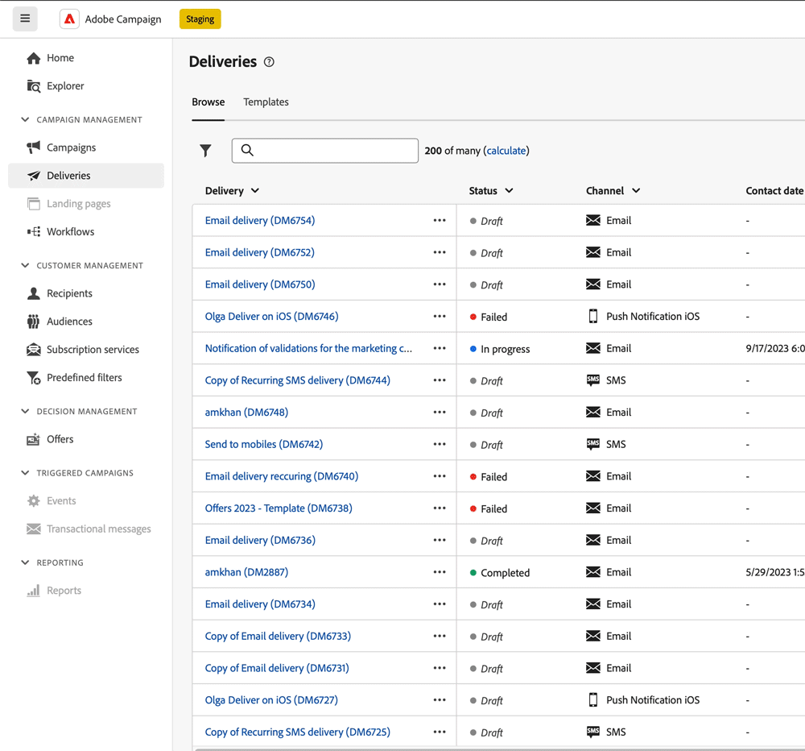

# 使用AI支援的知識助理 {#using-ai}

透過產品內容說明方塊中提供的AI支援知識助理，根據產品檔案和您目前的產品內容取得AI產生的快速答案。

>[!AVAILABILITY]
>
>此功能將於10月初推出。

此 **具有Gen AI的知識助理** 內嵌在內容說明中的內容，革新了檔案搜尋和回答操作方法問題，讓您能夠輕鬆地在龐大的檔案存放庫中篩選，立即找到您需要的精確資訊。

有了Campaign Gen AI的功能，此助理將改變您的體驗，讓資訊擷取和問題解決變得輕而易舉。 無論您是在複雜的工作中尋找指引，或是瀏覽廣泛的檔案，我們的Knowledge Assistant搭配Gen AI，是您最重要的夥伴，每次互動都能提供無與倫比的效率和準確性。

<!--
## Consent {#consent-ai}

Campaign knowledge assistant embeeded in the contextual help boxes uses AI. Your use of this capability constitutes consent that the information you provide in your session will be collected, used, disclosed, and retained by Adobe in accordance with the terms of Adobe's Customer Feedback Program. Please do not provide any personal information about yourself or other parties (including your name or contact information) in the knowledge assistant.

## Privacy {#privacy-ai}

Your data is encrypted and private following our standard data protection practices. Learn more about [Adobe Privacy Policies](https://www.adobe.com/privacy/policy.html){target="_blank"}.

The knowledge assistant AI capability does not use your data to train our models. We do not allow any partners or 3rd parties to use your data for training their models or any other purpose.

For information specific to Adobe AI policies in Experience Cloud apps and solutions, refer to [this page](https://business.adobe.com/products/sensei/adobe-sensei.html){target="_blank"}.
-->

## 答案 {#answers-ai}

答案可能不準確或誤導。 因此，Adobe知識助理可能會輸出不正確的資訊。 請務必檢視每個說明方塊中連結的產品檔案。

人工智慧和機器學習模型會隨著時間而改善，以更好地處理特定使用案例。 在未來幾個月內，Campaign AI支援的知識助理將繼續變好。 我們強烈建議您使用??您隨時都可以閱讀??訊按鈕，標示對工程師的任何不當回應。

## 建議  {#recommendations-ai}

在AI支援的知識助理中提出問題時，會考慮目前的產品內容（即您目前所在的Campaign畫面以及目前說明方塊的內容）。

若要充分利用AI支援的知識小幫手，我們建議您：

* 儘可能精確和具體，並避免模稜兩可。 答案將更為準確且實用。
* 為協助AI支援的知識小幫手找到正確的資訊，請儘量新增您想要瞭解的詳細資訊。
* 重新措辭並調整您的問題以取得更好的答案。 如果答案不準確或不實用，請嘗試不同方法並新增內容，以獲得更好的結果。
* 使用適當的字詞和措辭，加上中性色調。
* 請為答案評分，並提供意見回饋，以便我們的工程師能從您的經驗中學習，並改善結果。

