# 使用資料夾 {#folders}

>[!CONTEXTUALHELP]
>id="acw_folder_properties"
>title="資料夾屬性"
>abstract="資料夾屬性"

>[!CONTEXTUALHELP]
>id="acw_folder_security"
>title="資料夾安全性"
>abstract="資料夾安全性"

>[!CONTEXTUALHELP]
>id="acw_folder_restrictions"
>title="資料夾限制"
>abstract="資料夾限制"

>[!CONTEXTUALHELP]
>id="acw_folder_schedule"
>title="資料夾排程"
>abstract="資料夾排程"

## 關於資料夾 {#about-folders}

資料夾是 Adobe Campaign 中的物件，可讓您組織元件和資料。

您可以在導覽樹狀結構中建立、重新命名、重新排序和移動資料夾。您也可以根據自己的權限將其刪除。

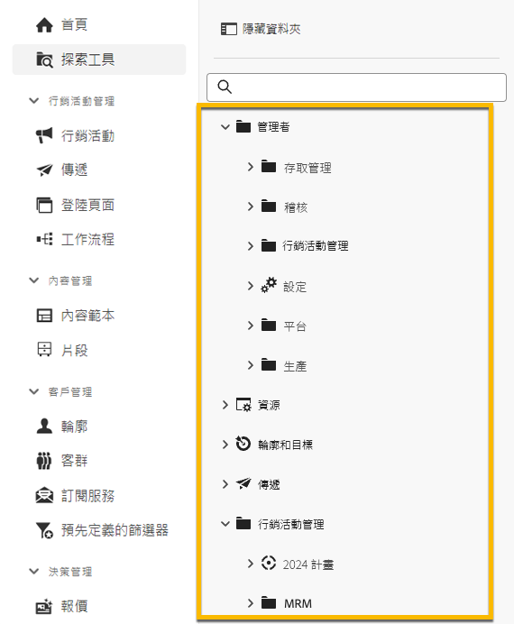{zoomable="yes"}

您可以設定資料夾類型。例如：傳遞的資料夾。
資料夾的圖示將根據此類型而有所變更。

## 建立新資料夾 {#create-a-folder}

若要在 Adobe Campaign Web UI 中建立新資料夾，請執行下列步驟：

1. 在「**[!UICONTROL 探索工具]**」中，前往您想要在其中建立新資料夾的資料夾。
在「**[!UICONTROL ...]**」選單下方，您會看到「**[!UICONTROL 建立新資料夾]**」。

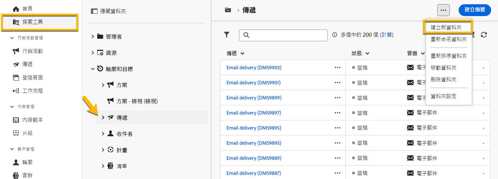{zoomable="yes"}

建立新資料夾時，根據預設，資料夾類型為父資料夾類型。在此範例中，我們會在「**[!UICONTROL 傳遞]**」資料夾中建立一個資料夾。

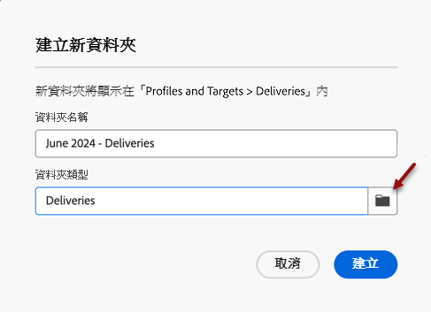{zoomable="yes"}

1. 如果需要，您可以按一下資料夾類型圖示來變更資料夾類型，然後在顯示的清單中進行選擇，如下所示：

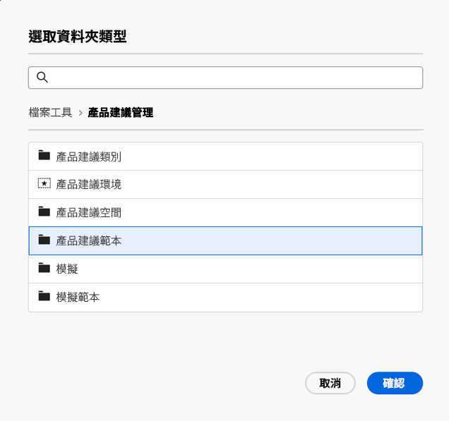{zoomable="yes"}

按一下「**[!UICONTROL 確認]**」按鈕以設定資料夾類型。

如果您想要建立非特定類型的資料夾，請選擇「**[!UICONTROL 一般資料夾]**」類型。

您也可以[在 Adobe Campaign 控制台中建立和管理資料夾](https://experienceleague.adobe.com/zh-hant/docs/campaign/campaign-v8/config/configuration/folders-and-views)。

## 重新排序資料夾 {#reorder-folders}

您可以根據需求重新排序資料夾。若要進行此動作，請按一下「**[!UICONTROL 重新排序資料夾]**」，如下所示。

在此範例中，「**傳送**」資料夾包含 4 個資料夾。

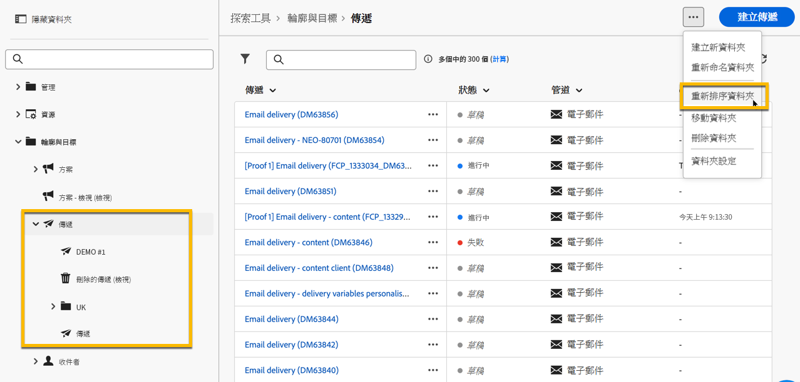{zoomable="yes"}

您可以透過&#x200B;**拖曳**&#x200B;或使用&#x200B;**向上鍵和向下鍵**&#x200B;來變更資料夾的順序。

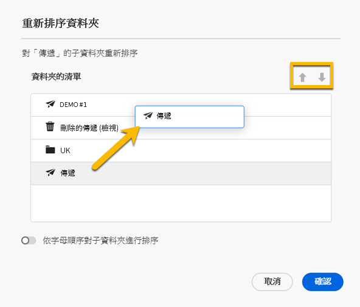{zoomable="yes"}

## 刪除資料夾 {#delete-a-folder}

>[!CAUTION]
>
>刪除資料夾時，儲存於該資料夾的所有資料也會被刪除。

若要刪除資料夾，請在「**[!UICONTROL 探索工具]**」樹狀結構中選取該資料夾，然後按一下「**[!UICONTROL ...]**」選單。
選擇「**[!UICONTROL 刪除資料夾]**」。

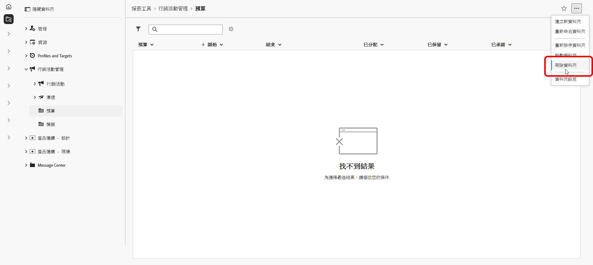{zoomable="yes"}

## 資料夾中的值分佈 {#distribution-values-folder}

值的分佈有助於了解表格中某欄的每個值所佔的百分比。

若要了解資料夾中值的分佈，請按照以下步驟進行：

例如，在各個傳遞項目中，我們想了解&#x200B;**「管道」**&#x200B;欄的值分佈情況。

若要獲取這些資訊，請前往&#x200B;**[!UICONTROL 「傳遞」]**&#x200B;資料夾，然後點擊&#x200B;**[!UICONTROL 「設定欄」]**&#x200B;圖示。

在&#x200B;**[!UICONTROL 「設定欄」]**&#x200B;視窗中，點擊您想了解的欄旁邊的&#x200B;**[!UICONTROL 「資訊」]**&#x200B;圖示。接著，點擊&#x200B;**[!UICONTROL 「值的分佈」]**&#x200B;按鈕。

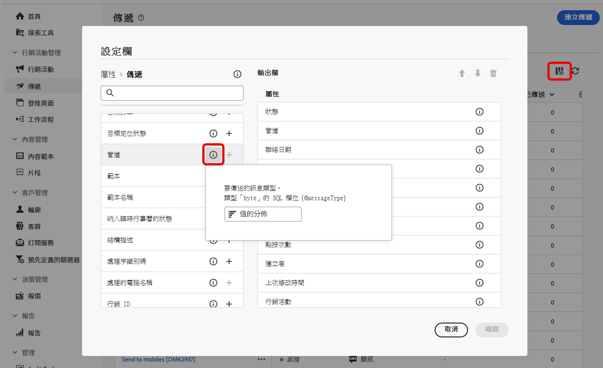{zoomable="yes"}

您將會看到&#x200B;**[!UICONTROL 「管道」]**&#x200B;欄中各值的百分比分佈。

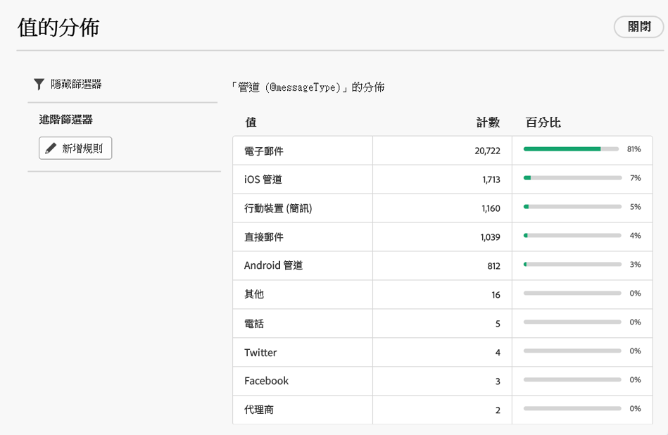{zoomable="yes"}

>[!NOTE]
>
> 對於具有許多值的欄，只會顯示前二十個值。系統會顯示&#x200B;**[!UICONTROL 「部分載入」]**&#x200B;通知來提醒您。

您也可以查看連結的值分佈。

在屬性清單中，點擊所需連結旁邊的&#x200B;**「+」**&#x200B;按鈕，如下所示。這會將連結新增到&#x200B;**[!UICONTROL 「輸出欄」]**&#x200B;中。現在，您可以看到&#x200B;**[!UICONTROL 「資訊」]**&#x200B;圖示，這樣您就可以查看其值的分佈。如果您不希望將連結保留在&#x200B;**[!UICONTROL 「輸出欄」]**&#x200B;中，請點擊&#x200B;**[!UICONTROL 「取消」]**&#x200B;按鈕。

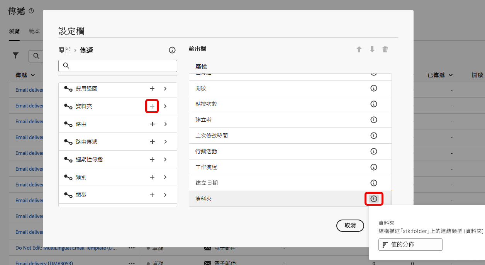{zoomable="yes"}

在查詢建模工具中也可以查看值的分佈。[如需更多詳情，請參閱此處](../query/build-query.md#distribution-of-values-in-a-query)。

### 篩選值 {#filter-values}

透過使用值分布視窗的「**[!UICONTROL 進階篩選器]**」，您可以根據指定條件篩選結果。

在上方的傳送清單範例中，顯示每個管道的分布情況，例如，您可以對其進行篩選，僅顯示其傳送狀態為「**已完成**」。

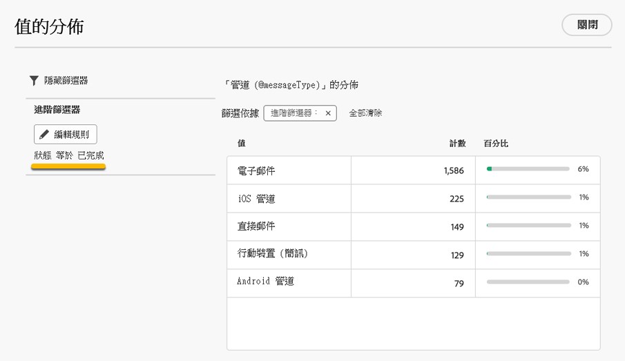{zoomable="yes"}
