<?xml version="1.0" encoding="UTF-8"?>
<xliff xmlns="urn:oasis:names:tc:xliff:document:1.2" xmlns:okp="okapi-framework:xliff-extensions" xmlns:its="http://www.w3.org/2005/11/its" xmlns:itsxlf="http://www.w3.org/ns/its-xliff/" version="1.2" its:version="2.0">
<file original="help/v8/get-started/work-with-folders.md.mdsc" source-language="en-US" target-language="en-XX" datatype="x-text/markdown">
<body>
<trans-unit id="tu22" xml:space="preserve">
<source xml:lang="en-US">https://experienceleague.adobe.com/docs/campaign/campaign-v8/permissions/manage-permissions.html#use-named-rights</source>
<target xml:lang="en-XX">https://experienceleague.adobe.com/docs/campaign/campaign-v8/permissions/manage-permissions.html?lang=zh-Hant#use-named-rights</target>
</trans-unit>
<trans-unit id="tu34" xml:space="preserve">
<source xml:lang="en-US">https://experienceleague.adobe.com/en/docs/campaign/campaign-v8/config/configuration/folders-and-views</source>
<target xml:lang="en-XX">https://experienceleague.adobe.com/zh-hant/docs/campaign/campaign-v8/config/configuration/folders-and-views</target>
</trans-unit>
<trans-unit id="tu1" restype="x-YAML_METADATA_HEADER_VALUE" xml:space="preserve">
<source xml:lang="en-US">Work with Folders</source>
<target xml:lang="en-XX">使用資料夾</target>
</trans-unit>
<trans-unit id="tu2" restype="x-YAML_METADATA_HEADER_VALUE" xml:space="preserve">
<source xml:lang="en-US">Learn how to manage a folder in Adobe Campaign</source>
<target xml:lang="en-XX">了解如何在 Adobe Campaign 中管理資料夾</target>
</trans-unit>
<trans-unit id="tu3" xml:space="preserve">
<source xml:lang="en-US">Work with folders</source>
<target xml:lang="en-XX">使用資料夾</target>
</trans-unit>
<trans-unit id="tu4" xml:space="preserve">
<source xml:lang="en-US">Folder properties</source>
<target xml:lang="en-XX">資料夾屬性</target>
</trans-unit>
<trans-unit id="tu5" xml:space="preserve">
<source xml:lang="en-US">Folder properties</source>
<target xml:lang="en-XX">資料夾屬性</target>
</trans-unit>
<trans-unit id="tu6" xml:space="preserve">
<source xml:lang="en-US">Folder security</source>
<target xml:lang="en-XX">資料夾安全性</target>
</trans-unit>
<trans-unit id="tu7" xml:space="preserve">
<source xml:lang="en-US">Folder security</source>
<target xml:lang="en-XX">資料夾安全性</target>
</trans-unit>
<trans-unit id="tu8" xml:space="preserve">
<source xml:lang="en-US">Folder schedule</source>
<target xml:lang="en-XX">資料夾排程</target>
</trans-unit>
<trans-unit id="tu9" xml:space="preserve">
<source xml:lang="en-US">Folder schedule</source>
<target xml:lang="en-XX">資料夾排程</target>
</trans-unit>
<trans-unit id="tu10" xml:space="preserve">
<source xml:lang="en-US">About folders</source>
<target xml:lang="en-XX">關於資料夾</target>
</trans-unit>
<trans-unit id="tu11" xml:space="preserve">
<source xml:lang="en-US">Folders are objects in Adobe Campaign that allow you to organize your components and data.</source>
<target xml:lang="en-XX">資料夾是 Adobe Campaign 中的物件，可讓您組織元件和資料。</target>
</trans-unit>
<trans-unit id="tu12" xml:space="preserve">
<source xml:lang="en-US">You can create, rename, reorder, and move folders in the navigation tree. You can also delete them based on your rights.</source>
<target xml:lang="en-XX">您可以在導覽樹狀結構中建立、重新命名、重新排序和移動資料夾。 您也可以根據自己的權限將其刪除。</target>
</trans-unit>
<trans-unit id="tu13" xml:space="preserve">
<source xml:lang="en-US"><ph id="1" ctype="x-IMAGE">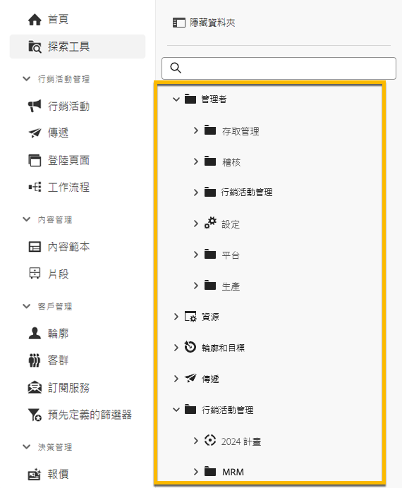{zoomable="yes"}</ph></source>
<target xml:lang="en-XX"><ph id="1" ctype="x-IMAGE">{zoomable="yes"}</ph></target>
</trans-unit>
<trans-unit id="tu14" xml:space="preserve">
<source xml:lang="en-US">You can set up a folder type. For example, a folder of deliveries. The folder icon changes according to its type.</source>
<target xml:lang="en-XX">您可以設定資料夾類型。 例如，傳遞用的資料夾。 資料夾圖示會根據其類型而變更。</target>
</trans-unit>
<trans-unit id="tu15" xml:space="preserve">
<source xml:lang="en-US">Folder restrictions</source>
<target xml:lang="en-XX">資料夾限制</target>
</trans-unit>
<trans-unit id="tu16" xml:space="preserve">
<source xml:lang="en-US">The folders Objects created automatically and Technical workflows are restricted, and cannot be viewed on the left side panel.</source>
<target xml:lang="en-XX">自動建立的「物件」資料夾和技術工作流程會受到限制，無法在左側面板上檢視。</target>
</trans-unit>
<trans-unit id="tu17" xml:space="preserve">
<source xml:lang="en-US"><ph id="1" ctype="x-regxph" equiv-text="&lbrack;!IMPORTANT">[!IMPORTANT]</ph></source>
<target xml:lang="en-XX"><ph id="1" ctype="x-regxph" equiv-text="&lbrack;!IMPORTANT">[!IMPORTANT]</ph></target>
</trans-unit>
<trans-unit id="tu18" xml:space="preserve">
<source xml:lang="en-US">The folders <ph id="1" ctype="x-STRONG_EMPHASIS">**[!UICONTROL </ph>Objects created automatically<ph id="3" ctype="x-LINK_REF">]**</ph> and <ph id="5" ctype="x-STRONG_EMPHASIS">**[!UICONTROL </ph>Technical workflows<ph id="7" ctype="x-LINK_REF">]**</ph> are restricted, and cannot be viewed on the left side panel.</source>
<target xml:lang="en-XX">「<ph id="1" ctype="x-STRONG_EMPHASIS">**[!UICONTROL </ph>自動建立的物件<ph id="3" ctype="x-LINK_REF">]**</ph>」和「<ph id="5" ctype="x-STRONG_EMPHASIS">**[!UICONTROL </ph>技術工作流程<ph id="7" ctype="x-LINK_REF">]**</ph>」資料夾會受到限制，且無法在左側面板上檢視。</target>
</trans-unit>
<trans-unit id="tu19" xml:space="preserve">
<source xml:lang="en-US">The actions available to you on a folder depend on the rights you have been granted on it. The <ph id="1" ctype="x-STRONG_EMPHASIS">**[!UICONTROL </ph>Folder settings<ph id="3" ctype="x-LINK_REF">]**</ph> dialog may open in <ph id="5" ctype="x-STRONG_EMPHASIS">**</ph>read-only mode<ph id="6" ctype="x-STRONG_EMPHASIS">**</ph>, and some actions or sections may not be available, depending on your rights.</source>
<target xml:lang="en-XX">您可以對資料夾執行的動作，取決於您獲授予的權限。<ph id="1" ctype="x-STRONG_EMPHASIS">**[!UICONTROL </ph>資料夾設定<ph id="3" ctype="x-LINK_REF">]**</ph>對話方塊可能會以<ph id="5" ctype="x-STRONG_EMPHASIS">**</ph>唯讀模式<ph id="6" ctype="x-STRONG_EMPHASIS">**</ph>開啟，且視您的權限而定，某些動作或區段可能無法使用。</target>
</trans-unit>
<trans-unit id="tu20" xml:space="preserve">
<source xml:lang="en-US">Contact your administrator if you are missing rights on a folder. Refer to this <ph id="1" ctype="x-LINK">[</ph>section<ph id="2" ctype="x-LINK">](permissions.md#folder-permissions)</ph> to learn how folder permissions are managed.</source>
<target xml:lang="en-XX">如果您缺少資料夾的權限，請聯絡管理員。請參閱此<ph id="1" ctype="x-LINK">[</ph>區段<ph id="2" ctype="x-LINK">](permissions.md#folder-permissions)</ph>，了解如何管理資料夾權限。</target>
</trans-unit>
<trans-unit id="tu21" xml:space="preserve">
<source xml:lang="en-US">Named rights such as <ph id="1" ctype="x-STRONG_EMPHASIS">**[!UICONTROL </ph>Insert Folders<ph id="3" ctype="x-LINK_REF">]**</ph>, <ph id="5" ctype="x-STRONG_EMPHASIS">**[!UICONTROL </ph>Edit Folders<ph id="7" ctype="x-LINK_REF">]**</ph>, and <ph id="9" ctype="x-STRONG_EMPHASIS">**[!UICONTROL </ph>Delete Folder<ph id="11" ctype="x-LINK_REF">]**</ph> also determine which folder actions are available to an operator. Refer to the <ph id="13" ctype="x-LINK">&lbrack;</ph>Campaign v8 documentation<ph id="14" ctype="x-LINK">[#$tu22]{target="_blank"}</ph>.</source>
<target xml:lang="en-XX">已命名的權限 (例如<ph id="1" ctype="x-STRONG_EMPHASIS">**[!UICONTROL </ph>插入資料夾<ph id="3" ctype="x-LINK_REF">]**</ph>、<ph id="5" ctype="x-STRONG_EMPHASIS">**[!UICONTROL </ph>編輯資料夾<ph id="7" ctype="x-LINK_REF">]**</ph>和<ph id="9" ctype="x-STRONG_EMPHASIS">**[!UICONTROL </ph>刪除資料夾<ph id="11" ctype="x-LINK_REF">]**</ph>) 也會決定操作員可以使用哪些資料夾動作。請參閱 <ph id="13" ctype="x-LINK">&lbrack;</ph>Campaign v8 文件<ph id="14" ctype="x-LINK">[#$tu22]{target="_blank"}</ph>。</target>
</trans-unit>
<trans-unit id="tu23" xml:space="preserve">
<source xml:lang="en-US">Create a new folder</source>
<target xml:lang="en-XX">建立新資料夾</target>
</trans-unit>
<trans-unit id="tu24" xml:space="preserve">
<source xml:lang="en-US">To create a new folder in Adobe Campaign Web UI, follow these steps:</source>
<target xml:lang="en-XX">若要在 Adobe Campaign Web UI 中建立新資料夾，請執行下列步驟：</target>
</trans-unit>
<trans-unit id="tu25" xml:space="preserve">
<source xml:lang="en-US">In <ph id="1" ctype="x-STRONG_EMPHASIS">**[!UICONTROL </ph>Explorer<ph id="3" ctype="x-LINK_REF">]**</ph>, go to the folder where you want to create your new folder. Under the <ph id="5" ctype="x-STRONG_EMPHASIS">**[!UICONTROL </ph>...<ph id="7" ctype="x-LINK_REF">]**</ph> menu, select <ph id="9" ctype="x-STRONG_EMPHASIS">**[!UICONTROL </ph>Create new folder<ph id="11" ctype="x-LINK_REF">]**</ph>.</source>
<target xml:lang="en-XX">在<ph id="1" ctype="x-STRONG_EMPHASIS">**[!UICONTROL </ph>探索工具<ph id="3" ctype="x-LINK_REF">]**</ph>中，前往您想要在其中建立新資料夾的資料夾。 在「<ph id="5" ctype="x-STRONG_EMPHASIS">**[!UICONTROL </ph>...<ph id="7" ctype="x-LINK_REF">]**</ph>」選單之下，選取「<ph id="9" ctype="x-STRONG_EMPHASIS">**[!UICONTROL </ph>建立新資料夾<ph id="11" ctype="x-LINK_REF">]**</ph>」。</target>
</trans-unit>
<trans-unit id="tu26" xml:space="preserve">
<source xml:lang="en-US"><ph id="1" ctype="x-IMAGE">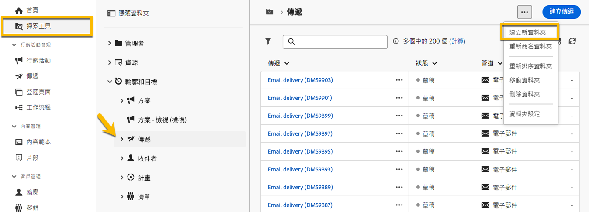{zoomable="yes"}</ph></source>
<target xml:lang="en-XX"><ph id="1" ctype="x-IMAGE">{zoomable="yes"}</ph></target>
</trans-unit>
<trans-unit id="tu27" xml:space="preserve">
<source xml:lang="en-US">When you create a new folder, the folder type defaults to the type of the parent folder. In this example, a folder is created in the <ph id="1" ctype="x-STRONG_EMPHASIS">**[!UICONTROL </ph>Deliveries<ph id="3" ctype="x-LINK_REF">]**</ph> folder.</source>
<target xml:lang="en-XX">建立新資料夾時，資料夾類型預設為父系資料夾的類型。 在這個範例中，會在<ph id="1" ctype="x-STRONG_EMPHASIS">**[!UICONTROL </ph>傳遞<ph id="3" ctype="x-LINK_REF">]**</ph>資料夾中建立一個資料夾。</target>
</trans-unit>
<trans-unit id="tu28" xml:space="preserve">
<source xml:lang="en-US"><ph id="1" ctype="x-IMAGE">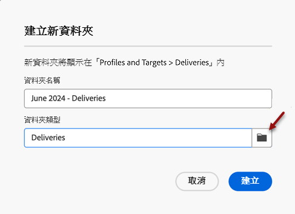{zoomable="yes"}</ph></source>
<target xml:lang="en-XX"><ph id="1" ctype="x-IMAGE">{zoomable="yes"}</ph></target>
</trans-unit>
<trans-unit id="tu29" xml:space="preserve">
<source xml:lang="en-US">Change the folder type by clicking on the folder type icon if needed, and select the desired type from the list presented, as shown below:</source>
<target xml:lang="en-XX">如果需要，按一下資料夾類型圖示變更資料夾類型，然後在顯示的清單中選取想要的類型，如下所示：</target>
</trans-unit>
<trans-unit id="tu30" xml:space="preserve">
<source xml:lang="en-US"><ph id="1" ctype="x-IMAGE">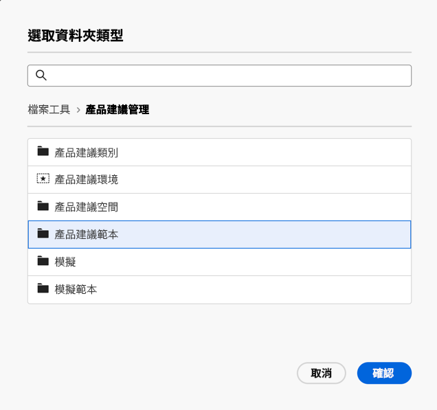{zoomable="yes"}</ph></source>
<target xml:lang="en-XX"><ph id="1" ctype="x-IMAGE">{zoomable="yes"}</ph></target>
</trans-unit>
<trans-unit id="tu31" xml:space="preserve">
<source xml:lang="en-US">Set up the folder type by clicking the <ph id="1" ctype="x-STRONG_EMPHASIS">**[!UICONTROL </ph>Confirm<ph id="3" ctype="x-LINK_REF">]**</ph> button.</source>
<target xml:lang="en-XX">按一下「<ph id="1" ctype="x-STRONG_EMPHASIS">**[!UICONTROL </ph>確認<ph id="3" ctype="x-LINK_REF">]**</ph>」按鈕，設定資料夾類型。</target>
</trans-unit>
<trans-unit id="tu32" xml:space="preserve">
<source xml:lang="en-US">If you want to create a folder with no specific type, select the <ph id="1" ctype="x-STRONG_EMPHASIS">**[!UICONTROL </ph>Generic Folder<ph id="3" ctype="x-LINK_REF">]**</ph> type.</source>
<target xml:lang="en-XX">如果您想要建立非特定類型的資料夾，選取「<ph id="1" ctype="x-STRONG_EMPHASIS">**[!UICONTROL </ph>一般資料夾<ph id="3" ctype="x-LINK_REF">]**</ph>」類型。</target>
</trans-unit>
<trans-unit id="tu33" xml:space="preserve">
<source xml:lang="en-US">You can also <ph id="1" ctype="x-LINK">&lbrack;</ph>create and manage folders in Adobe Campaign console<ph id="2" ctype="x-LINK">[#$tu34]</ph>.</source>
<target xml:lang="en-XX">您也可以<ph id="1" ctype="x-LINK">&lbrack;</ph>在 Adobe Campaign 主控台中建立和管理資料夾<ph id="2" ctype="x-LINK">[#$tu34]</ph>。</target>
</trans-unit>
<trans-unit id="tu35" xml:space="preserve">
<source xml:lang="en-US">Reorder folders</source>
<target xml:lang="en-XX">重新排序資料夾</target>
</trans-unit>
<trans-unit id="tu36" xml:space="preserve">
<source xml:lang="en-US">You can reorder folders based on your needs. To do so, click on <ph id="1" ctype="x-STRONG_EMPHASIS">**[!UICONTROL </ph>Reorder folders<ph id="3" ctype="x-LINK_REF">]**</ph>, as shown below.</source>
<target xml:lang="en-XX">您可以根據需要重新排序資料夾。 若要重新排序，按一下「<ph id="1" ctype="x-STRONG_EMPHASIS">**[!UICONTROL </ph>重新排序資料夾<ph id="3" ctype="x-LINK_REF">]**</ph>」，如下所示。</target>
</trans-unit>
<trans-unit id="tu37" xml:space="preserve">
<source xml:lang="en-US">In this example, the <ph id="1" ctype="x-STRONG_EMPHASIS">**</ph>Deliveries<ph id="2" ctype="x-STRONG_EMPHASIS">**</ph> folder contains four subfolders.</source>
<target xml:lang="en-XX">在此範例中，<ph id="1" ctype="x-STRONG_EMPHASIS">**</ph>傳遞<ph id="2" ctype="x-STRONG_EMPHASIS">**</ph>資料夾包含四個子資料夾。</target>
</trans-unit>
<trans-unit id="tu38" xml:space="preserve">
<source xml:lang="en-US"><ph id="1" ctype="x-IMAGE">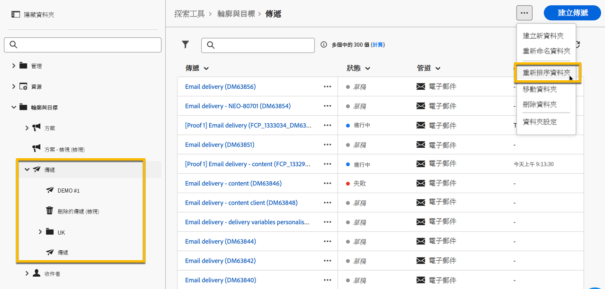{zoomable="yes"}</ph></source>
<target xml:lang="en-XX"><ph id="1" ctype="x-IMAGE">{zoomable="yes"}</ph></target>
</trans-unit>
<trans-unit id="tu39" xml:space="preserve">
<source xml:lang="en-US">You can change the order of folders either by <ph id="1" ctype="x-STRONG_EMPHASIS">**</ph>drag and drop<ph id="2" ctype="x-STRONG_EMPHASIS">**</ph> or by using <ph id="3" ctype="x-STRONG_EMPHASIS">**</ph>up and down arrows<ph id="4" ctype="x-STRONG_EMPHASIS">**</ph>.</source>
<target xml:lang="en-XX">您可以透過<ph id="1" ctype="x-STRONG_EMPHASIS">**</ph>拖放<ph id="2" ctype="x-STRONG_EMPHASIS">**</ph>方式，或使用<ph id="3" ctype="x-STRONG_EMPHASIS">**</ph>向上鍵和向下鍵<ph id="4" ctype="x-STRONG_EMPHASIS">**</ph>來變更資料夾的順序。</target>
</trans-unit>
<trans-unit id="tu40" xml:space="preserve">
<source xml:lang="en-US"><ph id="1" ctype="x-IMAGE">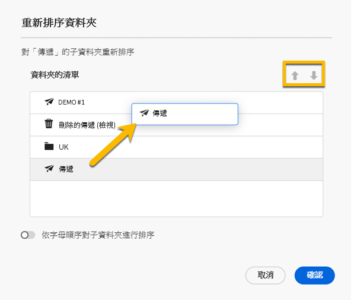{zoomable="yes"}</ph></source>
<target xml:lang="en-XX"><ph id="1" ctype="x-IMAGE">{zoomable="yes"}</ph></target>
</trans-unit>
<trans-unit id="tu41" xml:space="preserve">
<source xml:lang="en-US">Favorite folders</source>
<target xml:lang="en-XX">我的最愛資料夾</target>
</trans-unit>
<trans-unit id="tu42" xml:space="preserve">
<source xml:lang="en-US">Favorites</source>
<target xml:lang="en-XX">我的最愛</target>
</trans-unit>
<trans-unit id="tu43" xml:space="preserve">
<source xml:lang="en-US">Your favorite folders will be displayed at the top of the left tab.</source>
<target xml:lang="en-XX">您最愛的資料夾將顯示在左側分頁的最上方。</target>
</trans-unit>
<trans-unit id="tu44" xml:space="preserve">
<source xml:lang="en-US">The folders that have been marked as "Favorite" will always be shown at the top of the left tab.</source>
<target xml:lang="en-XX">已標記為「我的最愛」的資料夾將始終顯示在左側標籤的頂端。</target>
</trans-unit>
<trans-unit id="tu45" xml:space="preserve">
<source xml:lang="en-US">You can add folders as favorite by clicking on the star button at the top-right corner when viewing a folder.</source>
<target xml:lang="en-XX">您可以在檢視資料夾時，按一下右上角的星形按鈕，即可將資料夾加入為最愛項目。</target>
</trans-unit>
<trans-unit id="tu46" xml:space="preserve">
<source xml:lang="en-US"><ph id="1" ctype="x-IMAGE">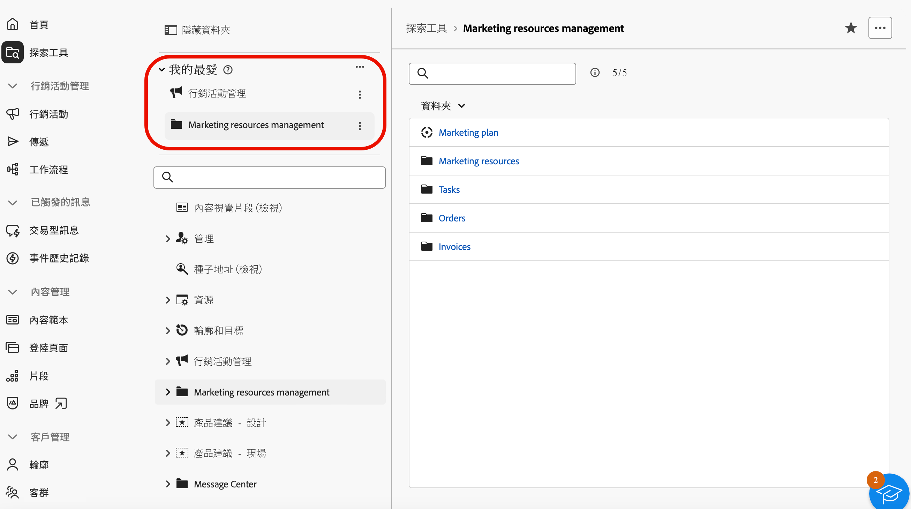{zoomable="yes"}</ph></source>
<target xml:lang="en-XX"><ph id="1" ctype="x-IMAGE">{zoomable="yes"}</ph></target>
</trans-unit>
<trans-unit id="tu47" xml:space="preserve">
<source xml:lang="en-US">Delete a folder</source>
<target xml:lang="en-XX">刪除資料夾</target>
</trans-unit>
<trans-unit id="tu48" xml:space="preserve">
<source xml:lang="en-US"><ph id="1" ctype="x-regxph" equiv-text="&lbrack;!CAUTION">[!CAUTION]</ph></source>
<target xml:lang="en-XX"><ph id="1" ctype="x-regxph" equiv-text="&lbrack;!CAUTION">[!CAUTION]</ph></target>
</trans-unit>
<trans-unit id="tu49" xml:space="preserve">
<source xml:lang="en-US">When deleting a folder, all data stored in the folder is also deleted.</source>
<target xml:lang="en-XX">刪除資料夾時，儲存於該資料夾的所有資料也會被刪除。</target>
</trans-unit>
<trans-unit id="tu50" xml:space="preserve">
<source xml:lang="en-US">To delete a folder, select it in your <ph id="1" ctype="x-STRONG_EMPHASIS">**[!UICONTROL </ph>Explorer<ph id="3" ctype="x-LINK_REF">]**</ph> tree, and click on the <ph id="5" ctype="x-STRONG_EMPHASIS">**[!UICONTROL </ph>...<ph id="7" ctype="x-LINK_REF">]**</ph> menu. Choose <ph id="9" ctype="x-STRONG_EMPHASIS">**[!UICONTROL </ph>Delete folder<ph id="11" ctype="x-LINK_REF">]**</ph>.</source>
<target xml:lang="en-XX">若要刪除資料夾，請在<ph id="1" ctype="x-STRONG_EMPHASIS">**[!UICONTROL </ph>探索工具<ph id="3" ctype="x-LINK_REF">]**</ph>樹狀結構中選取該資料夾，然後按一下「<ph id="5" ctype="x-STRONG_EMPHASIS">**[!UICONTROL </ph>...<ph id="7" ctype="x-LINK_REF">]**</ph>」選單。 選擇「<ph id="9" ctype="x-STRONG_EMPHASIS">**[!UICONTROL </ph>刪除資料夾<ph id="11" ctype="x-LINK_REF">]**</ph>」。</target>
</trans-unit>
<trans-unit id="tu51" xml:space="preserve">
<source xml:lang="en-US"><ph id="1" ctype="x-IMAGE">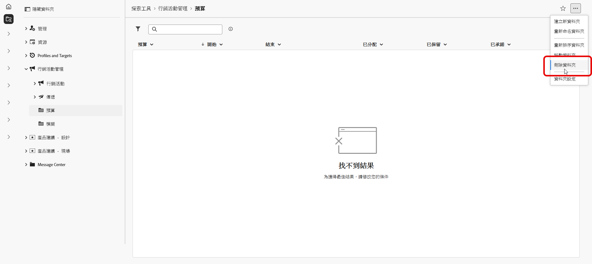{zoomable="yes"}</ph></source>
<target xml:lang="en-XX"><ph id="1" ctype="x-IMAGE">{zoomable="yes"}</ph></target>
</trans-unit>
<trans-unit id="tu52" xml:space="preserve">
<source xml:lang="en-US">Distribution of values in a folder</source>
<target xml:lang="en-XX">資料夾中的數值分佈</target>
</trans-unit>
<trans-unit id="tu53" xml:space="preserve">
<source xml:lang="en-US">The distribution of values helps you understand the percentage of a value in a column within a table.</source>
<target xml:lang="en-XX">數值分佈能幫助您了解表格中某個值在某資料欄所佔的百分比。</target>
</trans-unit>
<trans-unit id="tu54" xml:space="preserve">
<source xml:lang="en-US">To view the distribution of values in a folder, proceed as explained below.</source>
<target xml:lang="en-XX">若要檢視資料夾中的數值分佈，請按照以下說明的步驟進行。</target>
</trans-unit>
<trans-unit id="tu55" xml:space="preserve">
<source xml:lang="en-US">For example, among the deliveries, you may want to know the distribution of values in the <ph id="1" ctype="x-STRONG_EMPHASIS">**</ph>Channel<ph id="2" ctype="x-STRONG_EMPHASIS">**</ph> column.</source>
<target xml:lang="en-XX">例如，在各個傳遞間，您想了解<ph id="1" ctype="x-STRONG_EMPHASIS">**</ph>「管道」<ph id="2" ctype="x-STRONG_EMPHASIS">**</ph>資料欄的數值分佈情況。</target>
</trans-unit>
<trans-unit id="tu56" xml:space="preserve">
<source xml:lang="en-US">To get this information, go to the <ph id="1" ctype="x-STRONG_EMPHASIS">**[!UICONTROL </ph>Deliveries<ph id="3" ctype="x-LINK_REF">]**</ph> folder and click the <ph id="5" ctype="x-STRONG_EMPHASIS">**[!UICONTROL </ph>Configure columns<ph id="7" ctype="x-LINK_REF">]**</ph> icon.</source>
<target xml:lang="en-XX">若要獲取此資訊，請前往<ph id="1" ctype="x-STRONG_EMPHASIS">**[!UICONTROL </ph>傳遞<ph id="3" ctype="x-LINK_REF">]**</ph>資料夾，然後按一下「<ph id="5" ctype="x-STRONG_EMPHASIS">**[!UICONTROL </ph>設定資料欄<ph id="7" ctype="x-LINK_REF">]**</ph>」圖示。</target>
</trans-unit>
<trans-unit id="tu57" xml:space="preserve">
<source xml:lang="en-US">In the <ph id="1" ctype="x-STRONG_EMPHASIS">**[!UICONTROL </ph>Configure columns<ph id="3" ctype="x-LINK_REF">]**</ph> window, click the <ph id="5" ctype="x-STRONG_EMPHASIS">**[!UICONTROL </ph>Information<ph id="7" ctype="x-LINK_REF">]**</ph> icon related to the column you want to analyze. Then, click on the <ph id="9" ctype="x-STRONG_EMPHASIS">**[!UICONTROL </ph>Distribution of values<ph id="11" ctype="x-LINK_REF">]**</ph> button.</source>
<target xml:lang="en-XX">在<ph id="1" ctype="x-STRONG_EMPHASIS">**[!UICONTROL </ph>設定資料欄<ph id="3" ctype="x-LINK_REF">]**</ph>視窗中，按一下與您想分析的資料欄關聯的「<ph id="5" ctype="x-STRONG_EMPHASIS">**[!UICONTROL </ph>資訊<ph id="7" ctype="x-LINK_REF">]**</ph>」圖示。 接著，按一下「<ph id="9" ctype="x-STRONG_EMPHASIS">**[!UICONTROL </ph>數值分佈<ph id="11" ctype="x-LINK_REF">]**</ph>」按鈕。</target>
</trans-unit>
<trans-unit id="tu58" xml:space="preserve">
<source xml:lang="en-US"><ph id="1" ctype="x-IMAGE">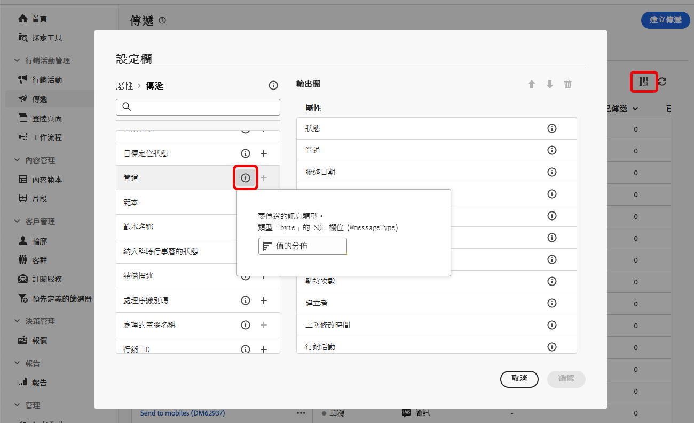{zoomable="yes"}</ph></source>
<target xml:lang="en-XX"><ph id="1" ctype="x-IMAGE">{zoomable="yes"}</ph></target>
</trans-unit>
<trans-unit id="tu59" xml:space="preserve">
<source xml:lang="en-US">You will see the percentage of values in the <ph id="1" ctype="x-STRONG_EMPHASIS">**[!UICONTROL </ph>Channel<ph id="3" ctype="x-LINK_REF">]**</ph> column.</source>
<target xml:lang="en-XX">您將會看到<ph id="1" ctype="x-STRONG_EMPHASIS">**[!UICONTROL </ph>管道<ph id="3" ctype="x-LINK_REF">]**</ph>資料欄中各數值的百分比。</target>
</trans-unit>
<trans-unit id="tu60" xml:space="preserve">
<source xml:lang="en-US"><ph id="1" ctype="x-IMAGE">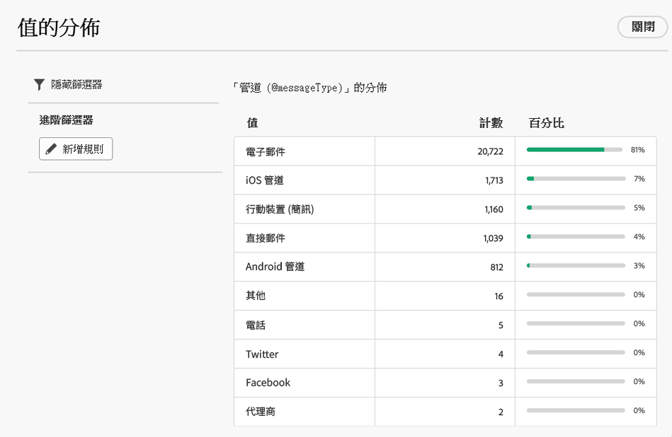{zoomable="yes"}</ph></source>
<target xml:lang="en-XX"><ph id="1" ctype="x-IMAGE">{zoomable="yes"}</ph></target>
</trans-unit>
<trans-unit id="tu61" xml:space="preserve">
<source xml:lang="en-US"><ph id="1" ctype="x-regxph" equiv-text="&lbrack;!NOTE">[!NOTE]</ph></source>
<target xml:lang="en-XX"><ph id="1" ctype="x-regxph" equiv-text="&lbrack;!NOTE">[!NOTE]</ph></target>
</trans-unit>
<trans-unit id="tu62" xml:space="preserve">
<source xml:lang="en-US">For columns with many values, only the first twenty values are displayed. A notification <ph id="1" ctype="x-STRONG_EMPHASIS">**[!UICONTROL </ph>Partial load<ph id="3" ctype="x-LINK_REF">]**</ph> warns you.</source>
<target xml:lang="en-XX">對於具有許多值的資料欄，僅顯示前二十個值。 系統會顯示<ph id="1" ctype="x-STRONG_EMPHASIS">**[!UICONTROL </ph>部分載入<ph id="3" ctype="x-LINK_REF">]**</ph>通知來提醒您。</target>
</trans-unit>
<trans-unit id="tu63" xml:space="preserve">
<source xml:lang="en-US">You can also view the distribution of values for a link.</source>
<target xml:lang="en-XX">您也可以檢視連結的數值分佈。</target>
</trans-unit>
<trans-unit id="tu64" xml:space="preserve">
<source xml:lang="en-US">In the attributes list, click the <ph id="1" ctype="x-STRONG_EMPHASIS">**</ph>+<ph id="2" ctype="x-STRONG_EMPHASIS">**</ph> button next to the desired link, as shown below. This adds the link to the <ph id="3" ctype="x-STRONG_EMPHASIS">**[!UICONTROL </ph>Output columns<ph id="5" ctype="x-LINK_REF">]**</ph>. You can now access the <ph id="7" ctype="x-STRONG_EMPHASIS">**[!UICONTROL </ph>Information<ph id="9" ctype="x-LINK_REF">]**</ph> icon, allowing you to view the distribution of its values. If you do not want to keep the link in the <ph id="11" ctype="x-STRONG_EMPHASIS">**[!UICONTROL </ph>Output columns<ph id="13" ctype="x-LINK_REF">]**</ph>, click the <ph id="15" ctype="x-STRONG_EMPHASIS">**[!UICONTROL </ph>Cancel<ph id="17" ctype="x-LINK_REF">]**</ph> button.</source>
<target xml:lang="en-XX">在屬性清單中，點擊所需連結旁邊的<ph id="1" ctype="x-STRONG_EMPHASIS">**</ph>「+」<ph id="2" ctype="x-STRONG_EMPHASIS">**</ph>按鈕，如下所示。 這會將連結新增到<ph id="3" ctype="x-STRONG_EMPHASIS">**[!UICONTROL </ph>「輸出欄」<ph id="5" ctype="x-LINK_REF">]**</ph>中。 現在，您可以存取<ph id="7" ctype="x-STRONG_EMPHASIS">**[!UICONTROL </ph>資訊<ph id="9" ctype="x-LINK_REF">]**</ph>圖示來檢視其數值分佈。 如果您不希望將連結保留在<ph id="11" ctype="x-STRONG_EMPHASIS">**[!UICONTROL </ph>輸出資料欄<ph id="13" ctype="x-LINK_REF">]**</ph>中，按一下「<ph id="15" ctype="x-STRONG_EMPHASIS">**[!UICONTROL </ph>取消<ph id="17" ctype="x-LINK_REF">]**</ph>」按鈕。</target>
</trans-unit>
<trans-unit id="tu65" xml:space="preserve">
<source xml:lang="en-US"><ph id="1" ctype="x-IMAGE">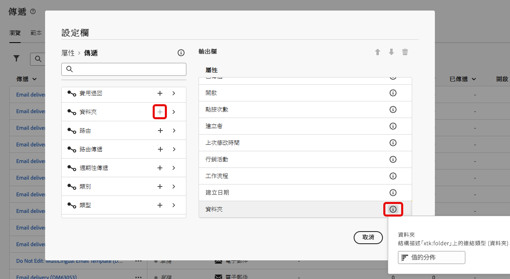{zoomable="yes"}</ph></source>
<target xml:lang="en-XX"><ph id="1" ctype="x-IMAGE">{zoomable="yes"}</ph></target>
</trans-unit>
<trans-unit id="tu66" xml:space="preserve">
<source xml:lang="en-US">It is also possible to view the distribution of values in a query modeler. <ph id="1" ctype="x-LINK">[</ph>Learn more here<ph id="2" ctype="x-LINK">](../query/build-query.md#distribution-of-values-in-a-query)</ph>.</source>
<target xml:lang="en-XX">在查詢建模工具中也可以檢視數值分佈。 <ph id="1" ctype="x-LINK">[</ph>若要了解更多資訊，請參閱此處<ph id="2" ctype="x-LINK">](../query/build-query.md#distribution-of-values-in-a-query)</ph>。</target>
</trans-unit>
<trans-unit id="tu67" xml:space="preserve">
<source xml:lang="en-US">Filter the values</source>
<target xml:lang="en-XX">篩選值</target>
</trans-unit>
<trans-unit id="tu68" xml:space="preserve">
<source xml:lang="en-US">By using the <ph id="1" ctype="x-STRONG_EMPHASIS">**[!UICONTROL </ph>Advanced filters<ph id="3" ctype="x-LINK_REF">]**</ph> in the distribution of values window, you can filter results based on specified conditions.</source>
<target xml:lang="en-XX">透過數值分佈視窗的「<ph id="1" ctype="x-STRONG_EMPHASIS">**[!UICONTROL </ph>進階篩選器<ph id="3" ctype="x-LINK_REF">]**</ph>」，您可以根據指定條件篩選結果。</target>
</trans-unit>
<trans-unit id="tu69" xml:space="preserve">
<source xml:lang="en-US">In the example of the delivery list above, which shows the distribution per channel, you can filter it to display only deliveries with a status of <ph id="1" ctype="x-STRONG_EMPHASIS">**</ph>Finished<ph id="2" ctype="x-STRONG_EMPHASIS">**</ph>.</source>
<target xml:lang="en-XX">上方的傳遞清單範例顯示每個管道的分佈情況，您可以透過篩選，使這份清單僅顯示狀態為<ph id="1" ctype="x-STRONG_EMPHASIS">**</ph>已完成<ph id="2" ctype="x-STRONG_EMPHASIS">**</ph>的傳遞。</target>
</trans-unit>
<trans-unit id="tu70" xml:space="preserve">
<source xml:lang="en-US"><ph id="1" ctype="x-IMAGE">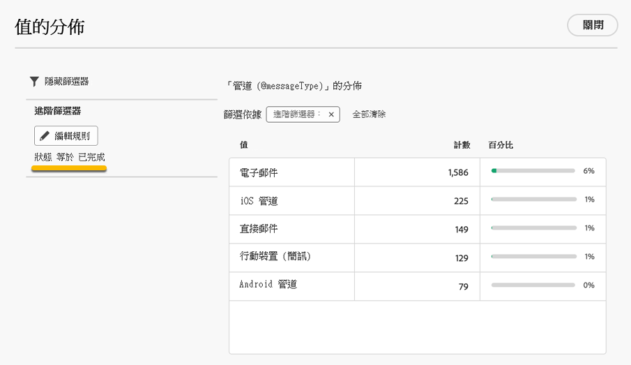{zoomable="yes"}</ph></source>
<target xml:lang="en-XX"><ph id="1" ctype="x-IMAGE">{zoomable="yes"}</ph></target>
</trans-unit>
</body>
</file>
</xliff>