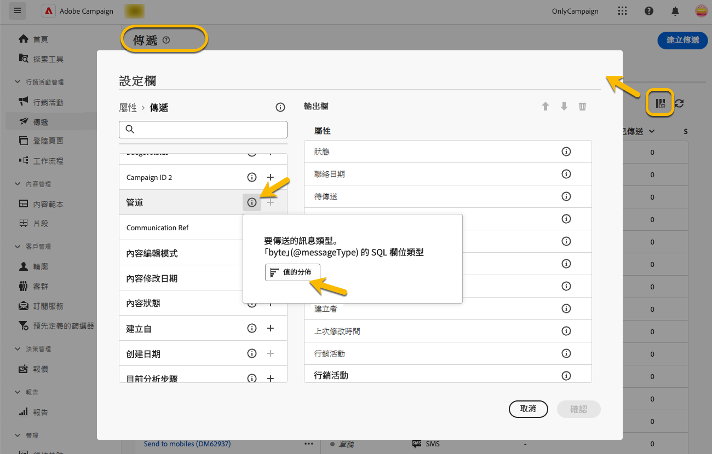

# 使用資料夾 {#folders}

>[!CONTEXTUALHELP]
>id="acw_folder_properties"
>title="資料夾屬性"
>abstract="資料夾屬性"

>[!CONTEXTUALHELP]
>id="acw_folder_security"
>title="資料夾安全性"
>abstract="資料夾安全性"

>[!CONTEXTUALHELP]
>id="acw_folder_schedule"
>title="資料夾排程"
>abstract="資料夾排程"

## 關於資料夾 {#about-folders}

資料夾是 Adobe Campaign 中的物件，可讓您組織元件和資料。

您可以在導覽樹狀結構中建立、重新命名、重新排序和移動資料夾。您也可以根據自己的權限將其刪除。

{zoomable="yes"}

您可以設定資料夾類型。例如，傳遞用的資料夾。資料夾圖示會根據其類型而變更。

>[!CONTEXTUALHELP]
>id="acw_folder_restrictions"
>title="資料夾限制"
>abstract="自動建立的「物件」資料夾和技術工作流程會受到限制，無法在左側面板上檢視。"

>[!IMPORTANT]
>
>「**[!UICONTROL 自動建立的物件]**」和「**[!UICONTROL 技術工作流程]**」資料夾會受到限制，且無法在左側面板上檢視。

## 建立新資料夾 {#create-a-folder}

若要在 Adobe Campaign Web UI 中建立新資料夾，請執行下列步驟：

1. 在&#x200B;**[!UICONTROL 探索工具]**&#x200B;中，前往您想要在其中建立新資料夾的資料夾。在「**[!UICONTROL ...]**」選單之下，選取「**[!UICONTROL 建立新資料夾]**」。

{zoomable="yes"}

建立新資料夾時，資料夾類型預設為父系資料夾的類型。在這個範例中，會在&#x200B;**[!UICONTROL 傳遞]**&#x200B;資料夾中建立一個資料夾。

{zoomable="yes"}

1. 如果需要，按一下資料夾類型圖示變更資料夾類型，然後在顯示的清單中選取想要的類型，如下所示：

{zoomable="yes"}

按一下「**[!UICONTROL 確認]**」按鈕，設定資料夾類型。

如果您想要建立非特定類型的資料夾，選取「**[!UICONTROL 一般資料夾]**」類型。

您也可以[在 Adobe Campaign 主控台中建立和管理資料夾](https://experienceleague.adobe.com/zh-hant/docs/campaign/campaign-v8/config/configuration/folders-and-views)。

## 重新排序資料夾 {#reorder-folders}

您可以根據需要重新排序資料夾。若要重新排序，按一下「**[!UICONTROL 重新排序資料夾]**」，如下所示。

在此範例中，**傳遞**&#x200B;資料夾包含四個子資料夾。

{zoomable="yes"}

您可以透過&#x200B;**拖放**&#x200B;方式，或使用&#x200B;**向上鍵和向下鍵**&#x200B;來變更資料夾的順序。

{zoomable="yes"}

### 我的最愛資料夾 {#favorite-folders}

>[!CONTEXTUALHELP]
>id="acw_folder_favorites"
>title="我的最愛"
>abstract="您最愛的資料夾將顯示在左側分頁的最上方。"

已標記為「我的最愛」的資料夾將始終顯示在左側標籤的頂端。

您可以在檢視資料夾時，按一下右上角的星形按鈕，即可將資料夾加入為最愛項目。

{zoomable="yes"}

## 刪除資料夾 {#delete-a-folder}

>[!CAUTION]
>
>刪除資料夾時，儲存於該資料夾的所有資料也會被刪除。

若要刪除資料夾，請在&#x200B;**[!UICONTROL 探索工具]**&#x200B;樹狀結構中選取該資料夾，然後按一下「**[!UICONTROL ...]**」選單。選擇「**[!UICONTROL 刪除資料夾]**」。

{zoomable="yes"}

## 資料夾中的數值分佈 {#distribution-values-folder}

數值分佈能幫助您了解表格中某個值在某資料欄所佔的百分比。

若要檢視資料夾中的數值分佈，請按照以下說明的步驟進行。

例如，在各個傳遞間，您想了解&#x200B;**「管道」**&#x200B;資料欄的數值分佈情況。

若要獲取此資訊，請前往&#x200B;**[!UICONTROL 傳遞]**&#x200B;資料夾，然後按一下「**[!UICONTROL 設定資料欄]**」圖示。

在&#x200B;**[!UICONTROL 設定資料欄]**&#x200B;視窗中，按一下與您想分析的資料欄關聯的「**[!UICONTROL 資訊]**」圖示。接著，按一下「**[!UICONTROL 數值分佈]**」按鈕。

{zoomable="yes"}

您將會看到&#x200B;**[!UICONTROL 管道]**&#x200B;資料欄中各數值的百分比。

{zoomable="yes"}

>[!NOTE]
>
>對於具有許多值的資料欄，僅顯示前二十個值。系統會顯示&#x200B;**[!UICONTROL 部分載入]**&#x200B;通知來提醒您。

您也可以檢視連結的數值分佈。

在屬性清單中，點擊所需連結旁邊的&#x200B;**「+」**&#x200B;按鈕，如下所示。這會將連結新增到&#x200B;**[!UICONTROL 「輸出欄」]**&#x200B;中。現在，您可以存取&#x200B;**[!UICONTROL 資訊]**&#x200B;圖示來檢視其數值分佈。如果您不希望將連結保留在&#x200B;**[!UICONTROL 輸出資料欄]**&#x200B;中，按一下「**[!UICONTROL 取消]**」按鈕。

{zoomable="yes"}

在查詢建模工具中也可以檢視數值分佈。[若要了解更多資訊，請參閱此處](../query/build-query.md#distribution-of-values-in-a-query)。

### 篩選值 {#filter-values}

透過數值分佈視窗的「**[!UICONTROL 進階篩選器]**」，您可以根據指定條件篩選結果。

上方的傳遞清單範例顯示每個管道的分佈情況，您可以透過篩選，使這份清單僅顯示狀態為&#x200B;**已完成**&#x200B;的傳遞。

{zoomable="yes"}