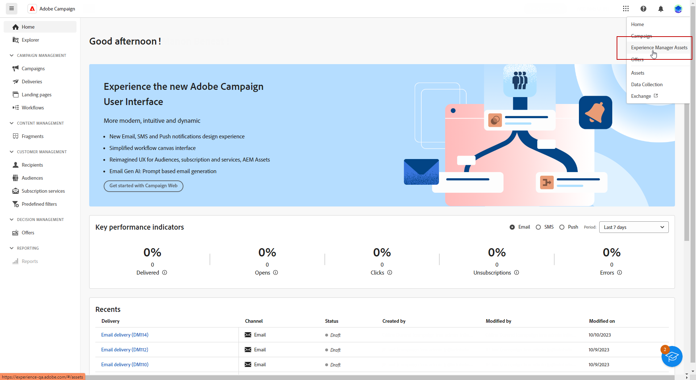
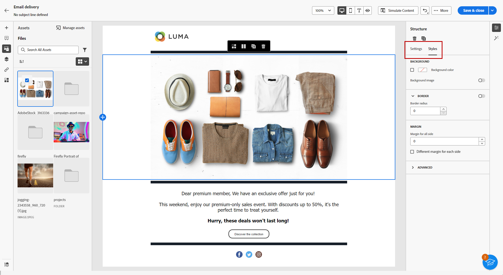

# 使用[!DNL Adobe Experience Manager Assets as a Cloud Service]管理資產{#aem-assets}

## 開始使用 [!DNL Adobe Experience Manager Assets as a Cloud Service] {#get-started-assets-essentials}

[!DNL Adobe Experience Manager Assets as a Cloud Service]是整合的合作平台，旨在簡化您的創意工作流程，並集中數位資產，提供順暢的體驗傳遞。 它可簡化組織、標籤和擷取已核准生產資產的流程，確保跨團隊的品牌一致性。 [!DNL Assets as Cloud Service]的介面簡單易用，可讓您在Adobe Creative和Experience Cloud應用程式中立即存取和共用資產。

在[Adobe Experience Manager Assets as a Cloud Service檔案](https://experienceleague.adobe.com/docs/experience-manager-cloud-service/content/assets/home.html?lang=zh-Hant){target="_blank"}中進一步瞭解。

## 上傳和插入資產{#add-asset}

若要將檔案匯入至[!DNL Assets as Cloud Service]，請瀏覽或建立將儲存檔案的資料夾。 然後，將其插入您的電子郵件內容。

如需如何上傳資產的詳細資訊，請參閱[Adobe Experience Manager Assets as a Cloud Service檔案](https://experienceleague.adobe.com/docs/experience-manager-cloud-service/content/assets/assets-view/add-delete-assets-view.html?lang=zh-Hant){target="_blank"}。

1. 從首頁存取進階功能表，然後選取[!DNL Experience Manager Assets]。

   {zoomable="yes"}

1. 在「**Assets管理**」下方，按一下「**Assets**」，然後在Adobe Campaign中選擇您資產的存放庫。

1. 按一下中央區段或樹狀檢視中的資料夾以開啟它。

   您也可以按一下&#x200B;**[!UICONTROL 建立資料夾]**&#x200B;以建立新資料夾。

1. 一旦進入選取或建立的資料夾，請按一下&#x200B;**[!UICONTROL 新增Assets]**，將新資產上傳至您的資料夾。

   {zoomable="yes"}

1. 從&#x200B;**[!UICONTROL 上傳檔案]**&#x200B;功能表，按一下&#x200B;**[!UICONTROL 瀏覽]**，並選擇要&#x200B;**[!UICONTROL 瀏覽檔案]**&#x200B;或&#x200B;**[!UICONTROL 瀏覽資料夾]**。

1. 選取您要上傳的檔案。 完成時，按一下&#x200B;**[!UICONTROL 上傳]**。

   {zoomable="yes"}

1. 若要存取進階資產管理功能表，請選取您剛才上傳的資產。

   若要進一步瞭解如何管理您的資產，請參閱此[頁面](https://experienceleague.adobe.com/docs/experience-manager-cloud-service/content/assets/assets-view/manage-organize-assets-view.html?lang=zh-Hant)。

   {zoomable="yes"}

1. 若要使用Adobe Photoshop Express進一步編輯您的資產，請連按兩下資產。 然後，從右側功能表選取&#x200B;**[!UICONTROL 編輯模式]**&#x200B;圖示。 [了解更多](https://experienceleague.adobe.com/docs/experience-manager-cloud-service/content/assets/assets-view/edit-images-assets-view.html?lang=zh-Hant#edit-using-express){target="_blank"}。

1. 從[!DNL Adobe Campaign]，從電子郵件設計工具的左窗格中選取&#x200B;**[!UICONTROL 資產選擇器]**&#x200B;功能表。

   {zoomable="yes"}

1. 選取您先前建立的&#x200B;**[!UICONTROL Assets]**&#x200B;資料夾。 您也可以在搜尋列中搜尋資產或資料夾。

   如有需要，請按一下&#x200B;**[!UICONTROL 管理資產]**，直接存取您的[!DNL Adobe Experience Manager Assets]工作區。

1. 將您的資產拖放至電子郵件內容中。

   {zoomable="yes"}

1. 使用&#x200B;**[!UICONTROL 設定]**&#x200B;和&#x200B;**[!UICONTROL 樣式]**&#x200B;索引標籤進一步自訂您的資產，例如新增外部連結或文字。 [進一步瞭解元件設定](../email/content-components.md)。

   {zoomable="yes"}