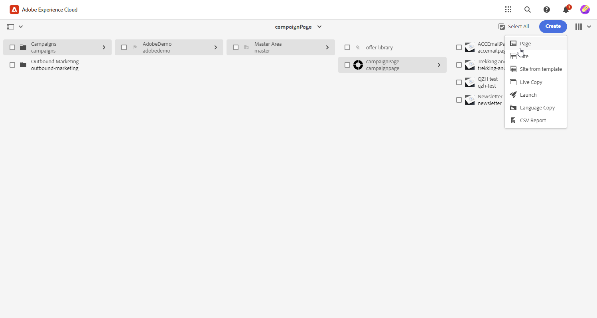
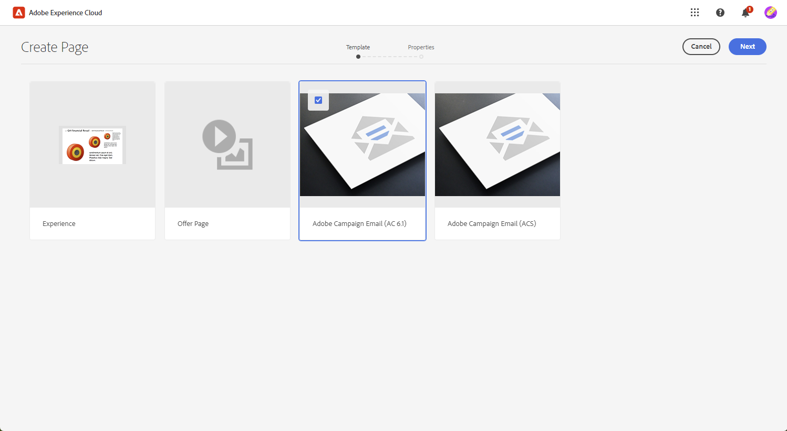
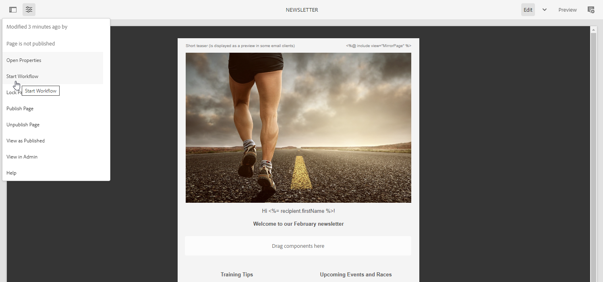
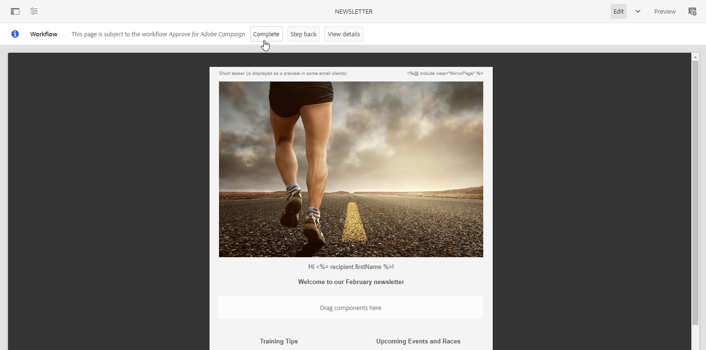
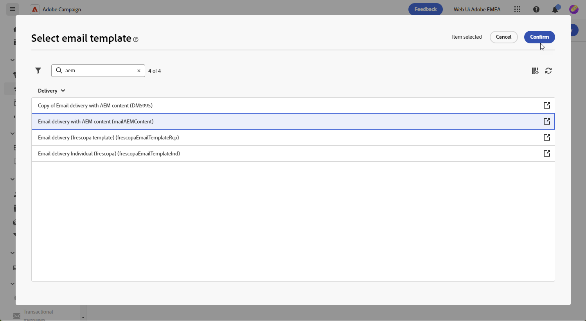
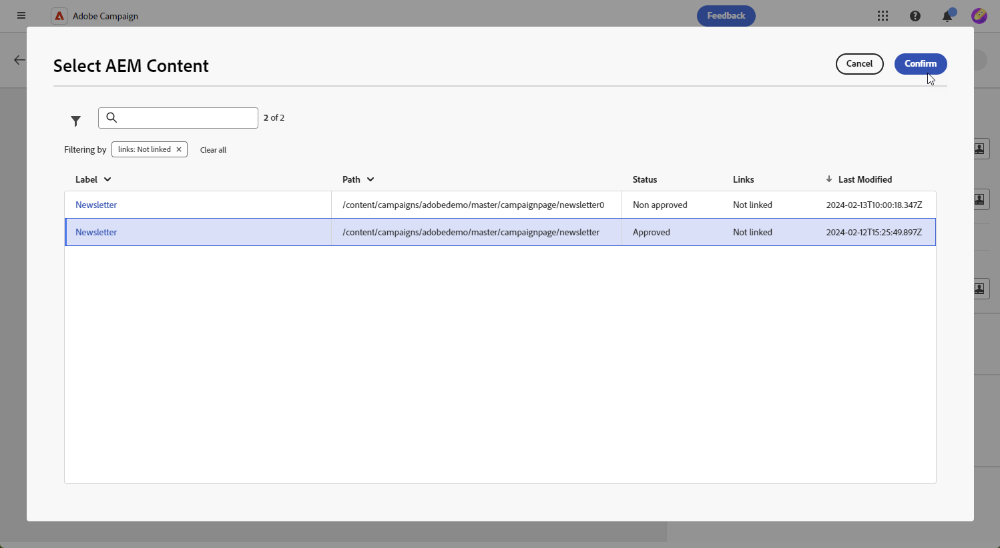
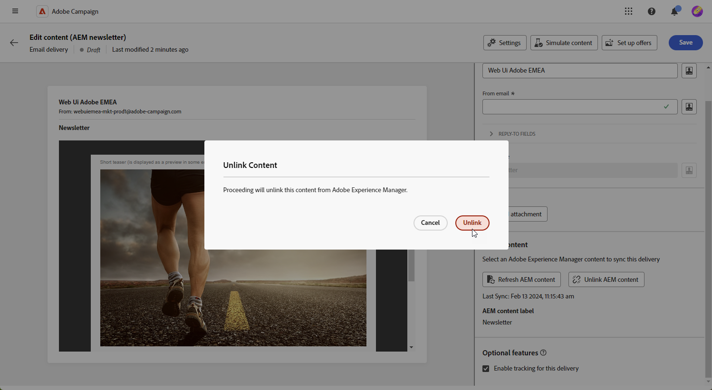

# 使用管理範本 [!DNL Adobe Experience Manager as a Cloud service]{#aem-assets}

## 開始使用 [!DNL Adobe Experience Manager as a Cloud service]{#create-aem}

Adobe Campaign網頁介面與Adobe Experience Manager整合，有助於直接在Adobe Experience Manager平台中簡化電子郵件傳遞內容和表單的管理。

[進一步瞭解Adobe Experience Manager as a Cloud Service](https://experienceleague.adobe.com/docs/experience-manager-cloud-service/content/sites/authoring/getting-started/quick-start.html?lang=en)

## 在中建立範本 [!DNL Adobe Experience Manager as a Cloud service]{#create-aem-template}

1. 導覽至 [!DNL Adobe Experience Manager] 編寫執行個體，然後按一下頁面左上角的Adobe體驗。 選擇 **[!UICONTROL 網站]** 功能表中。

1. 存取 **[!UICONTROL 行銷活動>品牌名稱>主要區域>頁面名稱]**.

1. 按一下 **[!UICONTROL 建立]** 並選取 **[!UICONTROL 頁面]** 下拉式選單中的。

   

1. 選取 **[!UICONTROL Adobe Campaign電子郵件]** 範本並命名您的Newsletter。

   

1. 透過新增元件來自訂您的電子郵件內容，例如Adobe Campaign的個人化欄位。 [了解更多](https://experienceleague.adobe.com/docs/experience-manager-65/content/sites/authoring/aem-adobe-campaign/campaign.html?lang=en#editing-email-content)

1. 電子郵件準備就緒後，請導覽至 **[!UICONTROL 頁面資訊]** 功能表並按一下 **[!UICONTROL 開始工作流程]**.

   

1. 從第一個下拉式清單中選取 **[!UICONTROL 核准Adobe Campaign]** 作為工作流程模型並按一下 **[!UICONTROL 開始工作流程]**.

1. 免責宣告會出現在您的頁面頂端，指出： `This page is subject to the workflow Approve for Adobe Campaign`. 按一下 **[!UICONTROL 完成]** 在免責宣告旁確認檢閱並按一下 **[!UICONTROL 確定]**.

   

1. 按一下 **[!UICONTROL 完成]** 再次選擇並選取 **[!UICONTROL 新聞稿核准]** 在 **[!UICONTROL 下一步]** 下拉式清單。

您的Newsletter現已準備就緒，並已在Adobe Campaign中同步。

## 將Adobe Experience Manager匯入為雲端服務範本{#aem-templates-perso}

當Experience Manager範本在Adobe Campaign Web中成為內容範本後，您就可以識別並合併電子郵件的必要內容，包括個人化。

1. 在Campaign Web中，從 **[!UICONTROL 傳遞]** 功能表，按一下 **[!UICONTROL 建立傳遞]**.

1. 在電子郵件範本視窗中，選取內建 **[!UICONTROL 包含AEM內容的電子郵件傳遞]** 範本。

   

1. 輸入 **[!UICONTROL 標籤]** 傳送並根據您的需求設定其他選項：

   * **[!UICONTROL 內部名稱]**：指派唯一識別碼給傳遞。

   * **[!UICONTROL 資料夾]**：將傳送儲存在特定資料夾。

   * **[!UICONTROL 傳遞代碼]**：使用此欄位可根據您自己的命名慣例來組織傳送。

   * **[!UICONTROL 說明]**：指定傳送的說明。

   * **[!UICONTROL 性質]**：指定用於分類目的的電子郵件性質。

1. 定義 **[!UICONTROL 對象]** 至您的電子郵件。 [了解更多](../email/create-email.md#define-audience)

1. 按一下 **[!UICONTROL 編輯內容]**.

1. 從 **[!UICONTROL 編輯內容]** 功能表，按一下 **[!UICONTROL 選取AEM內容]**.

   

1. 瀏覽您的AEM範本，並選取要匯入至Campaign網頁的範本。

   

1. 如果直接在Adobe Experience Manager中變更範本，只要選取 **[!UICONTROL 重新整理AEM內容]** 以擁有最新版本的範本。

1. 若要移除Experience Manager與Campaign之間的連結，或若要進一步在電子郵件設計工具中個人化Experience Manager範本，請按一下 **[!UICONTROL 取消連結AEM內容]**.

   

1. 如果您已將個人化內容新增至Experience Manager範本，請按一下 **[!UICONTROL 模擬內容]** 以使用測試設定檔預覽其顯示在訊息中的方式。

[進一步瞭解預覽和測試設定檔](../preview-test/preview-content.md)

1. 檢視訊息預覽時，任何個人化元素都會自動取代為所選測試設定檔中的對應資料。

   如有需要，可透過新增其他測試設定檔 **[!UICONTROL 管理測試設定檔]** 按鈕。

您的傳送現已準備就緒，可供傳送。
