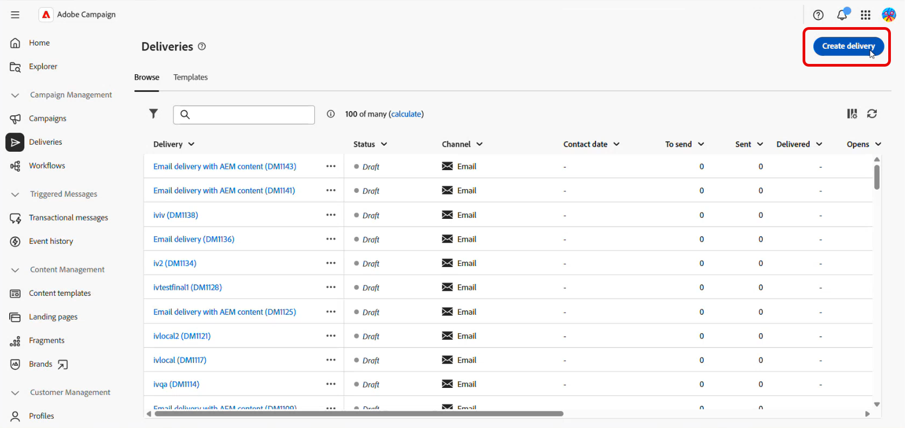
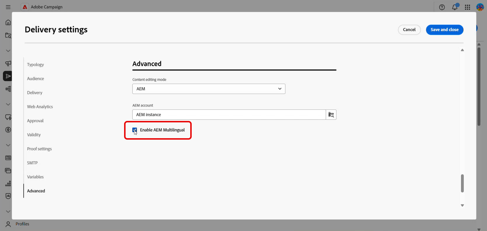
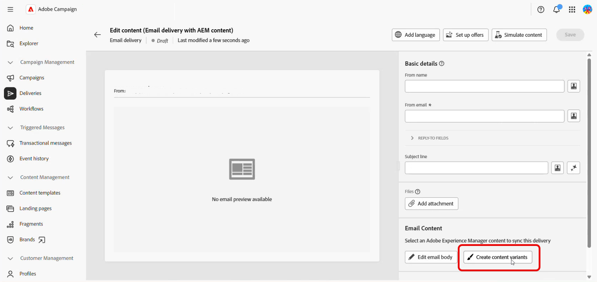
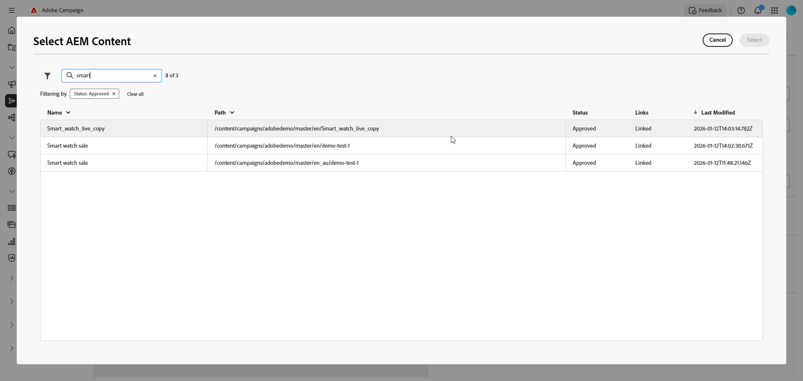
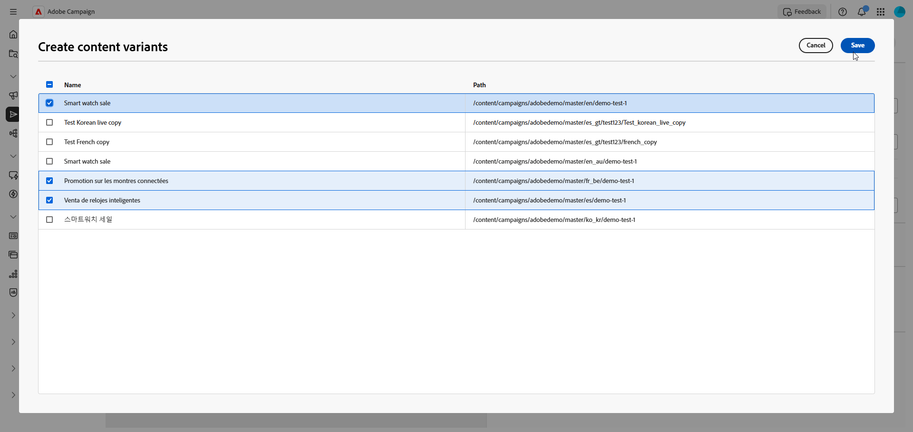
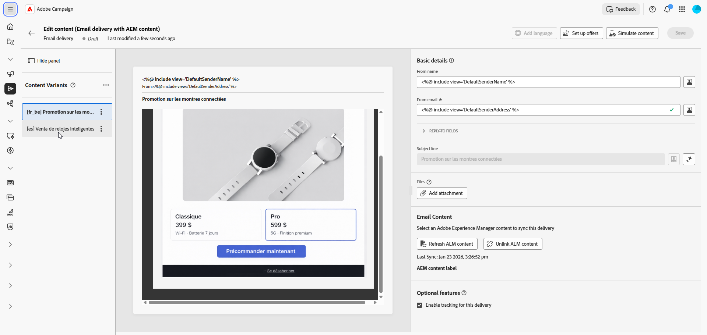
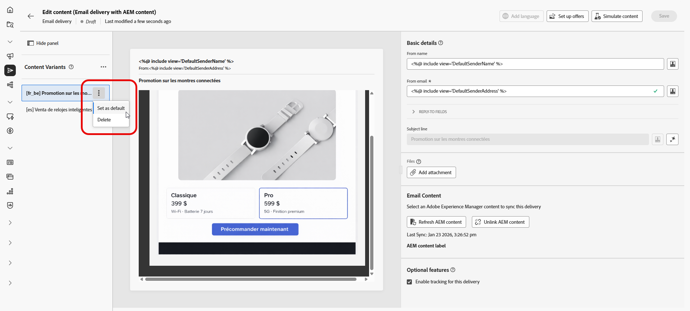
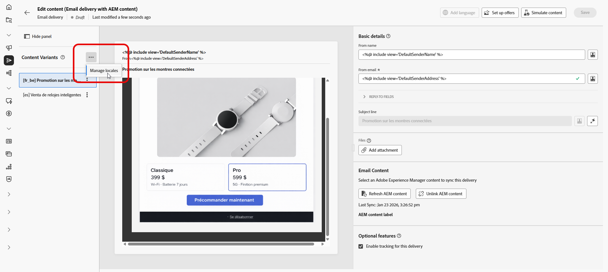
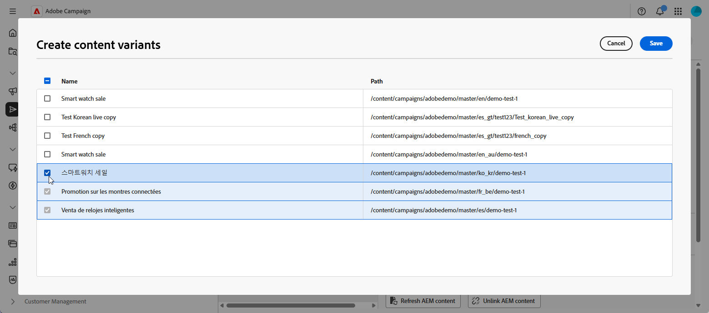
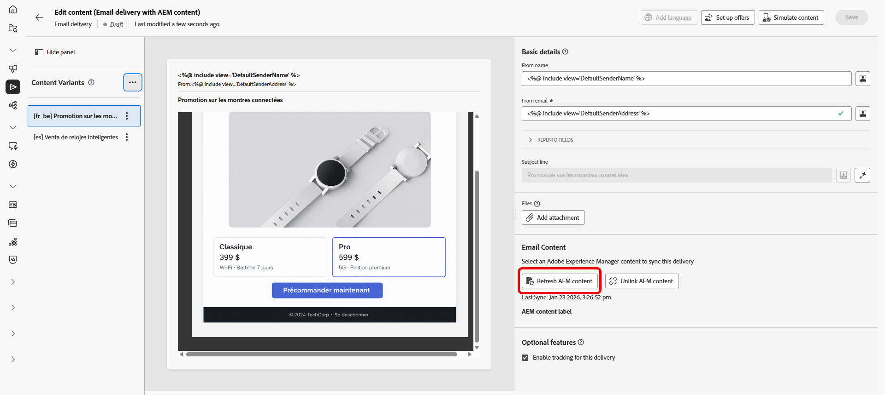

# 使用 Adobe Experience Manager 建立多語言電子郵件 {#aem-multilingual}

>[!CONTEXTUALHELP]
>id="acw_homepage_welcome_rn3"
>title="Experience Manager即時和語言副本"
>abstract="您現在可直接於 Campaign 存取 Adobe Experience Manager 語言和即時副本。即時內容重新整理可以省去手動同步處理，簡化多語言工作流程。"
>additional-url="https://experienceleague.adobe.com/docs/campaign-web/v8/release-notes/release-notes.html?lang=zh-hant" text="請參閱發行說明"

Adobe Experience Manager整合可讓您使用Adobe Experience Manager語言副本來建立多語言電子郵件傳送。 這可讓您管理不同語言的內容變體，並根據收件者語言偏好設定傳送個人化電子郵件。

## 先決條件 {#prerequisites}

在建立多語言電子郵件傳遞前，請確定您已：

* 存取為Adobe Campaign Web介面整合設定的Adobe Experience Manager執行個體。
* 已建立和核准含有語言副本的Adobe Experience Manager內容。 在[Adobe Experience Manager檔案](https://experienceleague.adobe.com/zh-hant/docs/experience-manager-cloud-service/content/sites/administering/reusing-content/translation/wizard)中進一步瞭解語言副本精靈
* 設定為接收Adobe Experience Manager內容的電子郵件傳遞範本。 請參閱[啟用多語言模式](#enable-multilingual)一節中詳述的步驟。

## 建立您的多語言傳遞

若要建立多語言電子郵件傳送，您必須先在傳送設定中啟用多語言選項。 系統會自動偵測可用的語言副本，並讓您選擇要新增的語言副本。

### 啟用多語言模式 {#enable-multilingual}

建立新傳遞並在進階設定中啟用多語言選項。

1. 從&#x200B;**[!UICONTROL 傳遞]**&#x200B;功能表，按一下&#x200B;**[!UICONTROL 建立傳遞]**。

   

1. 選取包含AEM內容的&#x200B;**[!UICONTROL 電子郵件傳遞]**&#x200B;範本，然後按一下&#x200B;**[!UICONTROL 建立傳遞]**。

   

1. 輸入傳送的標籤，並設定您的對象。 [了解更多](../email/create-email.md)

1. 存取您的傳遞&#x200B;**[!UICONTROL 設定]**，然後導覽至&#x200B;**[!UICONTROL 進階]**&#x200B;區段。

1. 啟用&#x200B;**[!UICONTROL 啟用AEM多語言]**&#x200B;選項。

   

1. 請確定：

   * **[!UICONTROL 內容編輯模式]**&#x200B;設定為&#x200B;**[!UICONTROL AEM]**。
   * 已選取正確的Adobe Experience Manager **[!UICONTROL 外部帳戶]**。

1. 按一下&#x200B;**[!UICONTROL 儲存並關閉]**。

### 建立內容變體 {#create-variants}

選取您的Adobe Experience Manager內容，並選擇要包含在傳遞中的語言變體。

1. 按一下&#x200B;**[!UICONTROL 編輯內容]**。

1. 選取&#x200B;**[!UICONTROL 建立內容變體]**。

   

1. 從清單中選取您的Adobe Experience Manager內容。

   

1. 例如，若您的Adobe Experience Manager內容有法文、德文和義大利文的變體，則所有變體都可供選取，則系統會偵測與所選內容相關的所有語言副本（父子關係）。

   選取您要納入傳遞的語言變體。

   

1. 按一下「**[!UICONTROL 儲存]**」。

1. 在內容編輯器中檢閱您的語言變體。 您現在可以[個別管理每個變體](#manage-variants)，或繼續[傳送傳遞](../monitor/prepare-send.md)。

   

## 管理語言變體 {#manage-variants}

建立內容變體後，您可以直接在傳送中管理變體：

1. 若要設定預設語言，請存取您所選變體的進階功能表，並選取&#x200B;**[!UICONTROL 設定為預設值]**。 設定檔的語言偏好設定未設定或與任何可用變體不相符時，就會使用預設語言。

   按一下&#x200B;**[!UICONTROL 刪除]**&#x200B;以從您的傳遞中移除任何變體。

   

1. 從「內容變體」進階功能表，按一下&#x200B;**[!UICONTROL 管理地區設定]**&#x200B;以將其他地區設定加入您的傳遞。

   

1. 選取其他語言復本以包含更多變體，然後按一下[儲存]。**&#x200B;**

   

1. 如果Adobe Experience Manager中的內容已更新，請按一下&#x200B;**[!UICONTROL 重新整理AEM內容]**，將所有變體與最新版本同步。

   

1. 如果您要直接在Campaign中編輯內容或中斷與AEM的連結，請按一下&#x200B;**[!UICONTROL 取消連結Adobe Experience Manager內容]**。

   >[!CAUTION]
   >
   >取消連結後，您無法從Adobe Experience Manager重新整理內容或建立新變體。 內容會獨立於Adobe Experience Manager。
