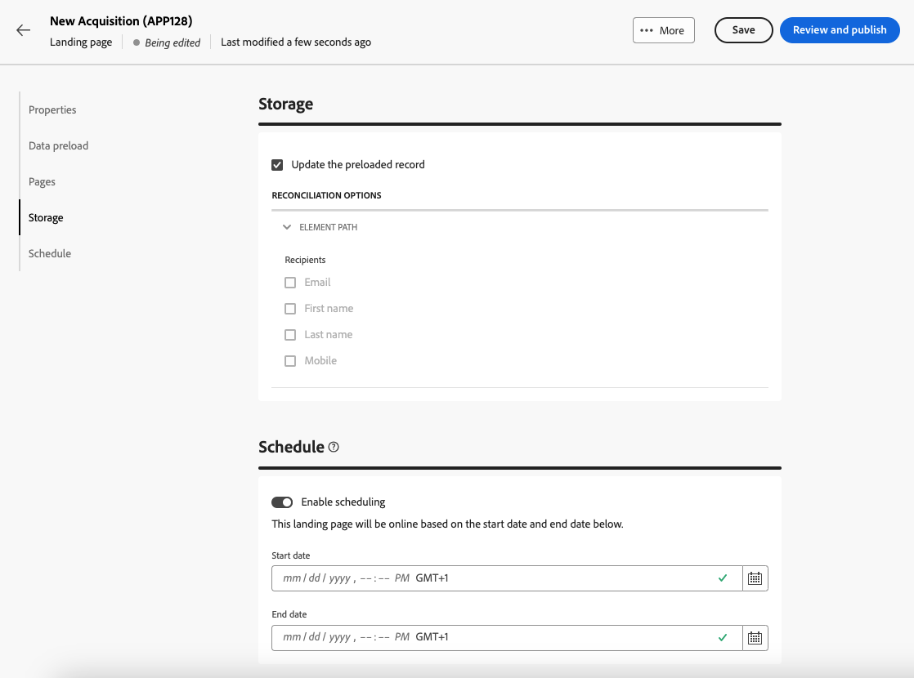

# 建立及發佈登陸頁面 {#create-lp}

>[!CONTEXTUALHELP]
>id="acw_landingpages_menu"
>title="建立及管理登入頁面"
>abstract="Adobe Campaign可讓您建立及設計登入頁面，將您的使用者導向線上表單，以便他們可以選擇加入或選擇退出接收您的通訊，或訂閱電子報等特定服務。"

若要將您的客戶導向至您要在他們按一下特定連結時顯示的已定義網頁，請建立登入頁面，位於 [!DNL Adobe Campaign]，設計其內容、測試並發佈。

## 存取登陸頁面 {#access-landing-pages}

若要存取登入頁面清單，請選取 **[!UICONTROL 行銷活動管理]** > **[!UICONTROL 登陸頁面]** 從左側功能表。

此 **[!UICONTROL 登陸頁面]** 「庫存管理系統」會顯示所有已建立的料號。 您可以使用 **顯示篩選器** 按鈕。 您可以將結果限製為特定 [資料夾](../get-started/permissions.md#folders) 使用下拉式清單，或使用以下專案新增規則： [查詢模型工具](../query/query-modeler-overview.md).

<!--From this list, you can access the [landing page Live report](../reports/lp-report-live.md) or [landing page Global report](../reports/lp-report-global.md) for published items.-->

>[!NOTE]
>
>您無法在Campaign網頁中顯示從使用者端主控台建立的登入頁面。 進一步瞭解 [Campaign主控台檔案](https://experienceleague.adobe.com/docs/campaign/campaign-v8/content/webapps.html){target="_blank"}.

<!--If you unpublish a landing page which is referenced in a message, the link to the landing page will be broken and an error page will be displayed. You cannot delete a published landing page. To delete it, you must first unpublish it.-->

您可以複製或刪除登入頁面。 按一下登入頁面旁的三個點，以選取所需的動作。

## 設定登陸頁面 {#create-landing-page}

>[!CONTEXTUALHELP]
>id="acw_landingpages_properties"
>title="定義登入頁面屬性"
>abstract="填寫屬性欄位（例如標籤），並視需要修改架構。 此外，您可以編輯內部名稱、變更儲存登入頁面的資料夾，以及提供說明。"

>[!CONTEXTUALHELP]
>id="acw_landingpages_pages_list"
>title="定義頁面的內容"
>abstract="編輯屬於此登入頁面之每個頁面的內容。"

>[!CONTEXTUALHELP]
>id="acw_landingpages_schedule"
>title="排程您的登陸頁面"
>abstract="您可以定義登入頁面的開始日期和結束日期。 頁面過期時， **有效期** 頁面隨即顯示。"

>[!CONTEXTUALHELP]
>id="acw_landingpages_primarypage"
>title="定義主要頁面設定"
>abstract="使用者點選您的登陸頁面連結 (例如從電子郵件或網站) 後，主要頁面會隨即向使用者顯示。"

>[!CONTEXTUALHELP]
>id="acw_landingpages_subscription"
>title="設定您的訂閱登入頁面"
>abstract="訂閱頁面可讓您的客戶訂閱服務。"

<!--The main steps to create landing pages are as follows:

-->

1. 從 **[!UICONTROL 登陸頁面]** 詳細目錄，按一下 **[!UICONTROL 建立登陸頁面]**.

   

1. 選取範本：
   * **[!UICONTROL 贏取]**：這是登入頁面的預設範本，可讓您擷取和更新設定檔資料。
   * **[!UICONTROL 訂閱]**：使用此範本提供服務的訂閱。
   * **[!UICONTROL 取消訂閱]**：此範本可從寄送給訂閱者的電子郵件連結至服務，讓他們得以取消訂閱此服務。
   * **[!UICONTROL 封鎖清單]**：此範本應在設定檔不想再由Campaign聯絡時使用。 深入了解封鎖清單管理

   

1. 按一下 **[!UICONTROL 建立]**.

1. 填寫屬性欄位，例如標籤。 根據預設，登入頁面會儲存在 **[!UICONTROL 網頁應用程式]** 資料夾。 您可以瀏覽至中所需的位置來變更它 **[!UICONTROL 其他選項]**. [瞭解如何使用資料夾](../get-started/permissions.md#folders)

   

1. 在 **[!UICONTROL 資料預先載入]** 部分，預設會選取以下兩個選項：

   * 此 **[!UICONTROL 使用表單中參照的資料預先填寫]** 選項可讓您自動預先載入與表單中輸入及合併欄位相符的資料。

   * 此 **[!UICONTROL 如果沒有ID，則跳過預先載入]** 如果您不想更新設定檔，則必須選取選項。 在這種情況下，在核准表單後，輸入的每個設定檔都將新增到資料庫。 例如，在網站上張貼表單時，會使用此選項。

1. 在 **[!UICONTROL 頁面]** 區段，按一下 **[!UICONTROL 編輯內容]** 按鈕來指定您要為此登入頁面設計的每個頁面。 每個頁面的內容均已預先填滿。 視需要編輯。 [了解更多](lp-content.md)

   

1. 此 **[!UICONTROL 更新預先載入的記錄]** 預設為選取。 如果您想要透過登入頁面更新儲存在資料庫中的設定檔，則可以使用預先載入方塊。 預先載入方塊可讓您指定如何在資料庫中尋找要更新的記錄。 您也可以從登入頁面目前前後關聯中的欄位中進行選擇，這些欄位將用於尋找資料庫中的對應設定檔。

   

1. 您可以定義登入頁面的開始日期和結束日期。 選取 **[!UICONTROL 啟用排程]** 並設定日期。 頁面過期時， **[!UICONTROL 有效期]** 頁面隨即顯示。

1. 按一下 **[!UICONTROL 檢閱和發佈]**.

設定並設計所有頁面後，您可以 [測試](#test-landing-page) 和 [發佈](#publish-landing-page) 您的登陸頁面。

## 測試登陸頁面 {#test-landing-page}

>[!CONTEXTUALHELP]
>id="acw_landingpages_simulate"
>title="模擬您的登陸頁面"
>abstract="您可以在Campaign網頁使用者介面中檢視登入頁面的預覽，或在新的網頁瀏覽器分頁中開啟。"

>[!CONTEXTUALHELP]
>id="ac_preview_lp_profiles"
>title="預覽和測試您的登陸頁面"
>abstract="定義登陸頁面設定和內容後，您就可以使用測試設定檔進行預覽。"

定義登入頁面設定和內容後，您就可以使用測試設定檔來預覽。 如果您已插入 [個人化內容](../personalization/gs-personalization.md)，您將能使用測試設定檔資料檢查此內容在登入頁面中的顯示方式。

>[!CAUTION]
>
>您必須有可用的測試設定檔，才能預覽訊息和傳送校樣。 瞭解如何 [建立測試設定檔](../audience/test-profiles.md).

1. 從登入頁面介面，按一下 **[!UICONTROL 模擬內容]** 按鈕以存取測試設定檔選項。

   

1. 從 **[!UICONTROL 模擬]** 畫面，選取一或多個測試設定檔。

   選取測試設定檔的步驟與測試訊息時相同。 在中會詳細說明這些步驟 [預覽和測試](../preview-test/preview-test.md) 區段。

1. 選取 **[!UICONTROL 開啟預覽]** 以測試您的登入頁面。

   

1. 登入頁面的預覽會在新標籤中開啟。 個人化元素會由選取的測試設定檔資料取代。

   

1. 選取其他測試設定檔以預覽登陸頁面每個變體的呈現。

<!--Can you preview Confirmation/Error/Expiration pages?-->

## 發佈登陸頁面 {#publish-landing-page}

一旦登入頁面準備就緒後，您就可以發佈該頁面，以供訊息使用。

發佈登入頁面後，會透過將其新增至登入頁面清單 **[!UICONTROL 已發佈]** 狀態。 現在已上線且可供使用。

發佈後，您可以複製並貼上 **[!UICONTROL 登陸頁面URL]** 會顯示在網頁瀏覽器頁面頂端的專案。

您可以透過記錄檔和特定報告監控登入頁面影響。
