# 建立和發佈登陸頁面 {#create-lp}

>[!CONTEXTUALHELP]
>id="acw_landingpages_menu"
>title="建立和管理登陸頁面"
>abstract="Adobe Campaign 可讓您建立、設計和分享登陸頁面，將使用者導向線上網頁；您可以在這些網頁中根據內建範本來管理贏取、訂閱/取消訂閱和封鎖清單使用案例。"

Campaign Web使用者介面可讓您建立、設計和發佈登入頁面。 發佈後，您可以在傳送中插入表單連結。 收件者按一下該連結後，即會被導向相對應的登陸頁面。

[!DNL Adobe Campaign]隨附四個範本以管理下列使用案例：**贏取**、**訂閱**、**取消訂閱**&#x200B;以及&#x200B;**封鎖清單**。 [了解更多](lp-use-cases.md)

## 存取登陸頁面 {#access-landing-pages}

若要存取登入頁面清單，請從左側功能表選取&#x200B;**[!UICONTROL 行銷活動管理]** > **[!UICONTROL 登入頁面]**。

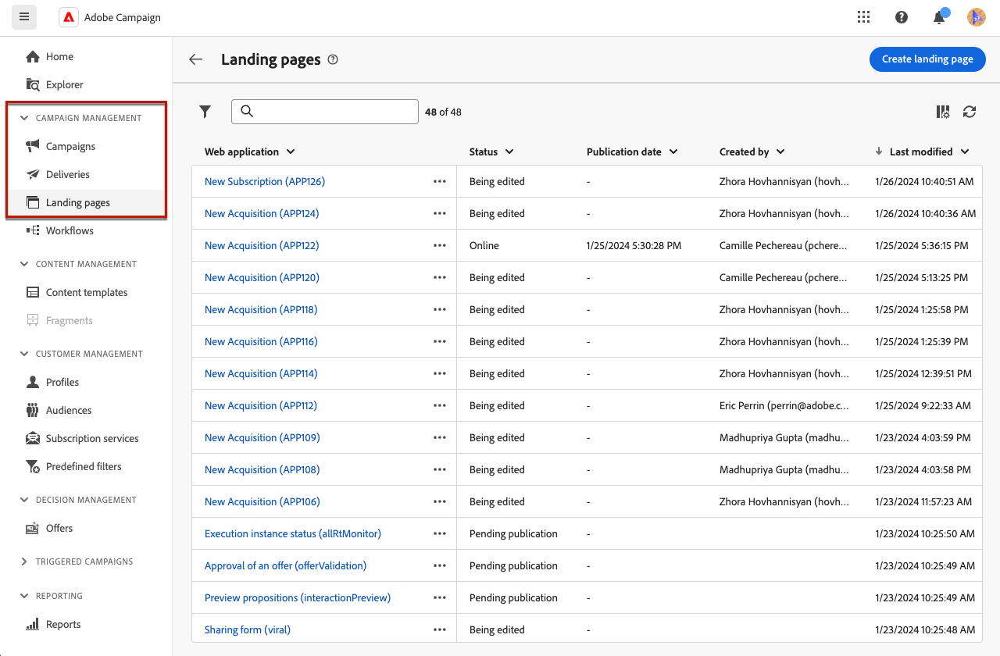{zoomable="yes"}

**[!UICONTROL 登陸頁面]**&#x200B;詳細目錄會顯示所有已建立的專案。 您可以使用&#x200B;**[!UICONTROL 顯示篩選器]**&#x200B;按鈕來篩選它們。 您可以使用下拉式清單將結果限製為特定[資料夾](../get-started/permissions.md#folders)，或使用[查詢模型工具](../query/query-modeler-overview.md)新增規則。

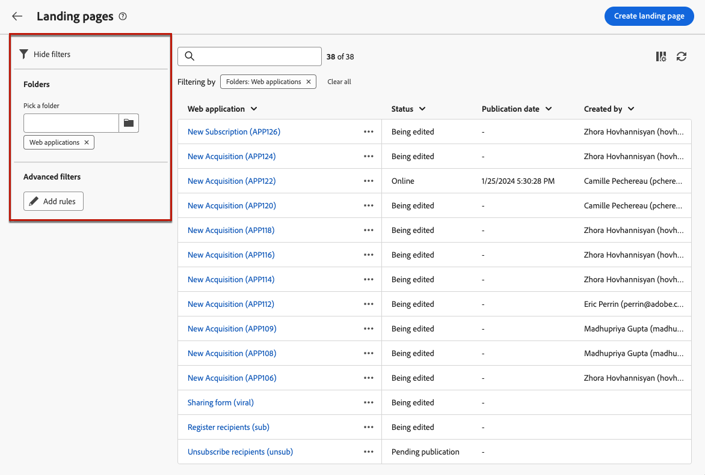{zoomable="yes"}

<!--From this list, you can access the [landing page Live report](../reports/lp-report-live.md) or [landing page Global report](../reports/lp-report-global.md) for published items.-->

>[!CAUTION]
>
>您無法在Campaign網頁使用者介面中顯示或編輯從使用者端主控台（網頁表單）建立的登入頁面。 在[Campaign主控台檔案](https://experienceleague.adobe.com/docs/campaign/campaign-v8/content/webapps.html?lang=zh-Hant){target="_blank"}中進一步瞭解。

<!--If you unpublish a landing page which is referenced in a message, the link to the landing page will be broken and an error page will be displayed. You cannot delete a published landing page. To delete it, you must first unpublish it.-->

您可以複製或刪除登入頁面。 按一下登入頁面旁的省略符號，以選取所需的動作。

## 設定登陸頁面 {#create-landing-page}

>[!CONTEXTUALHELP]
>id="acw_landingpages_properties"
>title="定義登錄頁面屬性"
>abstract="填寫屬性欄位 (例如標籤) 並根據需要修改結構描述。此外，您還可以編輯內部名稱、變更儲存登陸頁面的資料夾和提供說明。"

>[!CONTEXTUALHELP]
>id="acw_landingpages_pages_list"
>title="定義每個頁面的內容"
>abstract="調整屬於此登陸頁面的每個頁面內容，例如表單本身、提交表單時顯示的確認頁面或發生錯誤時引導使用者的頁面。"

>[!CONTEXTUALHELP]
>id="acw_landingpages_schedule"
>title="排程登陸頁面"
>abstract="您可以定義登陸頁面的開始日期和結束日期。當頁面有效期限結束時，就無法再使用該表格。會改為顯示&#x200B;**有效期**&#x200B;頁面。"

>[!CONTEXTUALHELP]
>id="acw_landingpages_preload"
>title="定義預先載入選項"
>abstract="當選取「**預先填寫表單中所參考的資料**」選項時，如果登陸頁面的訪客與資料庫中的設定檔相符時，設定檔的資訊會自動預先載入表單中。選取「**授權缺少 ID**」選項後，任何訪客 (包括匿名使用者) 都可以存取登入頁面。"

<!--With the **Skip preloading if no ID** option selected, each profile entered will be added to the database after approval of the form."-->

>[!CONTEXTUALHELP]
>id="acw_landingpages_storage"
>title="定義儲存選項"
>abstract="預先載入區段可讓您指示如何在資料庫中尋找要更新的記錄。"

<!--The main steps to create landing pages are as follows:

{zoomable="yes"}-->

若要建立登入頁面，請執行下列步驟：

1. 從&#x200B;**[!UICONTROL 登陸頁面]**&#x200B;詳細目錄，按一下&#x200B;**[!UICONTROL 建立登陸頁面]**。

   {zoomable="yes"}

1. 選取範本：
   * **[!UICONTROL 贏取]**：這是登入頁面的預設範本，可讓您擷取及更新設定檔資料。
   * **[!UICONTROL 訂閱]**：使用此範本讓使用者訂閱特定的[服務](../audience/manage-services.md)。
   * **[!UICONTROL 取消訂閱]**：此範本可用於傳送給服務訂閱者的傳遞中，以允許他們取消訂閱此[服務](../audience/manage-services.md)。
   * **[!UICONTROL 封鎖清單]**：當設定檔點按傳送中的選擇退出連結，且不想再聯絡時，應使用此範本。

   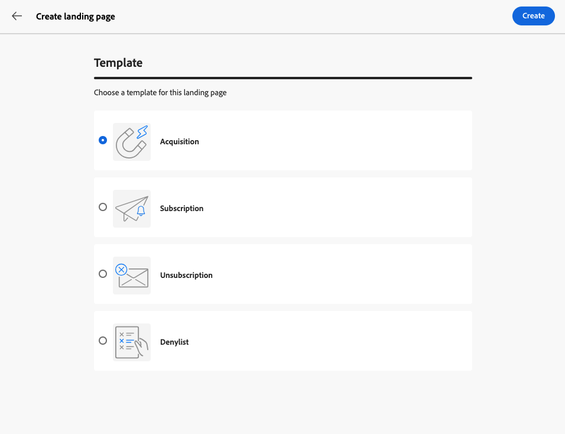{zoomable="yes"}

   >[!NOTE]
   >
   >瞭解如何在[此頁面](lp-use-cases.md)中實作與每個範本對應的不同使用案例。

1. 按一下「**[!UICONTROL 建立]**」。

1. 填寫&#x200B;**[!UICONTROL 屬性]**&#x200B;欄位，例如標籤。

   依預設，登入頁面會儲存在&#x200B;**[!UICONTROL 網頁應用程式]**&#x200B;資料夾中。 您可以在&#x200B;**[!UICONTROL 其他選項]**&#x200B;中瀏覽到想要的位置來變更它。 [瞭解如何使用資料夾](../get-started/permissions.md#folders)

   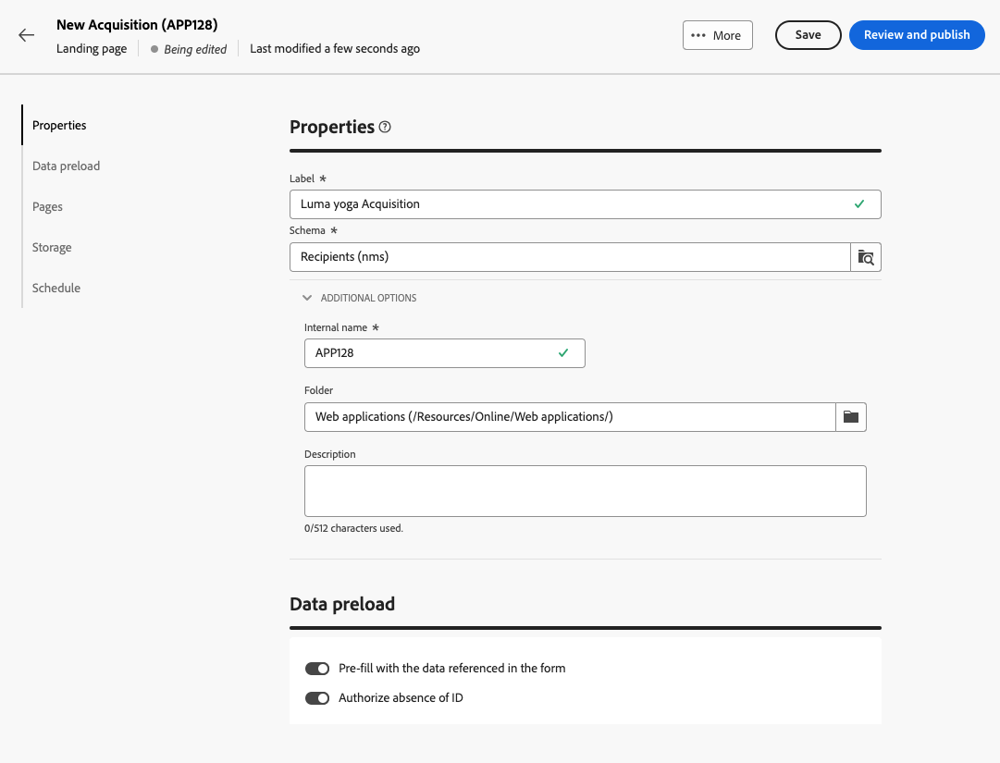{zoomable="yes"}

1. 在&#x200B;**[!UICONTROL 資料預先載入]**&#x200B;區段中，下列兩個選項可供使用：

   * 當選取「**[!UICONTROL 預先填寫表單中所參考的資料]**」選項時，如果登陸頁面的訪客與資料庫中的設定檔相符時，設定檔的資訊會自動預先載入表單中。使用者只需填寫缺少的欄位，並在需要時更新現有值。 這可合併現有設定檔的資料，而非建立重複專案。

     >[!NOTE]
     >
     >依預設，會為所有登入頁面範本選取此選項。

   <!--* The **[!UICONTROL Skip preloading if no ID]** option must be selected if you do not wish to update profiles. In this case, each profile entered will be added to the database after approval of the form. This option is used, for example, when the form is posted on a website.-->

   * **[!UICONTROL 授權缺少ID]**&#x200B;選項可讓任何訪客存取登入頁面。 取消選取此選項可防止匿名訪客使用它，這表示只有已識別的使用者才能存取及提交表單。

     >[!AVAILABILITY]
     >
     >此功能在有限可用性(LA)中提供。 僅限&#x200B;**從 Adobe Campaign Standard 移轉至 Adobe Campaign v8** 的客戶，且無法部署於任何其他環境。

     對於&#x200B;**[!UICONTROL 贏取]**&#x200B;與&#x200B;**[!UICONTROL 訂閱]**&#x200B;範本，預設會選取此選項。 對於&#x200B;**[!UICONTROL 取消訂閱]**&#x200B;與&#x200B;**[!UICONTROL 封鎖清單]**&#x200B;範本，此選項預設為取消選取，且無法修改<!--as per ticket - TBC? in that case, is it greyed out or doesn't display?-->。

1. 登入頁面可以有後續頁面。 若要新增頁面，請瀏覽&#x200B;**[!UICONTROL 頁面]**&#x200B;區段，然後按一下您想要為此登入頁面設計的每個頁面的&#x200B;**[!UICONTROL 編輯內容]**&#x200B;按鈕。 每個頁面的內容均已預先填滿。 視需要編輯。 [了解更多](lp-content.md)

   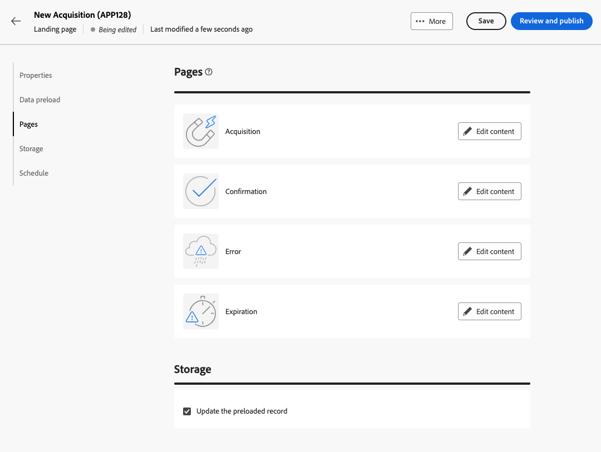{zoomable="yes"}

1. 在&#x200B;**[!UICONTROL 儲存體]**&#x200B;區段中，預設會選取&#x200B;**[!UICONTROL 更新預先載入的記錄]**&#x200B;選項。 它可讓您透過登入頁面更新儲存在資料庫中的設定檔。 預先載入方塊可讓您指定如何在資料庫中尋找要更新的記錄。

   您也可以從登入頁面目前前後關聯中的欄位中進行選擇，這些欄位將用於尋找資料庫中的對應設定檔。 若要這麼做，請取消選取&#x200B;**[!UICONTROL 更新預先載入的記錄]**&#x200B;選項，並核取&#x200B;**[!UICONTROL 調解選項]**&#x200B;下的所需欄位。

   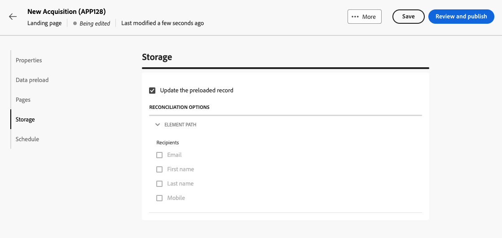{zoomable="yes"}

1. 建立&#x200B;**[!UICONTROL 其他資料]**，以便在提交登入頁面時儲存內部資料。 造訪頁面的使用者不會看見此資料。 只會考慮常數值。

   >[!AVAILABILITY]
   >
   >此功能在有限可用性(LA)中提供。 僅限&#x200B;**從 Adobe Campaign Standard 移轉至 Adobe Campaign v8** 的客戶，且無法部署於任何其他環境。

   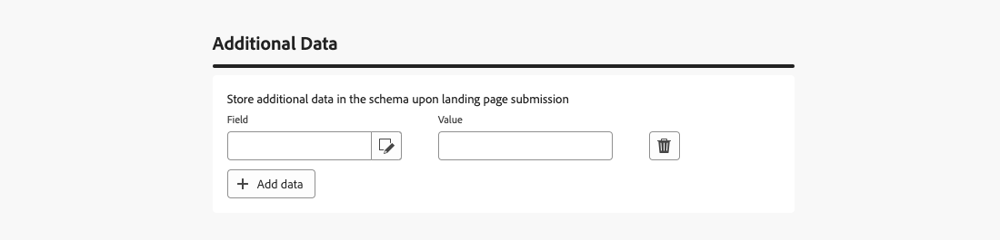{zoomable="yes"}

1. 您可以定義登陸頁面的開始日期和結束日期。選取&#x200B;**[!UICONTROL 啟用排程]**&#x200B;並設定日期。

   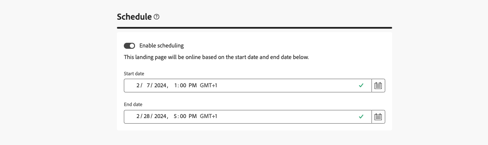{zoomable="yes"}

   * 登入頁面會在指定的開始日期/時間自動發佈。

     >[!NOTE]
     >
     >如果未定義開始日期，登入頁面在發佈後就會立即上線。

   * 當頁面到達結束日期時，<!--the landing page is automatically unpublished and -->表單將不再可用。 會改為顯示&#x200B;**[!UICONTROL 有效期]**&#x200B;頁面。

     >[!NOTE]
     >
     >基於安全性原因和平台效能，Adobe建議您設定結束日期。

1. 按一下&#x200B;**[!UICONTROL 檢閱並發佈]**。

定義所有設定並[設計](lp-content.md)所有頁面後，您可以[測試](#test-landing-page)和[發佈](#publish-landing-page)您的登陸頁面，如下所述。

## 測試登陸頁面 {#test-landing-page}

>[!CONTEXTUALHELP]
>id="acw_landingpages_simulate"
>title="模擬登陸頁面"
>abstract="您可以在 Campaign Web 使用者介面中查看登陸頁面的預覽內容，或在新的 Web 瀏覽器標籤中開啟它。"

>[!CONTEXTUALHELP]
>id="ac_preview_lp_profiles"
>title="預覽和測試您的登陸頁面"
>abstract="定義登陸頁面設定和內容後，您就可以使用測試設定檔進行預覽。"

定義登入頁面設定和內容後，您就可以使用測試設定檔來預覽。 如果您已插入[個人化內容](../personalization/gs-personalization.md)，您可以使用測試設定檔資料檢查此內容在登入頁面中的顯示方式。

>[!CAUTION]
>
>您必須有可用的測試設定檔，才能預覽訊息和傳送校樣。 [進一步瞭解測試設定檔](../audience/test-profiles.md)

若要測試您的登入頁面，請遵循下列步驟：

1. 按一下&#x200B;**[!UICONTROL 檢閱和發佈]**&#x200B;後，從登入頁面控制面板選取&#x200B;**[!UICONTROL 模擬內容]**&#x200B;按鈕以存取測試設定檔選取專案。

   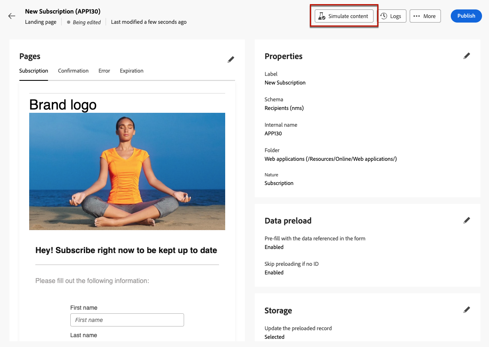{zoomable="yes"}

1. 從&#x200B;**[!UICONTROL 模擬]**&#x200B;畫面中，選取一或多個測試設定檔。

   選取測試設定檔的步驟與測試訊息時相同。 在[預覽和測試](../preview-test/preview-test.md)區段中會詳細說明這些專案。

1. 測試動態登入頁面時（已選取&#x200B;**[!UICONTROL 來自URL的服務]**&#x200B;選項 — [深入瞭解](../landing-pages/create-lp.md#define-actions-on-form-submission)）

1. 選取&#x200B;**[!UICONTROL 開啟預覽]**&#x200B;以測試您的登陸頁面。

   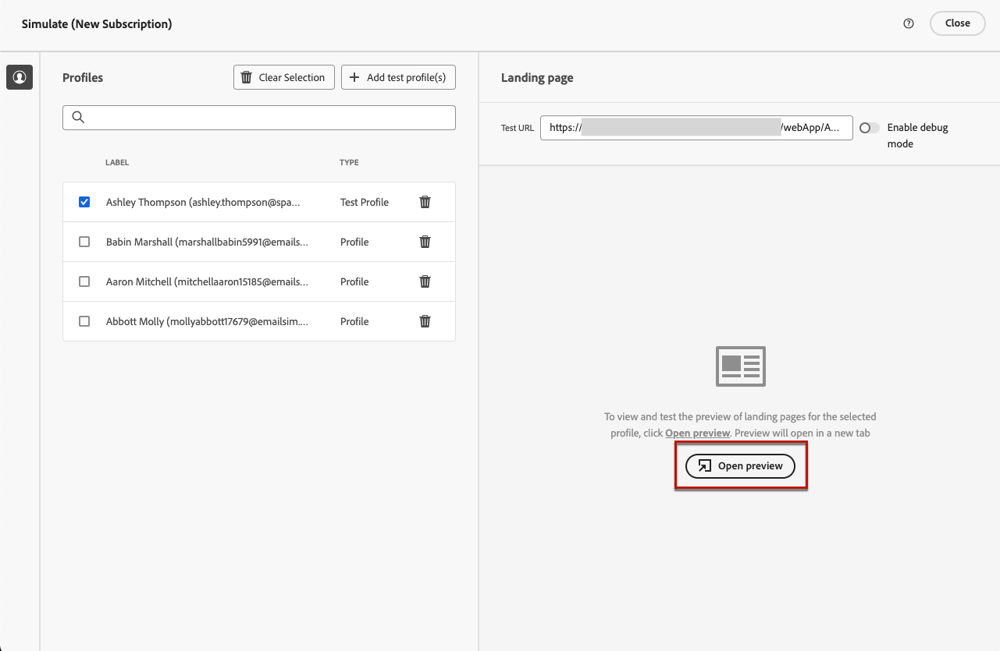{zoomable="yes"}

1. 登入頁面的預覽會在新標籤中開啟。 個人化元素會由選取的測試設定檔資料取代。

   如果您在登入頁面設定中選取了表單&#x200B;]**中參考資料的**[!UICONTROL &#x200B;預先填入選項，則表單欄位會自動預先填入對應的測試設定檔資料。<!--TBC-->

   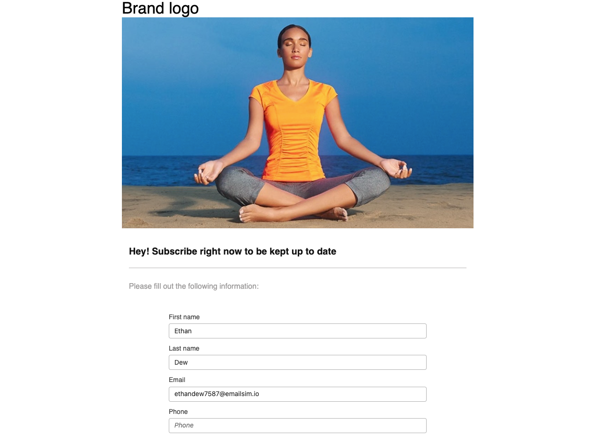{zoomable="yes"}

1. 選取其他測試設定檔以預覽登陸頁面每個變體的呈現。

<!--Can you preview Confirmation/Error/Expiration pages?-->

## 發佈登陸頁面 {#publish-landing-page}

在您的登入頁面準備就緒並完成驗證後，請發佈該頁面，以便使用對應按鈕將其用於傳送中。

發佈後：

* 登入頁面已新增至具有&#x200B;**[!UICONTROL 已發佈]**&#x200B;狀態的登入頁面清單。 它現在已上線，並準備好在您的內容中參照。

* 您可以將頁面上方顯示的&#x200B;**[!UICONTROL 登陸頁面URL]**&#x200B;複製並貼到網頁瀏覽器中，以預覽您的登陸頁面。

>[!CAUTION]
>
>若要全面測試或善用您的登陸頁面，您不得將此連結直接複製並貼上到網頁瀏覽器或您的傳遞內容中。請改用[模擬內容](#test-landing-page)函式來測試，並按照[此區段](lp-use-cases.md)中說明的步驟來正確使用您的登入頁面。

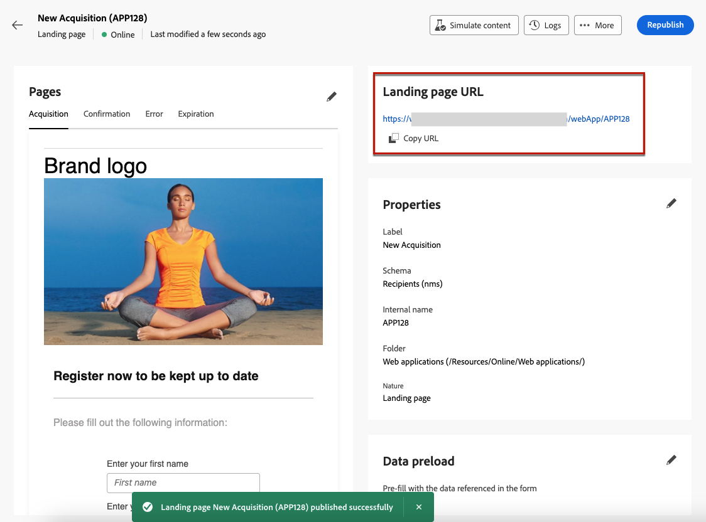{zoomable="yes"}

您可以透過記錄檔<!--and specific reports-->監視您的登入頁面影響。 按一下&#x200B;**[!UICONTROL 記錄檔]**&#x200B;按鈕。
