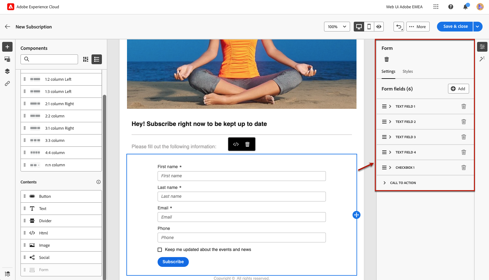
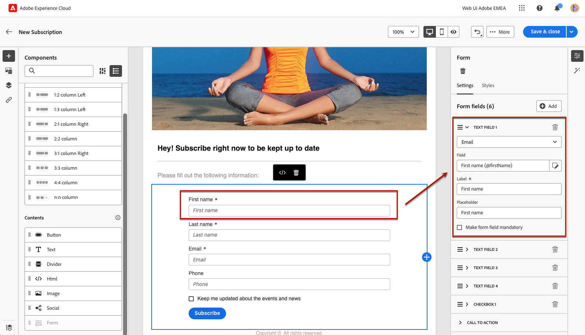
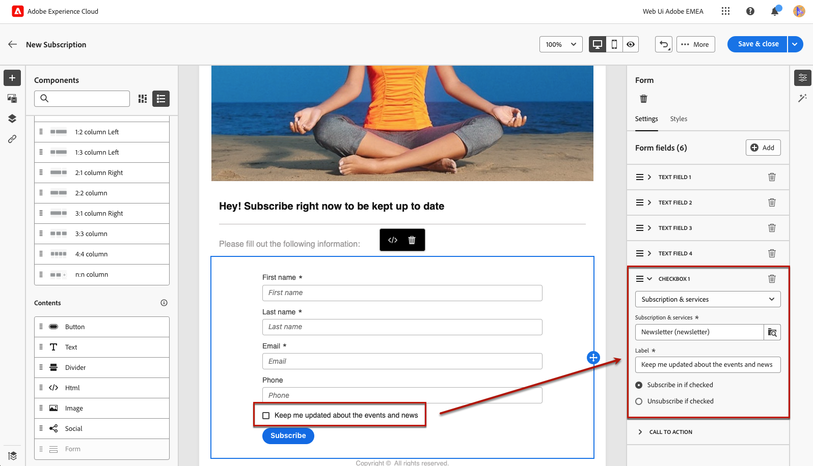
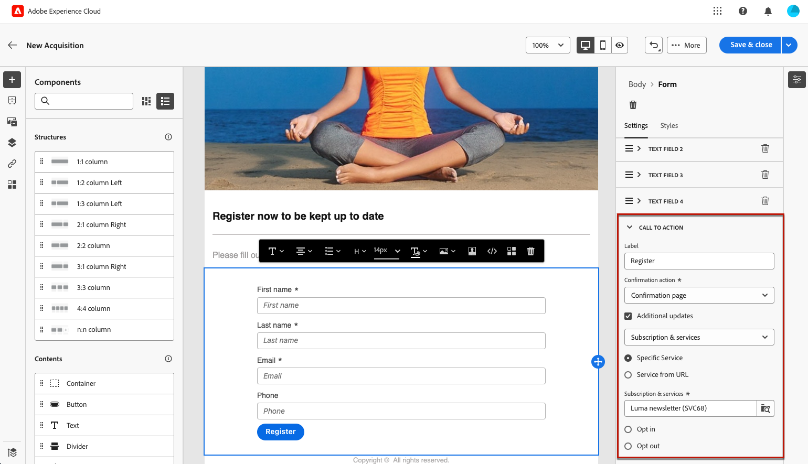
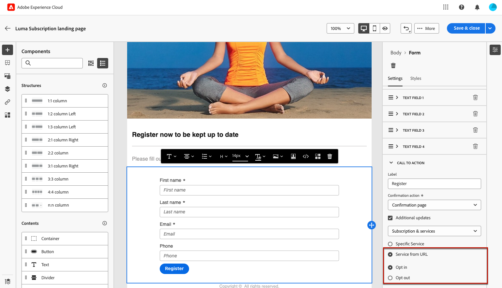
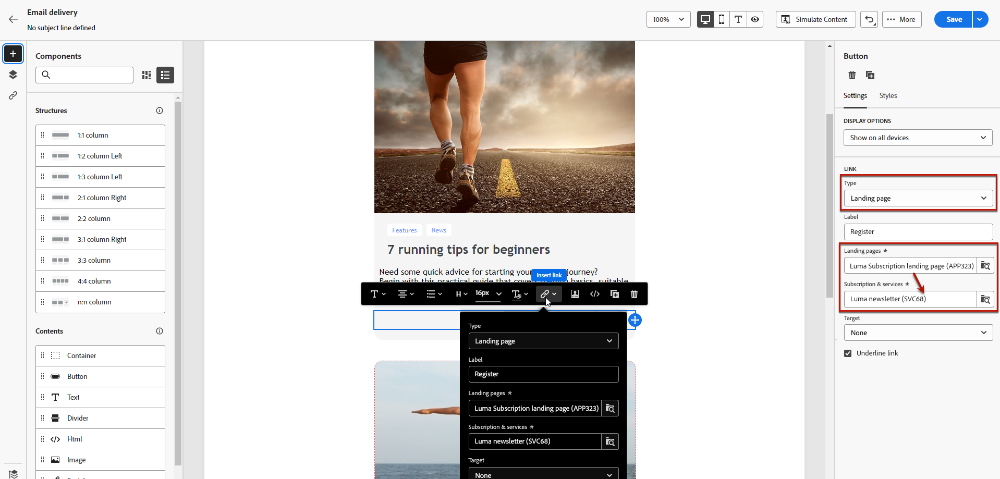
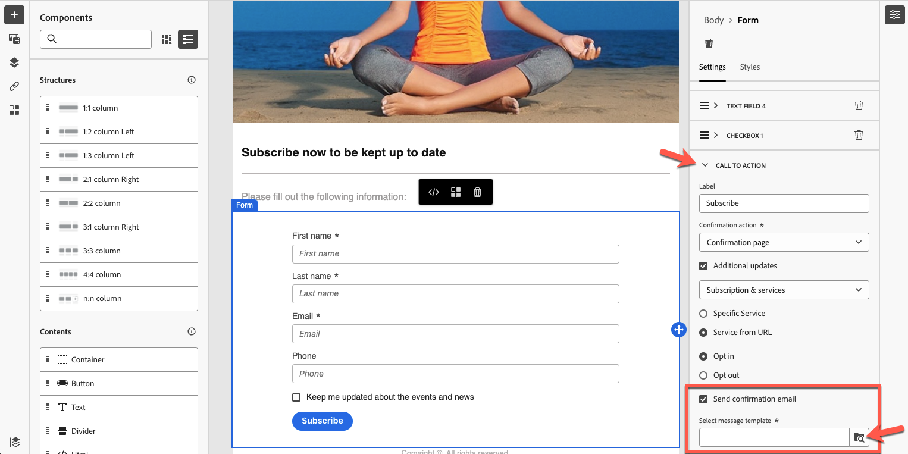
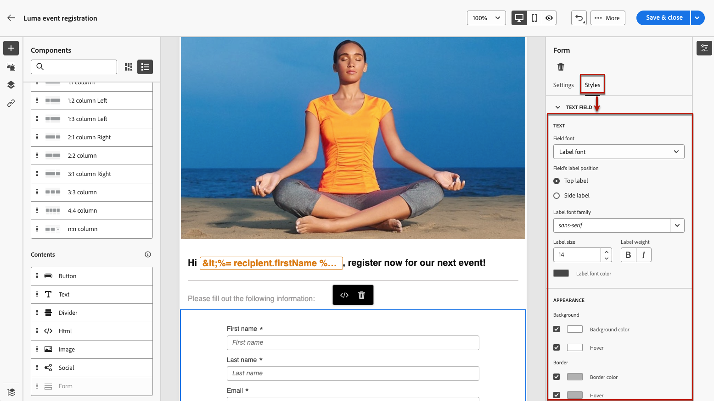
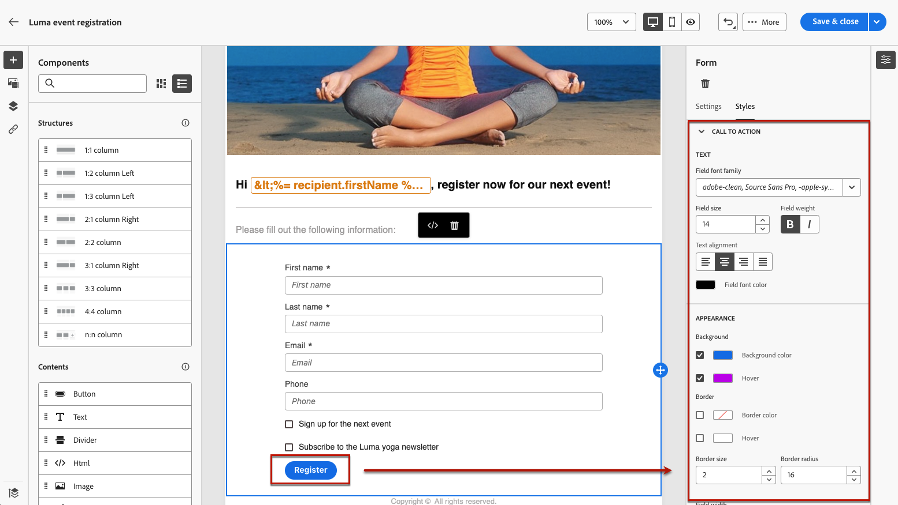

# 定義特定於著陸頁面的內容 {#lp-content}

>[!CONTEXTUALHELP]
>id="ac_lp_components"
>title="使用內容元件"
>abstract="內容元件指可用於建立登陸頁面版面的空白內容預留位置。若要定義讓使用者能夠選取並提交他們的選擇的特定內容，請使用表單元件。"

>[!CONTEXTUALHELP]
>id="acw_landingpages_primarypage"
>title="定義主要頁面設定"
>abstract="使用者點選您的登陸頁面連結 (例如從電子郵件或網站) 後，主要頁面會隨即向使用者顯示。"

您可以編輯登入頁面之任何頁面的內容。

使用者按一下您的登入頁面連結後，會立即向使用者顯示的第一個頁面已預先填入所選範本的[登入頁面特定表單元件](#use-form-component)。<!-- to enable users to select and submit their choices-->

**[!UICONTROL Confirmation]**、**[!UICONTROL Error]**&#x200B;及&#x200B;**[!UICONTROL Expiration]**&#x200B;頁面的內容也已預先填入。 視需要編輯。

您也可以為登入頁面](#lp-form-styles)定義[樣式。

若要進一步設計登入頁面內容：

* 您可以使用與設計電子郵件時所用的相同元件。 [了解更多](../email/content-components.md#add-content-components)

* 您可以像新增電子郵件一樣將條件式內容新增至登入頁面。 [了解更多](../personalization/conditions.md#condition-condition-builder)

  >[!AVAILABILITY]
  >
  >此功能在有限可用性(LA)中提供。 僅限&#x200B;**從 Adobe Campaign Standard 移轉至 Adobe Campaign v8** 的客戶，且無法部署於任何其他環境。

## 使用表單元件 {#use-form-component}

>[!CONTEXTUALHELP]
>id="ac_lp_formfield"
>title="設定表單元件欄位"
>abstract="定義您的收件者將如何從您的登陸頁面查看和提交他們的選擇。"

>[!CONTEXTUALHELP]
>id="acw_landingpages_calltoaction"
>title="按一下按鈕時會發生什麼事"
>abstract="定義使用者提交登陸頁面表單後會發生什麼事。"

若要定義可讓使用者從您的登入頁面選取並提交其選擇的特定內容，請編輯&#x200B;**[!UICONTROL Form]**&#x200B;元件。 請依照下列步驟以執行此操作。

1. 登入頁面特定的&#x200B;**[!UICONTROL 表單]**&#x200B;元件已顯示在所選範本的畫布中。

   >[!NOTE]
   >
   >**[!UICONTROL Form]**&#x200B;元件只能在同一個頁面上使用一次。

1. 選取它。 **[!UICONTROL 表單內容]**&#x200B;索引標籤會顯示在右側的浮動視窗中，讓您編輯表單的不同欄位。

   {zoomable="yes"}

   >[!NOTE]
   >
   >隨時切換至&#x200B;**[!UICONTROL 樣式]**&#x200B;索引標籤，以編輯表單元件內容的樣式。 [了解更多](#lp-form-styles)

1. 展開第一個文字欄位（如果有的話），或使用&#x200B;**[!UICONTROL 新增]**&#x200B;按鈕新增一個欄位。 從&#x200B;**[!UICONTROL 文字欄位1]**&#x200B;區段，您可以編輯欄位型別、要更新的資料庫欄位、標籤，以及在使用者輸入值之前顯示在欄位內的文字。

   {zoomable="yes"}

1. 視需要核取&#x200B;**[!UICONTROL 將表單欄位設為必填]**&#x200B;選項。 在此情況下，只有在使用者已填入此欄位時，才能提交登入頁面。

   >[!NOTE]
   >
   >如果未填入必填欄位，當使用者提交頁面時會顯示錯誤訊息。

1. 展開核取方塊（若有的話），或使用&#x200B;**[!UICONTROL 新增]**&#x200B;按鈕新增核取方塊。 選取該核取方塊應該更新資料庫中的服務或欄位。

   {zoomable="yes"}

   如果您選取&#x200B;**[!UICONTROL 訂閱與服務]**，請從清單中選取[服務](../audience/manage-services.md)，然後在下列兩個選項之間選擇：

   * **[!UICONTROL 如果勾選則訂閱]**：使用者需要勾選方塊才能同意（選擇加入）。
   * **[!UICONTROL 如果勾選則取消訂閱]**：使用者需要勾選方塊以移除其同意（選擇退出）。

   如果您選取&#x200B;**[!UICONTROL 欄位]**，請從屬性清單中選取欄位，然後在下列兩個選項之間選擇：

   * 如果勾選&#x200B;]**，**[!UICONTROL &#x200B;是。<!--TBC-->

   * **[!UICONTROL 若勾選]**.<!--TBC-->，則否

1. 您可以刪除和新增儘可能多的欄位（例如文字欄位、選項按鈕、核取方塊、下拉式清單等） 視需要。

1. 新增或更新所有欄位後，按一下&#x200B;**[!UICONTROL 呼叫動作]**&#x200B;以展開對應的區段。 它可讓您定義&#x200B;**[!UICONTROL 表單]**&#x200B;元件中按鈕的行為。 [了解做法](#define-actions-on-form-submission)

   {zoomable="yes"}

1. 儲存您的內容以返回[登陸頁面屬性](create-lp.md#create-landing-page)。

### 定義表單提交的動作 {#define-actions-on-form-submission}

1. 定義按一下按鈕後會發生什麼動作：

   * **[!UICONTROL 確認頁面]**：依預設，會將使用者重新導向至為目前登入頁面設定的&#x200B;**[!UICONTROL 確認]**&#x200B;頁面。

   * **[!UICONTROL 重新導向URL]**：輸入要重新導向使用者的頁面URL。

   * **[!UICONTROL 登陸頁面]**：您可以選取另一個登陸頁面，將使用者重新導向至該頁面。 請務必適當地設定選取的登陸頁面。

1. 如果您想在提交表單時進行其他更新，請選取&#x200B;**[!UICONTROL 其他更新]**，然後選取要更新的專案：
   * 訂閱[服務](../audience/manage-services.md) — 在此情況下，請定義您是否要在提交表單時選擇加入或選擇退出使用者。 在設計電子郵件時，如果您定義此登陸頁面的&#x200B;**[!UICONTROL 登陸頁面]**&#x200B;型別連結，則會自動使用選取的服務。 [進一步瞭解插入連結](../email/message-tracking.md)

     >[!NOTE]
     >
     >如果您想要搭配此登陸頁面使用數個服務，請使用下述的&#x200B;**[!UICONTROL 來自URL的服務]**&#x200B;選項。

   * 管道 — 填寫表單時使用的電子郵件位址。
   * 所有管道 — 提交表單時，使用者將選擇加入或退出（取決於所選的範本），以結束或離開您品牌在所有管道上的所有通訊。
   * 來自資料庫的欄位 — 從屬性清單中選取欄位，並定義在提交表單時該欄位應設為True或False。

   {zoomable="yes"}

1. 選取&#x200B;**[!UICONTROL 服務來自URL]**&#x200B;選項，以允許將登入頁面用於數個服務，使其成為動態的。 定義您要在提交表單時選擇加入或選擇退出使用者。

   >[!AVAILABILITY]
   >
   >此功能在有限可用性(LA)中提供。 僅限&#x200B;**從 Adobe Campaign Standard 移轉至 Adobe Campaign v8** 的客戶，且無法部署於任何其他環境。

   {zoomable="yes"}

   在設計電子郵件時，如果您定義此登陸頁面的&#x200B;**[!UICONTROL 登陸頁面]**&#x200B;型別連結，則可以從清單中選取任何服務。 接著，您可以在定義此登入頁面的其他連結時，選取其他服務。 [進一步瞭解插入連結](../email/message-tracking.md)

   {zoomable="yes"}

1. 您可以在提交登入頁面時傳送訊息。 [在這裡瞭解更多](#lp-message)

### 在提交後傳送訊息 {#lp-message}

>[!AVAILABILITY]
>
>此功能在有限可用性(LA)中提供。 僅限&#x200B;**從 Adobe Campaign Standard 移轉至 Adobe Campaign v8** 的客戶，且無法部署於任何其他環境。

若要在提交登入頁面後自動傳送確認訊息，請執行下列步驟：

1. 在&#x200B;**[!UICONTROL 呼叫動作]**&#x200B;區段中，核取&#x200B;**[!UICONTROL 傳送確認電子郵件]**&#x200B;選項。

1. 在關聯的下拉式清單中，選擇需要送出的交易式訊息範本。

{zoomable="yes"}

## 定義登陸頁面表單樣式 {#lp-form-styles}

1. 若要修改表單元件內容的樣式，請隨時切換至&#x200B;**[!UICONTROL 樣式]**&#x200B;索引標籤。

1. **[!UICONTROL 文字欄位]**&#x200B;區段預設為展開。 它可讓您編輯文字欄位的外觀，例如標簽字型、標籤位置、欄位背景顏色或欄位邊框。

   {zoomable="yes"}

1. 展開&#x200B;**[!UICONTROL 核取方塊]**&#x200B;區段以定義核取方塊和對應文字的外觀。 例如，您可以調整字型系列和大小，或是核取方塊框線顏色。

   {zoomable="yes"}

1. 展開並編輯與您可能新增的其他欄位（選項按鈕、下拉式清單、日期和時間等）對應的任何其他區段 至您的表單。

1. 展開&#x200B;**[!UICONTROL 呼叫動作]**&#x200B;區段，修改元件表單中按鈕的外觀。 例如，您可以變更字型、新增框線、在游標停留時編輯標籤顏色，或調整按鈕的對齊方式。

   {zoomable="yes"}

   您可以使用&#x200B;**[!UICONTROL 模擬內容]**&#x200B;按鈕來預覽某些設定，例如暫留時的按鈕標籤顏色。 [了解更多](create-lp.md#test-landing-page)

1. 儲存您的變更。
