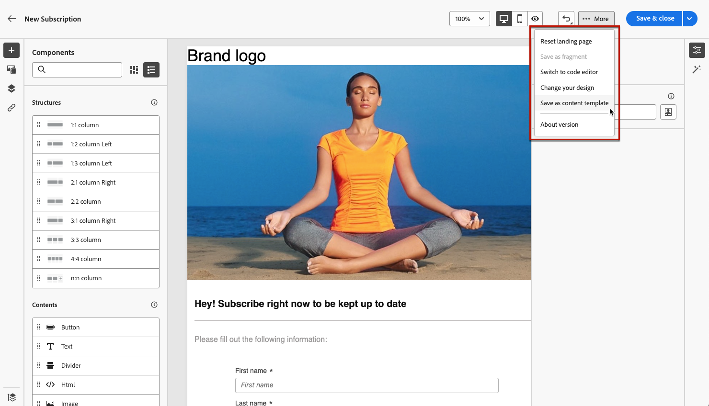
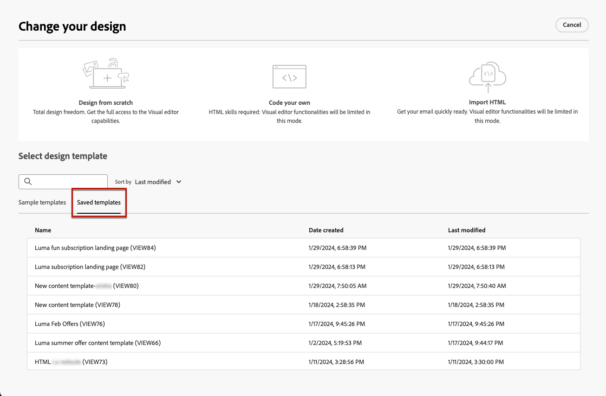

# 使用登入頁面內容範本 {#work-with-templates}

## 將頁面儲存為範本 {#save-as-template}

一旦您設計 [登陸頁面內容](lp-content.md)，您可將其儲存以供日後重複使用。 請依照下列步驟以執行此操作。

1. 按一下 **[!UICONTROL 更多]** 按鈕。

1. 選取 **[!UICONTROL 另存為內容範本]** （從下拉式功能表）。

   {zoomable=&quot;yes&quot;}

1. 為此範本新增名稱。

1. 按一下「**[!UICONTROL 儲存]**」。

下次建立登入頁面時，您可以使用此範本建立內容。 瞭解如何在 [區段](#use-saved-template) 底下。

{zoomable=&quot;yes&quot;}

## 使用儲存的範本 {#use-saved-template}

<!--Not for GA?-->

1. 編輯登入頁面內容時，按一下 **[!UICONTROL 更多]** 按鈕並選取 **[!UICONTROL 變更您的設計]**.

   {zoomable=&quot;yes&quot;}

1. 確認您的選取。

   >[!NOTE]
   >
   >此動作會刪除目前的內容，並以新範本中的內容取代。

1. 所有先前儲存的範本清單會顯示在 **[!UICONTROL 已儲存的範本]** 標籤。 你可以&#x200B;**[!UICONTROL 依名稱]**、**[!UICONTROL 上次修改日期]**&#x200B;和&#x200B;**[!UICONTROL 上次建立日期]**&#x200B;來排序儲存的範本。

   {zoomable=&quot;yes&quot;}

1. 從清單中選取您選擇的範本。 選取後，您可以使用左右箭頭在所有儲存的範本之間導覽。

   {zoomable=&quot;yes&quot;}

1. 按一下 **[!UICONTROL 使用此範本]**.

1. 使用登入頁面設計工具，視需要編輯您的內容。

<!--Primary page templates and subpage templates are managed separately, meaning that you cannot use a primary page template to create a subpage, and vice versa. TBC in Web user interface-->
