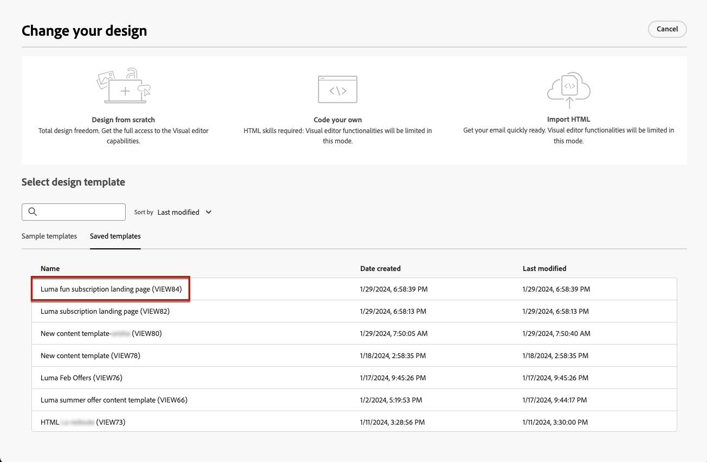
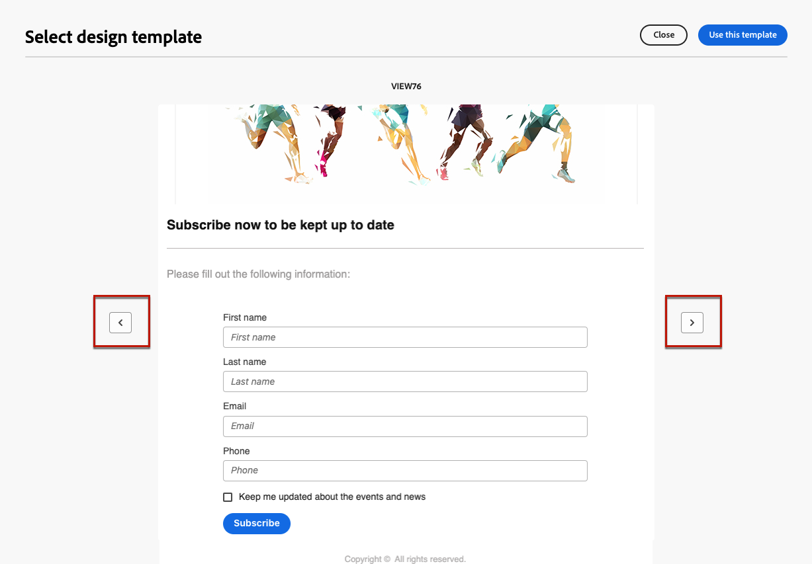

# 使用登入頁面內容範本 {#work-with-templates}

## 將頁面儲存為範本 {#save-as-template}

一旦您設計[登陸頁面內容](lp-content.md)，就可以儲存以供日後重複使用。 若要將頁面儲存為範本，請遵循下列步驟。

1. 按一下熒幕右上角的&#x200B;**[!UICONTROL 更多]**&#x200B;按鈕。

1. 從下拉式功能表中選取&#x200B;**[!UICONTROL 另存為內容範本]**。

   ![在下拉式功能表中顯示[另存為內容範本]選項的熒幕擷圖](assets/lp-save-as-template.png){zoomable="yes"}

1. 為此範本新增名稱。

1. 按一下「**[!UICONTROL 儲存]**」。

您可以使用此範本在下次建立登入頁面時建置內容。 在以下[小節](#use-saved-template)中瞭解如何操作。

{zoomable="yes"}

## 使用儲存的範本 {#use-saved-template}

<!--Not for GA?-->

1. 編輯登入頁面內容時，按一下&#x200B;**[!UICONTROL 更多]**&#x200B;按鈕，然後選取&#x200B;**[!UICONTROL 變更您的設計]**。

   ![在下拉式功能表中顯示[變更您的設計]選項的熒幕擷圖](assets/lp-change-your-design.png){zoomable="yes"}

1. 確認您的選取。

   >[!NOTE]
   >
   >此動作會刪除目前的內容，並以新範本的內容取代。

1. 所有先前儲存的範本清單會顯示在&#x200B;**[!UICONTROL 已儲存的範本]**&#x200B;索引標籤中。 您可以依名稱&#x200B;**[!UICONTROL 、]**&#x200B;上次修改時間&#x200B;**[!UICONTROL 和]**&#x200B;上次建立時間&#x200B;**[!UICONTROL 來排序它們]**。

   ![熒幕擷圖顯示[儲存的範本]索引標籤，並附排序選項](assets/lp-saved-templates.png){zoomable="yes"}

1. 從清單中選取您選擇的範本。 選取後，使用左右箭頭在所有儲存的範本之間導覽。

   {zoomable="yes"}

1. 按一下&#x200B;**[!UICONTROL 使用此範本]**。

1. 使用登入頁面設計工具，視需要編輯您的內容。

<!--Primary page templates and subpage templates are managed separately, meaning that you cannot use a primary page template to create a subpage, and vice versa. TBC in Web user interface-->