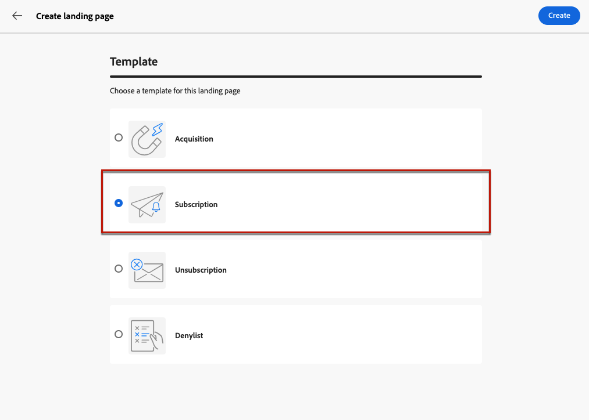
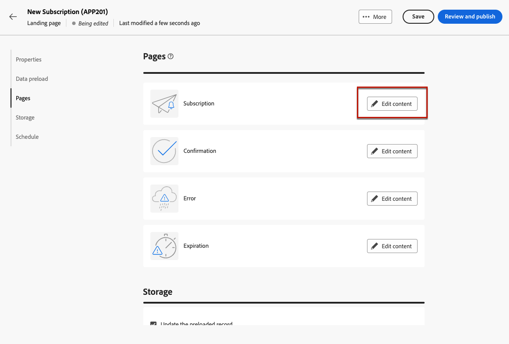
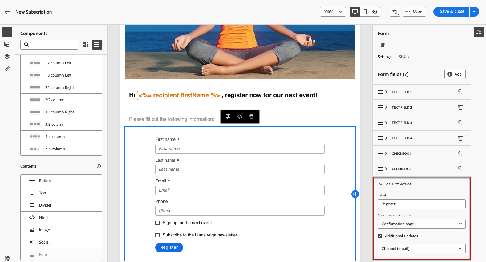

# 如何使用登入頁面 {#lp-use-cases}

>[!CONTEXTUALHELP]
>id="acw_landingpages_url"
>title="複製URL時請小心"
>abstract="若要完整測試或運用您的登入頁面，您無法直接複製此連結並貼至網頁瀏覽器或您的傳送中。 請改用 **模擬內容** 函式進行測試，並依照檔案中所述的步驟正確使用您的登入頁面。"

若要正確使用登入頁面，您應使用專用選項，將其作為傳送中的連結參照。

>[!CAUTION]
>
>若要充分利用登入頁面，您無法將已發佈傳遞控制面板中顯示的連結直接複製並貼到您的傳遞或網頁中。

在 [!DNL Adobe Campaign Web] 推論出，有四個現成可用的範本可讓您實作不同的使用案例。 不過，主要步驟保持不變，詳見下文。

1. [建立登入頁面](create-lp.md#create-landing-page) 並根據您的使用案例選取您選擇的範本：

   * [贏取](#lp-acquisition)
   * [訂閱](#lp-subscription)
   * [取消訂閱](#lp-unsubscription)
   * [封鎖清單](#lp-denylist)

1. 定義登入頁面屬性和設定。

   

1. 根據您的案例，選取 **[!UICONTROL 贏取]**， **[!UICONTROL 訂閱]**， **[!UICONTROL 取消訂閱]** 或 **[!UICONTROL 封鎖清單]** 頁面。

1. 頁面內容隨即顯示。 選取與登入頁面表單相對應的部分。

   

1. 視需要對登入頁面標籤和欄位進行儘可能多的其他更新。 依需要編輯其餘內容，儲存變更並關閉。

1. 請按照以下針對每個使用案例詳述的步驟操作。

1. 編輯 **[!UICONTROL 確認]** 頁面，以及 **[!UICONTROL 錯誤]** 和 **[!UICONTROL 有效期]** 頁面。 收件者提交登錄檔單後，此資訊就會顯示給他們。

   

1. 測試和 [發佈](create-lp.md#publish-landing-page) 您的登陸頁面。

1. 建立 [電子郵件](../email/create-email.md) 將流量引導至登陸頁面的傳送。

1. [插入連結](../email/message-tracking.md#insert-links) 放入您的訊息內容。 選取 **[!UICONTROL 登陸頁面]** 作為 **[!UICONTROL 連結型別]** 並選擇 [登陸頁面](create-lp.md#configure-primary-page) 您所建立的。

   

   >[!NOTE]
   >
   >若要能夠傳送您的訊息，請確定您選取的登入頁面尚未過期。 瞭解如何更新到期日 [在本節中](create-lp.md#create-landing-page).

收到電子郵件後，如果您的收件者按一下登入頁面的連結，並提交登入頁面表單，則會將其導向確認頁面，並套用登入頁面中定義的任何其他動作（例如，使用者將訂閱您的服務，或不會收到您任何其他通訊）。

以下是如何使用的一些範例 [!DNL Adobe Campaign] 登陸頁面，讓您的客戶選擇加入/退出接收部分或全部通訊。

## 設定檔贏取 {#lp-acquisition}

1. [建立登入頁面](create-lp.md#create-landing-page). 選取 **[!UICONTROL 贏取]** 範本。

1. 定義登入頁面屬性和設定。

   

1. 選取 **[!UICONTROL 贏取]** 頁面以編輯其內容。

1. 頁面內容隨即顯示。 選取與登入頁面表單相對應的部分。

## 訂閱服務 {#lp-subscription}

最常見的使用案例之一是邀請客戶 [訂閱服務](../audience/manage-services.md) （例如電子報或活動）瀏覽登陸頁面。 請遵循下列步驟。

<!--For example, let's say you organize an event next month and you want to launch an event registration campaign. To do this, you're going to send an email including a link to a landing page that will enable your recipients to register for this event. The users who register will be added to the subscription list that you created for this purpose.-->

1. 首先，請為訂閱您事件的使用者建立確認範本，以便您在建立服務時可以輕鬆選取它。 [了解更多](../audience/manage-services.md#create-confirmation-message)

   

1. 建立訂閱服務，將註冊的使用者儲存至您的事件。 [瞭解如何建立服務](../audience/manage-services.md)

1. 選取您建立的範本，作為使用者訂閱時將收到的確認電子郵件。

   

1. [建立登入頁面](create-lp.md#create-landing-page) 讓您的收件者註冊您的活動。 選取 **[!UICONTROL 訂閱]** 範本。

   <!---->

1. 定義登入頁面屬性和設定。

   <!---->

1. 選取 **[!UICONTROL 訂閱]** 頁面以編輯其內容。

   

1. 頁面內容隨即顯示。 選取與登入頁面表單相對應的部分，並展開 **[!UICONTROL 核取方塊1]** 區段。

   在 **[!UICONTROL 訂閱與服務]** 欄位中，選取您為事件建立的服務。 離開 **[!UICONTROL 如果選取，則訂閱]** 選項已啟用。

   

1. 例如，您可以新增其他核取方塊，為您的電子報提供訂閱。

<!--

1. You can also update the profiles who register for your event for the email channel. Expand the **[!UICONTROL Call to action]** section and select Additional updates.

    -->

1. 視需要對登入頁面標籤和欄位進行儘可能多的其他更新。 依需要編輯其餘內容，儲存變更並關閉。

1. 編輯 **[!UICONTROL 確認]** 頁面，以及 **[!UICONTROL 錯誤]** 和 **[!UICONTROL 有效期]** 頁面。 收件者提交登錄檔單後，此資訊就會顯示給他們。

   

1. 測試和 [發佈](create-lp.md#publish-landing-page) 您的登陸頁面。

1. 建立 **電子郵件** 傳遞以將流量引導至註冊登陸頁面。 設計電子郵件以宣佈您的活動已開放註冊。

1. [插入連結](../email/message-tracking.md#insert-links) 放入您的訊息內容。 選取 **[!UICONTROL 登陸頁面]** 作為 **[!UICONTROL 連結型別]** 並選擇 [登陸頁面](create-lp.md#configure-primary-page) 您為註冊而建立的。

   

   >[!NOTE]
   >
   >若要能夠傳送您的訊息，請確定您選取的登入頁面尚未過期。 瞭解如何更新到期日 [在本節中](create-lp.md#create-landing-page).

收到電子郵件後，如果您的收件者按一下登入頁面的連結，並提交登入頁面表單，系統會將他們導向至確認頁面，且會將他們新增至訂閱清單。

## 取消訂閱 {#lp-unsubscription}

1. [建立登入頁面](create-lp.md#create-landing-page). 選取 **[!UICONTROL 取消訂閱]** 範本。

1. 定義登入頁面屬性和設定。

1. 選取 **[!UICONTROL 取消訂閱]** 頁面以編輯其內容。

1. 頁面內容隨即顯示。 選取與登入頁面表單相對應的部分。

## 設定選擇退出登陸頁面 {#lp-denylist}

法律規定必須讓收件者提供能夠取消訂閱來自品牌的通訊。 進一步瞭解 [Experience Platform檔案](https://experienceleague.adobe.com/docs/experience-platform/privacy/regulations/overview.html#regulations){target="_blank"}.

因此，您必須一律包含 **取消訂閱連結** 在每一封傳送給收件者的電子郵件中：

* 按一下此連結後，收件者會被導向包含確認選擇退出按鈕的登陸頁面。
* 按一下選擇退出按鈕後，設定檔資料將會更新並包含此資訊。

您可以設定 **[!UICONTROL 封鎖清單]** 可讓使用者選擇退出所有傳送的登陸頁面。

若要讓使用者能夠選擇退出所有傳送，您必須建立並發佈 **[!UICONTROL 封鎖清單]** 登陸頁面。

使用者按一下登陸頁面連結後， **[!UICONTROL 不再聯絡（透過任何管道）]** 設定檔中的選項會自動選取。

定義 **[!UICONTROL 選擇退出]** 核取方塊並選擇以更新 **[!UICONTROL 頻道（電子郵件）]**：檢查登陸頁面上選擇退出方塊的設定檔將會選擇退出您的所有通訊。

收到訊息後，如果收件者按一下電子郵件中的取消訂閱連結，就會顯示您的登陸頁面。

如果收件者勾選方塊並提交表單：

* 系統會將選擇退出的收件者重新導向至確認訊息畫面。

* 設定檔資料已更新，除非再次訂閱，否則將不會收到您品牌的通訊。

若要檢查對應的設定檔選擇是否已更新，請移至「設定檔」並選取設定檔。

