# 如何使用登陸頁面 {#lp-use-cases}

>[!CONTEXTUALHELP]
>id="acw_landingpages_url"
>title="請謹慎複製 URL"
>abstract="若要全面測試或善用您的登陸頁面，您不得將此連結直接複製並貼上到網頁瀏覽器或您的傳遞內容中。請改用&#x200B;**模擬內容**&#x200B;功能對其進行測試，並按照文件中所述的步驟正確使用您的登陸頁面。"

>[!CONTEXTUALHELP]
>id="acw_landingpages_templates"
>title="請謹慎複製 URL"
>abstract="建立登陸頁面時，四個現成的範本可讓您實施不同的使用案例：新增或更新設定檔至行銷活動資料庫、為客戶訂閱服務、取消訂閱服務，或選擇將使用者登出。"
>additional-url="https://experienceleague.adobe.com/docs/campaign-web/v8/landing-pages/create-lp.html#create-landing-page" text="設定登陸頁面"

若要正確使用登入頁面，您應使用專用選項，將其作為傳送中的連結參照。

>[!CAUTION]
>
>若要充分利用登入頁面，您無法將已發佈傳遞控制面板中顯示的連結直接複製並貼到您的傳遞或網頁中。 在本節中瞭解如何正確操作。

在 [!DNL Adobe Campaign Web] 推論出，有四個現成可用的範本可讓您實作不同的使用案例。 不過，主要步驟保持不變，詳見下文。

1. [建立登入頁面](create-lp.md#create-landing-page) 並根據您的使用案例選取您選擇的範本。

1. 定義登入頁面屬性和設定。

   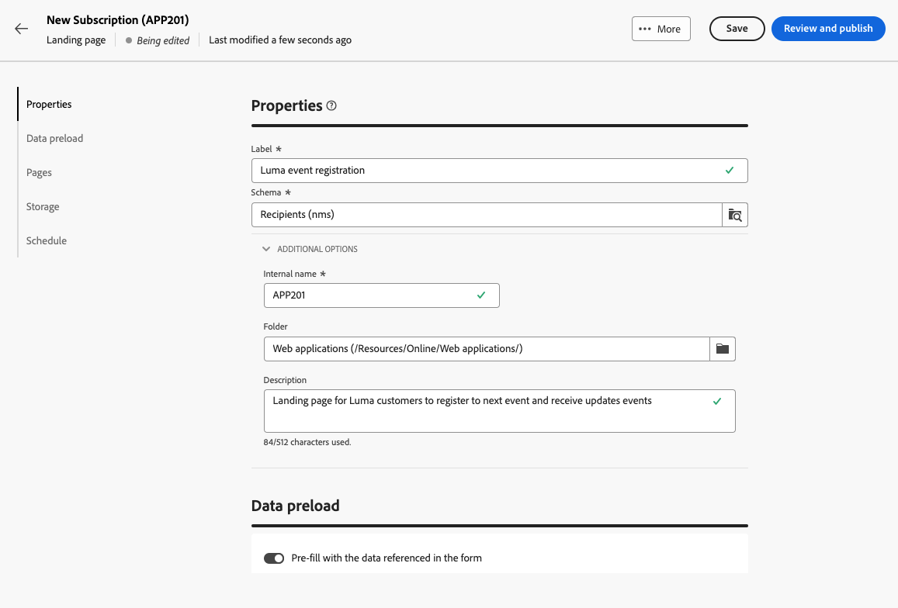{zoomable=&quot;yes&quot;}

1. 根據您的案例，選取 **[!UICONTROL 贏取]**， **[!UICONTROL 訂閱]**， **[!UICONTROL 取消訂閱]** 或 **[!UICONTROL 封鎖清單]** 頁面。

1. 頁面內容隨即顯示。 選取與登入頁面表單相對應的部分。

   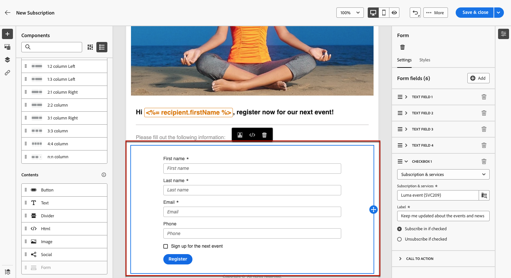{zoomable=&quot;yes&quot;}

1. 根據選取的範本編輯您的內容：

   * [贏取](#lp-acquisition)
   * [訂閱](#lp-subscription)
   * [取消訂閱](#lp-unsubscription)
   * [封鎖清單](#lp-denylist)

1. 視需要修改其餘內容，儲存變更並關閉。

1. 編輯 **[!UICONTROL 確認]** 頁面，以及 **[!UICONTROL 錯誤]** 和 **[!UICONTROL 有效期]** 頁面。 此 **[!UICONTROL 確認]** 當收件者提交表單後，頁面就會顯示給他們。

   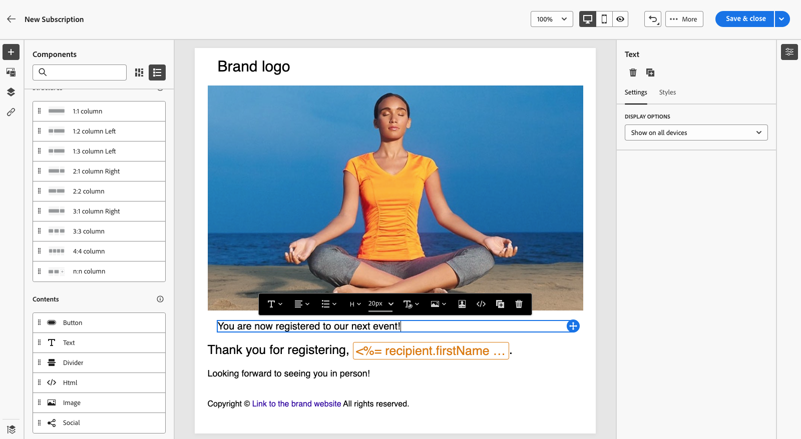{zoomable=&quot;yes&quot;}

1. [測試](create-lp.md#test-landing-page) 和 [發佈](create-lp.md#publish-landing-page) 您的登陸頁面。

1. 建立 [電子郵件](../email/create-email.md) 將流量引導至登陸頁面的傳送。

1. [插入連結](../email/message-tracking.md#insert-links) 放入您的訊息內容。 選取 **[!UICONTROL 登陸頁面]** 作為 **[!UICONTROL 連結型別]** 並選取您建立的登入頁面。

   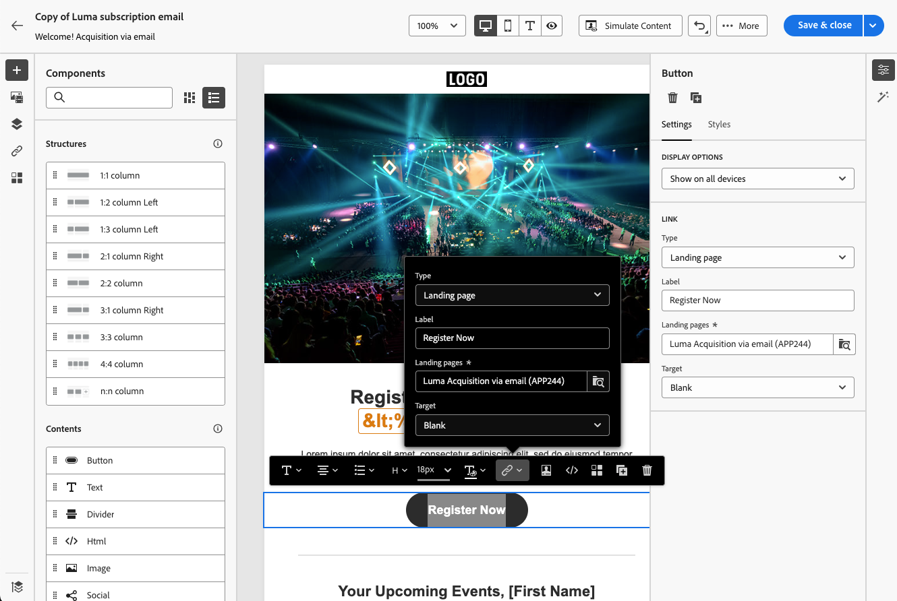{zoomable=&quot;yes&quot;}

   >[!NOTE]
   >
   >若要能夠傳送您的訊息，請確定您選取的登入頁面尚未過期。 [了解更多](create-lp.md#create-landing-page)

收到電子郵件後，如果您的收件者按一下登入頁面的連結並提交表單：

* 他們將被導向確認頁面。

* 將套用登陸頁面中定義的任何其他動作。 例如，使用者將會訂閱您的服務，或者他們不會再收到您的任何通訊。

以下是如何使用的一些範例 [!DNL Adobe Campaign] 登陸頁面中的不同可能使用案例。

## 設定檔贏取 {#lp-acquisition}

第一個範本可讓您新增或更新設定檔至Campaign資料庫。

1. 時間 [建立您的登入頁面](create-lp.md#create-landing-page)，選取 **[!UICONTROL 贏取]** 範本。

1. 在登入頁面屬性中，請務必選取 **[!UICONTROL 使用表單中參照的資料預先填寫]** 選項，以便從設定檔預先載入任何現有資訊並避免建立重複專案。

1. 選取 **[!UICONTROL 贏取]** 頁面以編輯其內容。

1. 根據您要在設定檔上收集的資訊，視需要編輯文字欄位。

1. 此外，您可以新增核取方塊，邀請客戶訂閱您的Newsletter服務。 [瞭解如何建立服務](../audience/manage-services.md)

   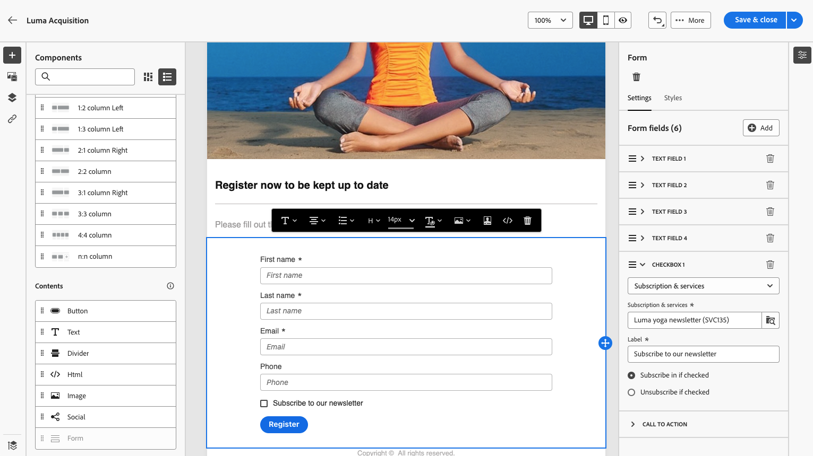{zoomable=&quot;yes&quot;}

1. 視需要調整您的內容並儲存變更。

1. 檢閱和 [發佈](create-lp.md#publish-landing-page) 您的登陸頁面。

1. 建立 [電子郵件](../email/create-email.md) 和 [新增連結](../email/message-tracking.md#insert-links) 至您的登陸頁面。

收到電子郵件後，如果您的收件者按一下登入頁面的連結並提交表單，則會將其設定檔新增至Campaign資料庫，或更新其所提供的資訊。

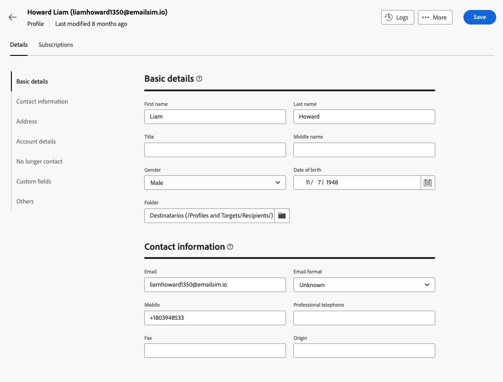{zoomable=&quot;yes&quot;}

如果他們選擇接收您的Newsletter，他們將訂閱相應的服務。

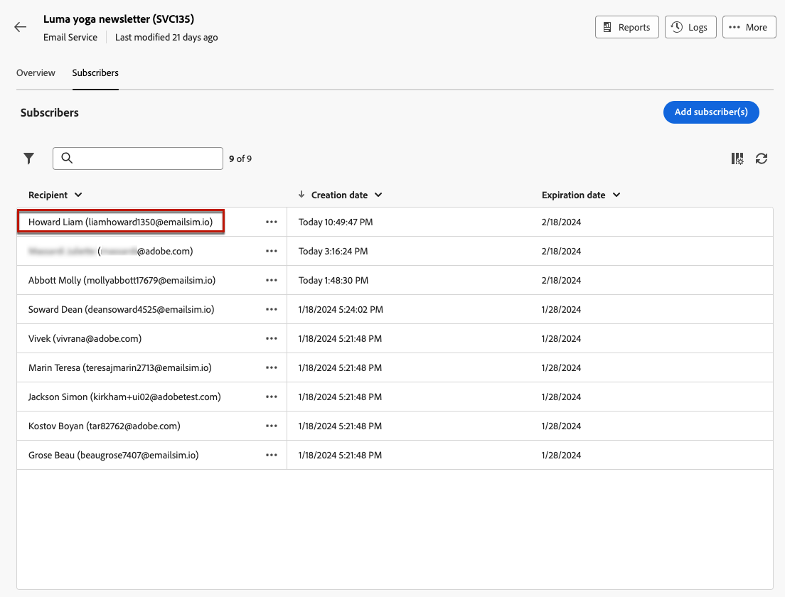{zoomable=&quot;yes&quot;}

## 訂閱服務 {#lp-subscription}

>[!CONTEXTUALHELP]
>id="acw_landingpages_subscription"
>title="設定訂閱登陸頁面"
>abstract="訂閱頁面可讓您的客戶訂閱服務。"

最常見的使用案例之一是邀請客戶 [訂閱服務](../audience/manage-services.md) （例如電子報或活動）瀏覽登陸頁面。 請遵循下列步驟。

<!--For example, let's say you organize an event next month and you want to launch an event registration campaign. To do this, you're going to send an email including a link to a landing page that will enable your recipients to register for this event. The users who register will be added to the subscription list that you created for this purpose.-->

1. 首先，請為訂閱您事件的使用者建立確認範本，以便您在建立服務時可以輕鬆選取它。 [了解更多](../audience/manage-services.md#create-confirmation-message)

   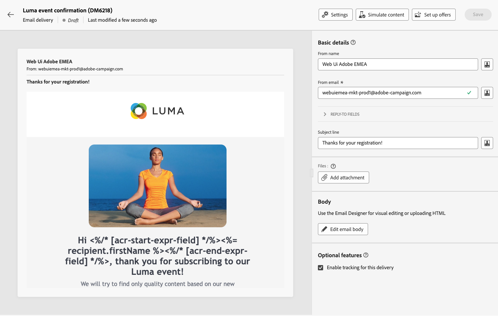{zoomable=&quot;yes&quot;}

1. 建立訂閱服務，將註冊的使用者儲存至您的事件。 [瞭解如何建立服務](../audience/manage-services.md)

1. 選取您建立的範本，作為使用者訂閱時將收到的確認電子郵件。

   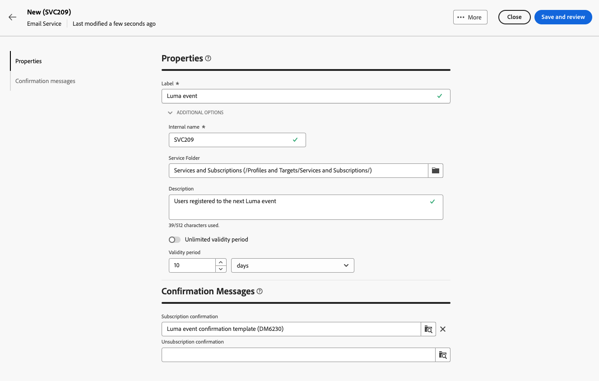{zoomable=&quot;yes&quot;}

1. [建立登入頁面](create-lp.md#create-landing-page) 讓您的收件者註冊您的活動。 選取 **[!UICONTROL 訂閱]** 範本。

1. 選取 **[!UICONTROL 訂閱]** 頁面以編輯其內容。

1. 頁面內容隨即顯示。 選取與登入頁面表單相對應的部分，並展開 **[!UICONTROL 核取方塊1]** 區段。

1. 在 **[!UICONTROL 訂閱與服務]** 欄位中，選取您為事件建立的服務。 離開 **[!UICONTROL 如果選取，則訂閱]** 選項已啟用。

   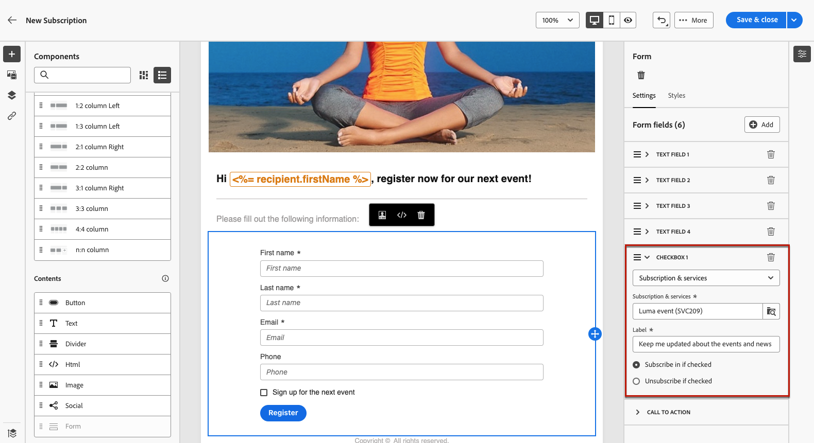{zoomable=&quot;yes&quot;}
<!--
1. You can add an additional checkbox to offer subscription to your newsletter for example.-->

1. 視需要調整您的內容並儲存變更。

1. 檢閱和 [發佈](create-lp.md#publish-landing-page) 您的登陸頁面。

1. 建立 [電子郵件](../email/create-email.md) 和 [新增連結](../email/message-tracking.md#insert-links) 以將流量引導至註冊登陸頁面。

1. 設計電子郵件以宣佈您的活動已開放註冊。

收到電子郵件後，如果您的收件者按一下登入頁面的連結，並提交表單，系統會將他們導向至確認頁面，且會將他們新增至訂閱清單。

## 取消訂閱 {#lp-unsubscription}

您可以讓客戶使用登入頁面取消訂閱服務。

1. 請確定您已為取消訂閱服務的使用者建立了確認範本，以便您在建立服務時可以輕鬆選取它。 [了解更多](../audience/manage-services.md#create-confirmation-message)

1. 在您的 [訂閱服務](../audience/manage-services.md)，選取您建立的範本，作為使用者取消訂閱時將會收到的確認電子郵件。

1. [建立登入頁面](create-lp.md#create-landing-page). 選取 **[!UICONTROL 取消訂閱]** 範本。

1. 選取 **[!UICONTROL 取消訂閱]** 頁面以編輯其內容。

1. 頁面內容隨即顯示。 選取與登入頁面表單相對應的部分。

1. 您可以新增 **[!UICONTROL 核取方塊]** 部分，選取服務並選取 **[!UICONTROL 如果勾選，則取消訂閱]** 選項。

   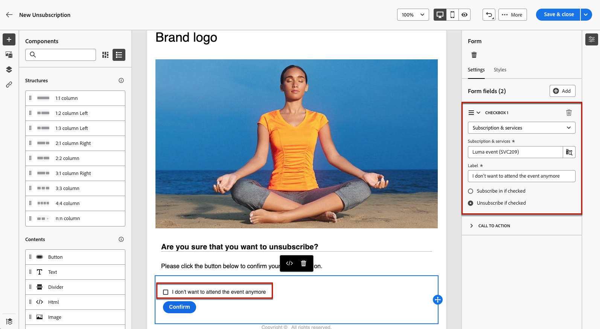{zoomable=&quot;yes&quot;}

1. 您也可以展開 **[!UICONTROL 行動號召]** 區段並選取 **[!UICONTROL 其他更新]** 選項。 選取服務並檢查 **[!UICONTROL 選擇退出]** 選項。

   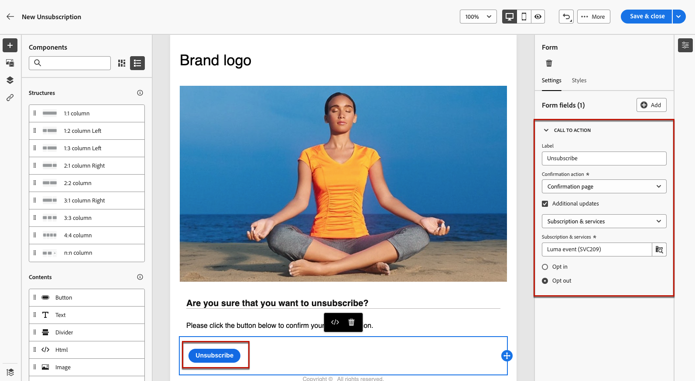{zoomable=&quot;yes&quot;}

1. 視需要調整您的內容並儲存變更。

1. 檢閱和 [發佈](create-lp.md#publish-landing-page) 您的登陸頁面。

1. 建立 [電子郵件](../email/create-email.md) 和 [新增連結](../email/message-tracking.md#insert-links) 前往登陸頁面。

收到電子郵件後，如果您的收件者按一下登入頁面的連結，並提交表單，系統會將他們導向至取消訂閱確認頁面，且他們將從對應的訂閱服務中移除。

## 封鎖清單 {#lp-denylist}

法律規定必須讓收件者提供能夠取消訂閱來自品牌的通訊。 因此，您必須一律包含 **取消訂閱連結** 每封寄送給收件者的電子郵件中。 按一下此連結後，收件者會被導向包含確認選擇退出按鈕的登陸頁面。

您可以設定 **[!UICONTROL 封鎖清單]** 可讓使用者選擇退出所有傳送的登陸頁面。

1. 時間 [建立您的登入頁面](create-lp.md#create-landing-page)，選取 **[!UICONTROL 封鎖清單]** 範本。

1. 選取 **[!UICONTROL 封鎖清單]** 頁面以編輯其內容。

1. 展開 **[!UICONTROL 行動號召]** 區段並選取 **[!UICONTROL 其他更新]** 選項。

1. 從對應的下拉式清單中，選取 **[!UICONTROL 頻道（電子郵件）]** 讓您的收件者僅能選擇退出電子郵件通訊。 您也可以選取 **[!UICONTROL 依所有管道]** 讓他們從所有通道的所有通訊中選取全部。

   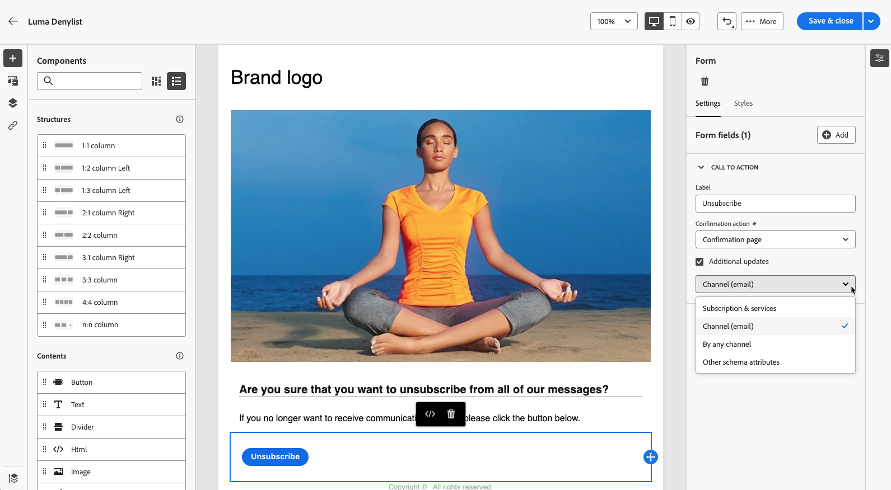{zoomable=&quot;yes&quot;}

1. 視需要調整您的內容並儲存變更。

1. 檢閱和 [發佈](create-lp.md#publish-landing-page) 您的登陸頁面。

1. 建立 [電子郵件](../email/create-email.md) 和 [新增連結](../email/message-tracking.md#insert-links) 至您的登陸頁面，讓使用者能夠選擇退出接收通訊。

收到電子郵件後，如果您的收件者按一下登入頁面的連結並提交表單，系統會將他們導向封鎖清單確認頁面，且他們的設定檔會更新為所提供的資訊。

若要檢查對應的設定檔選擇是否已更新，請瀏覽至 **[!UICONTROL 設定檔]** 功能表並選取該設定檔。

例如，如果您選擇更新 **[!UICONTROL 頻道（電子郵件）]** 選項，以及登入頁面中的 **[!UICONTROL 不再透過電子郵件聯絡]** 選項將會被核取。

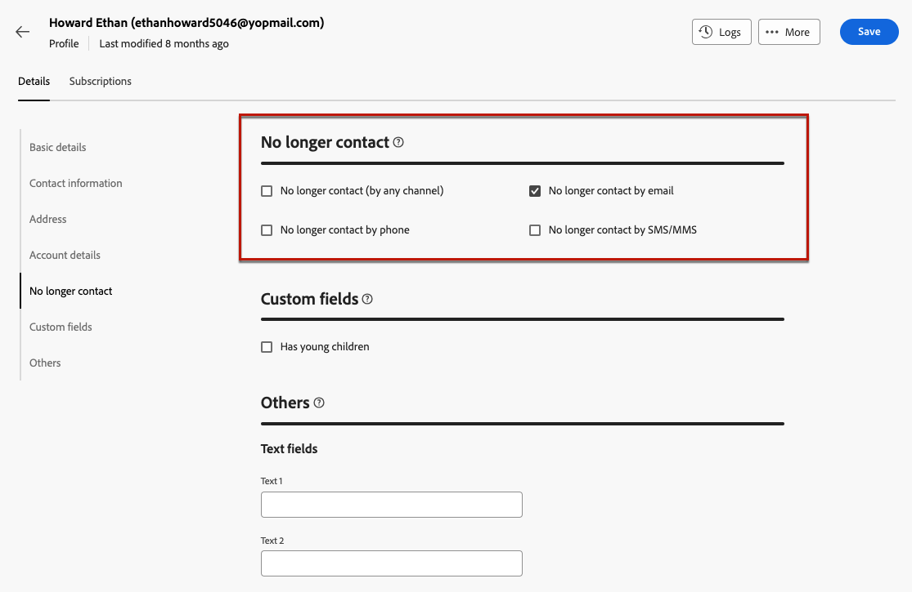{zoomable=&quot;yes&quot;}

除非再次訂閱，否則此設定檔將不會收到您品牌的電子郵件通訊。

