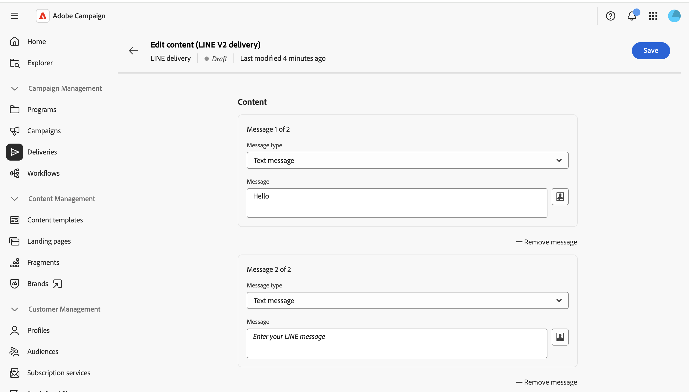
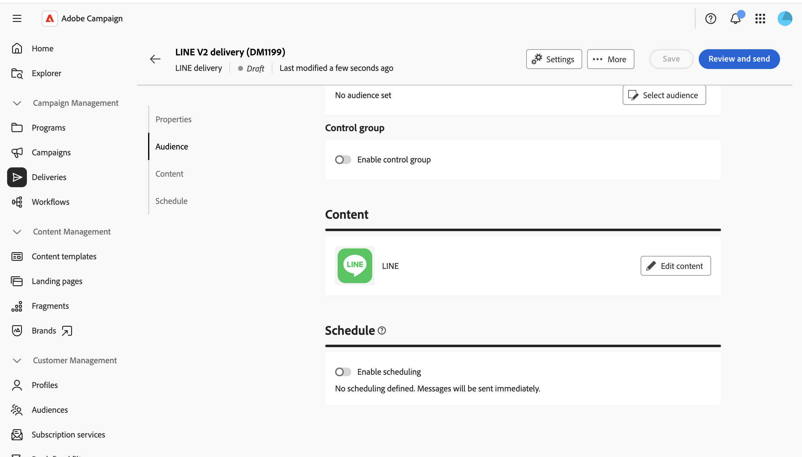

# 傳送LINE訊息 {#send-line}

您可以使用文字、影像或視訊內容來建立並傳送LINE訊息給訂閱者。 LINE傳遞可以建立為獨立傳遞或新增至工作流程。

本頁會逐步說明如何建立獨立LINE傳送，但在工作流程中設定LINE通道活動時，適用相同步驟。

>[!IMPORTANT]
>
>LINE傳遞目前不支援訊息預覽。 在傳送之前，您必須在編輯器中仔細檢閱內容，因為您無法預先預覽已轉譯的訊息。

## 建立LINE傳遞 {#create-line-delivery}

1. 瀏覽至&#x200B;**[!UICONTROL 傳遞]**&#x200B;功能表，然後按一下&#x200B;**[!UICONTROL 建立傳遞]**。

1. 選擇&#x200B;**[!UICONTROL LINE]**&#x200B;並選取傳遞範本，例如預設的&#x200B;**[!UICONTROL LINE V2傳遞]**&#x200B;範本。 [進一步瞭解範本](../msg/delivery-template.md)。

   

1. 按一下&#x200B;**[!UICONTROL 建立傳遞]**&#x200B;以確認並顯示傳遞設定畫面。

1. 輸入傳遞的&#x200B;**[!UICONTROL 標籤]**，並視需要定義其他或自訂選項。 [了解更多資訊](../push/create-push.md#configure-push-settings)。

   

## 選取客群 {#audience}

1. 按一下「**[!UICONTROL 選取對象]**」以鎖定現有對象或建立對象。 LINE傳遞的目標是根據&#x200B;**[!UICONTROL 訪客訂閱]**。 [進一步瞭解對象](../audience/about-recipients.md)。

1. 開啟&#x200B;**[!UICONTROL 啟用控制群組]**&#x200B;選項，以設定控制群組並測量傳遞的影響。 訊息不會傳送給該控制組，因此您可以將收到訊息的母體的行為與未收到訊息的連絡人的行為進行比較。 [了解更多](../audience/control-group.md)

## 定義內容 {#content}

按一下&#x200B;**[!UICONTROL 編輯內容]**。

隨即顯示LINE內容編輯器。

LINE傳遞最多可包含五則訊息。 按一下&#x200B;**[!UICONTROL 新增訊息]**&#x200B;以新增其他訊息至傳遞，或按一下&#x200B;**[!UICONTROL 移除訊息]**&#x200B;以刪除訊息。

可用時，您可以使用個人化編輯器來插入動態內容。 [了解更多資訊](../personalization/personalize.md)。

每則訊息都會使用下列其中一種型別。

>[!NOTE]
>
>僅支援影像和視訊URL。 無法上傳本機檔案，因為符合使用者端主控台的行為。

### 文字訊息 {#text-message}

文字訊息是以文字形式傳送的簡單訊息。 只要在相關欄位中輸入訊息，並視需要使用個人化欄位即可。

### 影像訊息 {#image-message}

影像訊息可讓您傳送影像，您可以選擇將影像劃分為可點按區域，每個區域都連結至不同的URL。

* **[!UICONTROL 個人化影像]**：為每個收件者動態定義影像。
* **[!UICONTROL 影像URL]**：提供您影像的URL。 建議的大小為1040 x 1040畫素。 啟用&#x200B;**[!UICONTROL 定義每個裝置熒幕大小的影像]**，以提供針對不同熒幕大小最佳化的不同影像解析度。
* **[!UICONTROL 替代文字]**：強制替代文字，在無法載入影像時顯示。
* **[!UICONTROL 連結]**：選擇版面配置，將影像分割成一或多個可點選區域，然後為每個區域指定URL。

### 影片訊息 {#video-message}

視訊訊息可讓您傳送視訊給收件者。

* **[!UICONTROL 影片URL]**：您的影片URL。 僅支援MP4格式。
* **[!UICONTROL 預覽影像URL]**：在播放視訊之前顯示的影像URL。

## 排程並傳送 {#schedule-send}

1. 定義內容後，按一下&#x200B;**儲存**，然後按一下「上一步」圖示以返回傳遞設定畫面。

1. 啟用&#x200B;**[!UICONTROL 啟用排程]**&#x200B;以在特定的日期和時間傳送。 [了解更多資訊](../msg/gs-deliveries.md#gs-schedule)。

   

1. 內容準備就緒後，按一下&#x200B;**[!UICONTROL 檢閱並傳送]**。 這會開啟傳遞控制面板。

   

1. 按一下&#x200B;**[!UICONTROL 準備]**，然後確認。 如果有任何錯誤，請修正錯誤，然後再次按一下[準備]。**&#x200B;**

1. 按一下&#x200B;**[!UICONTROL 傳送]**。 然後，您可以追蹤傳遞&#x200B;**[!UICONTROL 報告]**&#x200B;和&#x200B;**[!UICONTROL 記錄]**&#x200B;進入點的結果。
