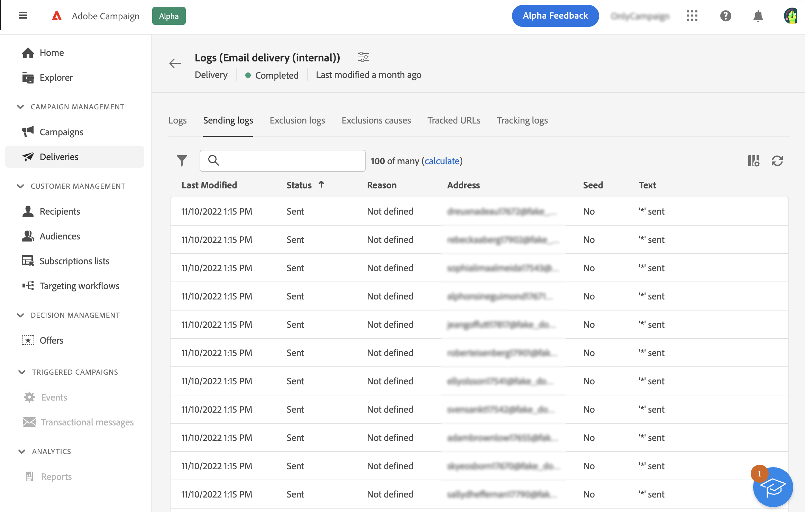
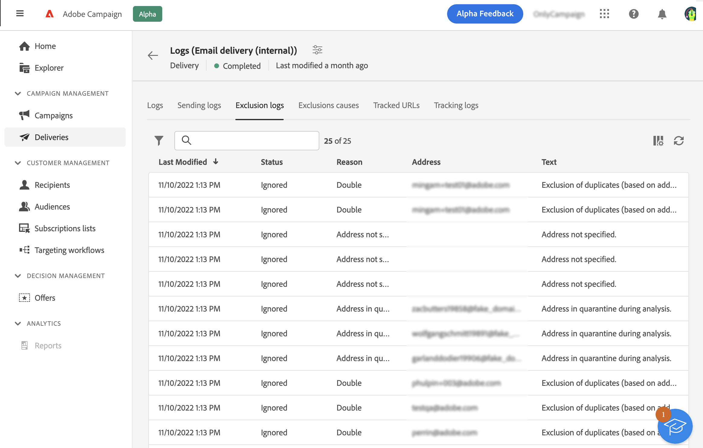
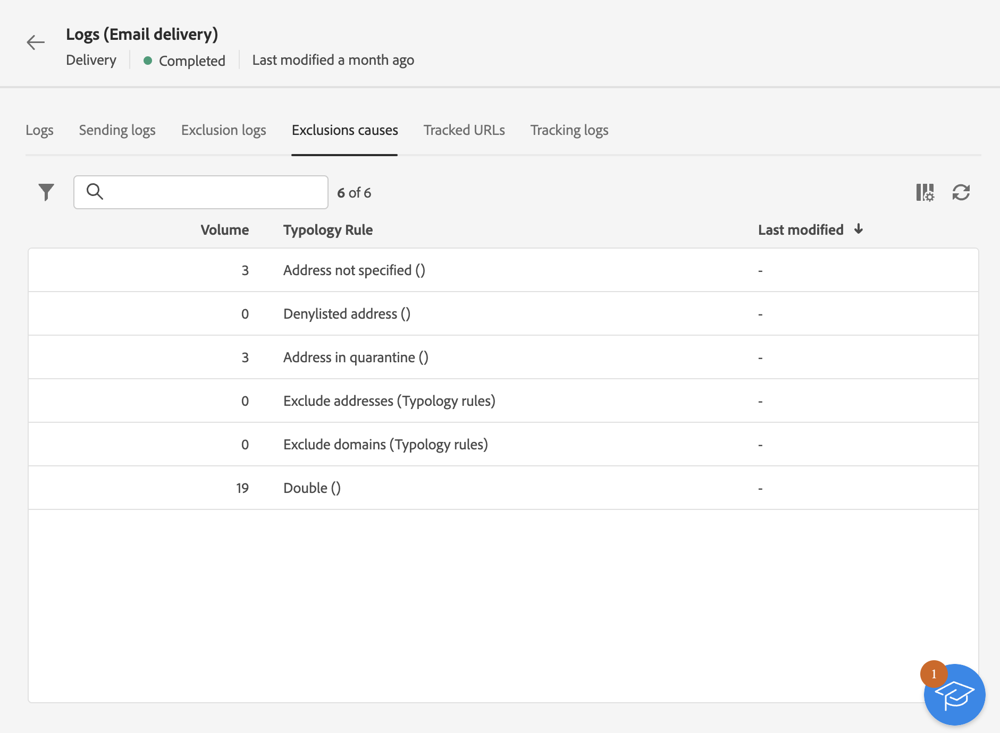
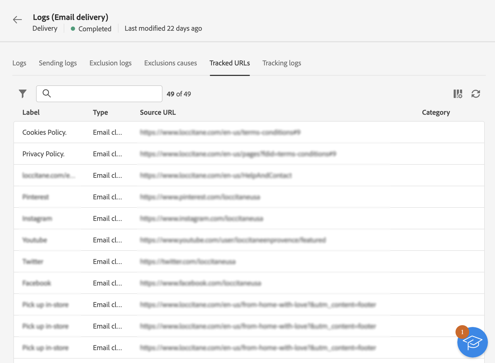
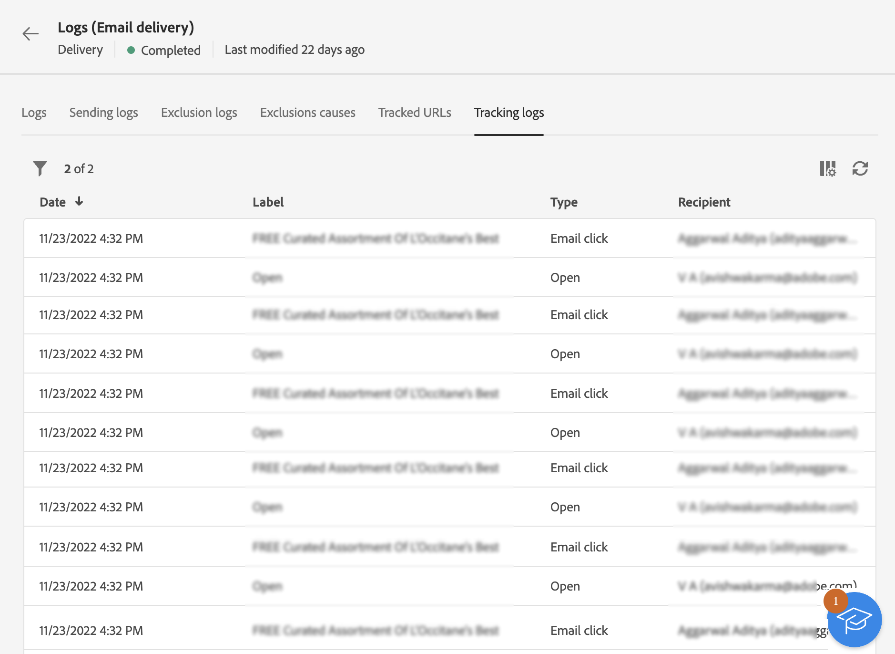

# Monitor delivery logs {#delivery-logs}

>[!CONTEXTUALHELP]
>id="acw_deliveries_email_preparation_logs"
>title="Delivery logs"
>abstract="TBC"

After preparing and sending an email, the delivery logs allow you to verify that there is no error. These logs can be accessed directly from the message dashboard. They show the detail of the sending, which target has been excluded and why, as well as the tracking information such as opens and clicks.

To view the logs, access your delivery dashboard and click the **Logs** button.

Several tabs are available:

## Logs

The **Logs** tab contains all messages relating to the delivery and the proofs. Specific icons allow you to identify errors or warnings. 

All the validation steps, warnings and errors are listed. Colored icons show the message type:

* The grey icon indicates an informative message.
* The yellow icon indicates a non-critical processing error.
* The red icon indicates a critical error that prevents sending the delivery. 

## Deliveries

The **Sending logs** tab offers a history of every occurrence of this delivery. The list of sent messages and their statuses is stored here. It allows you to view the delivery status for each recipient.

## Exclusions

The **Exclusion logs** tab lists all the messages that have been excluded from the target and specifies the reason for the send failure.

## Exclusion causes

The **Exclusion causes** tab displays the volume (in number of messages) of messages that were excluded from the target.

## Tracked URLs

The **Tracked URLs** tab regroups the URLs contained in the sent message, including their URL type and their source URL.

## Tracking

The **Tracking** tab lists the tracking history for this delivery. This tab displays tracking data for the messages sent, i.e. all URLs subject to tracking by Adobe Campaign.

>[!NOTE]
>
>If tracking is not enabled for a delivery, this tab is not displayed.

