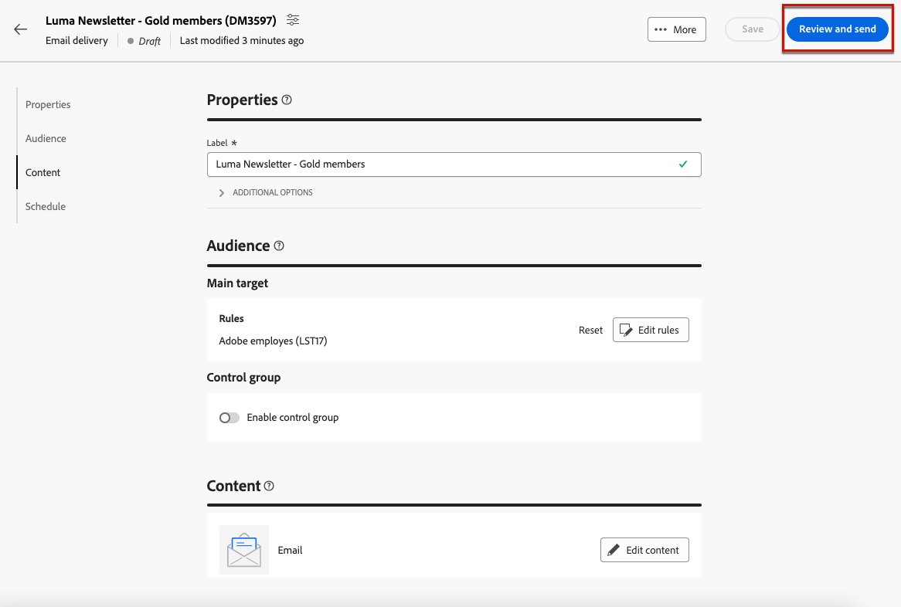
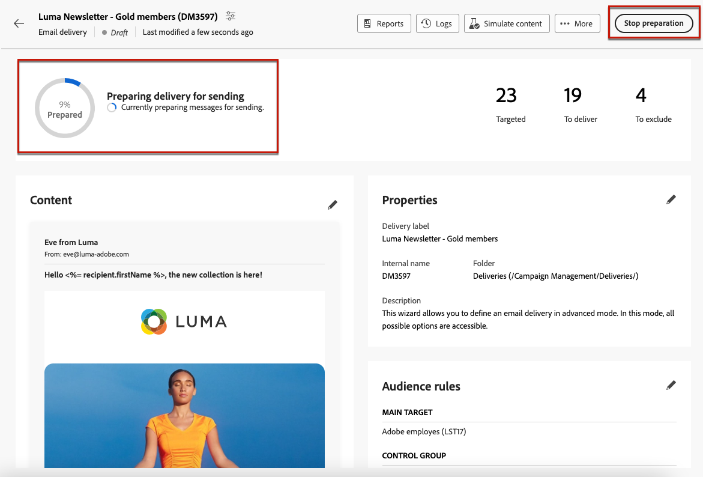
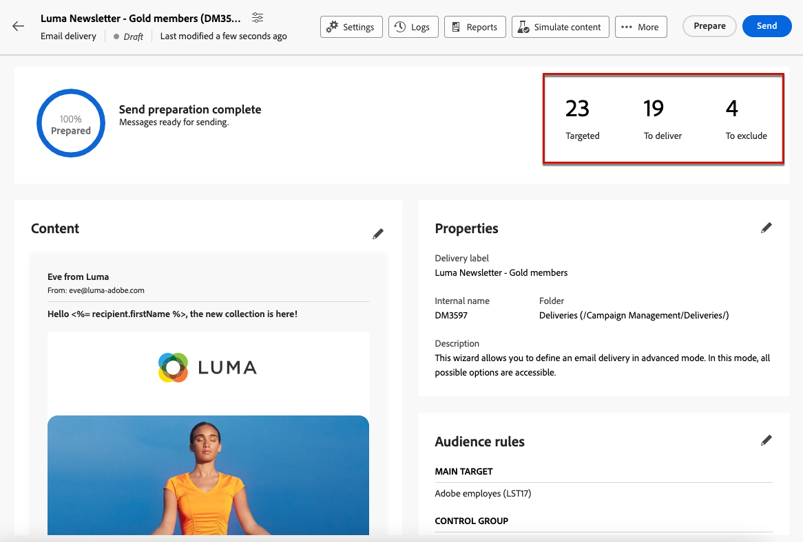
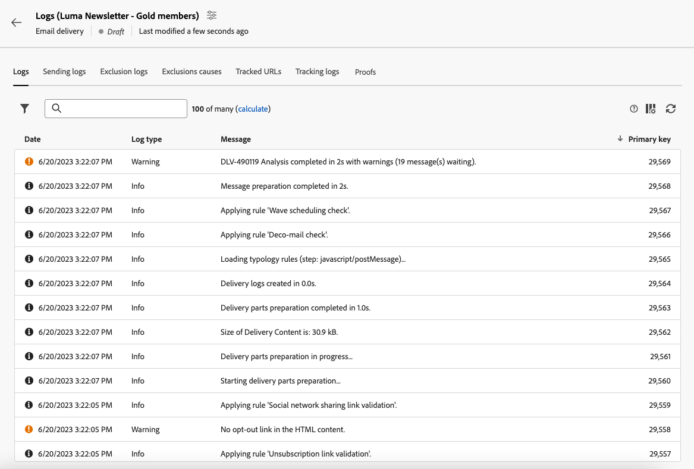
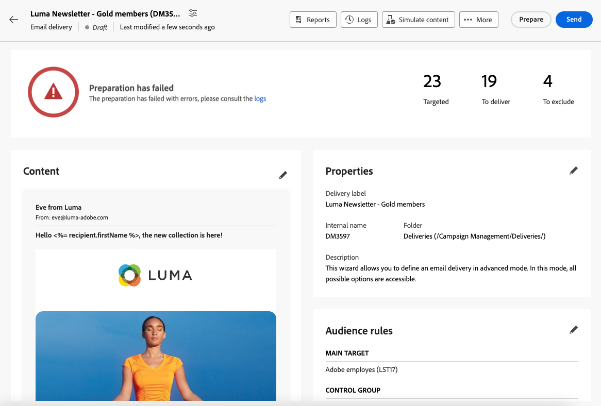
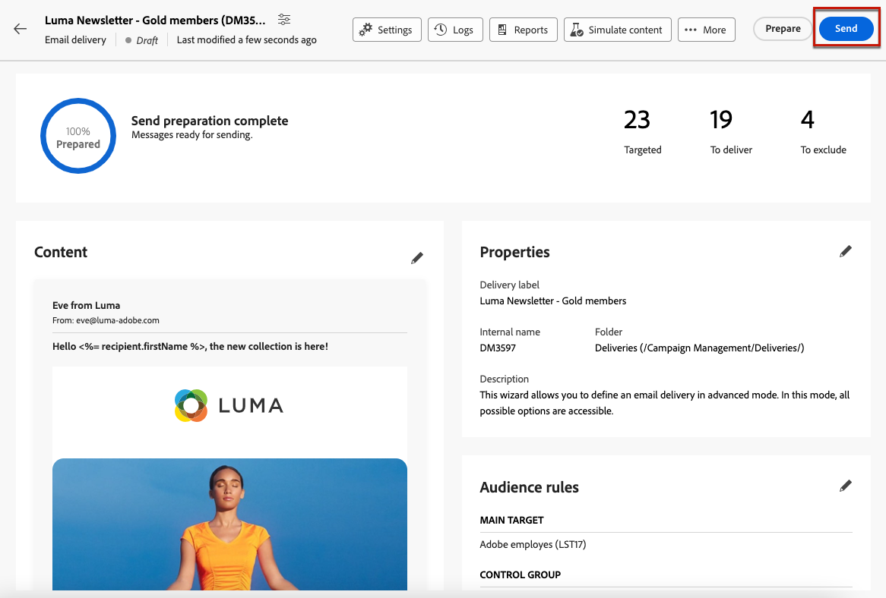
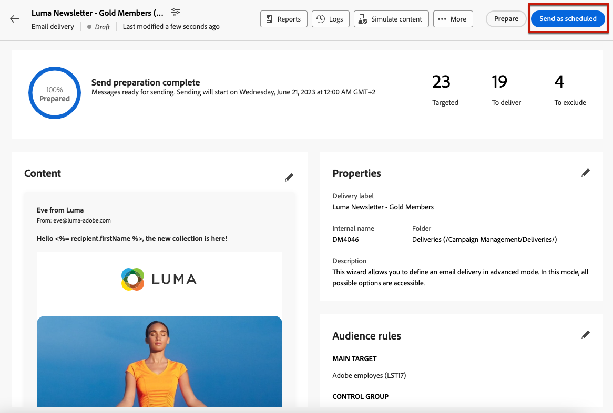
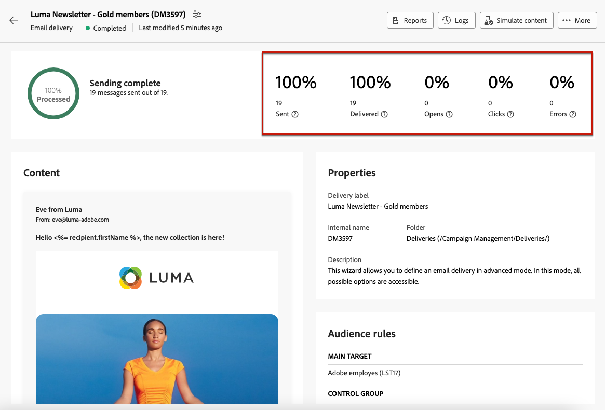

# 準備並傳送您的電子郵件 {#prepare-send}

## 準備傳送 {#prepare}

當您定義[內容](../email/edit-content.md)、[對象](../audience/add-audience.md)和[排程](../msg/gs-messages.md#schedule-the-delivery-sending-gs-schedule)時，您就可以準備電子郵件傳遞了。

在傳遞準備期間，會計算目標母體，並針對目標中包含的每個設定檔產生訊息內容。 完成準備工作後，即可立即或依排程的日期和時間傳送訊息。

傳遞準備期間使用的驗證規則在[Campaign v8 （使用者端主控台）檔案](https://experienceleague.adobe.com/docs/campaign/campaign-v8/send/emails/send.html){target="_blank"}中進行了說明。

準備傳送的主要步驟如下。

1. 從傳遞儀表板，按一下&#x200B;**[!UICONTROL 檢閱並傳送]**。

   {zoomable="yes"}

1. 按一下右上角的&#x200B;**[!UICONTROL 準備]**&#x200B;按鈕並確認。

   {zoomable="yes"}

   >[!NOTE]
   >
   >如果您已排程傳遞並停用&#x200B;**[!UICONTROL 傳送前啟用確認]**&#x200B;選項，則準備和傳送步驟會在&#x200B;**[!UICONTROL 準備並傳送]**&#x200B;按鈕下分組。 [進一步瞭解排程](../msg/gs-deliveries.md#gs-schedule)

1. 畫面會顯示準備進度。根據目標群體的大小，此操作可能需要一些時間。

   您可以使用&#x200B;**[!UICONTROL 停止準備]**&#x200B;按鈕隨時停止準備。

   {zoomable="yes"}

   >[!NOTE]
   >在準備階段，不傳送任何訊息。因此，您可以開始或停止準備而不會影響任何東西。

1. 準備作業完成後，請檢查 KPI。如果要傳送的訊息數與您的預期不符，請修改您的客群並重新開始準備。

   {zoomable="yes"}

   以下是顯示的不同 KPI：

   * **[!UICONTROL 已鎖定目標]**：已鎖定目標的收件者數目。
   * **[!UICONTROL 要傳遞]**：將傳送的訊息數。
   * **[!UICONTROL 要排除]**： [型別規則](../advanced-settings/delivery-settings.md#typology)排除的訊息數。

1. 按一下「**[!UICONTROL 記錄]**」按鈕並檢查沒有錯誤。最後的記錄訊息顯示所有錯誤訊息和錯誤數量。[了解更多](delivery-logs.md)

   {zoomable="yes"}

1. 如果準備作業偵測到阻止傳送傳遞的嚴重錯誤，則在傳遞儀表板中準備狀態顯示為失敗。

   {zoomable="yes"}

1. 如果您在準備後對傳送進行任何變更，則必須重新開始準備，才能將這些變更納入考量。

完成準備工作且無錯誤後，即可傳送您的訊息。

## 傳送訊息 {#send}

[準備](#prepare)完成後，您現在可以傳送電子郵件。

如果已排程訊息，則會在定義的日期和時間傳送訊息。 [了解更多](../msg/gs-deliveries.md#gs-schedule)

### 立即傳送 {#send-immediately}

若要立即傳送電子郵件，請遵循下列步驟。

1. 從傳遞控制面板中，按一下右上角的&#x200B;**[!UICONTROL 傳送]**&#x200B;按鈕。

   {zoomable="yes"}

1. 確認此動作以立即將訊息傳送至主要目標。

1. 會顯示傳送進度。

### 排程傳送 {#schedule-the-send}

如果您已排程在稍後日期及時間傳送電子郵件，請遵循下列步驟。

1. 在您按下&#x200B;**[!UICONTROL 檢閱並傳送]**&#x200B;按鈕之前，請確定您已定義電子郵件的排程。 [了解更多](../msg/gs-deliveries.md#gs-schedule)

1. 在傳遞控制面板中，按一下右上角的&#x200B;**[!UICONTROL 依排程傳送按鈕]**&#x200B;按鈕。

   {zoomable="yes"}

1. 按一下&#x200B;**[!UICONTROL 確認傳送]**。 系統會在排程日期將傳遞傳送至主要目標。

   >[!NOTE]
   >
   >如果您停用&#x200B;**[!UICONTROL 傳送前啟用確認]**&#x200B;選項，準備和傳送步驟會在&#x200B;**[!UICONTROL 準備和傳送]**&#x200B;按鈕下分組。 [進一步瞭解排程](../msg/gs-deliveries.md#gs-schedule)

## 暫停或停止傳送 {#pause-stop-sending}

無論您的傳遞是否已排程<!--TBC-->，在傳送程式期間隨時可以執行兩個動作：

* 按一下&#x200B;**[!UICONTROL 暫停傳送]**&#x200B;以中斷訊息的傳送。 您可以隨時恢復傳送。

* 按一下&#x200B;**[!UICONTROL 停止傳送]**&#x200B;以立即中斷傳送。 一旦停止，準備和傳送作業將無法恢復。

{zoomable="yes"}

## 檢查 KPI {#check-kpis}

>[!CONTEXTUALHELP]
>id="acw_deliveries_email_metrics_delivered"
>title="已傳遞"
>abstract="已成功傳遞的訊息數。此指標每 5 分鐘會更新一次。會根據已傳送訊息的總數顯示百分比。"
>additional-url="https://experienceleague.adobe.com/zh-hant/docs/campaign-web/v8/reports/kpis" text="瞭解 KPI"

>[!CONTEXTUALHELP]
>id="acw_deliveries_email_metrics_opens"
>title="開啟次數"
>abstract="開啟的訊息數。此指標每 5 分鐘會更新一次。顯示的百分比為相異開啟次數相較於已傳遞訊息數的比率。"
>additional-url="https://experienceleague.adobe.com/zh-hant/docs/campaign-web/v8/reports/kpis" text="瞭解 KPI"

>[!CONTEXTUALHELP]
>id="acw_deliveries_email_metrics_clicks"
>title="點按次數"
>abstract="在電子郵件中至少點按一次的收件者數量。此指標每 5 分鐘會更新一次。顯示的百分比為相異點按次數相較於已傳遞訊息數的比率。"
>additional-url="https://experienceleague.adobe.com/zh-hant/docs/campaign-web/v8/reports/kpis" text="瞭解 KPI"

>[!CONTEXTUALHELP]
>id="acw_deliveries_email_metrics_sent"
>title="傳送的量度"
>abstract="傳遞分析期間處理的訊息總數。"
>additional-url="https://experienceleague.adobe.com/zh-hant/docs/campaign-web/v8/reports/kpis" text="瞭解 KPI"

>[!CONTEXTUALHELP]
>id="acw_deliveries_email_metrics_errors"
>title="錯誤量度"
>abstract="傳遞和自動傳回處理期間累積的錯誤總數與已傳送之訊息總數的關係。"
>additional-url="https://experienceleague.adobe.com/zh-hant/docs/campaign-web/v8/reports/kpis" text="瞭解 KPI"

傳送完成後，您可以檢查顯示的KPI：

{zoomable="yes"}

* **[!UICONTROL 已傳送]**：已傳遞的訊息數。 顯示的百分比是以要傳送的訊息總數為基礎。

* **[!UICONTROL 已傳遞]**：已成功傳遞的訊息數。會根據已傳送訊息的總數顯示百分比。

* **[!UICONTROL 開啟]**：已開啟的訊息數。顯示的百分比是不同開啟次數與已傳送訊息次數的比較。

* **[!UICONTROL 點按]**：在電子郵件中至少點按一次的收件者人數。 顯示的百分比是相較於已傳遞訊息數量的不同點按次數。

* **[!UICONTROL 錯誤]**：具有錯誤狀態的電子郵件數目。 會根據已傳送訊息的總數顯示百分比。

>[!NOTE]
>
>所有指標在傳遞開始後每 5 分鐘更新一次。傳遞準備指標為即時。

在[此頁面](../reporting/kpis.md)中進一步瞭解KPI。

您也可以檢查記錄。[了解更多](delivery-logs.md)