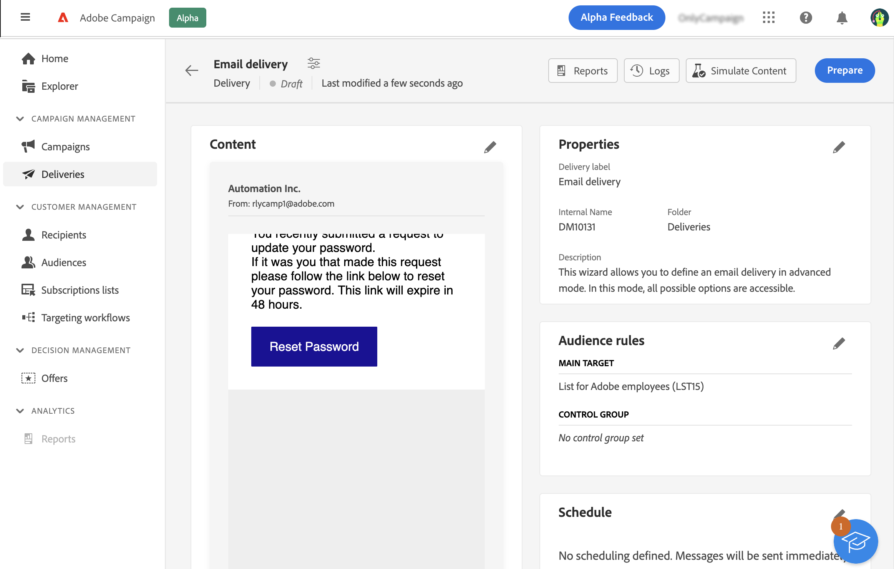
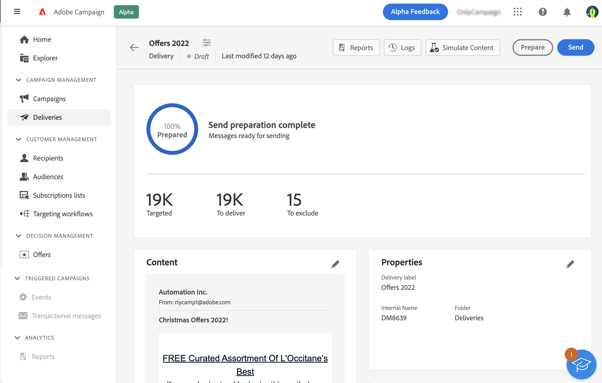
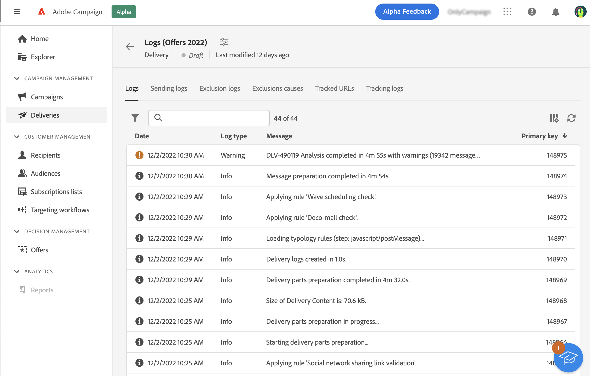
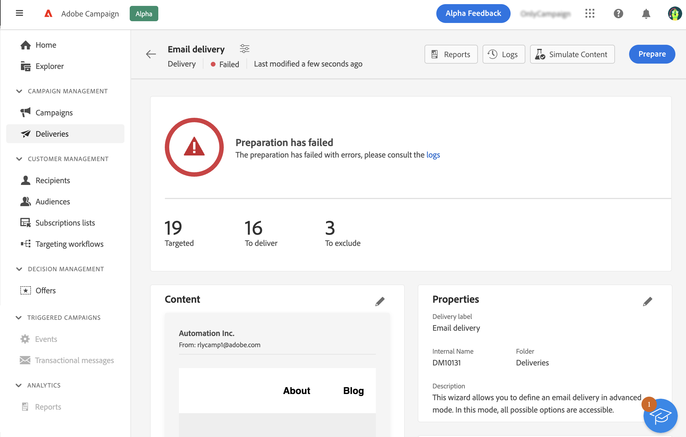
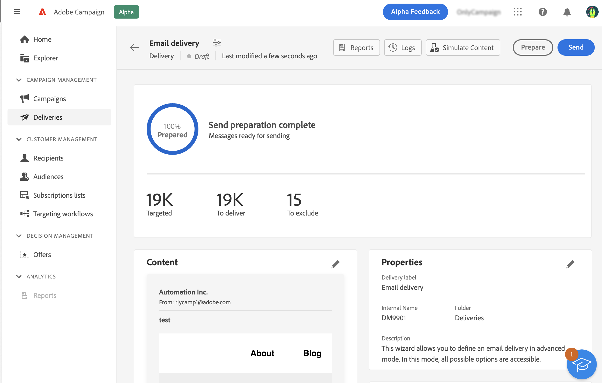
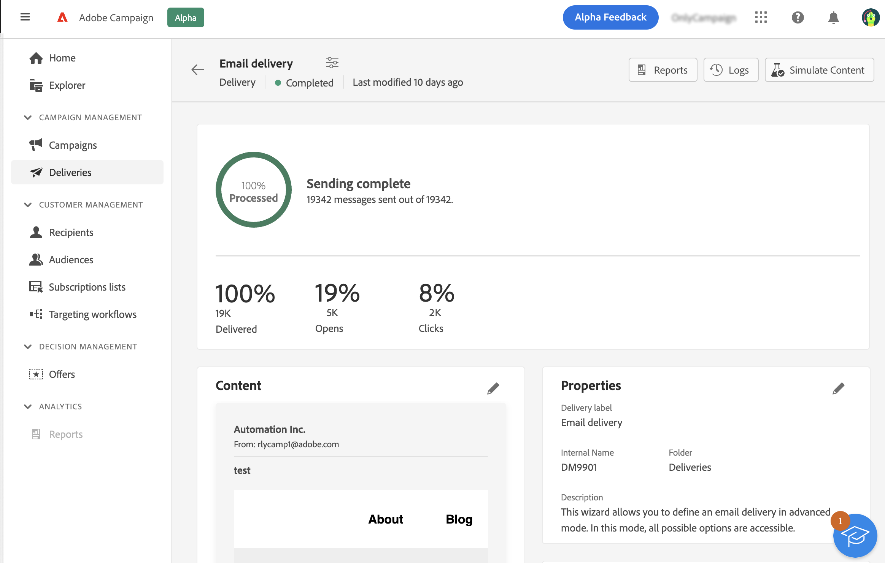

# Prepare and send your email {#prepare-send}

>[!CONTEXTUALHELP]
>id="acw_homepage_card5"
>title="Prepare and send your email"
>abstract="Discover how to prepare your email and learn more about sending KPIs."

<!--

	show how to prepare and send the email + the live kpis in the dashboard

like acc when preparation, target calculated then send
real time KPIs, not in AJO. similar to ACS.
exclusion logs, causes
-->

<!--
send also KPIs
-->

## Prepare the send{#prepare}

When you have defined your content, audience and schedule, you're ready to prepare your message. During the preparation, the target population is calculated and the message content generated for each profile included in the target. Once the preparation is finished, the messages are ready to be sent, either immediately or at the scheduled date and time. The validation rules used during analysis are described in the [Campaign Classic v7 documentation](https://experienceleague.adobe.com/docs/campaign-classic/using/sending-messages/key-steps-when-creating-a-delivery/steps-validating-the-delivery.html#validation-process-with-typologies){target="_blank"}.

Follow the steps below: 

1. From the delivery dashboard, click the **Prepare** button located in the top right corner and confirm.

    

   The preparation progress is displayed. Depending on the size of the targeted population, this operation may take some time.

    >[!NOTE]
    >
    >You can stop the preparation at any time using the **Stop preparation** button. During the preparation phase, no messages are sent. You can therefore start or stop this without risk of impacting anything.

1. When the preparation is finished, check the KPIs. If the number of messages to send does not match your expectations, modify your audience and restart the preparation. 

    
    
    Here are the different KPIs displayed:

    * **Targeted**: the number of recipients targeted
    * **To deliver**: the number of messages that will be sent 
    * **To exclude**: the number of messages excluded by a typology rule

1. Click the **Logs** button and check that there is no error. The last log message displays any error messages and the number of errors. For more on this, see this [section](delivery-logs.md).

    

If the preparation detects a critical error preventing the delivery from being sent, the preparation status appears as failed in the delivery dashboard.

If you need to make any changes to your delivery after the preparation, you need to restart the preparation for those changes to be taken into account. 

Once the preparation is complete with no error, your message is ready to be sent. For more on this, see this [section](#send).

## Send the message{#send}

Once the preparation is complete, you can now send your message. This step is only required for messages sent immediately. If the message is scheduled, it is sent at the defined date. 

Follow these steps:

1. From the delivery dashboard, click the **Send** button in the top right corner and confirm.

    

1. The sending progress is displayed. Check the KPIs displayed. You can also check the logs. For more on this, see this [section](delivery-logs.md).

    

    Here are the different KPIs displayed:

    * **Delivered**: the number of messages successfully delivered. The percentage displayed is based on the total number of sent messages.
    * **Opens**: the number of opened messages. The percentage displayed is the ratio of the number of distinct opens compared with the number of delivered messages.
    * **Clicks**: the number of recipient who clicked at least once in the email. The percentage displayed is the ratio of the number of distinct clicks compared with the number of delivered messages.

    >[!NOTE]
    >
    >The **Opens** and **Clicks** indicators are updated after 5 minutes.  

   You can pause the sending at any time and then resume. If you stop the delivery while it is being sent, you cannot resume.
