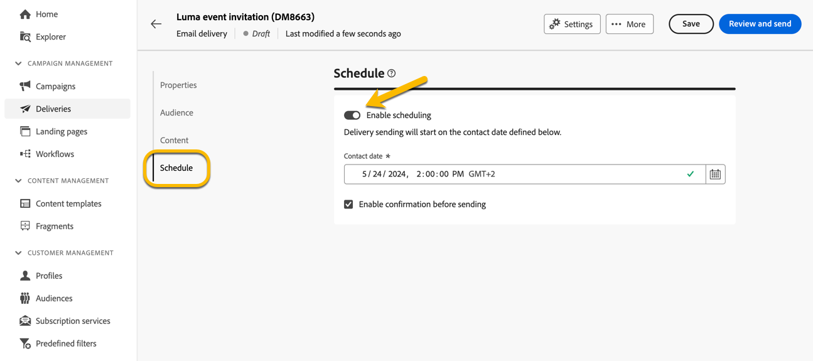
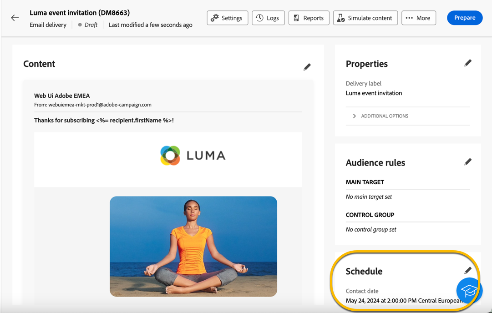
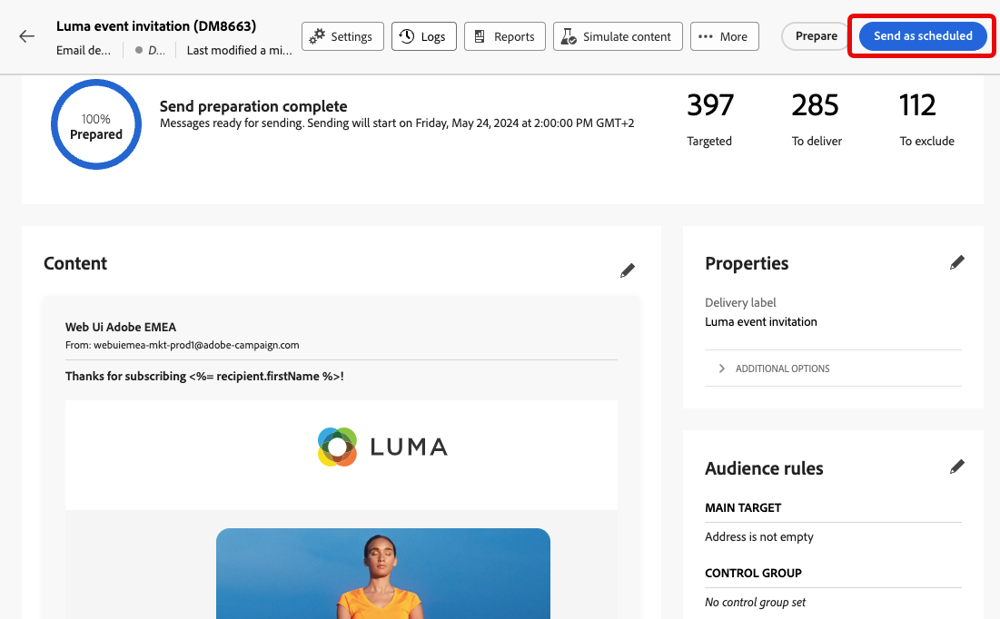
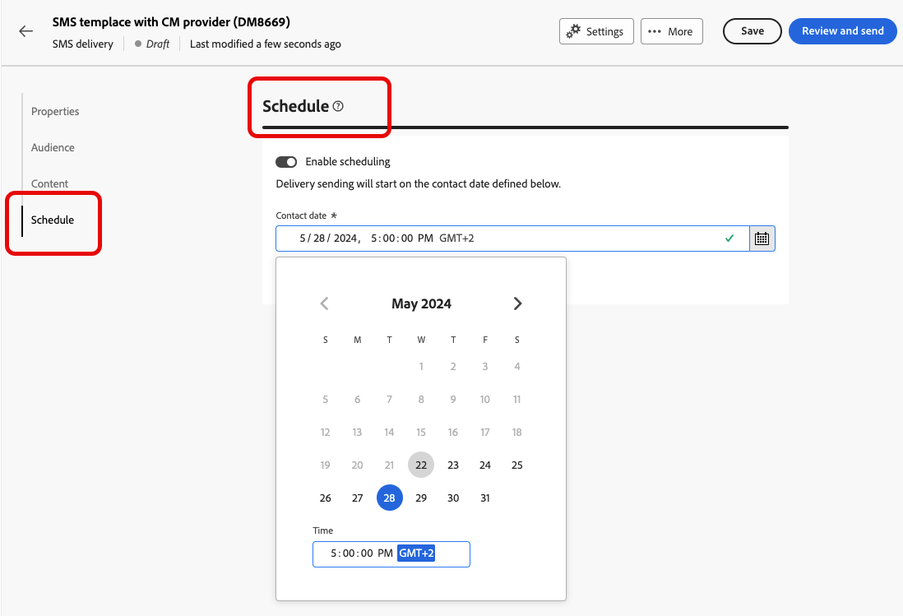
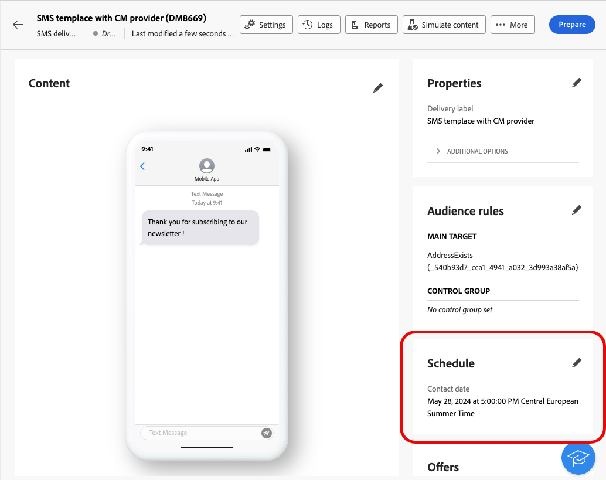
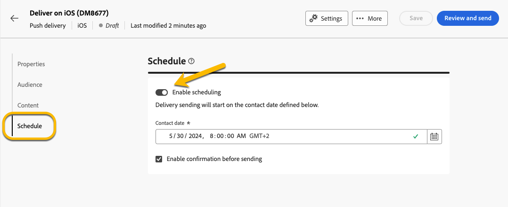
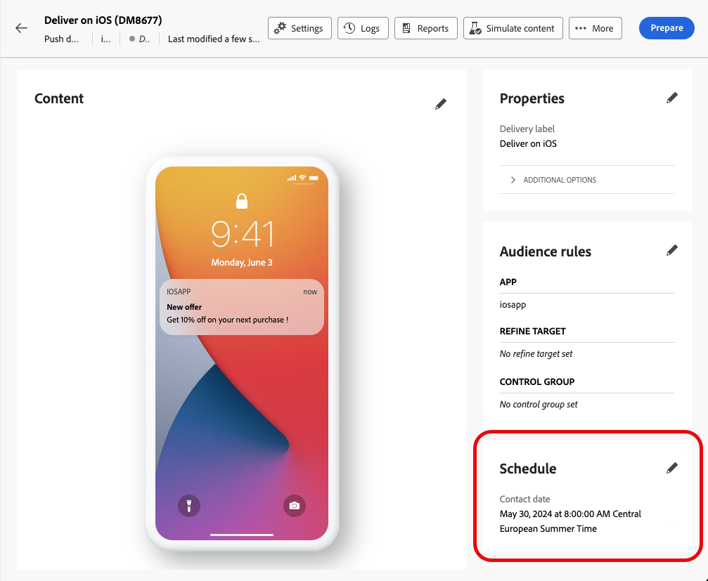
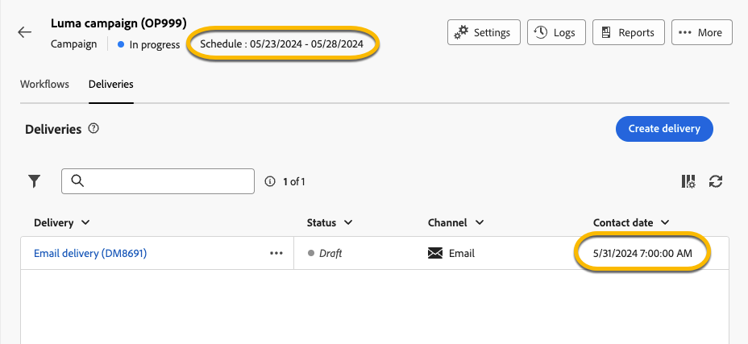
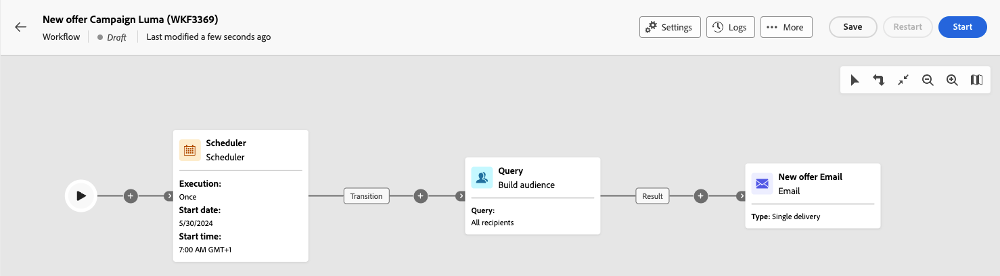
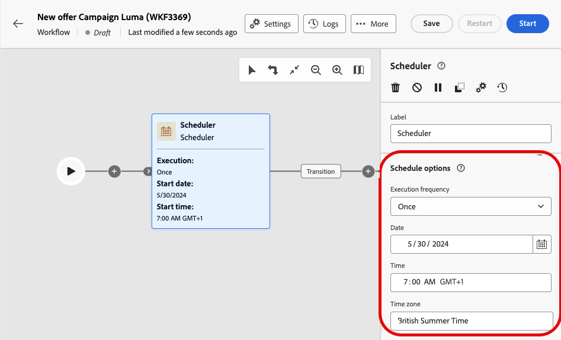

# 排程傳送作業 {#schedule-sending}

您可以排程傳遞的傳送。 步驟取決於是否為獨立（一次性）傳遞，或您是否正在行銷活動工作流程的內容中工作。

## 獨立傳送

如果是獨立傳送，請直接在傳送中排程日期和時間。 如需各種傳送型別的詳細資訊，請參閱下列範例：電子郵件、簡訊和推播通知。

### 電子郵件 {#schedule-email-standalone}

若要排程電子郵件傳送的傳送，請執行下列步驟：

1. 在傳遞屬性的&#x200B;**[!UICONTROL 排程]**&#x200B;區段中，啟動&#x200B;**[!UICONTROL 啟用排程]**&#x200B;切換按鈕。

1. 設定所要的傳送日期和時間，然後按一下&#x200B;**[!UICONTROL 檢閱並傳送]**&#x200B;按鈕。

   {zoomable="yes"}

>[!NOTE]
>
>預設會選取「**[!UICONTROL 啟用傳送前確認]**」選項。此選項要求您在排程的日期和時間傳遞之前確認傳送。如果您需要在排程的日期和時間自動傳送傳遞，請停用此選項。
>

1. 檢查排程是否正確，然後按一下&#x200B;**[!UICONTROL 準備]**&#x200B;按鈕。

{zoomable="yes"}

1. 準備完成後，訊息即可傳送。 顯示傳遞的關鍵量度，包括目標人口總數、要傳遞的訊息數目以及排除的收件者數目。 按一下&#x200B;**[!UICONTROL 依排程傳送]**&#x200B;按鈕，確認會在排程的日期和時間傳送至主要目標。

{zoomable="yes"}

### 簡訊

若要將簡訊傳送排程在特定日期和時間，請遵循與電子郵件傳送相同的步驟。 [請參閱上述](#schedule-email-standalone)。

{zoomable="yes"}

您也可以檢查排程是否已套用：

{zoomable="yes"}

### 推播通知

若要針對特定日期和時間排程獨立推播傳送，請遵循與電子郵件傳送相同的步驟。 [請參閱上述](#schedule-email-standalone)。

{zoomable="yes"}

您也可以檢查排程是否已套用：

{zoomable="yes"}

### 行銷活動中的獨立傳送

您無需使用工作流程，即可在行銷活動中建立獨立傳送。 如上所述，設定此傳遞的日期和時間排程。 行銷活動可能有自己的排程，包括開始日期和結束日期。 此排程不會影響您的傳送排程。

{zoomable="yes"}

## 在行銷活動工作流程中排程傳遞

在行銷活動工作流程中，最佳實務是使用&#x200B;**[!UICONTROL 排程器]**&#x200B;活動來套用啟動工作流程的日期和時間，其中涉及傳送傳遞。 [進一步瞭解排程器](../workflows/activities/scheduler.md)。

{zoomable="yes"}

設定&#x200B;**[!UICONTROL 排程器]**&#x200B;活動中的日期和時間。

{zoomable="yes"}

>[!NOTE]
>
>當您使用&#x200B;**[!UICONTROL 排程器]**&#x200B;活動在工作流程中排程傳送您的傳遞時，請勿在&#x200B;**[!UICONTROL 傳送]**&#x200B;活動設定中啟用&#x200B;**[!UICONTROL 啟用排程]**&#x200B;切換按鈕。 系統會自動傳送您的傳遞。
>

如果您在&#x200B;**[!UICONTROL 傳遞]**&#x200B;活動設定中啟用&#x200B;**[!UICONTROL 啟用排程]**&#x200B;切換功能，並設定日期和時間，則傳遞將在此日期和時間等候傳送。 這表示如果工作流程啟動日期和傳送日期之間有延遲，則對象可能不是最新狀態。