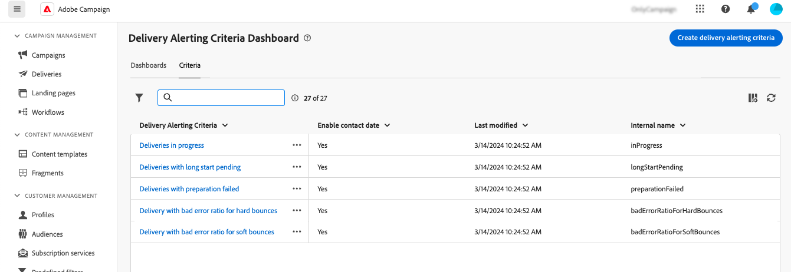
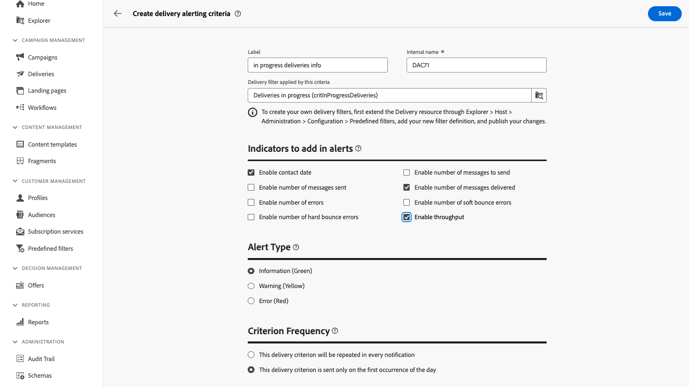

# 傳遞警報條件 {#delivery-alerting-criteria}

>[!CONTEXTUALHELP]
>id="acw_delivery_alerting_criteria"
>title="傳遞警報條件儀表板"
>abstract="Campaign Web 使用者介面提供了預先定義的警報標準 (輸送量低的傳遞、準備失敗的傳遞…)，您可以將其新增至儀表板。您還可以建立符合自己需求的條件。"

Campaign Web使用者介面提供預先定義的警示准則，例如低輸送量的傳遞或準備失敗的傳遞，您可將其新增至您的儀表板。 您還可以建立符合自己需求的條件。

可從左側導覽窗格的&#x200B;**傳送警報**&#x200B;功能表（**條件**&#x200B;標籤下）存取警報條件。

## 預先定義的警示准則 {#ootb-criteria}

Campaign Web使用者介面中提供預先定義的警示准則。 這些條件涵蓋一系列案例，如下所示：

* **傳遞失敗**：任何排程在定義範圍內的傳遞，狀態錯誤。
* **準備的傳遞失敗**：在定義的範圍內修改的任何傳遞，其準備步驟（目標計算與內容產生）已失敗。
* **軟退信的錯誤率錯誤**：任何已排程在定義範圍內的傳遞，其狀態至少為「進行中」，且軟退信錯誤率大於定義的百分比。
* **硬退信的錯誤率錯誤**：任何已排程在定義範圍內的傳遞，其狀態至少為「進行中」，且硬退信錯誤率大於定義的百分比。
* **長時間開始擱置的傳遞**：任何排程在定義範圍中的傳遞，其「開始擱置」狀態超過定義的持續時間。 「開始擱置」狀態表示系統尚未考慮這些訊息。
* **低輸送量的傳遞**：任何開始傳遞的時間超過定義的持續時間，且已處理訊息的百分比低於定義的百分比，而輸送量低於定義的值。
* **傳遞進行中**：任何排程在定義範圍內的傳遞，其狀態為「進行中」。

>[!NOTE]
>
>預設值會套用至上述條件的所有引數。 這些值可以在傳送警示控制面板的&#x200B;**條件引數**&#x200B;區段中自訂，這些引數正在使用中。 [瞭解如何使用儀表板](../msg/delivery-alerting-dashboards.md)

## 建立警報條件 {#criteria}

>[!CONTEXTUALHELP]
>id="acw_delivery_alerting_criteria_create"
>title="建立傳遞警報條件"
>abstract="除了 Adobe Campaign 提供的預先定義警報條件之外，您還可以建立符合自己需求的條件。"

>[!CONTEXTUALHELP]
>id="acw_delivery_alerting_criteria_create_indicators"
>title="要在警報中新增的指標"
>abstract="選取要在電子郵件警報「詳細資料」區段中顯示為欄位的指標。"

>[!CONTEXTUALHELP]
>id="acw_delivery_alerting_criteria_create_alert"
>title="警報類型"
>abstract="指定該條件的&#x200B;**警報類型**，即警報的「摘要」區段中傳遞條件旁顯示的標籤和顏色。"

>[!CONTEXTUALHELP]
>id="acw_delivery_alerting_criteria_create_frequency"
>title="條件頻率"
>abstract="控制達到此條件的傳遞，其每天的提醒頻率。"

若要建立新條件，請遵循下列步驟：

1. 導覽至左側導覽窗格中的&#x200B;**傳送警報**&#x200B;功能表，然後選取&#x200B;**條件**&#x200B;標籤。
1. 按一下&#x200B;**建立傳遞警示條件**&#x200B;按鈕。
1. 提供條件的標籤。 內部名稱會自動填入且為唯讀。
1. 使用此條件套用的&#x200B;**傳遞篩選器**，透過套用預先定義的篩選器來縮小條件的範圍。

   在下列範例中，已選取&#x200B;**進行中的傳遞(critInProgressDeliveries)**&#x200B;篩選器，這表示條件只會考慮狀態為「進行中」的傳遞。

   

   >[!NOTE]
   >
   >如果沒有任何預先定義的篩選器符合您的需求，您可以從&#x200B;**客戶管理** > **預先定義的篩選器**&#x200B;功能表建立自己的篩選器。 [閱讀更多](../get-started/predefined-filters.md)
   >
   >這項作業只能由進階使用者執行。

1. 在要新增警示的&#x200B;**指標**&#x200B;區段中，選擇要顯示為電子郵件警示之[詳細資料]區段中的欄的指標。

1. 指定條件的&#x200B;**警報類型**，即警報「摘要」區段中傳遞條件旁顯示的標籤和顏色。

1. 使用&#x200B;**條件頻率**&#x200B;區段控制每個符合條件的傳遞每天的警示頻率：

   * **此傳遞條件將在每個通知中重複**：在當天的每個電子郵件警報中顯示符合條件的傳遞。
   * **此傳遞條件只會在當天的第一次發生時傳送**：只會在當天的第一個報表中顯示符合條件的傳遞，而不會在後續的電子郵件警示中重複。