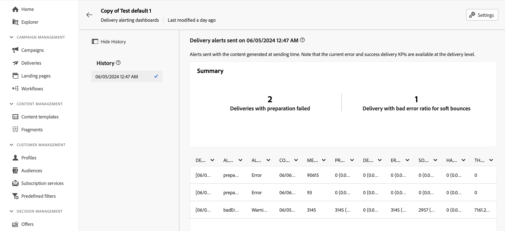

# 傳遞提醒儀表板 {#delivery-alerting-dashboards}

>[!CONTEXTUALHELP]
>id="acw_delivery_alerting_dashboards"
>title="傳遞提醒儀表板"
>abstract="「傳送警報」是警報管理系統，可讓使用者群組自動接收包含其傳送執行資訊的電子郵件通知。傳遞警報儀表板可讓您指定誰將接收電子郵件警報，選擇和設定用於傳送這些警報的警報條件，以及存取所有已傳送通知的歷史記錄。"

傳送警報儀表板可讓您指定接收電子郵件警報的人員、選擇並設定用於傳送這些警報的警報條件，以及存取所有已傳送通知的歷史記錄。 可從左側導覽窗格中&#x200B;**儀表板**&#x200B;標籤下的&#x200B;**傳送警報**&#x200B;功能表存取這些區段。

![熒幕擷圖顯示[傳送警示]功能表中警示儀表板的清單。](assets/alerting-dashboard-list.png)

## 建立傳遞儀表板 {#dashboards}

>[!CONTEXTUALHELP]
>id="acw_delery_alerting_dashboard_create"
>title="建立傳遞警報儀表板"
>abstract="建立傳遞警報儀表板可讓您指定誰將接收電子郵件警報，選擇和設定用於傳送這些警報的警報條件，以及存取所有已傳送通知的歷史記錄。"

>[!CONTEXTUALHELP]
>id="acw_delivery_alerting_create_general"
>title="傳遞警報一般參數"
>abstract="指定傳遞警報儀表板的一般屬性。 **選取警報群組**&#x200B;欄位可讓您指定&#x200B;**操作者群組**，以接收此儀表板傳送的警報。"

>[!CONTEXTUALHELP]
>id="acw_delivery_alerting_create_criteria_add"
>title="傳遞提醒條件"
>abstract="在此區段中，新增要用於從此儀表板傳送警報的條件。從預先定義的條件中進行選擇，或建立您自己的條件以滿足特定需求。"

>[!CONTEXTUALHELP]
>id="acw_delivery_alerting_create_criteria_parameters"
>title="條件參數"
>abstract="條件具有預設參數值，是用於定義必須如何套用這些參數。您可以在此區段中變更這些值，以滿足您的需求。"

若要建立傳送控制面板，請依照下列步驟進行：

1. 導覽至左側導覽窗格中的&#x200B;**傳遞警報**&#x200B;功能表，然後按一下&#x200B;**建立傳遞儀表板**。

   ![在傳送警示功能表中顯示[建立傳送儀表板]選項的熒幕擷圖。](assets/alerting-dashboard.png)

1. 在&#x200B;**標籤**&#x200B;欄位中命名您的儀表板。 **內部名稱**&#x200B;欄位會自動填入且為唯讀。

1. 在&#x200B;**選取警示群組**&#x200B;欄位中，指定&#x200B;**操作員群組**&#x200B;以接收此儀表板傳送的警示。 所選操作員群組的所有成員都會收到警示。

   在[Adobe Campaign v8 （主控台）檔案](https://experienceleague.adobe.com/zh-hant/docs/campaign/campaign-v8/admin/permissions/gs-permissions){target="_blank"}中進一步瞭解許可權和運運算元群組

1. 在&#x200B;**傳送警示條件**&#x200B;區段中，新增您要用來傳送警示的條件。 從預先定義的條件中選擇，或建立您自己的條件以符合特定需求。 [瞭解如何使用條件](../msg/delivery-alerting-criteria.md)

1. 條件具有預設引數值，可定義必須如何套用條件。 您可以從&#x200B;**條件引數**&#x200B;區段變更這些值，以符合您的需求。

   ![在傳遞儀表板中顯示[條件引數]區段的熒幕擷圖。](assets/alerting-criteria-parameters.png)

   例如，根據預設，**傳遞目標最小大小**&#x200B;條件引數設為50，這表示只有當傳遞目標至少為50個設定檔時，才會將傳遞包含在此控制面板所傳送的警示中。 如果您想要包含目標為少於50個設定檔的傳送，可以變更此引數。

   展開下列區段，取得每個條件引數的詳細資訊：

   +++可用的條件引數

   * **傳遞目標最小大小**：例如，如果您在此欄位中輸入100，則只會針對目標等於或大於100個收件者的傳遞傳送傳送通知。 此引數適用於所有條件。
   * **連絡日期之前和之後的監視期間（以小時為單位）**：目前時間之前和之後的小時數。 只會考慮聯絡日期在此時間範圍內的傳遞。 此引數適用於所有條件。 此欄位的值預設為24小時。
   * **軟退信錯誤比率上限**：針對軟退信錯誤比率大於指定值的所有傳遞傳送傳送通知。 此欄位的值預設為0.05 (5%)。
   * **硬退信錯誤比率上限**：針對硬退信錯誤比率大於指定值的所有傳遞傳送傳送通知。 此欄位的值預設為0.05 (5%)。
   * **處於「開始擱置」狀態之傳遞的最短時間臨界值（以分鐘為單位）**：針對所有具有「開始擱置」狀態的傳遞傳送傳送一個通知，其持續時間超過此欄位中指定的持續時間，「開始擱置」狀態表示系統尚未考慮這些訊息。
   * **計算輸送量所需的最短時間（以分鐘為單位）**：對於輸送量低的傳遞條件，只會考慮啟動時間超過指定持續時間的傳遞（具有進行中狀態）。
   * **計算輸送量的已處理訊息的最大百分比**：對於具有低輸送量的傳遞條件，只會考慮已處理訊息百分比低於指定百分比的傳遞。
   * **最小預期輸送量（以每小時傳送的訊息數表示）**：只有輸送量低於指定值的傳遞才會考慮輸送量低的傳遞條件。
   * **「進行中的傳遞」條件所需的最小處理比例**：只考慮處理訊息百分比高於指定百分比的傳遞。

+++

1. 預設會停用警示儀表板，這表示連結至此儀表板的電子郵件警示不會傳送。 若要立即啟用儀表板，請切換警示群組選擇欄位旁邊&#x200B;**一般**&#x200B;區段中的&#x200B;**已啟用**&#x200B;選項。

   您也可以儲存控制面板並於稍後啟用。

   ![在傳遞儀表板設定中顯示[已啟用]切換選項的熒幕擷圖。](assets/alerting-dashboard-enable.png)

1. 若要儲存警示儀表板，請按一下&#x200B;**儲存**&#x200B;按鈕。

警報儀表板會開啟，並顯示空白資料。 當您準備好要啟動它並傳送通知時，請按一下&#x200B;**設定**&#x200B;按鈕並切換&#x200B;**已啟用**&#x200B;選項（如果您之前未這麼做）。

現在，每當傳遞符合此儀表板中定義的條件時，就會傳送警報通知給指定的操作員群組。

## 管理警報儀表板

>[!CONTEXTUALHELP]
>id="acw_delivery_alerting_dashboard_alerts"
>title="已傳送的傳遞警報"
>abstract="此區段可讓您視覺化最新傳送警報的相關資訊。"

>[!CONTEXTUALHELP]
>id="acw_delivery_alerting_dashboard_history"
>title="傳遞警報歷史記錄"
>abstract="**歷史記錄**&#x200B;窗格包含從此儀表板傳送的所有警報。按一下項目可存取在該特定時間傳送的相應警報。"

可從&#x200B;**儀表板**&#x200B;標籤中的&#x200B;**傳送警報**&#x200B;功能表存取所有已建立的警報儀表板。

![熒幕擷圖顯示[傳送警示]功能表中警示儀表板的清單。](assets/alerting-dashboard-list.png)

您可以使用位於儀表板名稱旁邊的&#x200B;**更多動作**&#x200B;按鈕來複製或刪除儀表板。

若要存取儀表板的詳細檢視，請從清單中按一下其名稱。 您可以在此畫面中視覺化最新傳送的警報。 所有已傳送的警報都會列在左窗格中。 按一下項目可存取在該特定時間傳送的相應警報。

若要編輯儀表板，請按一下右上角的&#x200B;**設定**&#x200B;按鈕，並進行所需的變更。