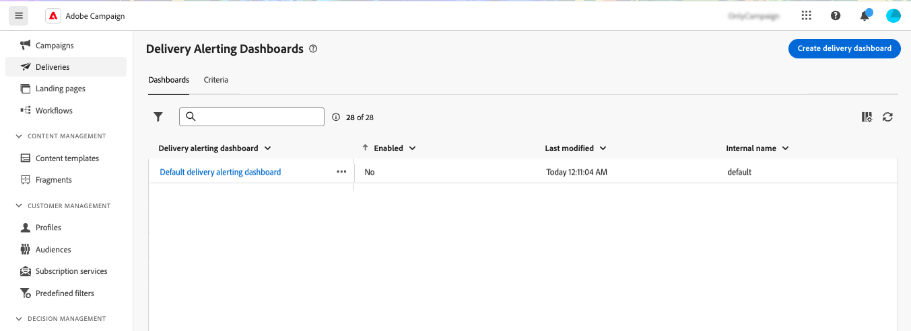
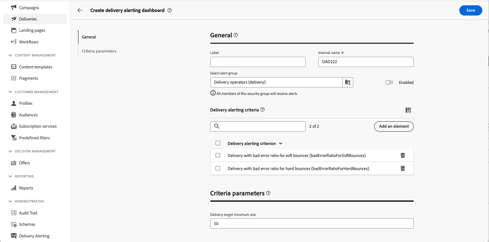
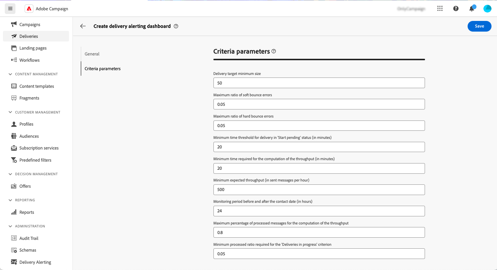
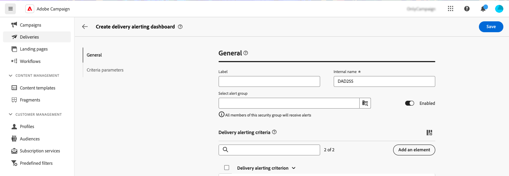

# 傳遞警報儀表板 {#delivery-alerting-dashboards}

>[!CONTEXTUALHELP]
>id="acw_delivery_alerting_dashboards"
>title="傳遞警報儀表板"
>abstract="傳送警報是警報管理系統，可讓使用者群組自動接收電子郵件通知，其中包含其傳送執行的資訊。 傳送警報儀表板可讓您指定接收電子郵件警報的人員、選擇並設定用於傳送這些警報的警報條件，以及存取所有已傳送通知的歷史記錄。"

傳送警報儀表板可讓您指定接收電子郵件警報的人員、選擇並設定用於傳送這些警報的警報條件，以及存取所有已傳送通知的歷史記錄。 可從存取 **傳遞警報** 功能表，位於左側導覽窗格的 **儀表板** 標籤。

## 建立傳遞儀表板 {#dashboards}

>[!CONTEXTUALHELP]
>id="acw_delery_alerting_dashboard_create"
>title="建立傳遞警報儀表板"
>abstract="建立傳遞警報儀表板可讓您指定接收電子郵件警報的人員、選擇並設定用於傳送這些警報的警報條件，以及存取所有已傳送通知的歷史記錄。"

>[!CONTEXTUALHELP]
>id="acw_delivery_alerting_create_general"
>title="傳遞警報一般參數"
>abstract="指定傳送警示控制面板的一般屬性。 此 **選取警示群組** 欄位可讓您指定 **操作員群組** 以接收此儀表板傳送的警示。"

>[!CONTEXTUALHELP]
>id="acw_delivery_alerting_create_criteria_add"
>title="傳遞警報條件"
>abstract="在此區段中，新增您要用來從此儀表板傳送警示的條件。 從預先定義的條件中選擇，或建立您自己的條件以符合特定需求。"

>[!CONTEXTUALHELP]
>id="acw_delivery_alerting_create_criteria_parameters"
>title="條件參數"
>abstract="條件具有預設引數值，可定義必須如何套用條件。 您可以在此區段變更這些值，以符合您的需求。"

若要建立傳送控制面板，請依照下列步驟進行：

1. 導覽至 **傳遞警報** 功能表，然後按一下 **建立傳遞儀表板**.

   

1. 在中命名您的儀表板 **標籤** 欄位。 此 **內部名稱** 欄位會自動填入且為唯讀。

1. 在 **選取警示群組** 欄位，指定 **操作員群組** 以接收此儀表板傳送的警示。 所選操作員群組的所有成員都會收到警示。

   進一步瞭解中的許可權和運運算元群組 [Adobe Campaign v8 （主控台）檔案](https://experienceleague.adobe.com/en/docs/campaign/campaign-v8/admin/permissions/gs-permissions){target="_blank"}

1. 在 **傳遞警報條件** 區段，新增您要用來傳送警示的條件。 從預先定義的條件中選擇，或建立您自己的條件以符合特定需求。 [瞭解如何使用條件](../msg/delivery-alerting-criteria.md)

1. 條件具有預設引數值，可定義必須如何套用條件。 您可以視需要從以下變更這些值： **條件引數** 區段。

   

   例如，根據預設， **傳遞目標最小大小** 條件引數設為50，表示只有在目標為至少50個設定檔時，才會將傳送納入此控制面板傳送的警報。 如果您想要包含目標為少於50個設定檔的傳送，可以變更此引數。

   展開下列區段，取得每個條件引數的詳細資訊：

   +++可用的條件引數

   * **傳遞目標最小大小**：例如，如果您在此欄位中輸入100，則系統只會針對目標等於或大於100個收件者的傳送傳送傳送傳送通知。 此引數適用於所有條件。
   * **聯絡日期之前和之後的監控期間（以小時為單位）**：目前時間之前和之後的小時數。 只會考慮聯絡日期在此時間範圍內的傳遞。 此引數適用於所有條件。 此欄位的值預設為24小時。
   * **軟退信錯誤的最大比率**：軟跳出錯誤率大於指定值的所有傳送都會傳送通知。 此欄位的值預設為0.05 (5%)。
   * **硬退信錯誤的最大比率**：對於硬跳出錯誤率大於指定值的所有傳送，都會傳送通知。 此欄位的值預設為0.05 (5%)。
   * **處於「開始擱置」狀態的傳遞的最短時間臨界值（以分鐘為單位）**：針對具有開始擱置狀態超過此欄位中所指定期間的所有傳遞傳送傳送通知，開始擱置狀態表示系統尚未考慮訊息。
   * **計算輸送量所需的最短時間（分鐘）**：只有已開始（具有進行中狀態）超過指定持續時間的傳送才會考慮低輸送量的傳送條件。
   * **用於計算輸送量的已處理訊息的最大百分比**：只有已處理訊息百分比低於指定百分比的傳送，才會考慮低輸送量的傳送條件。
   * **預期輸送量下限（每小時傳送的訊息數）**：只有輸送量低於指定值的傳送，才會考量為輸送量低的傳送條件。
   * **「進行中的傳遞」條件所需的最小處理率**：系統只會考慮已處理訊息百分比高於指定百分比的傳送。

+++

1. 預設會停用警示儀表板，這表示連結至此儀表板的電子郵件警示不會傳送。 若要立即啟用儀表板，請切換 **已啟用** 中的選項 **一般** 區段，位於警示群組選取範圍欄位旁。

   您也可以儲存控制面板，並於稍後啟用。

   

1. 若要儲存警示儀表板，請按一下 **儲存** 按鈕。

警報儀表板會開啟，並顯示空白資料。 當您準備好要啟動它並傳送通知時，請按一下 **設定** 按鈕並切換 **已啟用** 選項（如果您先前未這麼做的話）。

現在，每當傳遞符合此儀表板中定義的條件時，就會傳送警報通知給指定的操作員群組。

## 管理警報儀表板

>[!CONTEXTUALHELP]
>id="acw_delivery_alerting_dashboard_alerts"
>title="已傳送的傳遞警報"
>abstract="此區段可讓您視覺化與最新傳送警示相關的資訊。"

>[!CONTEXTUALHELP]
>id="acw_delivery_alerting_dashboard_history"
>title="傳遞警報歷史記錄"
>abstract="此 **歷史記錄** 窗格包含從此儀表板傳送的所有警示。 按一下專案以存取在該特定時間傳送的對應警示。"

所有已建立的警報儀表板都可從存取 **傳遞警報** 功能表，在 **儀表板** 標籤。

您可以使用來複製或刪除控制面板 **更多動作** 按鈕的名稱旁邊。

若要存取儀表板的詳細檢視，請從清單中按一下其名稱。 您可以在此畫面中視覺化最新傳送的警報。 所有已傳送的警報都會列在左窗格中。 按一下專案以存取在該特定時間傳送的對應警示。

若要編輯儀表板，請按一下 **設定** 按鈕進行所需的變更。
