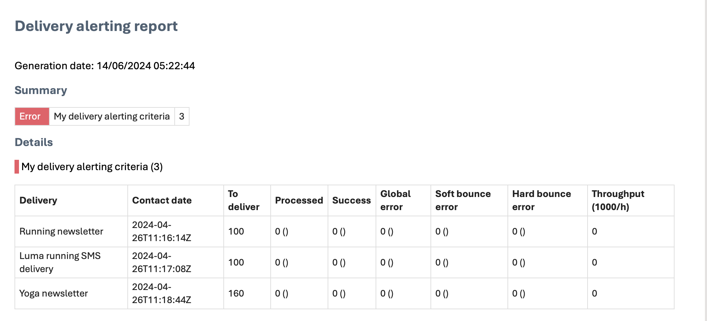

# 開始使用傳遞警報 {#gs-delivery-alerting}

傳送警報是警報管理系統，可讓使用者群組自動接收電子郵件通知，其中包含其傳送執行的資訊。 收件者會監控Adobe Campaign所處理的進行中傳遞，並在發生問題時採取適當的行動。

通知是根據透過Adobe Campaign Web使用者介面定義的特定警報條件而自訂。

如需管理傳送失敗的詳細資訊，請參閱[Adobe Campaign v8 （主控台）檔案](https://experienceleague.adobe.com/en/docs/campaign/campaign-v8/send/failures/delivery-failures#send){target="_blank"}。

## 電子郵件通知內容 {#content}

電子郵件通知包括下列小節：

* **摘要**：顯示符合您定義條件的傳遞數目，以及每個條件的標籤和顏色。
* **詳細資料**：列出控制面板的所有已定義傳遞條件，以及每個條件的對應傳遞。

## 設定傳送警報 {#set-up}

若要設定這些警示，Campaign Web使用者介面可讓您建立並管理：

* **傳送警示儀表板**：指定收件者、設定要包含在儀表板中的警示准則，以及存取已傳送警示的歷史記錄。 [瞭解如何使用儀表板](../msg/delivery-alerting-dashboards.md)。
* **傳遞警示條件**： Campaign網頁使用者介面提供預先定義的警示條件，例如低輸送量的傳遞或準備失敗的傳遞。 您可以將這些條件新增到您的儀表板，或建立您自己的條件以符合您的需求。 [瞭解如何使用條件](../msg/delivery-alerting-criteria.md)。

例如，僅通知具有管理許可權的使用者有關傳送失敗的情況，並通知行銷使用者有關具有高軟跳出錯誤率的傳送。 若要完成此操作，請為每個收件者群組建立兩個獨立的控制面板，其中包含適當的條件。

>[!NOTE]
>
>若要存取及設定儀表板和警示條件，您必須擁有&#x200B;**管理許可權**，或是&#x200B;**傳遞主管**&#x200B;安全性群組的成員。 標準使用者無法存取Adobe Campaign介面中的儀表板，但會收到警報通知。 [進一步瞭解存取和許可權](../get-started/permissions.md)。