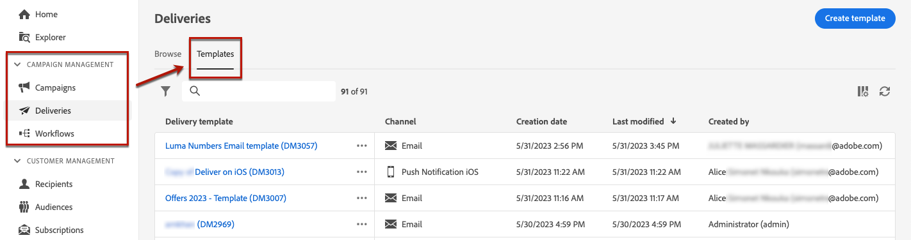
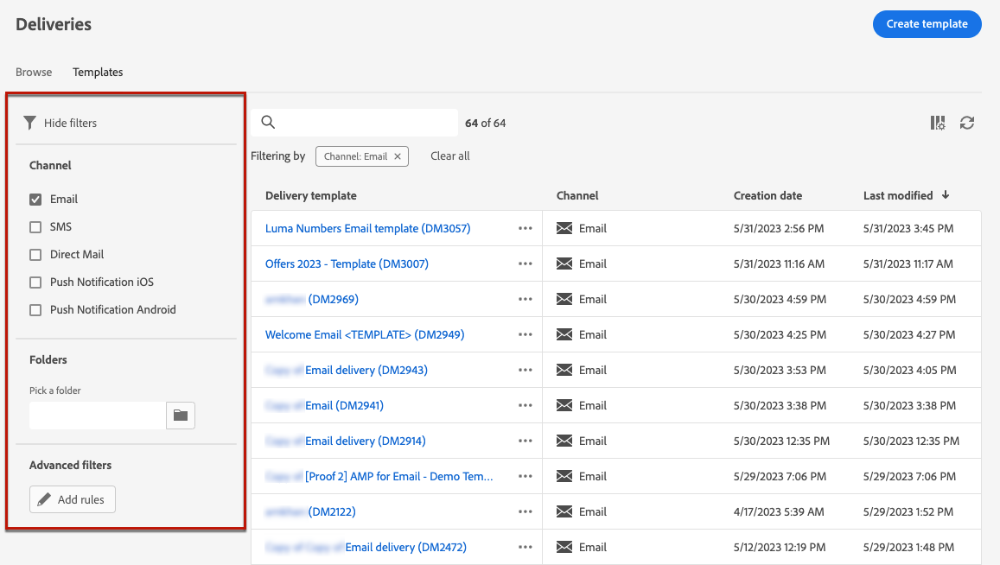
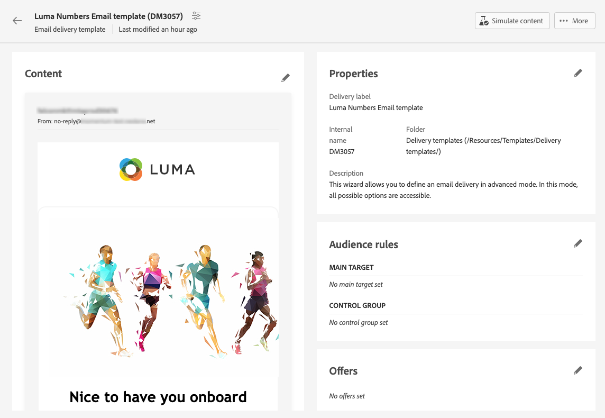
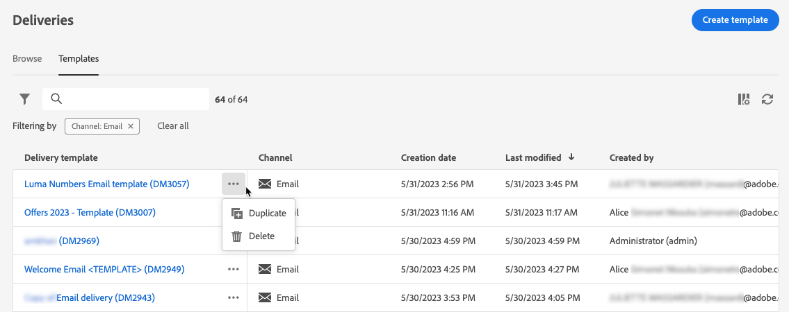
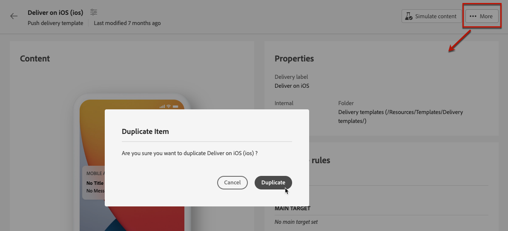
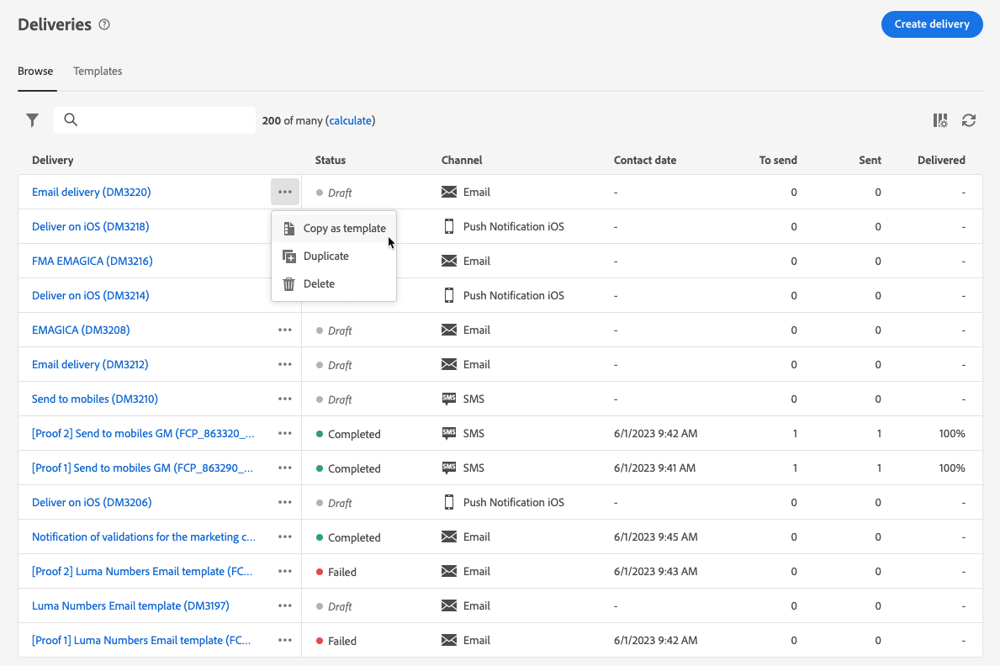
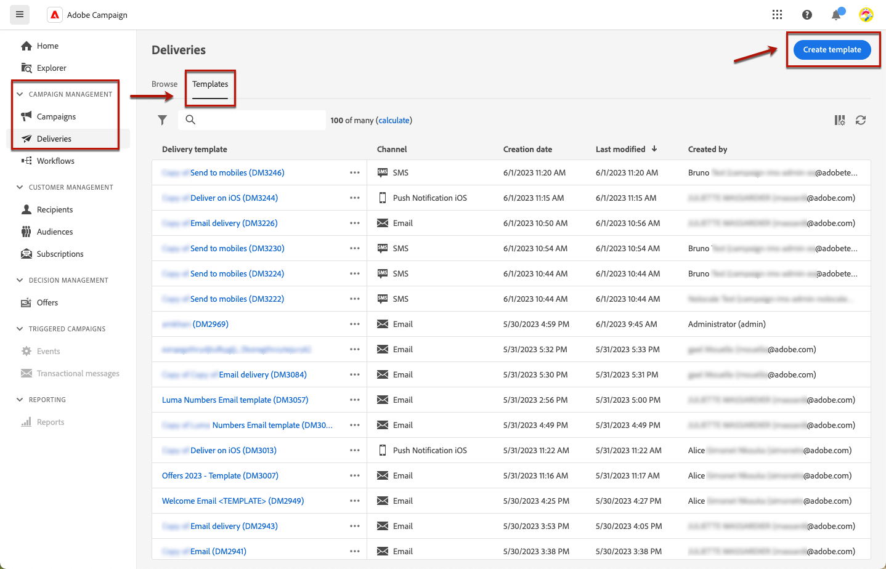
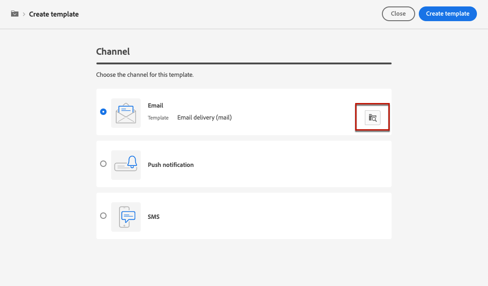
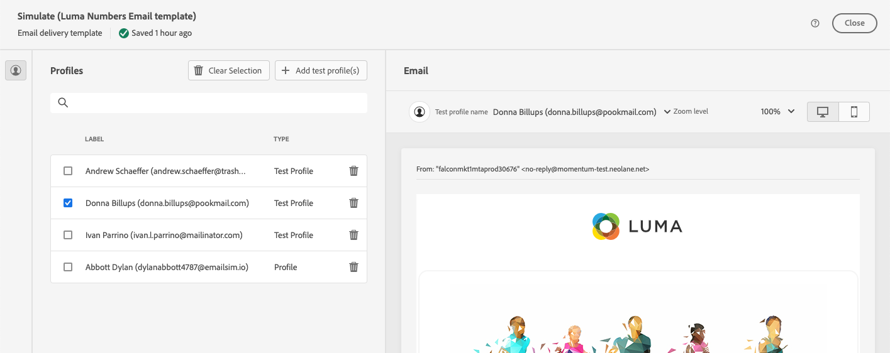

# 使用傳遞範本 {#work-with-delivery-templates}

>[!CONTEXTUALHELP]
>id="acw_delivery_template_for_campaign"
>title="傳遞範本"
>abstract="為了加速和改善設計流程，您可以建立傳遞範本並在多個行銷活動中輕鬆重複使用自訂內容和設定。這項功能可以將創意外觀和風格標準化，以更快速地執行和啟動行銷活動"

為了加速和改善設計流程，您可以建立傳遞範本並在多個行銷活動中輕鬆重複使用自訂內容和設定。這項功能可以將創意外觀和風格標準化，以更快速地執行和啟動行銷活動

範本可能包括：

* 此 **資料夾** 和 **執行資料夾** 範本的。 資料夾是儲存傳遞範本的位置。 執行資料夾是儲存根據此範本建立的傳遞的資料夾。
* [型別](../advanced-settings/delivery-settings.md#typology)，
* 寄件者地址，
* 一個 [對象](../audience/about-recipients.md)，包括 [控制組](../audience/control-group.md)，
* 自訂 [內容](../email/edit-content.md)，
* [個人化欄位](../personalization/personalize.md) 和 [條件式內容](../personalization/conditions.md)，
* 連結至 [映象頁面](../email/mirror-page.md) 和取消訂閱 [連結](../email/message-tracking.md)，
* 其他傳遞屬性，例如資源有效性、重試參數或隔離設定。

>[!NOTE]
>
>傳遞範本與不同 [內容範本](../email/create-email-templates.md)，可讓您僅重複使用電子郵件的內容，並開始以提供的現成可用範例電子郵件範本之一建立內容。

## 存取並管理傳遞範本 {#access-manage-templates}

>[!CONTEXTUALHELP]
>id="acw_delivery_templates"
>title="使用傳遞範本"
>abstract="使用傳遞範本建立並儲存傳遞設定，以供將來在您的行銷活動中使用。您可以從頭開始建立傳遞範本、複製現有範本或將傳遞轉換為範本。"

若要存取內容範本清單，請選取 **[!UICONTROL Campaign Management]** > **[!UICONTROL 傳遞]** 從左側功能表，並瀏覽至 **範本** 標籤。

所有符合以下條件的範本： [已建立](#create-a-delivery-template) 隨即顯示。

您可以在頻道和資料夾上篩選內容範本。 您也可以使用傳遞屬性建置規則，以設定進階篩選器。 [進一步瞭解規則產生器](../audience/../query/query-modeler-overview.md)

若要編輯範本，請從清單中按一下所需的專案。 從那裡：

* 您可以修改其內容、屬性、對象及附加至該對象的任何選件。
* 您也可以測試範本。 [了解更多](#test-template)

若要刪除或 [重複](#copy-an-existing-template) 範本，從範本中選取對應的動作 **[!UICONTROL 更多動作]** 功能表，從 **[!UICONTROL 範本]** 清單或範本版本畫面。

>[!NOTE]
>
>編輯或刪除範本時，使用此範本建立的傳遞不受影響。

## 建立傳遞範本 {#create-a-delivery-template}

若要建立傳遞範本，您可以：

* 複製現有範本 —  [瞭解更多](#copy-an-existing-template)
* 將現有傳遞轉換為範本 —  [瞭解更多](#convert-an-existing-delivery)
* 從頭開始建立傳遞範本 —  [瞭解更多](#create-a-new-template)

### 複製現有的傳遞範本 {#copy-an-existing-template}

Campaign為每個頻道提供一組內建範本：電子郵件、推播、簡訊。 建立傳遞範本最簡單的方法是複製和自訂內建範本。

>[!NOTE]
>
>您也可以複製任何自訂範本。

若要複製傳遞範本，請依照以下步驟進行：

1. 瀏覽至 **範本** 標籤，從 **傳遞** 左側功能表。 [了解更多](#access-manage-templates)
1. 按一下 **[!UICONTROL 更多動作]** 按鈕，然後選取「 」  **[!UICONTROL 複製]**.

   您也可以從清單中選取範本，然後從範本版本畫面中選取此選項。

1. 確認複製。

   

1. 新範本控制面板會在中央畫面中開啟。 視需要編輯範本設定。

   

1. 按一下 **[!UICONTROL 檢閱]** 按鈕以儲存並檢閱您的範本。 您仍然可以編輯其所有設定、刪除及複製它。

   

1. 視需要測試範本呈現。 [了解更多](#test-template)

新範本將新增至 [**範本** 清單](#access-manage-templates). 您現在建立新傳遞時即可以選取該範本。

### 將傳遞轉換為範本 {#convert-an-existing-delivery}

任何傳遞都可以轉換為範本，以供日後重複傳遞動作使用。

若要將傳送儲存為範本，請遵循下列步驟：

1. 瀏覽至 **[!UICONTROL 行銷活動管理]** > **[!UICONTROL 傳遞]** 功能表。
1. 從 **[!UICONTROL 瀏覽]** 索引標籤，按一下 **[!UICONTROL 更多動作]** 按鈕，然後選取「 」 **[!UICONTROL 復製為範本]**.

   

1. 確認複製。

1. 新範本控制面板會在中央畫面中開啟。 視需要編輯範本設定。

1. 按一下 **[!UICONTROL 檢閱]** 按鈕以儲存並檢閱您的範本。 您仍然可以編輯其所有設定、刪除及複製它。

1. 視需要測試範本呈現。 [了解更多](#test-template)

新範本將新增至 [**範本** 清單](#access-manage-templates). 您現在建立新傳遞時即可以選取該範本。

### 建立新的傳遞範本 {#create-a-new-template}

>[!NOTE]
>
>為避免發生設定錯誤，Adobe 建議您[複製內建範本](#copy-an-existing-template)並自訂其屬性，而不是建立新範本。

若要從頭設定傳遞範本，請依照以下步驟進行：

1. 瀏覽至 **範本** 標籤，從 **傳遞** 左側功能表。 [了解更多](#access-manage-templates)
1. 按一下 **[!UICONTROL 建立範本]** 按鈕。

   

1. 選取您要用於範本的管道。
1. 預設會使用該管道的內建傳遞範本，協助您建立自己的範本。 使用所選管道右側的專用按鈕，根據需要選擇另一個範本。

   

1. 按一下 **[!UICONTROL 建立範本]** 按鈕來重新命名。

1. 定義範本屬性， [對象](../audience/add-audience.md) 和內容（視選取的管道而定）。

   >[!NOTE]
   >
   >請在下列章節中進一步瞭解傳遞管道以及如何設計個別內容：
   >
   > * [電子郵件通道](../email/create-email.md)
   > * [推播通知頻道](../push/gs-push.md)
   > * [簡訊頻道](../sms/create-sms.md)

1. 此外，對於電子郵件範本，進階設定（例如型別規則和目標對應）可透過以下方式存取： **[!UICONTROL 設定]** 按鈕的位置。 [了解更多](../advanced-settings/delivery-settings.md)

1. 按一下 **[!UICONTROL 檢閱]** 按鈕以儲存並檢閱您的範本。 您仍然可以編輯其所有設定、刪除及複製它。

1. 視需要測試範本呈現。 [了解更多](#test-template)

新範本將新增至 [**範本** 清單](#access-manage-templates). 您現在建立新傳遞時即可以選取該範本。

## 測試傳遞範本 {#test-template}

您可以測試任何傳遞範本的轉譯，不論是從草稿建立還是從現有內容建立。 請依照下列步驟以執行此操作。

1. 瀏覽至 **範本** 跳過 **[!UICONTROL 行銷活動管理]** > **[!UICONTROL 傳遞]** 選單並選取任何範本。 [了解更多](#access-manage-templates)

1. 按一下 **[!UICONTROL 模擬內容]** 按鈕。

   

1. 選取一或多個測試設定檔，以檢查您的電子郵件呈現。 您也可以從資料庫中選取真正的設定檔。

1. 在不同的設定檔之間切換，以根據選取的設定檔取得訊息的個人化表示。

   <!--[Learn more on test profiles](../preview-test/test-deliveries.md#recipients)-->

   您也可以調整縮放等級，並選擇案頭或行動檢視。

   

1. 關閉視窗以返回範本版本畫面。

>[!NOTE]
>
>您無法在傳遞範本中使用電子郵件呈現或傳送測試。

* [進一步瞭解預覽電子郵件內容](../preview-test/preview-content.md)

* [進一步瞭解預覽簡訊內容](../sms/content-sms.md)

* [進一步瞭解預覽推播內容](../push/gs-push.md)
