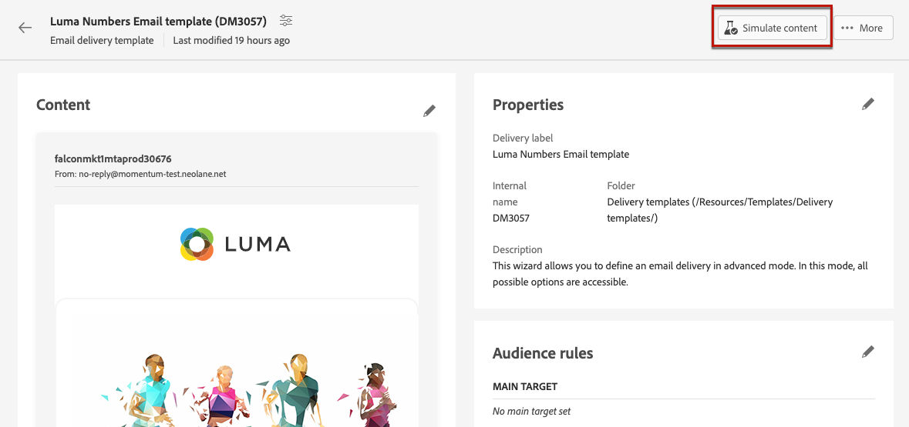

# 使用傳遞範本 {#work-with-delivery-templates}

>[!CONTEXTUALHELP]
>id="acw_delivery_template_for_campaign"
>title="傳遞範本"
>abstract="若要加速和改善設計流程，建立傳遞範本以便在各個行銷活動中重複使用自訂內容和設定。此功能將創意外觀標準化，能夠更快地執行和啟動行銷活動。"

若要加速和改善設計流程，建立傳遞範本以便在各個行銷活動中重複使用自訂內容和設定。此功能將創意外觀標準化，能夠更快地執行和啟動行銷活動。

範本包括：

* 範本的&#x200B;**資料夾**&#x200B;和&#x200B;**執行資料夾**。 資料夾是儲存傳遞範本的位置。 執行資料夾是儲存根據此範本建立的傳遞的資料夾。
* [型別](../advanced-settings/delivery-settings.md#typology)，
* 寄件者地址，
* [對象](../audience/about-recipients.md)，包括[控制組](../audience/control-group.md)，
* 自訂[內容](../email/edit-content.md)，
* [個人化欄位](../personalization/personalize.md)和[條件式內容](../personalization/conditions.md)，
* 連結至[映象頁面](../email/mirror-page.md)和取消訂閱[連結](../email/message-tracking.md)，
* 其他傳遞屬性，例如資源有效性、重試參數或隔離設定。

>[!NOTE]
>
>傳遞範本與[內容範本](../email/create-email-templates.md)不同，後者可讓您僅重複使用電子郵件內容，並開始使用其中一個現成的範例電子郵件範本建立內容。

## 存取並管理傳遞範本 {#access-manage-templates}

>[!CONTEXTUALHELP]
>id="acw_delivery_templates"
>title="使用傳遞範本"
>abstract="使用傳遞範本建立並儲存傳遞設定，以供將來在您的行銷活動中使用。從頭開始建立傳遞範本、複製現有範本或將傳遞轉換為範本。"

若要存取內容範本清單，請從左側功能表選取&#x200B;**[!UICONTROL 行銷活動管理]** > **[!UICONTROL 傳遞]**，然後瀏覽至&#x200B;**範本**&#x200B;索引標籤。

![傳遞功能表中的[範本]索引標籤](assets/templates-tab.png){zoomable="yes"}

目前環境中建立的所有範本都會顯示出來。

您可以依管道和資料夾篩選內容範本。 您也可以使用傳遞屬性建置規則，以設定進階篩選器。 [進一步瞭解查詢模型工具](../audience/../query/query-modeler-overview.md)

{zoomable="yes"}

若要編輯範本，請從清單中按一下所需的專案。 從那裡：

* 修改其內容、屬性、對象及附加至該選件的任何選件。
* 測試您的範本。 [了解更多](#test-template)

{zoomable="yes"}

若要刪除或[複製](#copy-an-existing-template)範本，請從&#x200B;**[!UICONTROL 更多動作]**&#x200B;功能表（從&#x200B;**[!UICONTROL 範本]**&#x200B;清單或範本版本畫面中）選取對應的動作。

範本的{zoomable="yes"}

>[!NOTE]
>
>編輯或刪除範本時，使用此範本建立的傳遞不受影響。

## 建立傳遞範本 {#create-a-delivery-template}

若要建立傳遞範本，您可以：

* 複製現有的範本 — [深入瞭解](#copy-an-existing-template)
* 將現有的傳遞轉換為範本 — [深入瞭解](#convert-an-existing-delivery)
* 從頭開始建立傳遞範本 — [深入瞭解](#create-a-new-template)

### 複製現有的傳遞範本 {#copy-an-existing-template}

Campaign包含每個管道的內建範本：電子郵件、推播和簡訊。 建立傳遞範本最簡單的方法是複製和自訂內建範本。

>[!NOTE]
>
>您也可以複製任何自訂範本。

若要複製傳遞範本，請遵循下列步驟：

1. 從左側&#x200B;**傳送**&#x200B;功能表瀏覽至&#x200B;**範本**&#x200B;索引標籤。 [了解更多](#access-manage-templates)
1. 按一下所需範本名稱右側的&#x200B;**[!UICONTROL 更多動作]**&#x200B;按鈕，然後選取&#x200B;**[!UICONTROL 複製]**。

   您也可以從清單中選取範本，然後從範本版本畫面中選擇此選項。

1. 確認複製。

   {zoomable="yes"}

1. 新範本控制面板會在中央畫面中開啟。 視需要編輯範本設定。

   {zoomable="yes"}

1. 按一下&#x200B;**[!UICONTROL 檢閱]**&#x200B;按鈕以儲存並檢閱您的範本。 您仍然可以編輯其所有設定、刪除及複製它。

   {zoomable="yes"}

1. 視需要測試範本呈現。 [了解更多](#test-template)

新範本已新增至&#x200B;[**範本**&#x200B;清單](#access-manage-templates)。 您現在建立新傳遞時即可以選取該範本。

### 將傳遞轉換為範本 {#convert-an-existing-delivery}

任何傳遞都可以轉換為範本，以供日後重複傳遞動作使用。

若要將傳送儲存為範本，請執行下列步驟：

1. 瀏覽至&#x200B;**[!UICONTROL 行銷活動管理]** > **[!UICONTROL 傳遞]**&#x200B;功能表。
1. 從&#x200B;**[!UICONTROL 瀏覽]**&#x200B;索引標籤中，按一下所要傳遞名稱右側的&#x200B;**[!UICONTROL 更多動作]**&#x200B;按鈕，然後選取&#x200B;**[!UICONTROL 復製為範本]**。

   {zoomable="yes"}

   您也可以從清單中選取範本，然後從範本版本畫面中選擇此選項。

1. 確認複製。

1. 新範本控制面板會在中央畫面中開啟。 視需要編輯範本設定。

1. 按一下&#x200B;**[!UICONTROL 檢閱]**&#x200B;按鈕以儲存並檢閱您的範本。 您仍然可以編輯其所有設定、刪除及複製它。

1. 視需要測試範本呈現。 [了解更多](#test-template)

新範本已新增至&#x200B;[**範本**&#x200B;清單](#access-manage-templates)。 您現在建立新傳遞時即可以選取該範本。

### 建立新的傳遞範本 {#create-a-new-template}

>[!NOTE]
>
>為避免設定錯誤，Adobe建議[複製內建範本](#copy-an-existing-template)並自訂其屬性，而非建立新範本。

若要從頭開始設定傳送範本，請遵循下列步驟：

1. 從左側&#x200B;**傳送**&#x200B;功能表瀏覽至&#x200B;**範本**&#x200B;索引標籤。 [了解更多](#access-manage-templates)
1. 按一下&#x200B;**[!UICONTROL 建立範本]**&#x200B;按鈕。

   {zoomable="yes"}

1. 選取您要用於範本的管道。
1. 預設會使用該管道的內建傳遞範本，協助您建立自己的範本。 使用所選管道右側的專用按鈕，根據需要選擇另一個範本。

   新範本的{zoomable="yes"}

1. 再次按一下&#x200B;**[!UICONTROL 建立範本]**&#x200B;按鈕。

1. 根據選取的管道定義範本屬性、[對象](../audience/add-audience.md)和內容。

   >[!NOTE]
   >
   >請在下列章節中進一步瞭解傳遞管道以及如何設計個別內容：
   >
   > * [電子郵件通道](../email/create-email.md)
   > * [推播通知頻道](../push/gs-push.md)
   > * [簡訊頻道](../sms/create-sms.md)

1. 此外，對於電子郵件範本，進階設定（例如型別規則和目標對應）可透過畫面右上方的&#x200B;**[!UICONTROL 設定]**&#x200B;按鈕進行存取。 [了解更多](../advanced-settings/delivery-settings.md)

1. 按一下&#x200B;**[!UICONTROL 檢閱]**&#x200B;按鈕以儲存並檢閱您的範本。 您仍然可以編輯其所有設定、刪除及複製它。

1. 視需要測試範本呈現。 [了解更多](#test-template)

新範本已新增至&#x200B;[**範本**&#x200B;清單](#access-manage-templates)。 您現在建立新傳遞時即可以選取該範本。

## 測試傳遞範本 {#test-template}

您可以測試任何傳遞範本的轉譯，不論是從草稿建立還是從現有內容建立。 若要這麼做，請依照以下步驟進行：

1. 透過&#x200B;**[!UICONTROL 行銷活動管理]** > **[!UICONTROL 傳送]**&#x200B;功能表瀏覽至&#x200B;**範本**&#x200B;索引標籤，並選取任何範本。 [了解更多](#access-manage-templates)

1. 按一下熒幕右上角的&#x200B;**[!UICONTROL 模擬內容]**&#x200B;按鈕。

   {zoomable="yes"}

1. 選取一或多個測試設定檔，以檢查您的電子郵件呈現。 您也可以從資料庫中選取真正的設定檔。 [進一步瞭解測試設定檔](../audience/test-profiles.md)

1. 在不同的設定檔之間切換，以根據選取的設定檔取得訊息的個人化表示。 您也可以調整縮放等級，並選擇案頭或行動檢視。

[深入瞭解預覽內容](../preview-test/preview-content.md)

   {zoomable="yes"}

1. 關閉視窗以返回範本版本畫面。

>[!NOTE]
>
>您無法在傳遞範本中使用電子郵件呈現或傳送校樣。