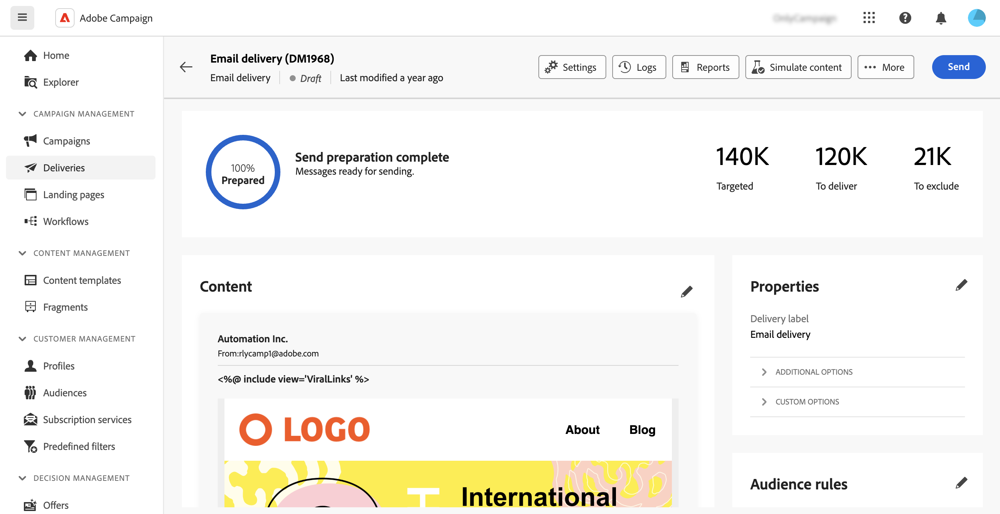
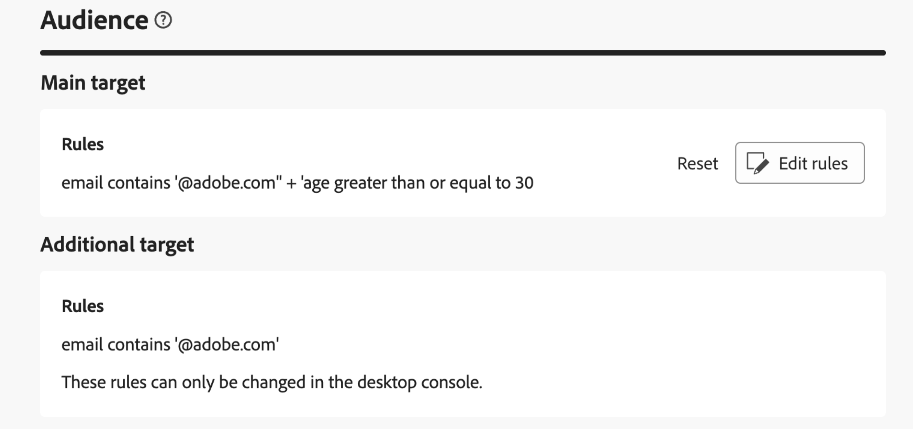

# 存取傳遞內容 {#work-with-deliveries}

>[!CONTEXTUALHELP]
>id="acw_deliveries_list"
>title="傳遞"
>abstract="傳送是指透過特定通道傳送給閱聽眾的通訊：電子郵件、簡訊或推播。 您可以在此畫面中編輯、複製和刪除現有的傳遞。您也可以檢視已完成傳遞的報告。按一下「**建立傳遞**」按鈕，即可新增傳遞。"

## 存取傳遞內容 {#access}

>[!CONTEXTUALHELP]
>id="acw_deliveries_additional_target"
>title="其他目標"
>abstract="這些規則只能在用戶端主控台變更。"

可從左側導覽的&#x200B;**[!UICONTROL 傳遞]**&#x200B;功能表存取傳遞。 從使用者端主控台或Web使用者介面建立的所有傳遞都會出現在此清單中。 您可以從此畫面監控所有現有傳送、複製或刪除傳送，或建立新傳送。

若要開啟傳遞，請從清單中按一下其名稱。 傳送隨即開啟，可讓您執行各種動作，例如編輯其引數、檢查其執行或使用專用報告監控其效能。

>[!NOTE]
>
>如果您開啟在使用者端主控台中建立的傳遞，可能會針對對象顯示&#x200B;**[!UICONTROL 其他目標]**&#x200B;區段。 這表示已為此傳遞設定多個目標。 這些引數只能在主控台中修改。
>
>{zoomable="yes"}

## 複製傳遞 {#delivery-duplicate}

您可以從傳遞清單或傳遞儀表板建立現有傳遞的副本。

若要從傳遞清單複製傳遞，請依照以下步驟進行：

1. 按一下要複製的傳遞名稱右側的三個點按鈕。
1. 選取「**[!UICONTROL 複製]**」。
1. 確認複製。 新的傳送控制面板會在中央畫面中開啟。

若要從儀表板複製傳遞，請依照以下步驟進行：

1. 開啟傳遞，然後按一下畫面頂端的&#x200B;**[!UICONTROL ...更多]**&#x200B;按鈕。
1. 選取「**[!UICONTROL 複製]**」。
1. 確認複製。 新傳送會取代中央畫面中的目前傳送。

## 刪除傳遞 {#delivery-delete}

傳遞會從傳遞清單中刪除，無論是從左側邊欄中的主要傳遞專案還是從行銷活動的傳遞清單中刪除。

若要從傳遞清單刪除傳遞，請依照以下步驟進行：

1. 按一下要刪除之傳送名稱旁的右側的三個點按鈕。
1. 選取 **[!UICONTROL Delete]**。
1. 確認刪除。

所有傳遞都可在這些清單中找到，但無法從那裡刪除在工作流程中建立的傳遞。若要刪除在工作流程內容中建立的傳遞，請從工作流程中刪除傳遞活動。

若要從工作流程中刪除傳遞，請依照以下步驟進行：

1. 選取傳送活動。
1. 按一下右側面板上的&#x200B;**[!UICONTROL 刪除]**&#x200B;圖示。
1. 確認刪除。如果傳送有子節點，請一併刪除或保留。

