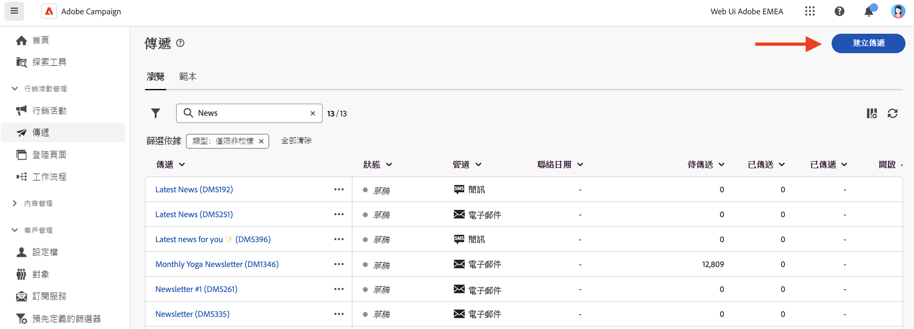
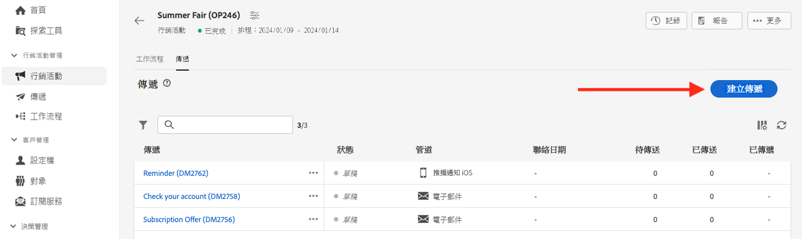
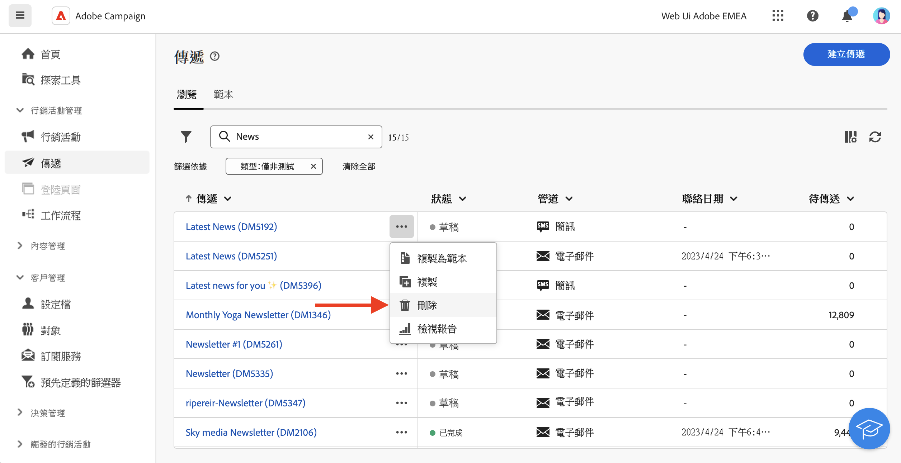

# 開始使用訊息{#gs-messages}

>[!CONTEXTUALHELP]
>id="acw_deliveries_list"
>title="傳遞"
>abstract="瀏覽您的傳遞清單。您可以檢視其狀態、聯絡和修改日期、關鍵 KPI。您可以依狀態、聯絡日期或管道篩選清單。按一下「建立傳遞」按鈕，即可新增傳遞。選取傳遞，檢視其內容、對象和詳細資料。"

透過 Adobe Campaign，您可以傳送跨管道行銷活動，包括電子郵件、簡訊、LINE 訊息、推播通知，並使用各種專屬報告來評估行銷效益。 

這些訊息會透過傳遞進行設計和傳送，並可針對每位收件者進行個人化。這些傳遞可以是獨立的，也可以納入行銷活動的內容中。

Adobe Campaign v8 提供下列傳遞管道： 電子郵件、簡訊和行動應用程式。

<table style="table-layout:fixed">
    <tr style="border: 0;">
    <td>
    
    
<a href="../email/create-email.md"><strong>建立電子郵件</strong>
    

    

    </td>
    <td>
    
    

    <a href="../push/gs-push.md"><strong>建立推播通知</strong></a>
    

    

    </td>
    <td>
    
    

    <a href="../sms/create-sms.md"><strong>建立簡訊</strong></a>
    

    

    </td>
    </tr>
    </table>

## 建立傳遞 {#create-delivery}

您可以從左側功能表的「**[!UICONTROL 傳遞]**」建立獨立的傳遞，或是從左側功能表的「**[!UICONTROL 行銷活動]**」在行銷活動的內容中建立傳遞。

瀏覽下面的標籤以了解如何建立傳遞：

>[!BEGINTABS]

>[!TAB 建立獨立傳遞]

若要建立獨立傳遞，請依照以下步驟進行：

1. 瀏覽至左側導覽上的「**[!UICONTROL 傳遞]**」選單，然後按一下「**[!UICONTROL 建立傳遞]**」按鈕。

   

1. 選擇要用於傳遞的管道。若要了解傳遞管道以及如何定義傳遞內容的詳細資訊，請參閱以下章節：

   * [電子郵件管道](../email/create-email.md)
   * [推播通知管道](../push/gs-push.md)
   * [簡訊管道](../sms/create-sms.md)

1. 定義主要目標和控制組的傳遞對象。若要了解對象的詳細資訊，請參閱[本章節](../audience/about-audiences.md)。
1. 定義訊息內容。
1. (選擇性) 定義傳遞排程。如果未定義排程，在按一下「**[!UICONTROL 傳送]**」按鈕後，訊息會立即傳送。
1. 按一下「**[!UICONTROL 檢閱並傳送]**」按鈕，以檢查您的設定。
1. 使用「**[!UICONTROL 模擬內容]**」按鈕，以測試您的傳遞和個性化設定。若要了解訊息模擬的詳細資訊，請參閱[本章節](../preview-test/preview-test.md)。
1. 按一下「**[!UICONTROL 準備]**」按鈕，以計算目標母體並產生訊息。準備步驟可能需要幾分鐘的時間才能完成。準備完成後，訊息即可用於傳送。萬一出現錯誤，請瀏覽到「**記錄檔**」，檢查警示和警告。
1. 檢查結果，然後按一下「**[!UICONTROL 傳送]**」按鈕，開始傳送訊息。
1. 傳送訊息後，請瀏覽到「**報告**」章節，以存取關鍵量度。若要了解傳遞報告的詳細資訊，請參閱[本章節](../reporting/delivery-reports.md)。

>[!TAB 在行銷活動中建立傳遞。]

若要在行銷活動中建立傳遞，請依照以下步驟進行：

1. 建立一個行銷活動或開啟一個現有的行銷活動。了解[行銷活動](../campaigns/gs-campaigns.md)的詳細資訊。
1. 建立一個工作流程或開啟一個現有的工作流程。
1. 新增並設定&#x200B;**[!UICONTROL 建置對象]**&#x200B;活動，然後按一下`+`按鈕。

   

   如需此&#x200B;**[!UICONTROL 建置對象]**&#x200B;活動的詳細資訊，請參閱[本章節](../workflows/activities/build-audience.md)。

1. 選取傳遞活動：**[!UICONTROL 電子郵件]**、**[!UICONTROL 簡訊]**、**[!UICONTROL 推播通知 (Android)]** 或&#x200B;**[!UICONTROL 推播通知 (iOS)]**。若要了解工作流程中的傳遞管道活動以及如何定義傳遞內容的詳細資訊，請參閱本[章節](../workflows/activities/about-activities.md#channel)。
1. 啟動工作流程，並檢查記錄檔。

您還可以在不建立工作流程的情況下在行銷活動中新增傳遞。若要這麼做，請瀏覽到行銷活動的「**[!UICONTROL 傳遞]**」標籤，然後按一下「**[!UICONTROL 建立傳遞]**」按鈕。

設定步驟和獨立傳遞類似。

如需有關如何設定行銷活動以及管理屬於行銷活動的傳遞的詳細資訊，請參閱[本章節](../campaigns/gs-campaigns.md)。

>[!ENDTABS]

## 新增個人化{#personalization}

Adobe Campaign 傳送的資訊可以透過多種方式實現個人化。[了解個人化功能的詳細資訊](../personalization/gs-personalization.md)。

使用 Campaign 建立動態內容並傳送個人化訊息。可合併個人化功能以改善您的訊息並建立自訂的使用者體驗。

您可以透過以下方式個人化訊息內容：

* 插入動態&#x200B;**個人化欄位**

  個人化欄位用於訊息的第一層個人化。您可以從個人化編輯器選取資料庫中的任何欄位。對於傳遞，您可以選取與收件者、訊息或傳遞相關的任何欄位。可將這些個人化屬性插入訊息的主旨行或內文中。[了解更多](../personalization/personalize.md)

* 插入預先定義的&#x200B;**內容區塊**

  Campaign 會隨附一組個人化區塊，其中包含您可以插入到傳遞中的特定呈現。例如，您可以新增標誌、問候訊息或訊息鏡像頁面的連結。內容區塊可從個人化編輯器的專屬項目取得。[了解更多](../personalization/personalize.md#ootb-content-blocks)

* 建立&#x200B;**條件式內容**

  例如，設定條件式內容以根據收件者的設定檔新增動態個人化。特定條件為真時，即可插入文字區塊及/或影像。[了解更多](../personalization/conditions.md)

* 新增&#x200B;**個人化優惠方案**

  可根據收件者位置、目前的天氣或上次的採購訂單，在您的訊息內容中插入個人化優惠方案。

## 預覽和測試您的傳遞 

定義訊息內容後，即可進行預覽以控制訊息的呈現，並使用測試設定檔檢查個人化設定。[了解更多](../preview-test/preview-test.md)

## 監視和追蹤記錄{#gs-tracking-logs}

傳送傳遞後進行監視是確保行銷活動效率並和客戶保持聯繫的關鍵步驟。 

您可以在傳送傳遞後進行監視，並了解如何管理傳遞失敗和隔離。

若要了解監視和追蹤功能的詳細資訊，請參閱[本章節](../reporting/gs-reports.md)。

## 複製傳遞 {#delivery-duplicate}

您可以從傳遞清單或傳遞儀表板建立現有傳遞的副本。

若要從傳遞清單複製傳遞，請依照以下步驟進行：

1. 按一下要複製的傳遞名稱右側的三個點按鈕。
1. 選取「**[!UICONTROL 複製]**」。
1. 確認複製：新的傳遞儀表板隨即在畫面中央開啟。

若要從儀表板複製傳遞，請依照以下步驟進行：

1. 開啟傳遞並在螢幕頂端區段按一下「**[!UICONTROL ...更多]**」按鈕。
1. 選取「**[!UICONTROL 複製]**」。
1. 確認複製：新的傳遞會隨即取代畫面中央的現有傳遞。

## 刪除傳遞 {#delivery-delete}

從傳遞清單中刪除傳遞 - 可從左側邊欄中的主要傳遞項目或從行銷活動的傳遞清單中刪除。

若要從傳遞清單刪除傳遞，請依照以下步驟進行：

1. 按一下要複製的傳遞名稱右側的三個點按鈕。
1. 選取「**[!UICONTROL 刪除]**」。
1. 確認刪除。

所有傳遞都可在這些清單中找到，但無法從那裡刪除在工作流程中建立的傳遞。若要刪除在工作流程中建立的傳遞，您必須從工作流程中刪除該傳遞活動。

若要從工作流程中刪除傳遞，請依照以下步驟進行：

1. 選取傳遞活動。
1. 按一下右側面板上的&#x200B;**[!UICONTROL 刪除]**&#x200B;圖示。
1. 確認刪除。如果該傳遞有子節點，您也可以選擇將子節點刪除或保留。

