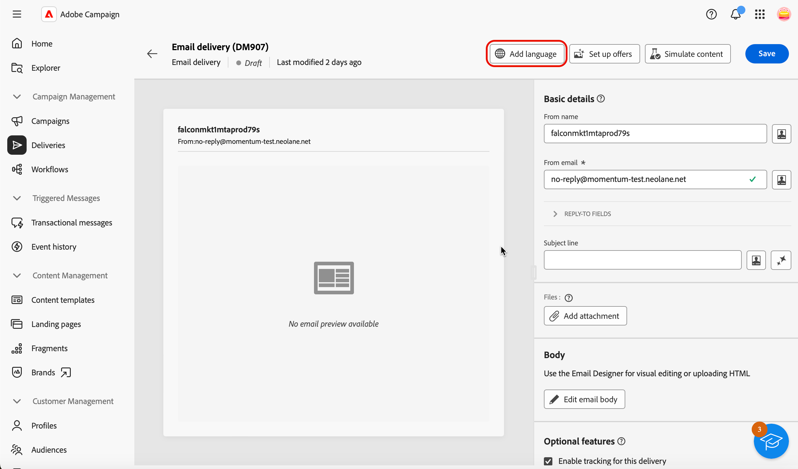
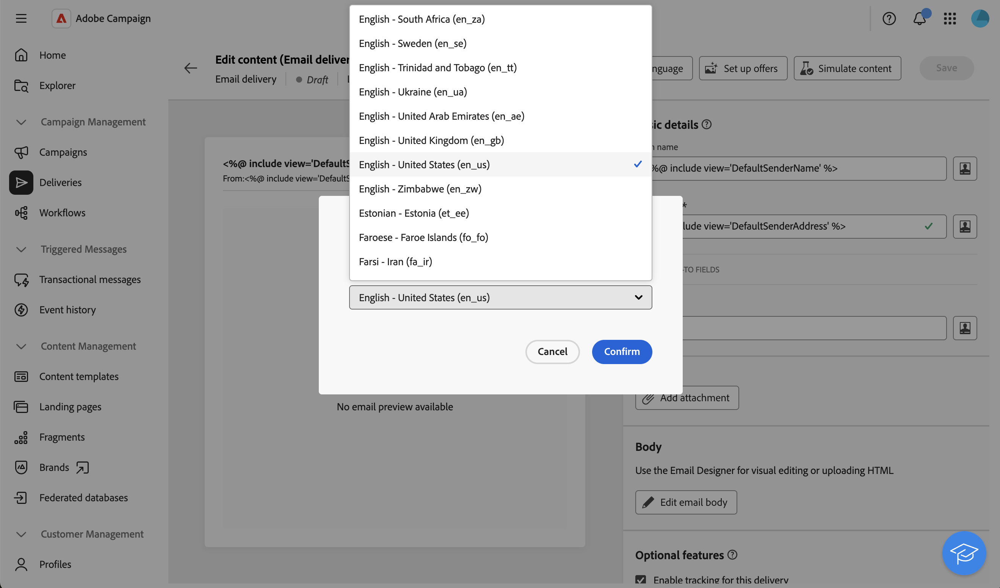
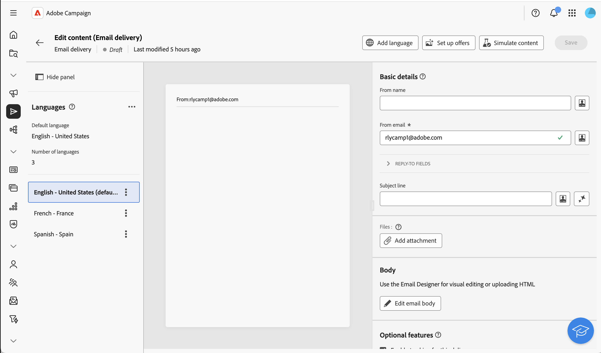
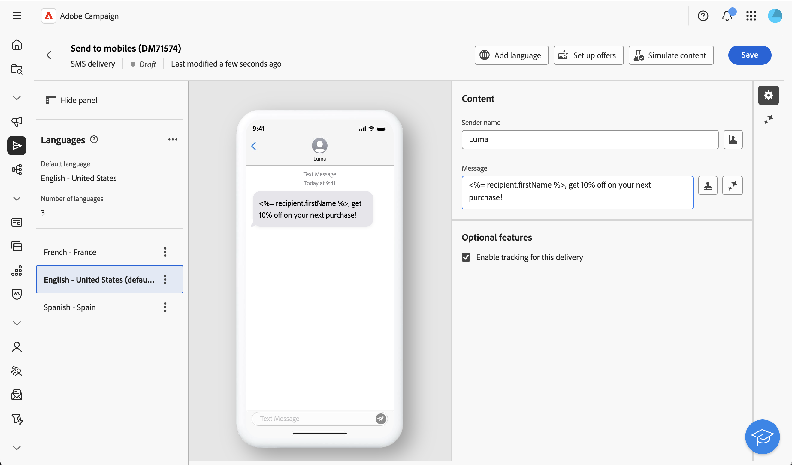
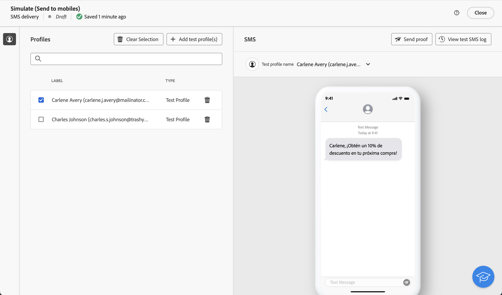
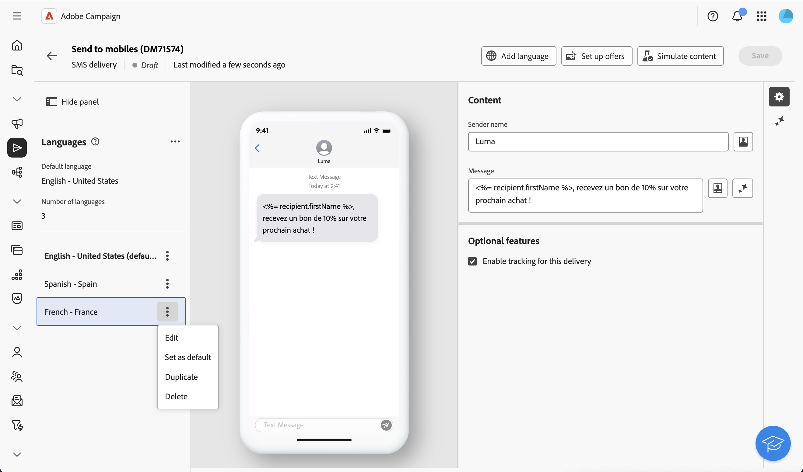
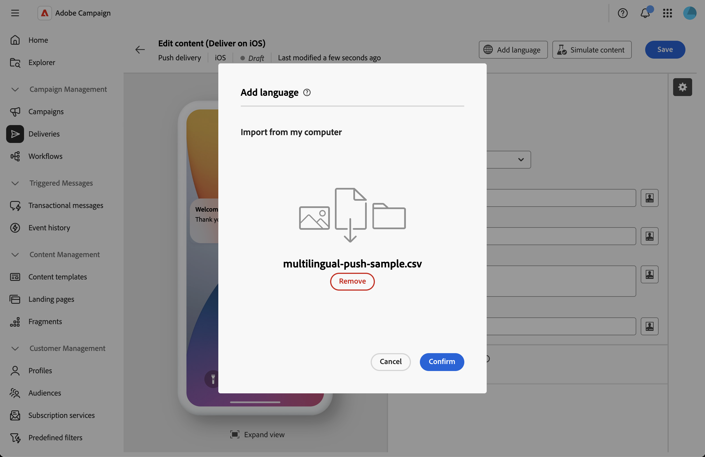
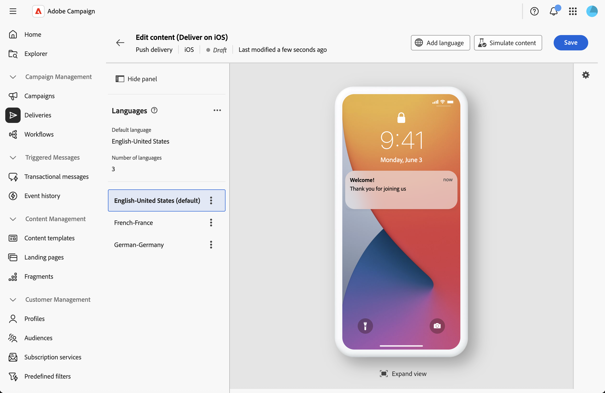

# 設定多語言傳遞 {#multilingual-delivery}

>[!CONTEXTUALHELP]
>id="acw_homepage_welcome_rn1"
>title="多語言傳遞"
>abstract="您現在可以在Campaign網頁UI中以多種語言傳送訊息。 針對推播通知，請上傳CSV檔案來填入所有語言變體。"
>additional-url="https://experienceleague.adobe.com/docs/campaign-web/v8/release-notes/release-notes.html?lang=zh-hant" text="請參閱發行說明"

>[!CONTEXTUALHELP]
>id="acw_deliveries_email_multilingual"
>title="新增語言"
>abstract="在此索引標籤中，您將找到要用來傳遞內容的語言清單。您可以按一下「新增語言」按鈕，或透過此索引標籤複製其他語言來新增更多語言。"

>[!CONTEXTUALHELP]
>id="acw_multilingual_file_upload"
>title="匯入語言變體"
>abstract="使用此對話方塊可透過匯入CSV檔案來新增語言變體。 檔案會自動填入所選語言的所有可用欄位。 您可以拖放檔案，或在確認之前從電腦中選擇檔案。"

在Campaign Web UI中，您可以將傳送設定為多語言，這可讓您根據設定檔的偏好語言傳送訊息。 未定義偏好設定時，訊息會以預設語言傳送。

在多語言傳遞中，語言管理會根據變體。 每個變體代表一種語言。 在建立傳遞期間，您可以新增多種語言變體，以符合訊息中所需語言的數量。 您也可以在新增這些變體後，隨時變更預設語言。

多語言功能目前可用於電子郵件、推播通知、異動訊息和簡訊。

若要設定多語言傳送，請遵循下列主要步驟：

1. 新增語言變體，[瞭解詳情](#add-variant)
1. 定義每個變體的內容，[瞭解詳情](#define-content)
1. 管理語言變體，[瞭解詳情](#manage-variant)

## 新增語言變體{#add-variant}

若要建立語言變體，請依照下列步驟進行：

1. 在傳遞儀表板中，按一下鉛筆圖示以存取傳遞內容版本畫面，然後按一下&#x200B;**[!UICONTROL 新增語言]**。

   >[!IMPORTANT]
   >
   >**[!UICONTROL 新增語言]**&#x200B;按鈕只有在目標維度包含&#x200B;**語言**&#x200B;結構描述時才可用。 若要進一步瞭解結構描述和目標維度，請參閱[詳細檔案](../audience/targeting-dimensions.md)。

   {zoomable="yes"}

1. 從&#x200B;**新增語言**&#x200B;下拉式清單中，選取要新增的語言，然後確認。 對於推播通知，您也可以[上傳CSV檔案](#csv-upload)以一次匯入所有語言變體。

   您新增的第一個語言會自動設定為預設語言，而現有內容會成為預設版本。 新增其他語言時，其內容最初會從預設語言複製。

   {zoomable="yes"}

   >[!NOTE]
   >
   >透過此清單可用的語言取決於&#x200B;**語言**&#x200B;屬性所定義的值（例如：system、user、dbenum等值）。 在此[區段](../administration/enumerations.md)中進一步瞭解列舉管理。

1. 重複此作業以新增其他語言。 左側的&#x200B;**[!UICONTROL 語言]**&#x200B;面板會顯示您已選擇的語言清單、語言數目和預設語言。

   例如，如果您已選擇英文、法文和瑞典文，您可以看到下列3種語言：

   {zoomable="yes"}

   若要瞭解如何管理語言變體，請參閱此[區段](#manage-variant)。

## 定義每個變體的內容{#define-content}

語言設定完成後，請針對每種語言定義傳送內容。

1. 在傳遞內容版本畫面中，從左側的&#x200B;**[!UICONTROL 語言]**&#x200B;面板選取語言。

   {zoomable="yes"}

1. 為此語言定義訊息的內容。 在此[節](../msg/create-deliveries.md)中瞭解更多。

1. 針對每種語言重複此作業。

<!--
>[!BEGINTABS]

>[!TAB Email delivery]

1. From the delivery content edition screen, choose a language and click the **[!UICONTROL Edit email body]** button. You can also hover over the email preview and select **[!UICONTROL Open email designer]**.

    {zoomable="yes"}

1. Define the content of your email for this language. [Read more](../email/get-started-email-designer.md#start-authoring)

1. Repeat this operation for each language.

>[!TAB SMS delivery]

1. From the delivery content edition screen, choose a language.

1. Edit the content of the SMS message for this language. [Read more](../sms/create-sms.md)

    {zoomable="yes"}

1. Repeat this operation for each language.

>[!ENDTABS]

-->

若要預覽傳遞，請按一下&#x200B;**[!UICONTROL 模擬內容]**&#x200B;按鈕，然後選擇設定檔。 確保為每個設定檔顯示正確的內容。

{zoomable="yes"}

## 管理語言變體{#manage-variant}

在左側面板中，會顯示所有語言變體資訊。 若要刪除所有語言，請按一下展開按鈕，然後按一下&#x200B;**[!UICONTROL 刪除所有變體]**。

{zoomable="yes"}

在語言變體清單中，您可以執行下列動作：

* **編輯**：在保留關聯內容的同時變更語言。
* **設定為預設值**：將語言設定為預設語言。 當設定檔未定義語言時，訊息會以預設語言傳送。
* **複製**：複製針對此語言定義的內容，並選擇不同的變體。
* **刪除**：刪除變體及其相關內容。

{zoomable="yes"}

## 從CSV匯入語言變體（推播通知） {#csv-upload}

針對推播通知，您可以上傳包含多語言內容的CSV檔案來快速填入所有語言變體。 此功能可讓您離線準備內容並大量匯入，簡化多語言行銷活動的建立。

* **效率**：在單一作業中新增多種語言及其內容
* **一致性**：確保所有語言變體之間有統一的訊息
* **Collaboration**：讓內容團隊在熟悉的試算表工具中準備翻譯
* **大量管理**：輕鬆管理和更新大量的語言變體

### 先決條件 {#csv-best-practices}

請遵循下列最佳實務以確保成功匯入CSV：

* **使用完全相同的資料行結構**：您的CSV檔案中必須包含全部14個資料行，即使您保留部分空白亦然。 缺少欄會導致匯入失敗。 您可以使用不同的順序，但所有欄都必須存在。
* **完全符合資料行名稱**：資料行名稱區分大小寫。 使用`title`不是`Title`，`badge`不是`Bbadge`，`locale`不是`Locale`。
* **使用小寫地區設定代碼**：將地區設定代碼格式設為`en_us`、`fr_fr`、`de_de` （小寫含底線），而非`en_US`或`en-us`。
* **填入必要資料行**： `locale`和`language`資料行必須包含每一資料行的值。 空值將導致匯入失敗。
* **保持地區設定唯一性**：每個地區設定代碼在CSV檔案中必須只出現一次。 將會拒絕重複的區域設定。
* **儲存為UTF-8**：請一律以UTF-8編碼儲存您的CSV檔案，以正確支援國際字元。
* **引號包含逗號的內容**：如果您的標題或訊息本文包含逗號，請以雙引號括住整個欄位： `"Hello, welcome!"`。
* **正確使用數值**：針對旗標欄(isContentAvailable、isMutableContent、silentPush)，使用`1`表示true，`0`表示false，或保留空白以作為預設值。
* **驗證JSON格式**：如果使用customFields欄，請確定您的JSON格式正確： `{"key":"value"}`包含正確的引號和括弧。
* **請先以最少量的資料進行測試**：在建立大型檔案之前，請先以簡單的2-3語言CSV開始驗證您的格式。

>[!NOTE]
>
>此[區段](#csv-columns)中有詳細的資料行結構。

### 匯入CSV檔案 {#csv-steps}

若要從CSV檔案匯入語言變體，請執行下列步驟：

1. 在傳遞內容編輯器中，按一下&#x200B;**[!UICONTROL 新增語言]**。

   ![在推播通知內容編輯器中顯示[新增語言]按鈕的熒幕擷圖](assets/multilingual-csv.png){zoomable="yes"}

1. 將CSV檔案拖放到上傳區域中以選取檔案，或按一下以瀏覽您的電腦。

   系統會驗證您的檔案格式與內容。 如果驗證失敗，錯誤訊息會指出哪些欄或資料不正確。 請修正CSV檔案中的問題，然後重新上傳。 請參閱本[章節](#csv-troubleshooting)。

   {zoomable="yes"}

1. 在語言變體面板中檢閱匯入的內容，以確認所有翻譯皆已正確載入。

   {zoomable="yes"}

### 欄結構 {#csv-columns}

以下是正確使用的欄結構：

>[!NOTE]
>
>您可以使用不同的順序，但所有欄都必須存在。 如需更多最佳做法，請參閱此[區段](#csv-best-practices)。

1. **title**：通知標題（必要）
1. **messageBody**：通知訊息內文（必要）
1. **聲音**：聲音檔案名稱（例如，`default`、`custom_sound.mp3`） — 保留空白為預設值
1. **徽章**：要在應用程式圖示上顯示的徽章編號(iOS) — 僅使用編號
1. **deeplinkURI**：在點選通知時開啟的深層連結URL — 若未使用，則保留空白
1. **類別**：自訂動作的通知類別識別碼(iOS) — 若未使用，請留空
1. **iosMediaAttachmentURL**： iOS通知的媒體附件URL — 若未使用，請留空
1. **androidMediaAttachmentURL**： Android通知的媒體附件URL — 若未使用，請留空
1. **isContentAvailable**：可用內容旗標(iOS) — 將`1`用於true，`0`用於false，保留空白用於預設(0)
1. **isMutableContent**：可變內容旗標(iOS) — 將`1`用於true，`0`用於false，保留空白用於預設值(0)
1. **customFields**： JSON格式的自訂資料（例如，`{"key1":"value1","key2":"value2"}`） — 若未使用，則保留空白
1. **地區設定**：語言代碼（必要） — 例如`en_us`、`fr_fr`、`de_de` - **必要，每列必須是唯一的**
1. **語言**：語言名稱（必要） — 例如`English-United States`、`French-France` - **必要**
1. **silentPush**：無訊息推播旗標 — 使用`1`進行無訊息推播，`0`為一般推播，保留空白為預設值(0)

### CSV檔案範例 {#csv-examples}

以下是必填欄位的基本範例：

```csv
title,messageBody,sound,badge,deeplinkURI,category,iosMediaAttachmentURL,androidMediaAttachmentURL,isContentAvailable,isMutableContent,customFields,locale,language,silentPush
Welcome!,Thank you for joining us,,,,,,,,,, en_us,English-United States,0
Bienvenue !,Merci de nous avoir rejoint,,,,,,,,,,fr_fr,French-France,0
Willkommen!,Vielen Dank für Ihre Anmeldung,,,,,,,,,, de_de,German-Germany,0
¡Bienvenido!,Gracias por unirte a nosotros,,,,,,,,,, es_es,Spanish-Spain,0
```

以下是包含選用欄位的範例：

```csv
title,messageBody,sound,badge,deeplinkURI,category,iosMediaAttachmentURL,androidMediaAttachmentURL,isContentAvailable,isMutableContent,customFields,locale,language,silentPush
Welcome!,Thank you for joining us,default,1,,,https://example.com/welcome-en.jpg,https://example.com/welcome-en.jpg,,,, en_us,English-United States,0
Bienvenue !,Merci de nous avoir rejoint,default,1,,,https://example.com/welcome-fr.jpg,https://example.com/welcome-fr.jpg,,,, fr_fr,French-France,0
Willkommen!,Vielen Dank für Ihre Anmeldung,default,1,,,https://example.com/welcome-de.jpg,https://example.com/welcome-de.jpg,,,, de_de,German-Germany,0
¡Bienvenido!,Gracias por unirte a nosotros,default,1,,,https://example.com/welcome-es.jpg,https://example.com/welcome-es.jpg,,,, es_es,Spanish-Spain,0
```

以下是自訂欄位的範例

```csv
title,messageBody,sound,badge,deeplinkURI,category,iosMediaAttachmentURL,androidMediaAttachmentURL,isContentAvailable,isMutableContent,customFields,locale,language,silentPush
New Collection,Discover our latest products,default,1,,,,,,,"{"campaign":"summer2025","segment":"premium"}",en_us,English-United States,0
Nouvelle Collection,Découvrez nos derniers produits,default,1,,,,,,,"{"campaign":"summer2025","segment":"premium"}",fr_fr,French-France,0
```

>[!NOTE]
>
>對於包含輪播或動作按鈕的豐富推送通知，Campaign會使用與CSV匯入不同的設定方法。 匯入基本多語言內容後，直接在傳遞編輯器中設定豐富推送內容。

### CSV檔案中的Personalization {#csv-personalization}

若要在CSV內容中使用個人化欄位，您需要使用`<span>`標籤：

```csv
title,messageBody,sound,badge,deeplinkURI,category,iosMediaAttachmentURL,androidMediaAttachmentURL,isContentAvailable,isMutableContent,customFields,locale,language,silentPush
"Hello <span class=""nl-dce-field nl-dce-done"" data-nl-expr=""recipient.firstName"">recipient.firstName</span>","Your order has shipped!",,,,,,,,,,en_us,English-United States,0
"Bonjour <span class=""nl-dce-field nl-dce-done"" data-nl-expr=""recipient.firstName"">recipient.firstName</span>","Votre commande a été expédiée !",,,,,,,,,,fr_fr,French-France,0
```

傳送期間，Campaign會以實際收件者資料取代這些預留位置。

### 疑難排解 {#csv-troubleshooting}

| 錯誤 | 原因 | 解決方案 |
|-------|-------|----------|
| 缺少必要欄 | CSV檔案並未包含全部14欄 | 請確定您的CSV有全部14欄，而且順序完全符合上圖。 對未使用的欄使用空白值。 |
| 無效的地區設定/語言值 | 地區設定或語言欄是空的 | 地區設定和語言欄都必須有每列的值 |
| 複製地區設定 | 相同的地區設定代碼出現多次 | 每個地區設定值都必須是唯一的 — 移除重複列 |
| 檔案編碼問題 | CSV檔案使用不相容的編碼 | 以UTF-8編碼儲存您的CSV檔案 |
| 欄不符 | 列與標題的欄數不同 | 請確定所有列都有14欄符合標題 |
| 無效的數值 | 徽章、isContentAvailable、isMutableContent或silentPush包含非數值 | 僅使用數字：標籤使用0或1，預設保留空白 |
| 格式錯誤的JSON | customFields欄包含無效的JSON | 請確定JSON語法正確： `{"key":"value"}`或保留空白 |
| 欄名稱大小寫不符 | 欄名稱不完全相符 | 資料行名稱區分大小寫 — 使用如上所示的確切名稱（例如，`badge`，而非`Badge`或`BADGE`） |

>此[區段](#csv-best-practices)列出最佳實務。 此[區段](#csv-columns)中有詳細的資料行結構。

