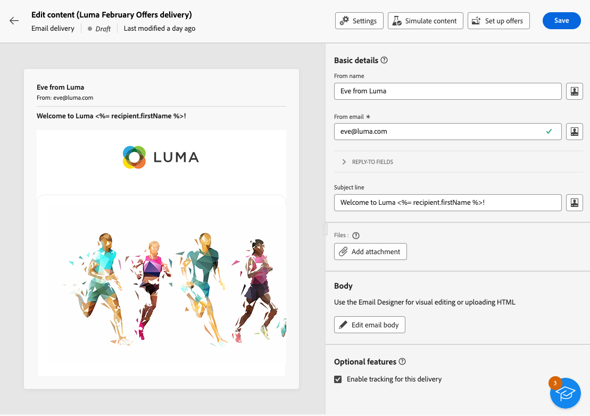
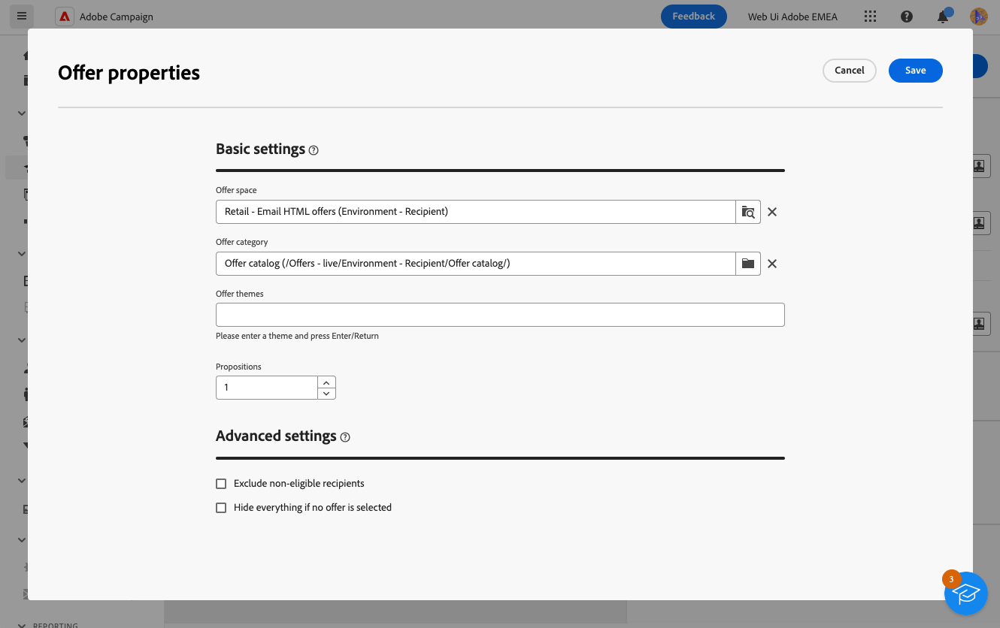
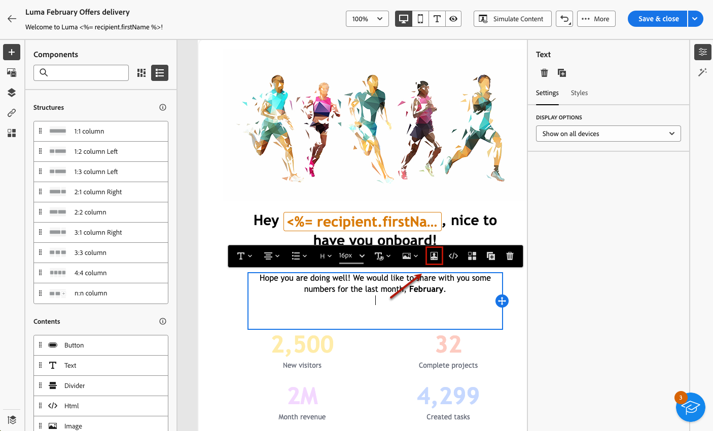
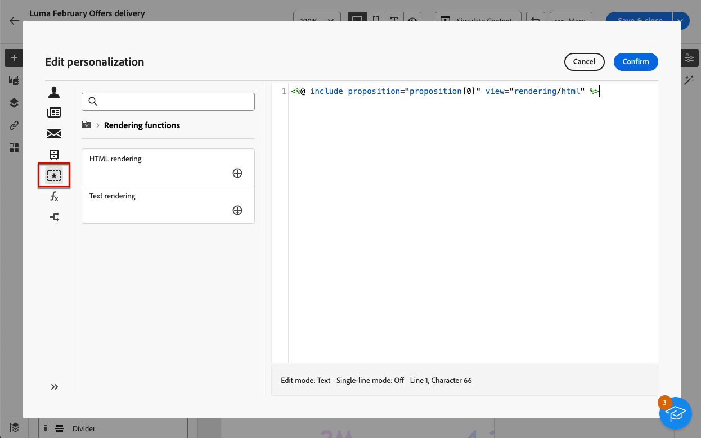

# 將產品建議新增至您的訊息 {#offers-content}

您可以在Adobe Campaign網路使用者介面中，將優惠方案新增至傳遞。 這些優惠可從左側的&#x200B;**優惠方案**&#x200B;功能表取得，可讓您存取優惠方案清單。 所有這些選件都是唯讀的，必須使用&#x200B;**[!UICONTROL 互動]**&#x200B;模組在Campaign使用者端主控台中建立。 如需互動以及如何管理主控台中的優惠方案目錄的詳細資訊，請參閱[Campaign v8 （使用者端主控台）檔案](https://experienceleague.adobe.com/docs/campaign/campaign-v8/offers/interaction.html?lang=zh-Hant){target="_blank"}。

透過傳送傳送優惠方案的步驟如下：

1. [設定要提出的產品建議](#configure)
1. [將優惠方案插入傳遞](#insert)

## 設定要提出的產品建議 {#configure}

>[!CONTEXTUALHELP]
>id="acw_deliveries_email_offers_settings"
>title="定義產品建議參數"
>abstract="透過定義產品建議空間 (可選的類別和主題) 來設定應向收件者建議哪些產品建議，並指定要插入到傳遞中的產品建議數量。"

>[!CONTEXTUALHELP]
>id="acw_deliveries_email_offers_advanced_settings"
>title="設定產品建議的進階設定"
>abstract="您可以啟用排除收件者功能來排除未合格的產品建議的收件者，並選擇當某方案不存在時處理訊息的方式。"

Adobe Campaign可讓您在互動期間提出一或多個特定優惠方案，即時回應指定的聯絡人。 這些優惠方案可以是簡單的通訊訊息、一或多個產品的特殊優惠方案或服務。

若要選取要新增至傳送的優惠方案，請遵循下列步驟。

1. 從傳遞內容版本畫面按一下&#x200B;**[!UICONTROL 設定選件]**&#x200B;按鈕。

   {zoomable="yes"}

1. 設定應向收件者提出的產品建議。

   首先，選取符合您優惠方案環境的&#x200B;**[!UICONTROL 優惠方案空間]**。 在[Campaign v8 （使用者端主控台）檔案](https://experienceleague.adobe.com/docs/campaign/campaign-v8/offers/interaction-settings/interaction-offer-spaces.html?lang=zh-Hant){target="_blank"}中瞭解如何建立優惠方案空間。

   {zoomable="yes"}

1. 若要縮小引擎的產品建議選擇範圍，請選取特定的&#x200B;**[!UICONTROL 產品建議類別]**，產品建議在此類別中排序。

   選取資料夾時，會自動包含所有子資料夾，且無法移除。 請注意，[!DNL Campaign]介面不會反映此行為。

   >[!NOTE]
   >
   >如果未指定類別，則產品建議引擎會將環境包含的所有產品建議考慮在內，除非有選取&#x200B;**[!UICONTROL 產品建議主題]**。

1. （選用）輸入主題以篩選類別。 主題是類別中上游定義的關鍵字。 優惠方案可做為篩選條件，在一組類別中選取優惠方案，以精簡要呈現的優惠方案數量。

1. 使用&#x200B;**[!UICONTROL 建議]**&#x200B;欄位來指定要插入傳遞中的優惠方案數目。

1. 選取「**[!UICONTROL 排除不符合資格的收件者]**」選項 (如有必要)。

   此選項可讓您針對沒有足夠的合格優惠方案，來啟用或停用收件者排除功能：

   * 如果啟用該選項，則沒有足夠提議的收件者被排除在傳遞作業之外。
   * 如果停用該選項，不會排除這些收件者，但他們不能有要求的建議數量。

1. 如有必要，選取「**[!UICONTROL 如果未選取任何產品建議，則隱藏所有內容]**」選項。

   此選項可讓您選擇在其中一個主張不存在時如何處理訊息：

   * 如果啟用此選項，則不會顯示缺少主張的表示，並且此主張的訊息中不會出現任何內容。
   * 如果停用選項，則訊息本身會在傳送期間取消，且收件者無法再接收任何訊息。

一旦您將優惠方案設定為在傳送中建議後，您就可以將它們插入傳送內容。

## 將優惠插入傳遞 {#insert}

可以使用[運算式編輯器](../personalization/gs-personalization.md#access)將選件新增到傳遞中。 它們可以插入主旨行或傳遞內文中。

>[!CAUTION]
>
>將優惠方案插入傳遞之前，請確定您已[設定要與該傳遞一起建議哪些優惠方案](#configure)。

若要使用運算式編輯器插入選件，請遵循下列步驟。

1. 存取主旨列或任何傳遞的內容。

1. 將游標置於您要插入選件的位置，並使用個人化圖示開啟運算式編輯器。

   {zoomable="yes"}

1. 選取&#x200B;**[!UICONTROL 建議]**&#x200B;功能表。 可用主張會顯示在清單中。

   >[!NOTE]
   >
   >當[設定目前傳遞的選件](#configure)時，會定義主張的數目。

1. 使用可用的個人化欄位、演算函式或優惠方案屬性來定義每個主張。

   {zoomable="yes"}

   >[!NOTE]
   >
   >可用的主張數量取決於引擎呼叫的設定方式，而其順序則取決於優惠方案的優先順序。 在[Campaign v8 （使用者端主控台）檔案](https://experienceleague.adobe.com/docs/campaign/campaign-v8/offers/interaction-best-practices.html?lang=zh-Hant){target="_blank"}中進一步瞭解。

1. 儲存您的變更。

1. 完成內容、測試並傳送您的傳遞。 [了解更多](gs-messages.md)。

現在，當收件者收到傳遞時，正確的優惠方案會顯示給該特定設定檔。