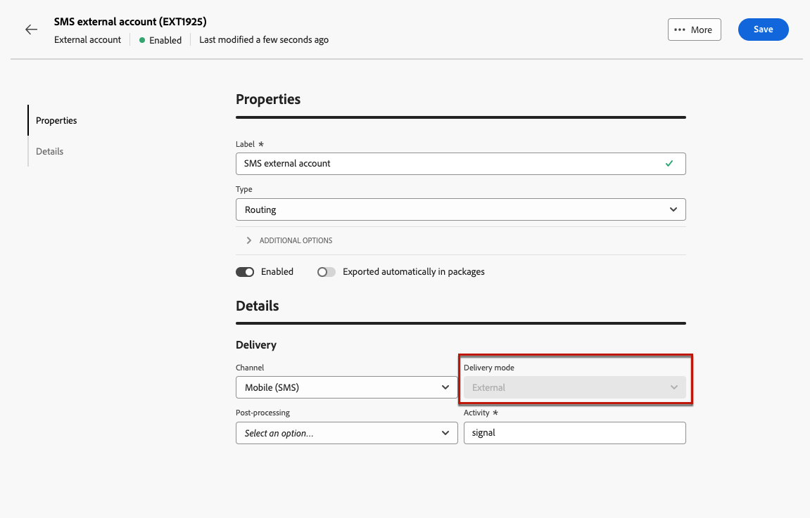
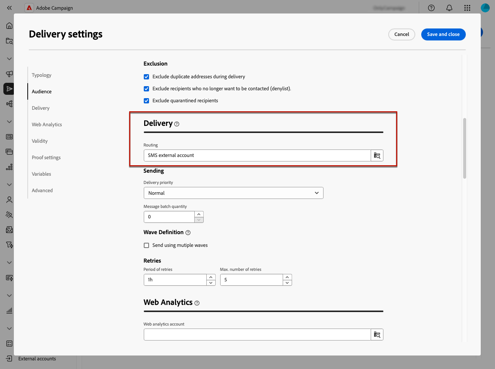
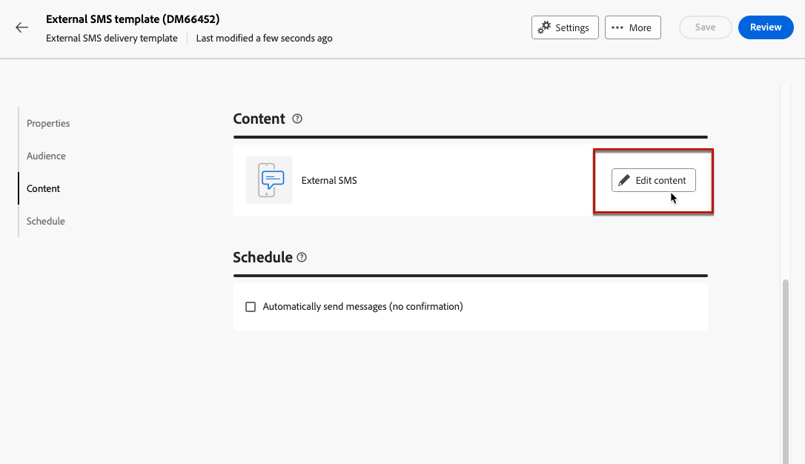
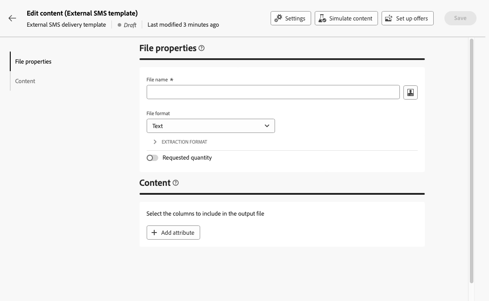
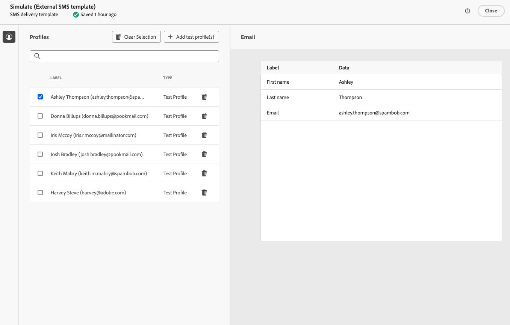

# 傳送外部傳遞 {#gs-direct-mail}

Adobe Campaign可讓您處理在Campaign外部建立的傳遞，以透過外部系統大量傳遞個人化電子郵件、簡訊或推播通知(iOs和Android)。

<!--The supported channels are Email, Mobile (SMS), and Push (iOs and Android).-->

建立外部傳遞時，Adobe Campaign會自動產生擷取檔案，其中包含所有目標設定檔和選取的資料。 此檔案會傳送至您選擇的伺服器，由伺服器為您處理傳送程式。

## 建立專用的外部帳戶 {#routing-external-account}

您首先需要設定用於外部傳遞的特定外部帳戶。 它必須是&#x200B;**[!UICONTROL 路由]**&#x200B;型別。

>[!NOTE]
>
>瞭解如何在[本節](../administration/external-account.md#routing)中建立路由型別的外部帳戶。

例如，選取外部帳戶的&#x200B;**[!UICONTROL 行動（簡訊）]**&#x200B;管道。 預設選取&#x200B;**[!UICONTROL 外部]**&#x200B;作為&#x200B;**[!UICONTROL 傳遞模式]**。

{zoomable="yes"}

## 建立並傳送外部傳遞 {#create-external-delivery}

設定特定外部帳戶後，請建立外部傳遞。 請遵循下列步驟。

1. 建立傳遞。 [了解做法](create-deliveries.md)

   您有三個選項：

   * **在工作流程中**：新增外部通道活動（電子郵件、簡訊或推播）至工作流程。 如需有關如何設定工作流程的詳細說明，請參閱[本頁面](../workflows/gs-workflow-creation.md)。
   * **在行銷活動中**：一旦您建立了行銷活動，就可以建立電子郵件、簡訊或推播通道外部傳遞。 如需有關設定行銷活動的詳細資訊，請參閱[本頁面](../campaigns/gs-campaigns.md)。
   * **獨立傳遞**：透過個別的外部傳遞，直接及立即與客戶互動。 [瞭解如何建立傳遞](../msg/gs-deliveries.md)

1. 在傳遞或傳遞範本[設定](../advanced-settings/delivery-settings.md)中，選取您為所選管道（在此範例中為SMS管道）建立的外部帳戶並儲存。

   {zoomable="yes"}

   >[!NOTE]
   >
   >如果您正在建立傳遞，請確定您已使用&#x200B;**[!UICONTROL 路由]**&#x200B;型別的外部帳戶選取[傳遞範本](delivery-template.md)，否則您將無法選取您在上面[建立](#routing-external-account)的專用帳戶。

1. 在傳遞&#x200B;**[!UICONTROL 內容]**&#x200B;區段中，按一下&#x200B;**[!UICONTROL 編輯內容]**。

   {zoomable="yes"}

1. 與標準傳送不同，您並非設計訊息本身的內容。 您需要定義將傳送至外部系統的檔案的屬性和欄。

   {zoomable="yes"}

   依照設計[直接郵件傳遞](../direct-mail/content-direct-mail.md)產生的擷取檔案的內容時所用的步驟執行：

   * 定義解壓縮檔案的屬性。 [了解更多](../direct-mail/content-direct-mail.md#properties)
   * 選取包含要匯出至該檔案之資訊的欄。 [了解更多](../direct-mail/content-direct-mail.md#content)

1. 您可以預覽檔案並傳送校樣<!--not in UI right now - to check-->。 [了解做法](../direct-mail/send-direct-mail.md#preview-dm)

   {zoomable="yes"}

1. 傳送傳遞以產生解壓縮檔案。 [了解做法](../direct-mail/send-direct-mail.md#send-dm)

傳送傳遞後，擷取檔案會自動產生，並匯出至傳遞範本設定中所選[外部帳戶](../administration/external-account.md#create-ext-account)中指定的位置。

您可以從傳遞頁面追蹤KPI，以及從&#x200B;**[!UICONTROL 記錄檔]**&#x200B;功能表追蹤資料。