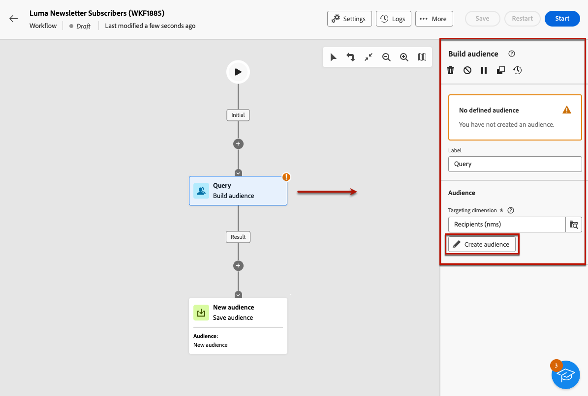
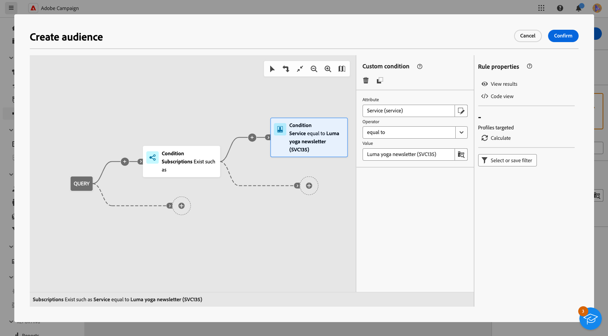
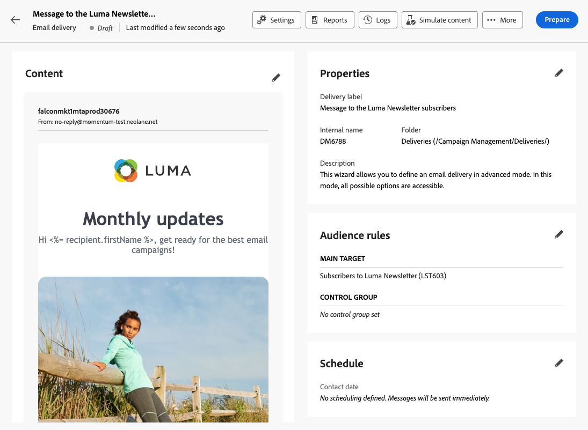

# 傳送訊息給服務的訂閱者 {#send-to-subscribers}

您可以在Adobe Campaign中建立訂閱服務，並傳送訊息給訂閱者。 瞭解如何在[此頁面](../audience//manage-services.md#create-service)上建立訂閱服務。

若要傳送訊息給訂閱者，請建立特定對象來識別訂閱者，然後建立傳送，如下所述。

1. 建立對象。 系統會自動建立新工作流程。 [進一步瞭解對象](../audience/create-audience.md)。

1. 為了更好的可讀性，請在工作流程設定&#x200B;**標籤**&#x200B;欄位中變更工作流程的名稱。 [瞭解如何設定工作流程設定](../workflows/workflow-settings.md)。

1. 開啟&#x200B;**[!UICONTROL 建立對象]**&#x200B;活動，然後選取&#x200B;**[!UICONTROL 建立對象]**。 [瞭解如何設定組建對象活動](../workflows/activities/build-audience.md)。

   {zoomable="yes"}

1. 在對象建立流程中，選取下列自訂條件： **[!UICONTROL 訂閱]**&#x200B;存在，例如&#x200B;**[!UICONTROL 服務]**&#x200B;等於您定義的服務。 在此範例中，選取您的&#x200B;**Luma瑜伽電子報**。

   {zoomable="yes"}

1. 選取&#x200B;**[!UICONTROL 確認]**，然後按一下&#x200B;**[!UICONTROL 開始]**&#x200B;以執行工作流程。

1. 建立傳遞。 建立傳遞的步驟已詳載於[此頁面](../msg/gs-messages.md#create-delivery)。

1. 瀏覽至您的傳遞設定，並將預設目標對應變更為&#x200B;**訂閱(nms：subscriptions)**。

   {zoomable="yes"}

1. 在傳送的主要目標區段中，選取您在上方建立的對象。

   {zoomable="yes"}

1. 建立您的訊息內容、測試並傳送傳遞，如[本節](../preview-test/preview-test.md)所詳述。

   {zoomable="yes"}

您的傳遞只會傳送給該服務的訂閱者。