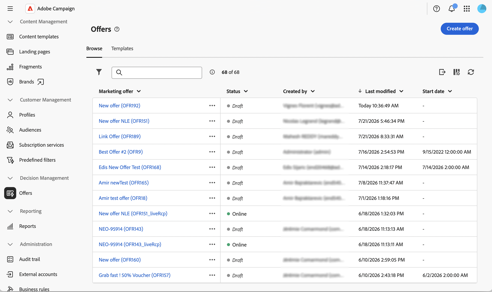
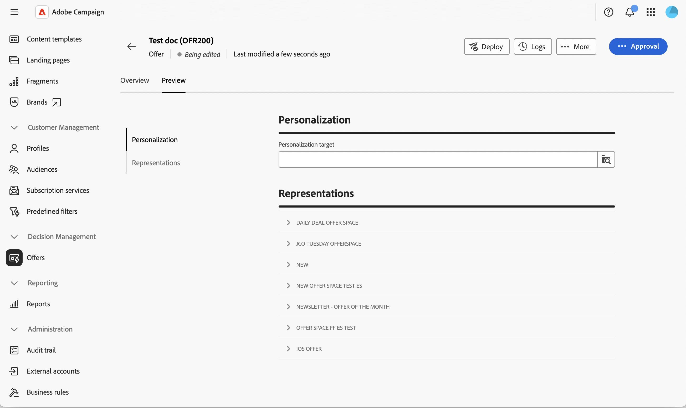

# 建立並發佈優惠方案 {#create-offer}

**優惠方案**&#x200B;是個別主張，有其自己的適用期間、目標篩選器、權重和內容。 優惠方案會透過&#x200B;**類別**&#x200B;在優惠方案目錄中組織，並透過&#x200B;**優惠方案空間**&#x200B;呈現給收件者。

建立選件之前，請確定已設定選件環境，且已發佈至少一個選件空間。 深入瞭解[設定優惠方案環境](offer-environment.md)和[建立和管理優惠方案空間](offer-space.md)。

## 存取優惠方案目錄 {#access}

若要瀏覽及建立選件，請從左側導覽邊欄中選取&#x200B;**[!UICONTROL 選件]**。 清單會顯示現有的選件。 使用搜尋欄位、資料夾選擇器或[查詢模型工具](../query/query-modeler-overview.md)來篩選清單。

{zoomable="yes"}

按一下優惠方案名稱以開啟它進行編輯，或使用它旁邊的三個點來&#x200B;**[!UICONTROL 複製]**&#x200B;或&#x200B;**[!UICONTROL 刪除]**&#x200B;它。

## 建立產品建議 {#create}

若要建立新選件：

1. 在選件清單中，按一下&#x200B;**[!UICONTROL 建立選件]**。

1. 選取&#x200B;**[!UICONTROL 範本]**&#x200B;以從中建立優惠（例如，空白優惠或匿名優惠範本）。

   {zoomable="yes"}

1. 輸入&#x200B;**[!UICONTROL 標籤]**，並選擇性地使用指派給&#x200B;**的**&#x200B;將優惠指派給運運算元，和/或輸入&#x200B;**[!UICONTROL 優惠代碼]**。

1. 展開&#x200B;**[!UICONTROL 其他選項]**&#x200B;以編輯自動產生的&#x200B;**[!UICONTROL 內部名稱]**、選取儲存選件的&#x200B;**[!UICONTROL 類別]**，或新增說明。 此步驟為選填。

1. 展開&#x200B;**[!UICONTROL 核准]**&#x200B;以將核准者指派給&#x200B;**[!UICONTROL 資格核准]**&#x200B;和&#x200B;**[!UICONTROL 內容核准]**&#x200B;群組。 此步驟為選填。

1. 展開&#x200B;**[!UICONTROL 自訂選項]**&#x200B;以填入貴組織新增至優惠方案結構描述的任何其他欄位。 本節中顯示的欄位因Campaign執行個體而異。 此步驟為選填。

1. 按一下「**[!UICONTROL 建立]**」。 隨即顯示完整設定畫面。

   {zoomable="yes"}

### 定義資格 {#eligibility}

此區段可讓您控制何時以及向誰顯示優惠方案。 可以使用以下選項：

* **[!UICONTROL 排程]** — 設定可顯示優惠方案的開始和結束日期。

  >[!NOTE]
  >
  >考量資格期間與父類別的交集：即使優惠方案自己的排程較寬，也只會在其父類別也符合資格時顯示優惠方案。

* **[!UICONTROL 目標上的篩選器]** — 按一下&#x200B;**[!UICONTROL 建立篩選器]**&#x200B;以開啟規則產生器，並將選件限制在特定對象。 將篩選器保留為空白，讓優惠方案符合整個環境對象的資格。 若要重複使用在平台層級宣告的&#x200B;**預先定義的篩選器**，請參閱[Campaign v8檔案](https://experienceleague.adobe.com/docs/campaign/campaign-v8/offers/interaction-predefined-filters.html){target="_blank"}。 預先定義的篩選器是從使用者端主控台建立。

* **[!UICONTROL 管理優惠方案權重]** — 按一下&#x200B;**[!UICONTROL 顯示優惠方案權重]**，然後按一下&#x200B;**[!UICONTROL 新增權重]**，以便在多個優惠方案同時符合資格時影響優惠方案的優先順序。 每個權重都有開始日期、結束日期及選擇性篩選器。

>[!NOTE]
>
>優惠方案引擎會降低權重來排序合適的優惠方案，並先傳回最高加權建議。 選擇邏輯（稱為&#x200B;**套利**）也會考慮在上層類別和環境上設定的適用規則和權重。 在[Campaign v8檔案](https://experienceleague.adobe.com/docs/campaign/campaign-v8/offers/interaction-best-practices.html?lang=zh-Hant){target="_blank"}中進一步瞭解套利原則。

### 定義內容 {#content}

從選件中，選取&#x200B;**[!UICONTROL 內容]**&#x200B;標籤。 此索引標籤會定義彩現功能將公開的值。

1. 填寫現成可用的屬性 — **[!UICONTROL Title]**、**[!UICONTROL 目的地URL]**、**[!UICONTROL 影像URL]**&#x200B;以及在優惠方案結構描述中宣告的任何自訂屬性。

1. 使用[運算式編輯器](../query/expression-editor.md)，以設定檔資料、優惠屬性或主張欄位來個人化值。

1. 針對HTML和文字裝載，按一下&#x200B;**[!UICONTROL 編輯內容]**&#x200B;以開啟內容編輯器。 您可以選擇從範例範本開始從頭開始設計內容、為您自己的HTML撰寫程式碼，或匯入現有的HTML。

>[!IMPORTANT]
>
>**[!UICONTROL Content]**&#x200B;區段中可用的屬性取決於[!DNL nms:offer]結構描述。 若要公開自訂屬性，請擴充結構描述，並在&#x200B;**[!UICONTROL 選件內容]**&#x200B;區段中選取它們。 深入瞭解[使用結構描述](../administration/schemas.md)。

## 預覽優惠方案 {#preview}

您可以在提交優惠方案之前先預覽優惠方案。

1. 從選件中，選取&#x200B;**[!UICONTROL 概觀]**&#x200B;旁的&#x200B;**[!UICONTROL 預覽]**&#x200B;標籤。

   {zoomable="yes"}

1. 選取目標設定檔，並選取預覽應針對的優惠方案空間（若相關）。

   在優惠方案空間上定義的演算函式會套用至優惠方案內容，且產生的表示會隨即顯示。

>[!NOTE]
>
>如果預覽傳回錯誤或沒有內容，請檢查優惠方案空間的演算功能、優惠方案的適用性規則，以及所有必要的內容欄位均已填滿。

## 核准並部署優惠方案 {#approve-deploy}

選件無法立即用於傳送：它們會經過核准和部署週期。

1. 在選件總覽中，按一下&#x200B;**[!UICONTROL 核准]**。

   {zoomable="yes"}

1. 核准&#x200B;**[!UICONTROL 資格]**&#x200B;和&#x200B;**[!UICONTROL 內容]**。 您可以為每個優惠方案空間核准內容，因此您可以為一個優惠方案空間核准內容，而讓其他優惠方案空間維持在待定狀態。

1. 兩個核准都獲得授權後，按一下&#x200B;**[!UICONTROL 部署]**&#x200B;以將選件發佈到即時環境。

1. 重新整理選件檢視以確認&#x200B;**[!UICONTROL 即時]**&#x200B;表示是最新的。

<!--
>[!NOTE]
>
>Once deployed, the design offer's status resets to **[!UICONTROL Being edited]** — its normal draft status, not a sign that someone is actively editing it. This just means the design offer is ready to accept further changes, which would then need to go through a new approval and deployment cycle. The live representation itself remains untouched until that happens.
-->

>[!CAUTION]
>
>核准優惠方案的資格和內容是兩個不同的動作。 優惠方案可以部分核准（例如僅內容），且在也授予資格核准之前，無法用於傳送。

## 監視優惠儀表板 {#dashboard}

優惠方案&#x200B;**[!UICONTROL 總覽]**&#x200B;索引標籤總結了&#x200B;**[!UICONTROL 屬性]**、**[!UICONTROL 內容]**&#x200B;和&#x200B;**[!UICONTROL 資格]**&#x200B;卡片中的優惠方案狀態，每個卡片上都有一個鉛筆圖示可跳回版本。 **[!UICONTROL 代表]**&#x200B;卡會列出優惠連結的每個優惠方案空間，以及其目前的設計狀態。

{zoomable="yes"}

按一下&#x200B;**[!UICONTROL 記錄檔]**&#x200B;以存取部署記錄檔，或按一下&#x200B;**···** （**[!UICONTROL 更多]**）功能表以&#x200B;**[!UICONTROL 複製]**&#x200B;或&#x200B;**[!UICONTROL 刪除]**&#x200B;選件。

一旦選件上線，修改任何設定都會將設計選件切換回可編輯狀態。 在下個核准和部署週期之前，即時表示將保持不變。

## 在傳遞中使用選件 {#use-in-delivery}

當優惠方案上線時，您可以從任何將目標鎖定於相符優惠方案空間的傳送中選取。 瞭解如何在[新增優惠到您的訊息](../msg/offers.md)中設定傳遞中的優惠。

如需完整的傳出傳送整合，包括如何建立引擎呼叫以及如何將追蹤套用至選件連結，請參閱傳出傳送[&#128279;](https://experienceleague.adobe.com/docs/campaign/campaign-v8/offers/interaction-send-offers.html?lang=zh-Hant){target="_blank"}中的Campaign v8檔案選件。

