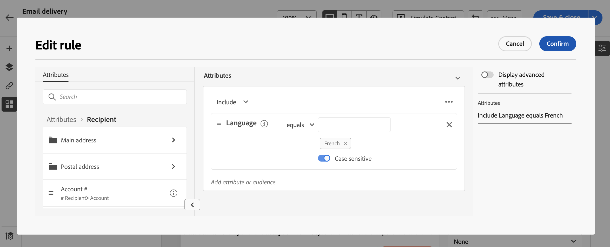

# 建立條件內容{#add-conditions}

>[!CONTEXTUALHELP]
>id="acw_conditional_content"
>title="新增條件內容"
>abstract="設定條件內容欄位，以根據收件者的設定檔資料建立進階的動態個人化。在滿足特定條件時，會更換訊息內容中的文字區塊、連結、主題行和/或影像。"

## 開始使用條件式內容 {#gs}

條件式內容是一項強大的功能，可讓您根據收件者的設定檔建立動態個人化，在滿足某些條件時自動取代文字區塊和影像。 此功能可以將您的行銷活動提升到新的高度，並為您的對象提供目標明確的個人化體驗。

例如，透過設定條件式內容欄位，您可以根據收件者的設定檔建立進階動態個人化。 當滿足特定條件時，會在訊息內容中取代文字區塊、連結、主旨行和/或影像。 例如，您可以根據Adobe Campaign資料庫中性別欄位的值顯示「先生」或「夫人」，或根據收件者偏好的語言包含其他連結。

若要建立條件式內容，您需要在 **運算式編輯器** 使用特定的協助程式函式。 此方法適用於所有傳遞管道，以及任何可存取運算式編輯器的欄位，例如主旨行或電子郵件連結及文字/按鈕內容元件。 [瞭解如何存取運算式編輯器](gs-personalization.md/#access)

<!--In addition to the expression editor, you can leverage a dedicated **conditional content builder** when designing an email that allows you to build conditions using profile attributes only. [Learn how to create conditional content in emails](#condition-condition-builder)-->

## 在運算式編輯器中建立條件 {#condition-perso-editor}

若要使用運算式編輯器定義傳遞的條件式內容，請遵循下列步驟。 在此範例中，我們要根據收件者的語言（法文或英文）建立條件式內容。

1. 開啟傳遞並導覽至「內容編輯」區段。

1. 找到您要新增條件式內容的欄位。 例如，您可以將條件式內容新增至SMS訊息。

1. 按一下 **[!UICONTROL 開啟個人化對話方塊]** 圖示來開啟運算式編輯器。

   

1. 在個人化編輯器中，瀏覽至 **[!UICONTROL 輔助函式]** 功能表左側。

1. 若要開始建立條件，請按一下「+」圖示() **如果** 函式。 下列行將新增到中央畫面中：`<% if (<FIELD>==<VALUE>) { %>Insert content here<% } %>`

   * 取代 `<FIELD>` ，並使用個人化欄位，例如收件者的語言： `recipient.language`.
   * 取代 `<VALUE>` ，其值需滿足。 例如， `'French'`.
   * 取代 `Ìnsert content here` ，其中包含您想要顯示給符合指定條件的設定檔的內容。

     {width="800" align="center"}

1. 指定收件者不符合條件時應顯示的內容。 若要這麼做，請使用 **否則** 輔助函式：

   1. 將游標放在運算式結束標籤之前 `%>` 並按一下 `+` 在 **否則** 函式。

   1. 取代 `Ìnsert content here` ，其中包含您要顯示給不符合if函式條件的設定檔的內容。

   {width="800" align="center"}

   您也可以使用 **否則，如果** 協助程式函式，可建立包含多個內容變體的條件。 例如，下方的運算式會根據收件者的語言顯示郵件的三種變體：

   {width="800" align="center"}

   >[!NOTE]
   >
   >每次新增協助程式函式時，都會開啟(`<%`)和關閉(`%>`)標籤會在函式之前和之後自動新增。
   >
   >在運算式中新增「Else」協助程式函式後的範例： >
   >
   >`<% if (<FIELD>==<VALUE>) { %>Insert content here<% } <% else { %> Insert content here<% } %>%>`
   >
   >請務必移除這些標籤，以避免任何語法錯誤。 在此範例中，移除 **否則** 函式標籤為：
   >
   >`<% if (<FIELD>==<VALUE>) { %>Insert content here<% } else { %> Insert content here<% } %>`

1. 條件準備就緒後，您可以儲存內容，並透過模擬內容來檢查其呈現。

<!--SECTION REMOVED FOR LA > CONDITIONAL CONTENT NOT AVAILABLE ANYMORE FROM THE DEDICATED MENU IN THE EMAIL DESIGNER. ONLY THE EXPRESSION EDITOR IS AVAILABLE FOR NOW

## Create conditional content in emails {#condition-condition-builder}

Conditional content in emails can be created in two ways:
* In the expression editor by building a condition with helper functions,
* In a dedicated conditional content builder that is accessible when designing an email.

Detailed information on how to create conditions using the expression editor is available [here](#condition-perso-editor). The following section provides step-by-step instructions on how to create conditions using the email designer's conditional content capability. In this example, we want to create an email message with multiple variants based on the recipients' language. Follow these steps:

1. Create or open an email delivery, edit its content, and click the **[!UICONTROL Edit email body]** button to open the email designing workspace.

1. Select a content component and click the **[!UICONTROL Enable conditional content]** icon.

    {width="800" align="center"}

1. The **[!UICONTROL Conditional Content]** pane opens on the left-hand side of the screen. In this pane, you can create multiple variants of the selected content component using conditions.

1. Configure your first variant. Hover over **[!UICONTROL Variant - 1]** in the **[!UICONTROL Conditional Content]** pane and click the **[!UICONTROL Add condition]** icon.

1. A query modeler appears. Use profile attributes to create the condition for the first variant of the message and click **[!UICONTROL Confirm]**. In this example, we are creating a rule targeting recipients whose language is 'French'.

    {width="800" align="center"}

1. The rule is now associated to the variant. For better readability, we recommend renaming the variant by clicking the ellipsis menu.

1. Configure how the component should display if the rule is met when sending the message. In this example, we want to display the text in French if it is the recipient's preferred language.

    {width="800" align="center"}

1. Add as many variants as needed for the content component. You can switch between the variants at any time to check how the content component will display based on their conditional rules.

    >[!NOTE]
    >If none of the rules defined in the variants are met when sending the message, the content component will display the content defined in the **[!UICONTROL Default variant]** from the **[!UICONTROL Conditional Content]** pane.
-->