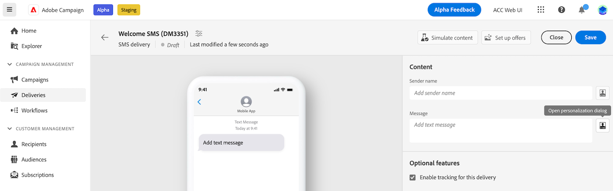
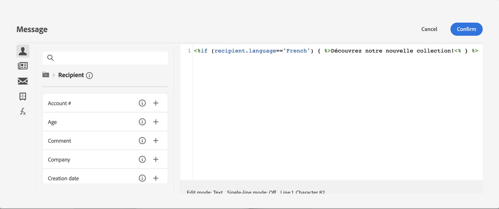
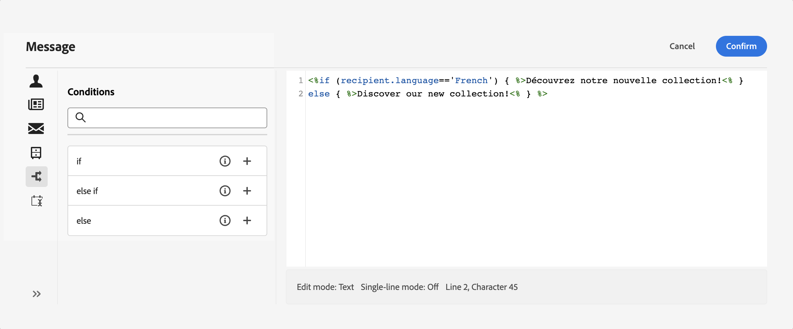
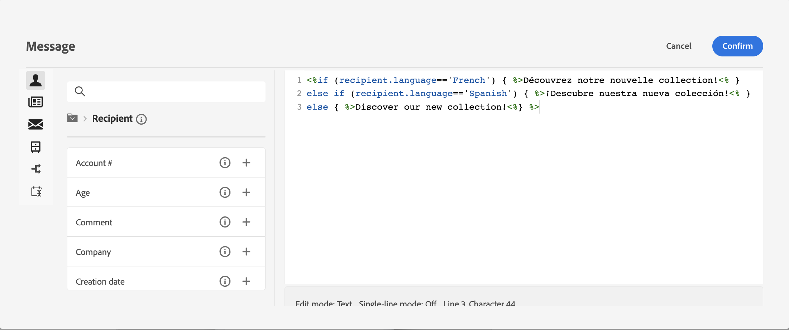
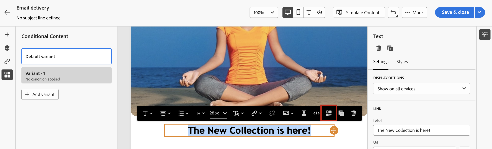
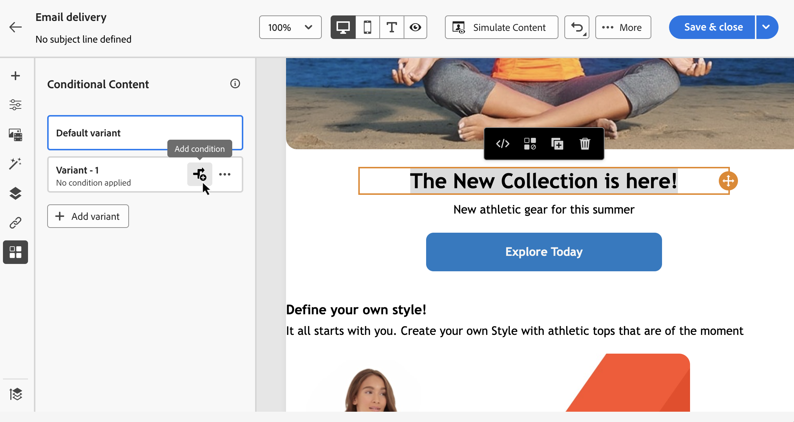
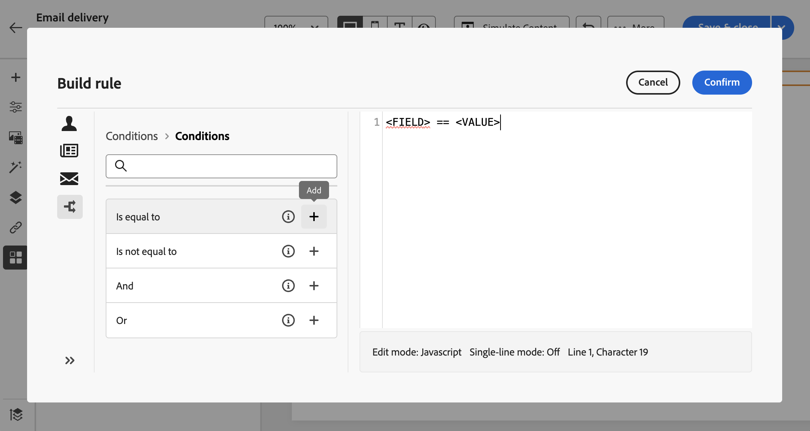
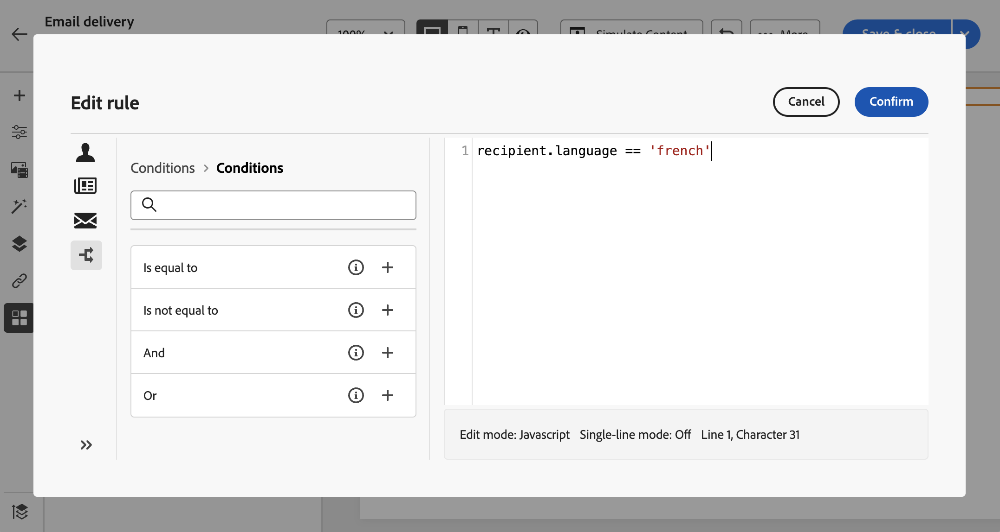
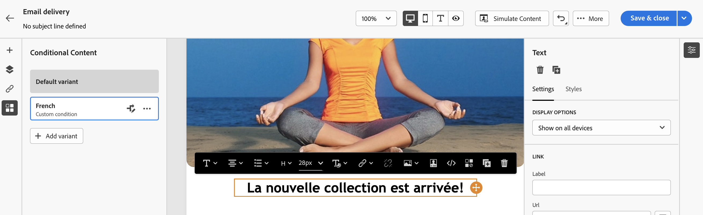

# 建立條件內容{#add-conditions}

>[!CONTEXTUALHELP]
>id="acw_conditional_content"
>title="新增條件內容"
>abstract="設定條件內容欄位，以根據收件者的設定檔資料建立進階的動態個人化。在滿足特定條件時，會更換訊息內容中的文字區塊、連結、主題行和/或影像。"

## 開始使用條件式內容 {#gs}

條件式內容是一項強大的功能，可讓您根據收件者的設定檔建立動態個人化，在滿足某些條件時自動取代文字區塊和影像。 此功能可以將您的行銷活動提升到新的高度，並為您的對象提供目標明確的個人化體驗。

例如，透過設定條件式內容欄位，您可以根據收件者的設定檔建立進階動態個人化。 當滿足特定條件時，會在訊息內容中取代文字區塊、連結、主旨行和/或影像。 例如，您可以根據Adobe Campaign資料庫中性別欄位的值顯示「先生」或「夫人」，或根據收件者偏好的語言包含其他連結。

若要建立條件式內容，您需要在 **運算式編輯器** 使用特定的協助程式函式。 此方法適用於所有傳遞管道，以及任何可存取運算式編輯器的欄位，例如主旨行或電子郵件連結及文字/按鈕內容元件。 [瞭解如何存取運算式編輯器](gs-personalization.md/#access)

除了運算式編輯器之外，您也可以利用專用的運算式 **條件式內容產生器** 在設計可讓您為電子郵件內文的元素建立多個變體的電子郵件時。 [瞭解如何在電子郵件中建立條件式內容](#condition-condition-builder)

## 在運算式編輯器中建立條件 {#condition-perso-editor}

若要使用運算式編輯器定義傳遞的條件式內容，請遵循下列步驟。 在此範例中，我們要根據收件者的語言（法文或英文）建立條件式內容。

1. 開啟傳遞並導覽至「內容編輯」區段。

1. 找到您要新增條件式內容的欄位。 例如，您可以將條件式內容新增至SMS訊息。

1. 按一下 **[!UICONTROL 開啟個人化對話方塊]** 圖示來開啟運算式編輯器。

   

1. 在個人化編輯器中，瀏覽至 **[!UICONTROL 輔助函式]** 功能表左側。

1. 若要開始建立條件，請按一下「+」圖示() **如果** 函式。 下列行將新增到中央畫面中：`<% if (<FIELD>==<VALUE>) { %>Insert content here<% } %>`

   * 取代 `<FIELD>` ，並使用個人化欄位，例如收件者的語言： `recipient.language`.
   * 取代 `<VALUE>` ，其值需滿足。 例如， `'French'`.
   * 取代 `Ìnsert content here` ，其中包含您想要顯示給符合指定條件的設定檔的內容。

     {width="800" align="center"}

1. 指定收件者不符合條件時應顯示的內容。 若要這麼做，請使用 **否則** 輔助函式：

   1. 將游標放在運算式結束標籤之前 `%>` 並按一下 `+` 在 **否則** 函式。

   1. 取代 `Ìnsert content here` ，其中包含您要顯示給不符合if函式條件的設定檔的內容。

   {width="800" align="center"}

   您也可以使用 **否則，如果** 協助程式函式，可建立包含多個內容變體的條件。 例如，下方的運算式會根據收件者的語言顯示郵件的三種變體：

   {width="800" align="center"}

   >[!NOTE]
   >
   >每次新增協助程式函式時，都會開啟(`<%`)和關閉(`%>`)標籤會在函式之前和之後自動新增。
   >
   >在運算式中新增「Else」協助程式函式後的範例： >
   >
   >`<% if (<FIELD>==<VALUE>) { %>Insert content here<% } <% else { %> Insert content here<% } %>%>`
   >
   >請務必移除這些標籤，以避免任何語法錯誤。 在此範例中，移除 **否則** 函式標籤為：
   >
   >`<% if (<FIELD>==<VALUE>) { %>Insert content here<% } else { %> Insert content here<% } %>`

1. 條件準備就緒後，您可以儲存內容，並透過模擬內容來檢查其呈現。

## 在電子郵件中建立條件式內容 {#condition-condition-builder}

電子郵件中的條件式內容有兩種建立方式：
* 在運算式編輯器中，透過建立包含協助程式函式的條件，
* 在設計電子郵件時可存取的專用條件式內容產生器中。

下節提供逐步指示，說明如何使用電子郵件設計工具的條件式內容功能建立條件。 提供了有關如何使用運算式編輯器建立條件的詳細資訊 [此處](#condition-perso-editor).

在此範例中，我們要根據收件者的語言建立包含多個變體的電子郵件訊息。 請依照下列步驟操作：

1. 建立或開啟電子郵件傳送，編輯其內容，然後按一下 **[!UICONTROL 編輯電子郵件內文]** 按鈕以開啟電子郵件設計工作區。

1. 選取內容元件並按一下 **[!UICONTROL 啟用條件式內容]** 圖示。

   {width="800" align="center"}

1. 此 **[!UICONTROL 條件式內容]** 窗格會在熒幕左側開啟。 在此窗格中，您可以使用條件來建立所選內容元件的多個變體。

1. 設定您的第一個變體。 暫留在 **[!UICONTROL 變體 — 1]** 在 **[!UICONTROL 條件式內容]** 窗格並按一下 **[!UICONTROL 新增條件]** 按鈕。

   {width="800" align="center"}

1. 規則產生器隨即顯示。 它提供 **個人資料**， **訊息**、和 **傳遞** 您可用來建立條件的屬性。

   此外， **條件** 選單提供預先建立的條件，您可以將這些條件新增到畫布以輕鬆建立變體。 若要使用，請按一下 **新增** 按鈕，然後取代下列專案之間的元素： `<` 和 `>`符號依所需元素。 請確定您為 `<value>` 物件在引號中。

   {width="800" align="center"}

1. 訊息的第一個變體的條件就緒後，請按一下 **[!UICONTROL 確認]**. 在此範例中，我們將建立以語言為「法文」的收件者為目標的規則。

   {width="800" align="center"}

1. 該規則現在已關聯至變體。 為了提高可讀性，建議您按一下省略符號選單，重新命名變體。

1. 設定在傳送訊息時符合規則時元件應如何顯示。 在此範例中，如果法文是收件者的慣用語言，我們會想要以法文顯示文字。

   {width="800" align="center"}

1. 視需要為內容元件新增任意數量的變體。 您可以隨時在變體之間切換，以檢查內容元件將如何根據其條件規則顯示。

   >[!NOTE]
   >如果傳送訊息時，不符合變體中所定義的任何規則，內容元件將會顯示 **[!UICONTROL 預設變體]** 從 **[!UICONTROL 條件式內容]** 窗格。
