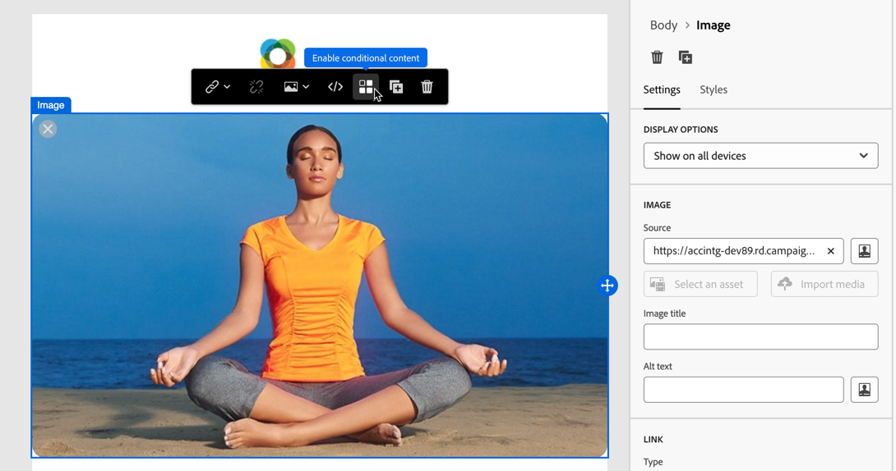
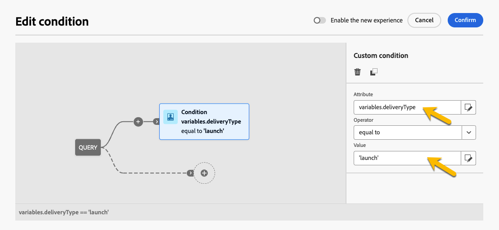

# 建立條件內容 {#add-conditions}

>[!CONTEXTUALHELP]
>id="acw_conditional_content"
>title="新增條件內容"
>abstract="設定條件內容欄位，以根據收件者的設定檔資料建立進階的動態個人化。在滿足特定條件時，會更換訊息內容中的文字區塊、連結、主題行和/或影像。"

## 開始使用條件式內容 {#gs}

條件式內容是一項強大的功能，可根據收件者的設定檔資料啟用動態個人化。 它會在符合特定條件時自動取代文字區塊和影像。 此功能可增強行銷活動，並為您的對象提供高度目標性的個人化體驗。

透過設定條件式內容欄位，您可以根據收件者的設定檔建立進階動態個人化。 例如，當滿足特定條件時，會在訊息內容中取代文字區塊、連結、主旨行和影像。 例如，您可以根據Adobe Campaign資料庫中「性別」欄位的值來顯示「先生」或「夫人」，或根據收件者偏好的語言加入其他連結。

若要建立條件式內容，請使用特定的協助程式函式，在&#x200B;**運算式編輯器**&#x200B;中設定條件。 此方法適用於所有傳遞管道，以及任何可存取運算式編輯器的欄位，例如主旨列、電子郵件連結及文字/按鈕內容元件。 [瞭解如何存取運算式編輯器](gs-personalization.md#access)。

此外，在設計電子郵件時，請使用專用的&#x200B;**條件式內容產生器**，為您的電子郵件內文元素建立多個變體。 [瞭解如何在電子郵件中建立條件式內容](#condition-condition-builder)。

## 在運算式編輯器中建立條件 {#condition-perso-editor}

>[!CONTEXTUALHELP]
>id="acw_personalization_editor_conditions"
>title="條件"
>abstract="此選單可讓您利用協助程式函數來定義條件內容。"

若要使用運算式編輯器定義傳遞的條件式內容，請遵循下列步驟。 在此範例中，條件式內容是根據收件者的語言（法文或英文）建立。

1. 開啟傳遞並導覽至「內容編輯」區段。

1. 找到您要新增條件式內容的欄位。 例如，將條件式內容新增至SMS訊息。

1. 按一下欄位旁的&#x200B;**[!UICONTROL 開啟個人化對話方塊]**&#x200B;圖示以開啟運算式編輯器。

   ![熒幕擷圖顯示SMS訊息編輯器中欄位旁的[開啟個人化對話方塊]圖示。](assets/open-perso-editor-sms.png){zoomable="yes"}

1. 在個人化編輯器中，瀏覽至左側的&#x200B;**[!UICONTROL 條件]**&#x200B;功能表。

1. 若要開始建立條件，請按一下&#x200B;**If**&#x200B;函式旁的&#39;+&#39;圖示。 下列行已新增到中央熒幕： `<% if (<FIELD>==<VALUE>) { %>Insert content here<% } %>`

   * 以個人化欄位取代`<FIELD>`，例如收件者的語言： `recipient.language`。
   * 將`<VALUE>`取代為要滿足的值，例如`'French'`。
   * 以要顯示給符合指定條件的設定檔的內容取代`Insert content here`。

     {zoomable="yes"}{width="800" align="center"}

1. 指定收件者不符合條件時要顯示的內容。 使用&#x200B;**else**&#x200B;協助程式函式：

   1. 將游標放在運算式結束標籤`%>`之前，然後按一下`+`Else **函式旁的**。

   1. 以要顯示給不符合if函式條件的設定檔的內容取代`Insert content here`。

   {zoomable="yes"}{width="800" align="center"}

   使用&#x200B;**else if**&#x200B;協助程式函式來建置具有多個內容變體的條件。 例如，下方的運算式會根據收件者的語言顯示郵件的三種變體：

   {zoomable="yes"}{width="800" align="center"}

   >[!NOTE]
   >
   >每次新增協助程式函式時，都會在函式前後自動新增開啟(`<%`)和結束(`%>`)標籤。
   >
   >在運算式中新增「Else」協助程式函式後的範例：
   >
   >`<% if (<FIELD>==<VALUE>) { %>Insert content here<% } <% else { %> Insert content here<% } %>%>`
   >
   >請務必移除這些標籤以避免語法錯誤。 在此範例中，移除&#x200B;**else**&#x200B;函式標籤後修正的運算式為：
   >
   >`<% if (<FIELD>==<VALUE>) { %>Insert content here<% } else { %> Insert content here<% } %>`

1. 儲存您的內容，並藉由模擬您的內容來檢查其呈現。

## 在電子郵件中建立條件式內容 {#condition-condition-builder}

電子郵件中的條件式內容有兩種建立方式：
* 使用協助程式函式建立條件，以在運算式編輯器中執行。
* 在設計電子郵件時，可在專用的條件式內容產生器中存取。

下節提供有關使用電子郵件Designer的條件式內容功能建立條件的逐步指示。 有關使用運算式編輯器建立條件的詳細資訊，請參閱[這裡](#condition-perso-editor)。

在此範例中，會根據收件者的語言建立包含多個變體的電子郵件訊息。 請依照下列步驟操作：

1. 建立或開啟電子郵件傳遞、編輯其內容，然後按一下&#x200B;**[!UICONTROL 編輯電子郵件內文]**&#x200B;按鈕以開啟電子郵件設計工作區。

1. 選取內容元件，然後按一下&#x200B;**[!UICONTROL 啟用條件式內容]**&#x200B;圖示。

   ![在電子郵件設計工具中顯示[啟用條件式內容]圖示的熒幕擷圖。](assets/condition-email-enable.png){zoomable="yes"}{width="800" align="center"}

1. **[!UICONTROL 條件式內容]**&#x200B;窗格會在畫面左側開啟。 在此窗格中，使用條件建立所選內容元件的多個變體。

1. 設定您的第一個變體。 在&#x200B;**[!UICONTROL 條件式內容]**&#x200B;窗格中，將游標暫留在&#x200B;**[!UICONTROL 變體 — 1]**&#x200B;上，然後按一下&#x200B;**[!UICONTROL 新增條件]**&#x200B;按鈕。

   ![熒幕擷圖顯示[條件內容]窗格中的[新增條件]按鈕。](assets/condition-add-condition.png){zoomable="yes"}{width="800" align="center"}

1. 查詢建模器隨即開啟，可讓您透過篩選收件者的設定檔資料來建立條件。 [瞭解如何使用查詢模型工具](../query/query-modeler-overview.md)。

   訊息第一個變體的條件就緒後，請按一下&#x200B;**[!UICONTROL 確認]**。 在此範例中，會建立以語言為「法文」的收件者為目標的規則。

   {zoomable="yes"}{width="800" align="center"}

1. 規則現在與變體相關聯。 為提升可讀性，請按一下省略符號選單，重新命名變體。

1. 設定在傳送訊息時符合規則時元件應如何顯示。 在此範例中，如果法文是收件者的偏好語言，則會顯示法文文字。

   {zoomable="yes"}{width="800" align="center"}

1. 視需要為內容元件新增任意數量的變體。 隨時在變體之間切換，以檢查內容元件將如何根據其條件規則顯示。

   >[!NOTE]
   >如果傳送訊息時不符合變體中所定義的規則，內容元件將會從&#x200B;**[!UICONTROL 條件式內容]**&#x200B;窗格顯示&#x200B;**[!UICONTROL 預設變體]**&#x200B;中所定義的內容。

## 對條件式內容使用變數 {#variables-conditional}

變數可用於傳遞中的條件式內容。

深入瞭解[新增變數至傳遞](../advanced-settings/delivery-settings.md#variables-delivery)。

選擇要放置條件式內容的元素。

{zoomable="yes"}

若要使用變數，請使用&#x200B;**[!UICONTROL 編輯運算式]**&#x200B;按鈕來設定條件，如下所示。 在此範例中，當變數的值為`launch`時會顯示此影像。

{zoomable="yes"}

以值`reminder`建立另一個變體，例如，其中顯示不同的影像。