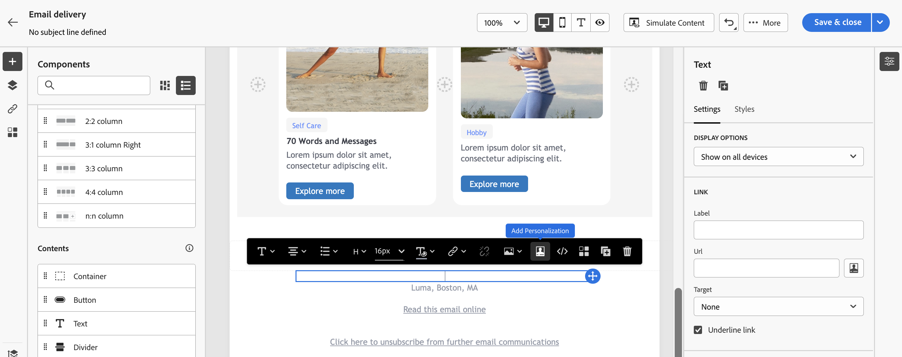
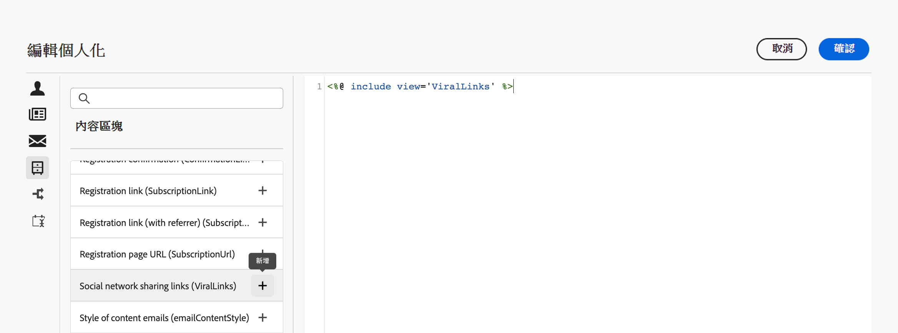

# 新增內建的內容區塊 {#ootb-content-blocks}

Adobe Campaign提供預先設定的內容區塊清單。 這些內容區塊為動態、個人化的區塊，並具備您可插入傳遞中的特定轉譯。 例如，您可以新增標誌、問候語訊息或映象頁面的連結。

若要將內容區塊新增至傳送，請執行下列步驟：

1. 開啟傳遞並編輯其內容。

1. 找到您要新增內容區塊的欄位，然後按一下 **[!UICONTROL 開啟個人化對話方塊]** 圖示以開啟運算式編輯器。

   {zoomable=&quot;yes&quot;}{width="800" align="center"}

1. 在運算式編輯器中，瀏覽至 **[!UICONTROL 內容區塊]** 左側功能表。

1. 若要新增內容區塊，請將游標置於內容內所需的位置，然後按一下「+」按鈕加以插入。

   {zoomable=&quot;yes&quot;}{width="800" align="center"}

內建的內容區塊包括：

* **[!UICONTROL 預設選擇退出橫幅]**
* **[!UICONTROL 由 Adobe Campaign 啟用]**：插入「由 Adobe Campaign 啟用」標誌。
* **[!UICONTROL 專有名詞的格式化函數]**：產生 **[!UICONTROL toSmartCase]** Javascript 函數，它將每個單詞的第一個字母變更為大寫。
* **[!UICONTROL 問候語]**：插入帶有收件人全名的問候語，後面跟著一個逗號。範例：「你好 John Doe，」。
* **[!UICONTROL 插入標誌]**：插入在執行個體設定中定義的標誌。
* **[!UICONTROL 鏡像頁面連結]**：插入[鏡像頁面](../email/mirror-page.md)的連結。預設格式：「如果您無法正確檢視此訊息，請按一下此處」。
* **[!UICONTROL 鏡像頁面 URL]**：插入鏡像頁面 URL，使傳遞設計工具檢查連結。
* **[!UICONTROL 通知樣式]**
* **[!UICONTROL 單一模式的優惠接受 URL]**：插入可以將優惠設定為&#x200B;**[!UICONTROL 接受]** 的 URL。(如果啟用互動模組，則此區塊可用)
* **[!UICONTROL 註冊確認]**：插入可以確認訂閱的連結。
* **[!UICONTROL 註冊連結]**：插入訂閱連結。此連結在執行個體設定中定義。預設內容：「若要註冊，請按一下這裡。」
* **[!UICONTROL 註冊連結 (含推薦者)]**：插入可以識別訪客和傳遞的訂閱連結。此連結在執行個體設定中定義。
* **[!UICONTROL 註冊頁面 URL]**：插入訂閱 URL
* 社交網路共用連結
* **[!UICONTROL 內容電子郵件的樣式]**&#x200B;和&#x200B;**[!UICONTROL 通知樣式]**：產生使用預先定義的 HTML 樣式格式化電子郵件的程式碼。
* **[!UICONTROL 取消訂閱連結]**：插入可以取消訂閱所有傳遞 (封鎖清單) 的連結。預設關聯內容：「您收到此訊息因為您曾聯絡&#x200B;***您的組織名稱***&#x200B;或附屬機構。若不要再收到來自&#x200B;***您的組織名稱***&#x200B;的訊息，請按一下這裡。」

>[!NOTE]
>
>您可以從Adobe Campaign v8主控台定義新區塊，以讓您將傳送個人化最佳化。 進一步瞭解 [Campaign v8 （使用者端主控台）檔案](https://experienceleague.adobe.com/docs/campaign/campaign-v8/campaigns/send/personalize/personalization-blocks.html#create-custom-personalization-blocks){target="_blank"}.
