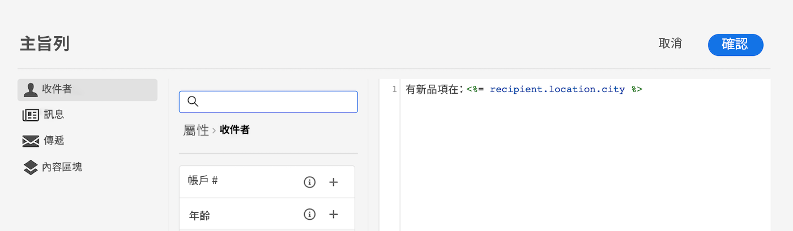
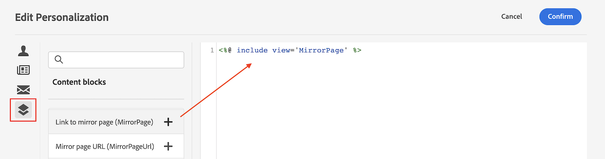
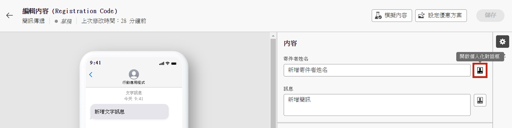
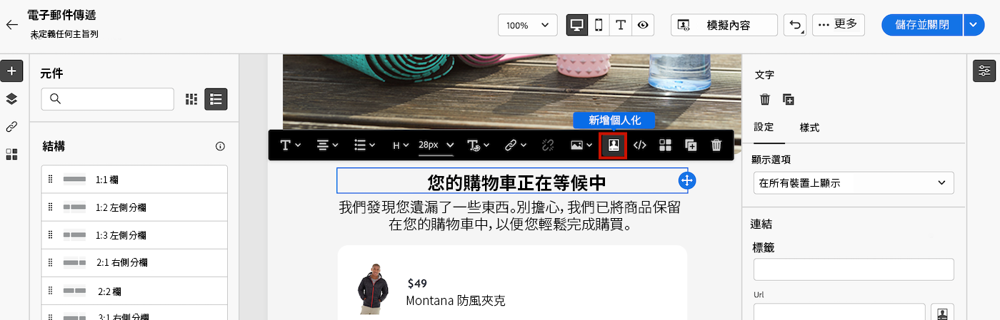

# 開始使用動態內容

為了充分運用每一次行銷活動，Adobe Campaign可讓您提供自訂動態內容，以與客戶就其層級溝通。 根據設定檔資料，使用個人化功能建立不同群組和個人的自訂體驗：您可以運用您擁有的關於特定收件者的資料和資訊，根據他們來調整您的訊息。 這可以是他們的名字、興趣、居住地、購買內容等等。

使用 Campaign 建立動態內容並傳送個人化訊息。可合併個人化功能以改善您的訊息並建立自訂的使用者體驗。

您可以插入以下內容，讓訊息內容成為動態的：

* **個人化欄位**

   個人化欄位用於訊息的第一層個人化。您可以從個人化編輯器選取資料庫中的任何欄位。對於傳遞，您可以選取與收件者、訊息或傳遞相關的任何欄位。這些個人化屬性可以插入訊息的主旨行或內文中。

   

   以下語法將收件者城市插入您的內容：&lt;%= recipient.location.city %>。

* **條件式內容**

   例如，設定條件式內容以根據收件者的設定檔新增動態個人化。特定條件為真時，即可插入文字區塊及/或影像。當條件不是true時，您可以定義內容的替代版本。

* **內建的內容區塊**

   Campaign 隨附一組個人化區塊，其中包含您可以插入到傳遞中的特定轉譯。例如，您可以新增標誌、問候語訊息，或電子郵件訊息映象頁面的連結。 可從個人化編輯器中的專用專案取得內容區塊。

   

## 我可以在哪裡新增動態內容？

Adobe Campaign V8 Web提供運算式編輯器，您可在其中選取、排列、自訂及驗證所有資料，以建立內容的自訂體驗。

運算式編輯器適用於所有管道，在每個具有「開啟個人化」對話方塊圖示的欄位中，例如主旨行欄位，或電子郵件中的文字和按鈕內容元件。

此外，在設計電子郵件時可存取專用的條件式內容產生器。 [瞭解如何在電子郵件中建立條件式內容](conditions.md)

## 讓我們深入探討

現在您已瞭解如何讓內容充滿活力，是時候深入探討這些檔案區段來開始使用功能了。

<table style="table-layout:fixed"><tr style="border: 0;">
<td>

<a href="personalize.md"><strong>新增個人化</strong></a>

</td>
<td>

<a href="conditions.md"><strong>新增條件式內容</strong>

</td>
<td>

<a href="content-blocks.md"><strong>新增內建內容區塊</strong></a>

</td>
</tr></table>
