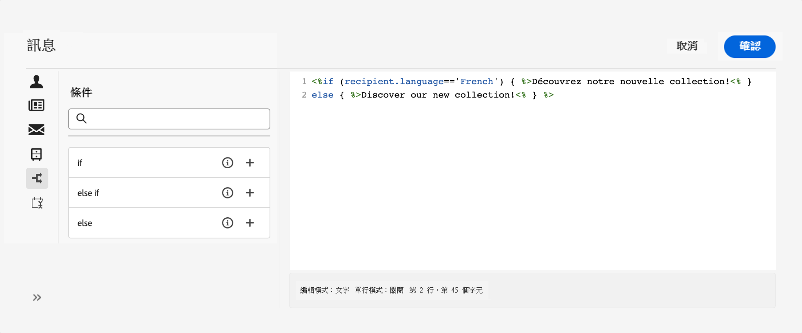

# 開始使用動態內容 {#gs-dynamic-content}

>[!CONTEXTUALHELP]
>id="acw_targetdata_personalization_dashboard"
>title="個人化"
>abstract="運算式編輯器可讓您選取、安排、自訂和驗證所有資料，以建立內容的自訂體驗。您可以利用設定檔資料將傳送每個收件者的訊息個人化，並建立條件式內容，針對每個收件者調整訊息，並僅顯示相關內容。此外，個人化區塊可用於將預先定義的個人化內容新增到您的傳遞中。"

身為行銷人員，瞄準真正對您的產品感興趣的客戶並提供有效且相關的內容與他們互動是最重要的。考慮到您面對的收件者範圍極為廣泛，若要建立多個行銷內容以訴求不同的人群可能既費時又浪費資源。這就是動態內容可發揮效用之處。

Adobe Campaign Web 動態內容功能可讓您根據已經收集的有關收件者的資訊自訂內容。使用動態內容，您即可確保行銷內容更具相關性，避免行銷不需要或不必要的產品或服務。這種方法使您的內容更具吸引力並增加了讀取內容的可能性。此外，這還能讓您將內容個人化，使收件者感覺他們是在從人而不是機器接收資訊。

## 如何製作動態內容？  {#make-content-dyn}

在 Campaign Web 運算式編輯器中插入 JavaScript 結構，即可製作動態的訊息內容。傳送訊息時，Adobe Campaign 會解譯這些運算式，以便將正確的內容傳遞給您的每個收件者：

* 利用每個特定收件者的名字、興趣、居住地、購買的商品等設定檔資料傳送&#x200B;**個人化訊息**&#x200B;給他們。您可以從和收件者、訊息或傳遞相關的個人化編輯器中選取資料庫中的任何可用欄位。可將這些個人化屬性插入訊息的主旨行或內文中。以下語法是將收件者的城市插入您的內容：&lt;%= recipient.location.city %>。

  {zoomable=&quot;yes&quot;}{width="800" align="center"}

* **建立條件式內容**&#x200B;以針對每個收件者調整傳遞，並僅顯示根據所掌握的客戶資訊和特定客戶相關的內容。這讓您可根據條件顯示特定的文字區塊和/或影像。例如，可根據收件者對特定服務的訂閱調整電子郵件的橫幅。

  {zoomable=&quot;yes&quot;}{width="800" align="center"}

* **使用個人化區塊**&#x200B;以節省時間並在您的訊息中運用易於重複使用的個人化內容。Campaign 會隨附一組個人化區塊，其中包含您可以插入到傳遞中的特定呈現。例如，您可以新增標誌、問候訊息或電子郵件訊息鏡像頁面的連結。內容區塊可從個人化編輯器中的專屬項目取得。

  {zoomable=&quot;yes&quot;}{width="800" align="center"}

## 存取運算式編輯器 {#access}

Adobe Campaign Web 會提供運算式編輯器，您可在此選取、安排、自訂和驗證所有資料，以建立內容的自訂體驗。運算式編輯器可在所有管道中取得，在具有&#x200B;**[!UICONTROL 開啟個人化對話框]**&#x200B;圖示的每個欄位中，例如主旨行欄位，或電子郵件連結和文字/按鈕內容元件。

以下是有關如何根據要動態化的內容存取運算式編輯器的一些範例：

* *從寄件者姓名欄位存取運算式編輯器*

  {zoomable=&quot;yes&quot;}{width="800" align="center"}

* *從電子郵件文字元件存取運算式編輯器*

  {zoomable=&quot;yes&quot;}{width="800" align="center"}

* *從電子郵件中的連結存取運算式編輯器*

  {zoomable=&quot;yes&quot;}{width="800" align="center"}

>[!NOTE]
>
>除了運算式編輯器之外，您還可以在設計電子郵件時利用專用的條件式內容產生器。[了解如何在電子郵件中建置條件式內容](conditions.md)

## 讓我們深入探討 {#dive-deeper}

由於您已經了解如何製作動態內容，您現在可以深入了解這些文件章節，以開始使用該功能。

<table style="table-layout:fixed"><tr style="border: 0;">
<td>

<a href="personalize.md"><strong>新增個人化</strong></a>

</td>
<td>

<a href="conditions.md"><strong>新增條件內容</strong>

</td>
<td>

<a href="content-blocks.md"><strong>新增內建的內容區塊</strong></a>

</td>
</tr></table>
