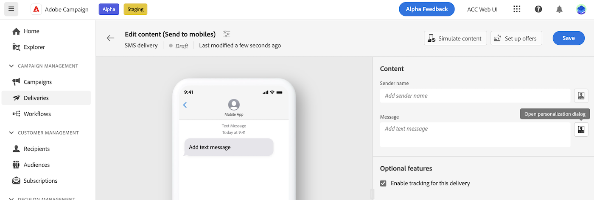
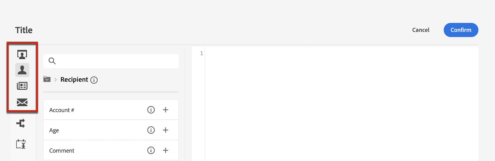
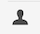
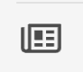
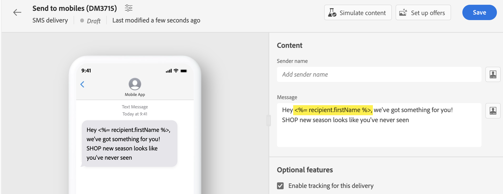
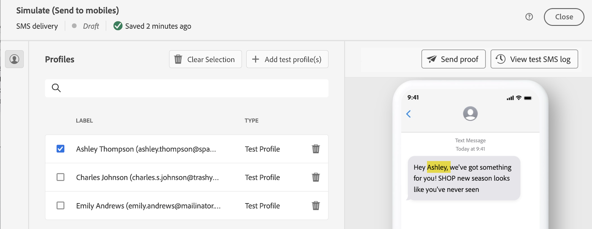

# 個人化您的內容 {#add-personalization}

您可以使用運算式編輯器來個人化任何傳遞，該編輯器可在具有的欄位中存取 **[!UICONTROL 開啟個人化對話方塊]** 圖示，例如主旨列、電子郵件連結和文字/按鈕內容元件。 [瞭解如何存取運算式編輯器](gs-personalization.md/#access)

## 個人化語法 {#syntax}

個人化標籤會遵循特定語法： `<%= table.field %>`. 例如，若要從收件者表格插入收件者的姓氏，請使用 `<%= recipient.lastName %>` 語法。

在傳遞準備程式期間，Adobe Campaign會自動解譯這些標籤，並以每個收件者的對應欄位值取代。 您可以藉由模擬內容來檢視實際取代。

從外部檔案上傳連絡人以進行獨立電子郵件傳遞時，輸入檔案中的所有欄位都可用於個人化。 語法如下： `<%= dataSource.field %>`.

## 新增個人化標籤 {#add}

若要將個人化標籤新增至傳遞，請遵循下列步驟：

1. 使用開啟運算式編輯器 **[!UICONTROL 開啟個人化對話方塊]** 圖示可從文字型別編輯欄位存取，例如主旨行或SMS內文。 [瞭解如何存取運算式編輯器](gs-personalization.md/#access)

   {zoomable=&quot;yes&quot;}{width="800" align="center"}

1. 運算式編輯器開啟。 Adobe Campaign資料庫中可用的個人化欄位會整理到畫面左側的數個功能表中：

   {zoomable=&quot;yes&quot;}{width="800" align="center"}

   | 選單 | 說明 |
   |-----|------------|
   | {zoomable=&quot;yes&quot;} | 此 **[!UICONTROL 訂閱者應用程式]** 功能表會列出與應用程式訂閱者相關的欄位，例如使用的終端機或作業系統。 *此功能表僅適用於推播通知* |
   | {zoomable=&quot;yes&quot;} | 此 **[!UICONTROL 收件者]** 功能表會列出在收件者表格中定義的欄位，例如收件者的名稱、年齡或地址。 時間 [從外部檔案上傳連絡人](../audience/file-audience.md) 對於獨立電子郵件傳送，此功能表會列出輸入檔案中可用的所有欄位。 |
   | {zoomable=&quot;yes&quot;} | 此 **[!UICONTROL 訊息]** 功能表會列出與傳送記錄檔相關的欄位，包括跨所有通道傳送給收件者或裝置的所有訊息，例如與指定收件者的最後一個事件日期 |
   | {zoomable=&quot;yes&quot;} | 此 **[!UICONTROL 傳遞]** 功能表會列出與執行傳送所需的引數相關的欄位，例如傳送通道或標籤。 |

   >[!NOTE]
   >
   >依預設，每個功能表都會列出所選表格中的所有欄位（收件者、/訊息/傳遞）。 如果要包含連結至所選表格的表格欄位，請啟用 **[!UICONTROL 顯示進階屬性]** 選項的位置。

1. 若要新增個人化欄位，請將游標置於內容內所需的位置，然後按一下 `+` 按鈕以插入它。

1. 一旦您的內容準備就緒後，您就可以儲存該內容，並透過模擬您的內容來測試個人化的呈現。 以下範例顯示具有收件者名字的SMS訊息個人化。

   {zoomable=&quot;yes&quot;}{width="800" align="center"}

   {zoomable=&quot;yes&quot;}{width="800" align="center"}
