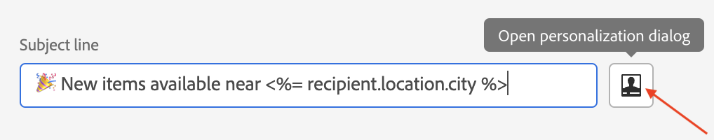
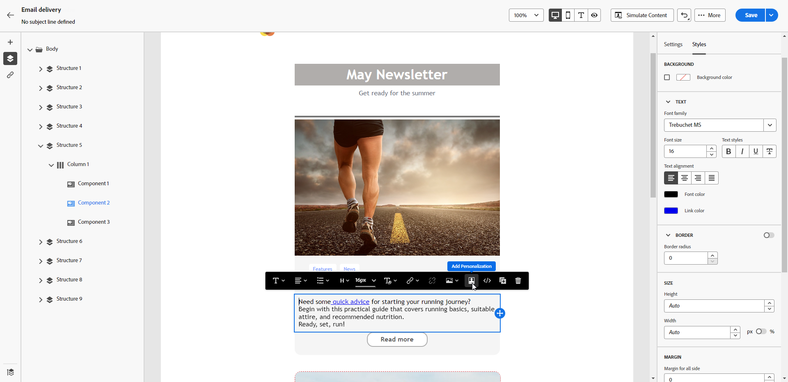
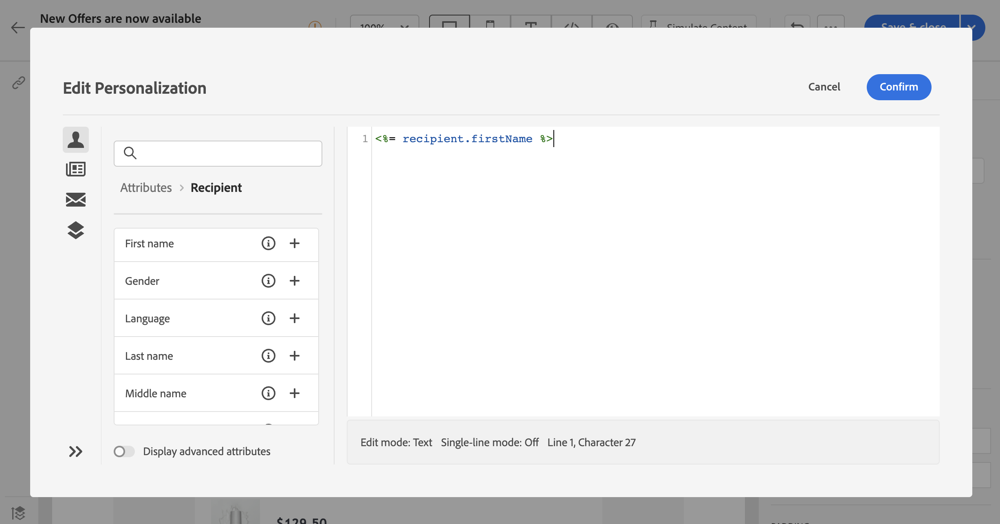
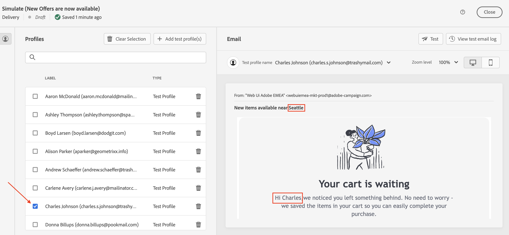
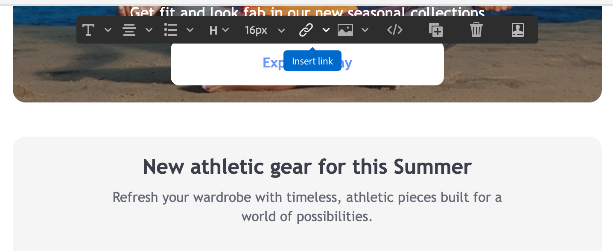

# 個人化您的內容{#add-personalization}

您可以透過以下方式個人化訊息內容：

* 插入動態 **個人化欄位**

   個人化欄位是用於訊息的第一層級個人化。 您可以從個人化編輯器中選取資料庫中可用的任何欄位。 對於傳遞，您可以選取與收件者、訊息或傳遞相關的任何欄位。 這些個人化屬性可插入訊息的主旨行或內文中。

   

   上方的語法將收件者的城市插入您的內容中：&lt;%= recipient.location.city %>。

* 插入預定義 **內容區塊**

   Campaign隨附一組個人化區塊，其中包含您可插入至傳送的特定轉譯。 例如，您可以新增標誌、問候訊息或訊息鏡像頁面的連結。 內容區塊可從個人化編輯器中的專用項目使用。

   
<!--
* Create **conditional content**

    Configure conditional content to add dynamic personalization based on the recipient’s profile for example. Text blocks and/or images are inserted when a particular condition is true.
-->

## 個人化電子郵件主旨行 {#personalize-subject-line}

若要在 **[!UICONTROL 主旨行]** 欄位，請遵循下列步驟：

1. 按一下 **開啟個人化對話方塊** 表徵圖 **主旨行** 欄位。
1. 輸入主旨行內容並選取要新增的個人化屬性。
1. 按一下「確認」以驗證。 個人化屬性會新增至主旨行。

## 個人化您的電子郵件內容 {#personalize-emails}

若要個人化電子郵件內容，請在電子郵件設計工具中開啟訊息，然後：

1. 在文字區塊內按一下。
1. 在內容工具列中，選取 **新增個人化**.

   

1. 在個人化編輯器中插入收件者的名稱並確認。

   

   個人化屬性會新增至電子郵件內容。

   您可以模擬內容以檢查呈現。 [了解更多](../preview-test/preview-content.md)

   

## 個人化電子郵件中的連結 {#personalize-links}

若要個人化 **連結**:

1. 選取文字區塊或影像。
1. 在內容工具列中，選取 **新增個人化**.

   

1. 使用個人化編輯器來定義並個人化連結。

## 個人化您的優惠方案 {#personalize-offers}

將文字類型內容新增至選件的表示時，您也可以存取個人化編輯器。
