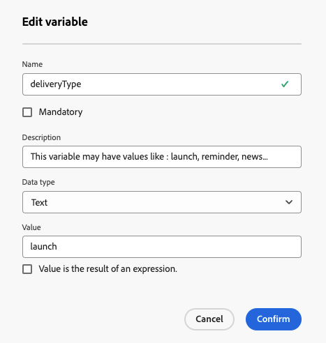
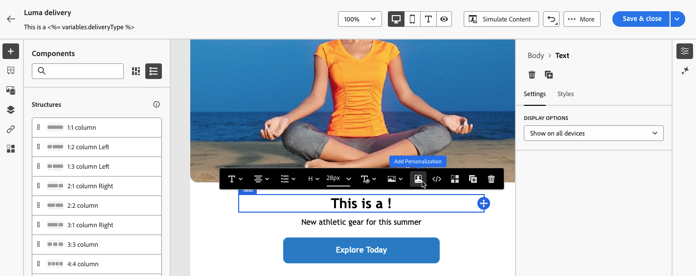
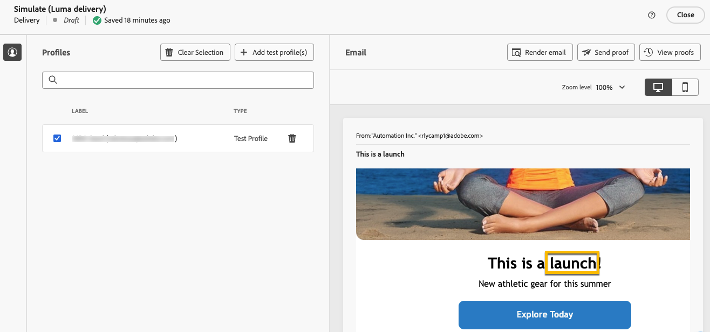

# 個人化您的內容 {#add-personalization}

>[!CONTEXTUALHELP]
>id="acw_personalization_editor_add_current_date"
>title="新增目前日期"
>abstract="此選單提供與日期格式相關的功能，您可以利用這些功能來個人化您的內容。"

傳遞內容的Personalization是一項關鍵功能，可讓您為個別收件者量身打造訊息，讓通訊更具相關性和吸引力。

在Adobe Campaign中，使用設定檔名稱、位置或過去互動等[設定檔資料](#data-personalization)，以及傳遞的特定[變數](#variables-personalization)，您就能動態自訂通訊中的文字、影像和選件等元素。

傳遞個人化可改善使用者體驗及參與率，進而帶來更高的轉換率和客戶滿意度。

## 使用個人化設定檔資料 {#data-personalization}

您可使用運算式編輯器以設定檔資料個人化任何傳遞，該編輯器可使用&#x200B;**[!UICONTROL 開啟個人化對話方塊]**&#x200B;圖示的欄位進行存取，例如主旨列、電子郵件連結和文字/按鈕內容元件。 [瞭解如何存取運算式編輯器](gs-personalization.md/#access)。

### Personalization語法 {#syntax}

Personalization標籤遵循特定語法： `<%= table.field %>`。 例如，若要從收件者表格插入收件者的姓氏，請使用`<%= recipient.lastName %>`語法。

在傳遞準備程式期間，Adobe Campaign會解譯這些標籤，並以每個收件者的對應欄位值取代這些標籤。 您可以藉由模擬內容來檢視實際取代。

從外部檔案上傳連絡人以進行獨立電子郵件傳遞時，輸入檔案中的所有欄位都可用於個人化。 語法如下： `<%= dataSource.field %>`。

### 新增個人化標籤 {#add}

若要將個人化標籤新增至傳遞，請遵循下列步驟：

1. 使用&#x200B;**[!UICONTROL 開啟個人化對話方塊]**&#x200B;圖示開啟運算式編輯器，可從文字型別編輯欄位（例如主旨行或簡訊內文）存取。 [瞭解如何存取運算式編輯器](gs-personalization.md/#access)。

   {zoomable="yes"}{width="800" align="center"}

1. 運算式編輯器開啟。 Adobe Campaign資料庫中可用的個人化欄位會整理到畫面左側的數個功能表中：

   {zoomable="yes"}{width="800" align="center"}

   | 選單 | 說明 |
   |------|-------------|
   | {zoomable="yes"} | **[!UICONTROL 訂閱者應用程式]**&#x200B;功能表會列出與應用程式訂閱者相關的欄位，例如使用的終端機或作業系統。 *此功能表僅適用於推播通知。* |
   | {zoomable="yes"} | **[!UICONTROL 收件者]**&#x200B;功能表列出在收件者表格中定義的欄位，例如收件者的名稱、年齡或地址。 從外部檔案[上傳獨立電子郵件傳遞的連絡人時，此功能表會列出輸入檔案中可用的所有欄位。](../audience/file-audience.md) |
   | {zoomable="yes"} | **[!UICONTROL 訊息]**&#x200B;功能表會列出與傳送記錄檔相關的欄位，包括跨所有通道傳送給收件者或裝置的所有訊息，例如與指定收件者最後一次事件的日期。 |
   | {zoomable="yes"} | **[!UICONTROL 傳遞]**&#x200B;功能表會列出與執行傳遞所需引數相關的欄位，例如傳遞通道或標籤。 |

   >[!NOTE]
   >
   >依預設，每個功能表都會列出所選表格中的所有欄位（收件者、/訊息/傳遞）。 如果要包含連結至所選表格的表格欄位，請啟用位於清單下方的&#x200B;**[!UICONTROL 顯示進階屬性]**&#x200B;選項。

1. 若要新增個人化欄位，請將游標置於內容中所需的位置，然後按一下「`+`」按鈕加以插入。

1. 內容準備就緒後，請儲存內容，並模擬內容以測試個人化的呈現。 以下範例顯示具有收件者名字的SMS訊息個人化。

   {zoomable="yes"}{width="800" align="center"}

   {zoomable="yes"}{width="800" align="center"}

## 使用變數進行個人化 {#variables-personalization}

您也可以使用變數來個人化您的傳遞。 深入瞭解[新增變數至傳遞](../advanced-settings/delivery-settings.md#variables-delivery)。

例如，變數`deliveryType`的定義如下所示。

{zoomable="yes"}

此變數使用這個範例中的&#x200B;**[!UICONTROL 新增Personalization]**&#x200B;圖示和運算式`<%= variables.deliveryType %>`，用於傳遞的內容。

{zoomable="yes"}

檢查變數搭配&#x200B;**[!UICONTROL 模擬內容]**&#x200B;按鈕的使用。

{zoomable="yes"}