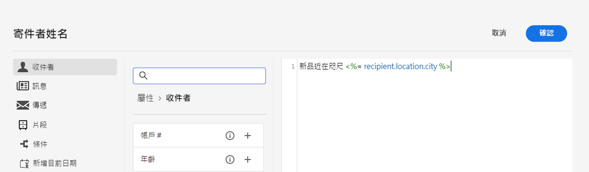

# 個人化您的內容{#add-personalization}

您可以透過以下方式個人化訊息內容：

* 插入動態 **個人化欄位**

   個人化欄位是用於訊息的第一層級個人化。 您可以從個人化編輯器中選取資料庫中可用的任何欄位。 對於傳遞，您可以選取與收件者、訊息或傳遞相關的任何欄位。 這些個人化屬性可插入主旨行或訊息內文中。

   

   下列語法會將收件者的城市插入內容中：&lt;%= recipient.location.city %>。

* 插入預定義 **內容區塊**

   Campaign隨附一組個人化區塊，其中包含您可插入至傳送的特定轉譯。 例如，您可以新增標誌、問候訊息或訊息鏡像頁面的連結。 內容區塊可從個人化編輯器中的專用項目使用。

   
<!--
* Create **conditional content**

    Configure conditional content to add dynamic personalization based on the recipient’s profile for example. Text blocks and/or images are inserted when a particular condition is true.
-->

## 個人化電子郵件主旨行 {#personalize-subject-line}

若要在 **[!UICONTROL 主旨行]** 欄位，請遵循下列步驟：

1. 按一下 **開啟個人化對話方塊** 表徵圖 **主旨行** 欄位。
1. 輸入主旨行內容並選取要新增的個人化屬性。
1. 按一下 **確認** 以驗證。 個人化屬性會新增至主旨行。

## 個人化您的電子郵件內容 {#personalize-emails}

若要個人化電子郵件內容，請在電子郵件設計工具中開啟訊息，然後：

1. 在文字區塊內按一下。
1. 在內容工具列中，選取 **新增個人化**.

   

1. 在個人化編輯器中插入收件者的名稱並確認。

   

   個人化屬性會新增至電子郵件內容。

   您可以模擬內容以檢查呈現。 [了解更多](../preview-test/preview-content.md)

   

若要將內容區塊新增至您的電子郵件，請套用相同步驟並從最後一個圖示選取內容區塊：

插入後，內容區塊會新增至電子郵件內容，如下所示。 在傳送準備步驟產生個人化時，會自動調整為收件者設定檔。

內建內容區塊包括：

* **[!UICONTROL 由Adobe Campaign啟用]**:插入「Enabled by Adobe Campaign」標誌。
* **[!UICONTROL 專名的格式功能]**:會產生 **[!UICONTROL toSmartCase]** Javascript函式，可將每個字詞的首字母變更為大寫。
* **[!UICONTROL 問候]**:插入帶有收件人全名的問候語，後面跟逗號。 範例：「你好，無名氏，」
* **[!UICONTROL 插入徽標]**:插入在實例設定中定義的徽標。
* **[!UICONTROL 鏡像頁面的連結]**:插入連結至 [鏡像頁面](mirror-page.md). 預設格式為：「如果您無法正確檢視此訊息，請按一下這裡」。
* **[!UICONTROL 鏡像頁面URL]**:插入鏡像頁面URL，使「傳遞設計人員」能夠檢查連結。
* **[!UICONTROL 以統一模式提供接受URL]**:插入URL，以便將選件設定為 **[!UICONTROL 已接受]**. （如果已啟用互動模組，便可使用此區塊）
* **[!UICONTROL 註冊確認]**:插入啟用以確認訂閱的連結。
* **[!UICONTROL 註冊連結]**:插入訂閱連結。 此連結會在執行個體設定中定義。 預設內容為：&quot;要註冊，請按一下這裡。&quot;
* **[!UICONTROL 註冊連結（具有反向連結）]**:插入訂閱連結，以識別訪客和傳送。 此連結會在執行個體設定中定義。
* **[!UICONTROL 註冊頁面URL]**:插入訂閱URL
* **[!UICONTROL 內容電子郵件的樣式]** 和 **[!UICONTROL 通知樣式]**:產生程式碼，使用預先定義的HTML樣式來格式化電子郵件。
* **[!UICONTROL 取消訂閱連結]**:插入可從所有傳送（封鎖清單）中取消訂閱的連結。 預設關聯內容為：「你收到這條資訊是因為你與 ***您的組織名稱*** 或附屬機構。 不再接收來自 ***您的組織名稱*** 按一下這裡。」

## 個人化電子郵件中的連結 {#personalize-links}

若要個人化 **連結**:

1. 選取文字區塊或影像。
1. 在內容工具列中，選取 **插入連結**.

   

1. 輸入連結標籤，然後使用 **插入連結** 按鈕來個人化連結。

   

1. 使用個人化編輯器來定義及個人化連結，並進行確認。

   

## 個人化您的優惠方案 {#personalize-offers}

將文字類型內容新增至選件的表示時，您也可以存取個人化編輯器。 深入了解 [本節](../content/offers.md).
