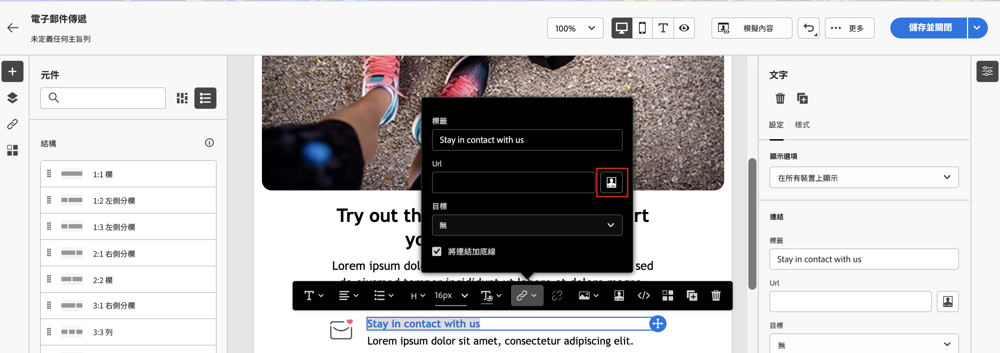

# 個人化您的內容{#add-personalization}

## 個人化訊息的主旨列 {#personalize-subject-line}

若要在訊息的&#x200B;**[!UICONTROL 主旨行]**&#x200B;欄位新增個人化，請依照以下步驟進行：

1. 開啟傳遞，然後按一下 **[!UICONTROL 編輯內容]**.
1. 按一下 **[!UICONTROL 開啟個人化對話方塊]** 圖示右側 **[!UICONTROL 主旨列]** 電子郵件欄位，或 **[!UICONTROL 標題]** 推播/簡訊傳遞的欄位。

   {width="600"}

1. 輸入主旨行或標題，然後選取要新增的個人化屬性。

1. 按一下「**[!UICONTROL 確認]**」以驗證。個人化屬性會新增至內容。

## 個人化您的電子郵件內容 {#personalize-emails}

若要個人化電子郵件內容，請在電子郵件設計工具中開啟訊息，然後：

1. 在文字區塊內按一下。
1. 在內容關聯式工具列中，選取「**[!UICONTROL 新增個人化]**」。

   

1. 在個人化編輯器中插入收件者名稱並確認。

   

   個人化屬性已新增到電子郵件內容。

   您可以模擬內容以檢查轉譯。[了解更多](../preview-test/preview-content.md)

   

1. 若要在電子郵件中新增內容區塊，請執行相同的步驟，然後從最後一個圖示選取內容區塊：

   

1. 插入後，即將內容區塊新增到電子郵件內容。在傳遞準備步驟中，個人化產生時，它會自動適應收件者設定檔。

   

## 個人化電子郵件中的連結 {#personalize-links}

若要個人化&#x200B;**連結**：

1. 選取文字區塊或影像。
1. 在內容關聯式工具列中，選取「**插入連結**」。

   

1. 輸入連結標籤並使用「**插入連結**」按鈕來個人化連結。

   

1. 使用個人化編輯器來定義和個人化連結，並確認。

   

## 個人化您的優惠 {#personalize-offers}

您也可以在將文字類型的內容新增到優惠的表示時存取個人化編輯器。在[本章節](../content/offers.md)了解更多資訊。

