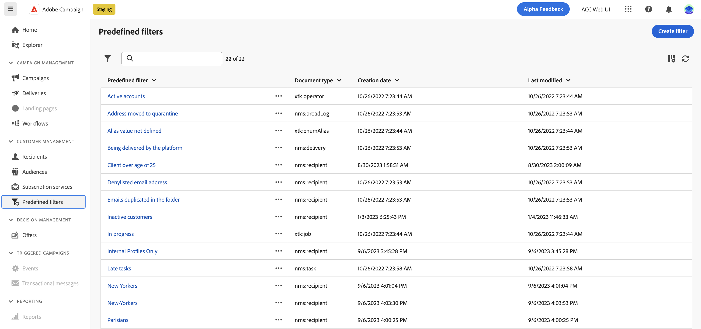
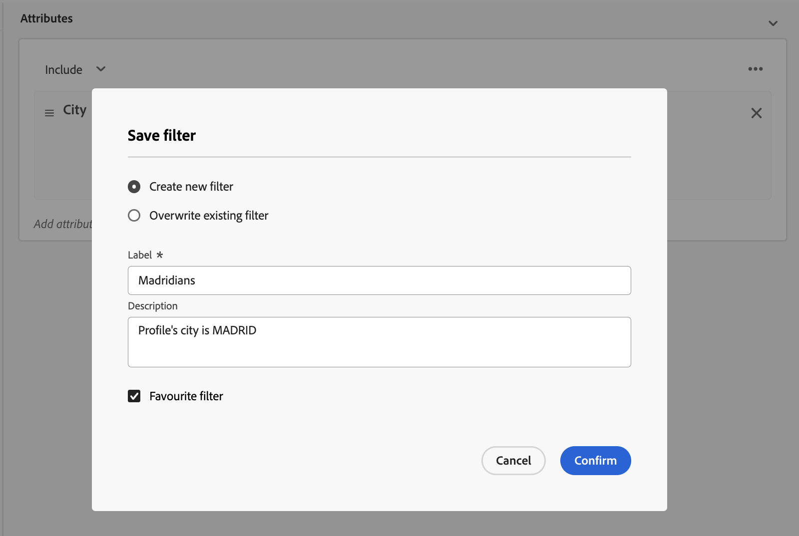
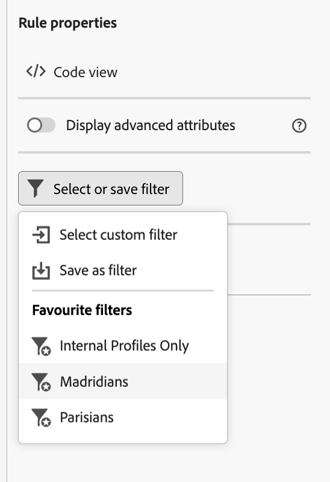

# 使用預先定義的篩選器 {#predefined-filters}

>[!CONTEXTUALHELP]
>id="acw_homepage_card3"
>title="預先定義的篩選器管理"
>abstract="Campaign網頁版現在提供使用者易記的介面，讓您輕鬆管理及自訂預先定義的篩選器，以符合特定需求。 建立一次並儲存以供日後使用。"

>[!CONTEXTUALHELP]
>id="acw_predefined-filters-dashboard"
>title="預先定義的篩選"
>abstract="Campaign網頁版現在提供使用者易記的介面，讓您輕鬆管理及自訂預先定義的篩選器，以符合特定需求。 建立一次並儲存以供日後使用。"

預先定義的篩選器是可供日後使用的自訂篩選器。 在使用規則產生器的篩選作業期間，它們可以當做捷徑使用。

## 建立預先定義的篩選器 {#create-predefined-filter}

>[!CONTEXTUALHELP]
>id="acw_predefined-filters-creation"
>title="建立預先定義的篩選器"
>abstract="輸入預先定義篩選的標籤，並選取要套用至的表格。 開啟其他選項以新增說明，並將此篩選器設定為我的最愛。 然後使用「建立規則」按鈕來定義篩選條件。"

使用規則產生器建立篩選器時，您可以儲存以供日後使用。 儲存為自訂篩選器時，可供日後使用。 您也可以從左側導覽的專用功能表建立和編輯預先定義的篩選器。

若要在規則產生器中儲存自訂篩選器，請遵循下列步驟：

1. 開啟規則產生器並定義篩選條件。 在以下範例中，您會篩選住在馬德里的收件者。
1. 按一下 **選取或儲存篩選器** 按鈕，然後選取 **另存為篩選器**.

   

1. 選取 **建立新的篩選器**，並輸入該篩選器的名稱和說明。

   

1. （選用）啟用 **另存為最愛** 選項，即可在我的最愛中檢視此預先定義的篩選器。

   

1. 按一下 **確認** 以儲存變更。

您的自訂篩選器現在可在 **預先定義的篩選器** 清單並可供所有Campaign使用者存取。

## 使用預先定義的篩選器 {#use-predefined-filter}

## 管理預先定義的篩選器 {#manage-predefined-filter}

