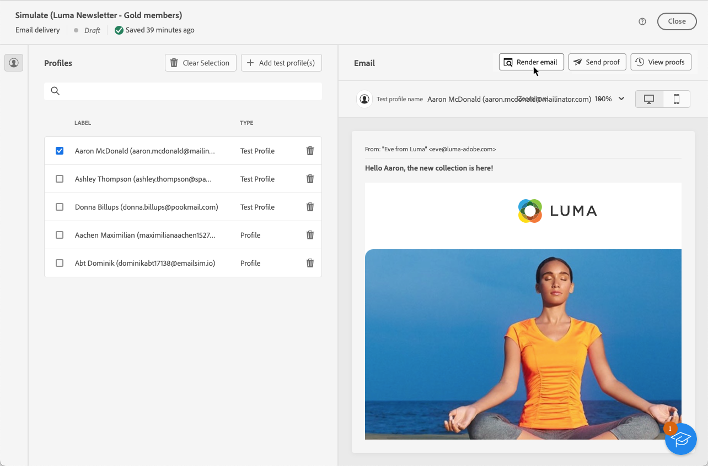
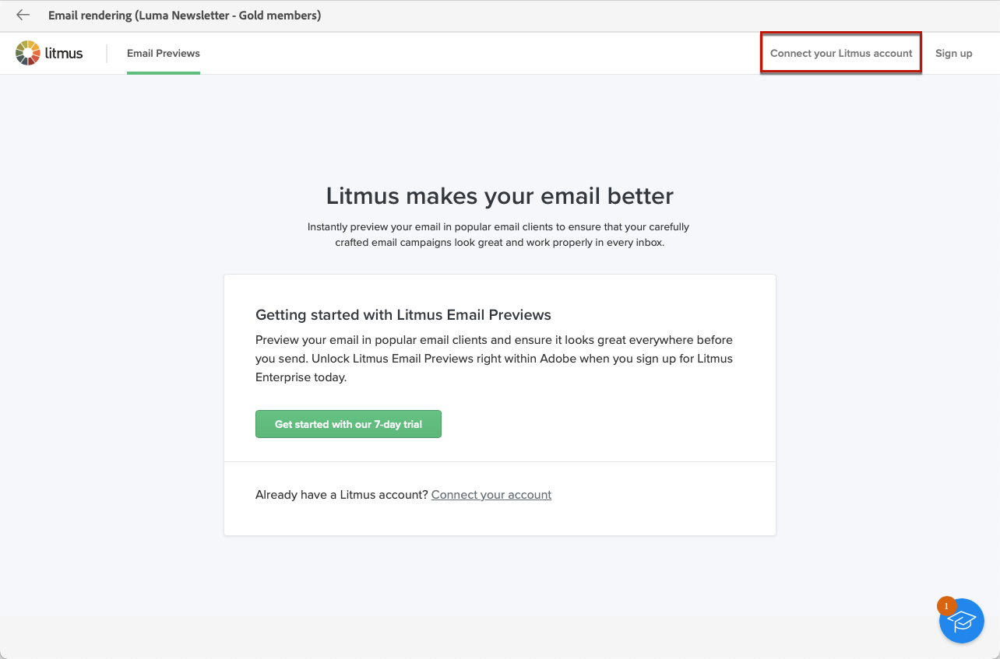
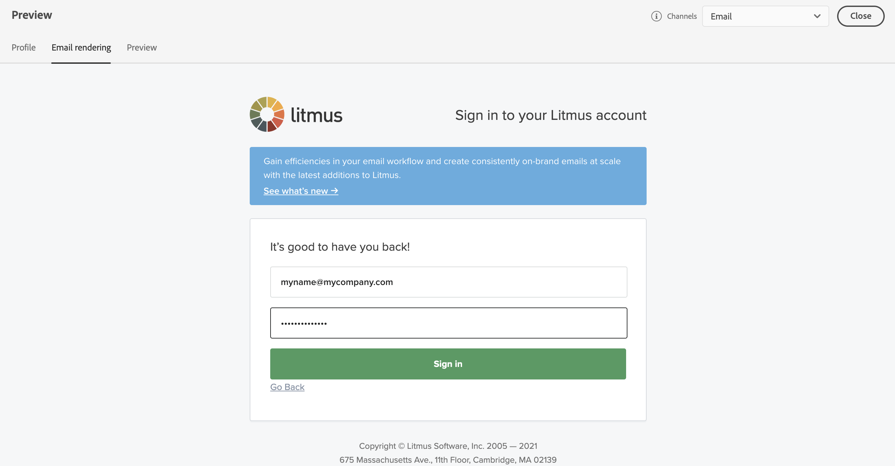
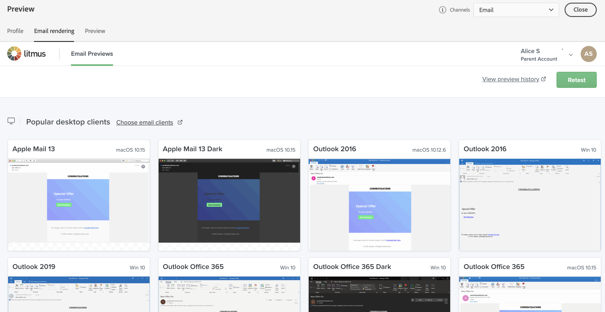

# 測試電子郵件轉譯 {#email-rendering}

在傳送電子郵件之前，請確定您的訊息以最佳方式顯示在各種Web使用者端和裝置上給收件者。

若要這麼做，您可以利用 **Litmus** 帳戶至 [!DNL Adobe Campaign] 即時預覽不同內容中的電子郵件呈現，並檢查主要案頭和應用程式（網頁郵件、訊息服務、行動裝置等）中的相容性。

>[!CAUTION]
>
>在Campaign中使用電子郵件呈現會傳送測試電子郵件至第三方系統。 透過將您的Litmus帳戶與 [!DNL Campaign]，您確認Adobe對您可能傳送給該第三方的任何資料概不負責。 Litmus資料保留電子郵件原則適用於這些電子郵件，包括可能包含在這些測試訊息中的個人化資料。 若要存取或刪除這類資料，您必須直接聯絡Litmus。

若要存取電子郵件呈現功能，您需要：

* 擁有Litmus帳戶
* 選取測試設定檔 — 瞭解如何 [本節](preview-content.md)

然後，請遵循下列步驟。

1. 在 [編輯內容](../content/edit-content.md) 畫面或 [電子郵件設計工具](../content/get-started-email-designer.md)，按一下 **[!UICONTROL 模擬內容]** 按鈕。

1. 選取 **[!UICONTROL 演算電子郵件]** 按鈕。

   

1. 按一下 **連線您的Litmus帳戶** 在右上角。

   

1. 輸入您的憑證並登入。

   

1. 按一下 **執行測試** 按鈕以產生電子郵件預覽。

1. 在熱門的案頭、行動裝置和網頁型使用者端中檢視您的電子郵件內容。

   

<!--
TO CHECK IF user is directed to Litmus or if the email rendering is shown directly in the Campaign UI.

CONTENT ABOVE COPIED FROM AJO

If not redirecting to Litmus:

To test the email rendering, follow these steps:

1. Access the email content creation screen, then click **[!UICONTROL Simulate content]**.

1. Click the **[!UICONTROL Render email]** button.

    The left pane provides various desktop, mobile and web-based email clients. Select the desired email client to display a preview of your email in the right pane. 

    

    >[!NOTE]
    >
    >The email clients list provides a sample of the major mail clients. Additional email clients are available from the filter button next to the top search bar.

 -->
