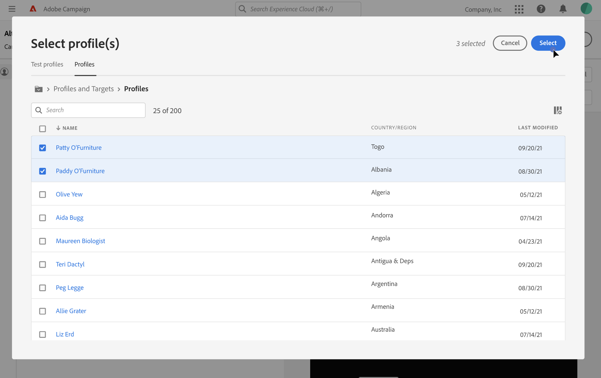
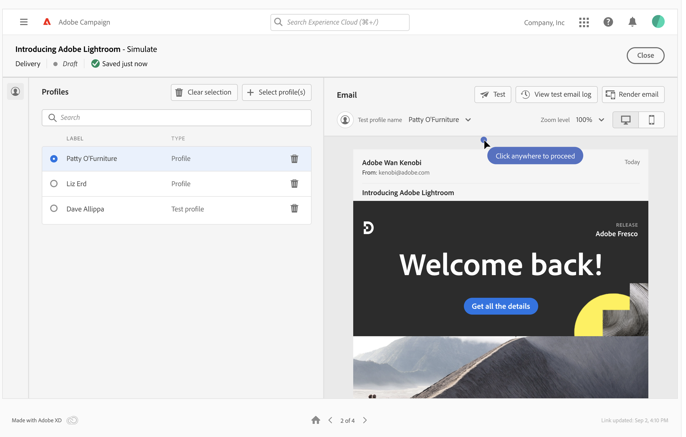

# Preview email content {#preview}

>[!CONTEXTUALHELP]
>id="acw_homepage_card4"
>title="Smart preview of your content"
>abstract="Adobe Campaign lets you use profiles to preview the content of your email before sending, check personalization and how your recipients will see it."

Adobe Campaign allows you to preview the content of your email before sending it, to check personalization, and how it is displayed to your recipients.

To preview the content of your email, follow these steps:

1. Access the email content creation screen and click the **[!UICONTROL Simulate content]** button.

    

1. Select one or multiple profiles by clicking the **[!UICONTROL Select profile(s)]** button, then use the **[!UICONTROL Test profiles]** and **[!UICONTROL Profiles]** tabs to choose from:

    * The **Test profiles** tab contains seed addresses, which are additional and fictitious recipients in the database. They can be created in Adobe Campaign console into the **[!UICONTROL Resources]** / **[!UICONTROL Campaign Management]** / **[!UICONTROL Seed addresses]** folder.
    * The **Profiles** tab lists all the recipients stored into the **[!UICONTROL Profiles and Targets]** folder from the Campaign console.

    You can combine both test profiles and profiles to preview your email.

    

1. Once profiles have been selected, a preview of the email is displayed in the right pane. Personalized elements are replaced by the data from the profile selected in the left pane.

    If you have added multiple profiles, you can switch between them in the list to preview the corresponding email.

    >[!NOTE]
    >
    >You can preview the rendering of your content on different devices (desktop, mobile, tablet), by clicking the dedicated icon in the top right corner.

    

