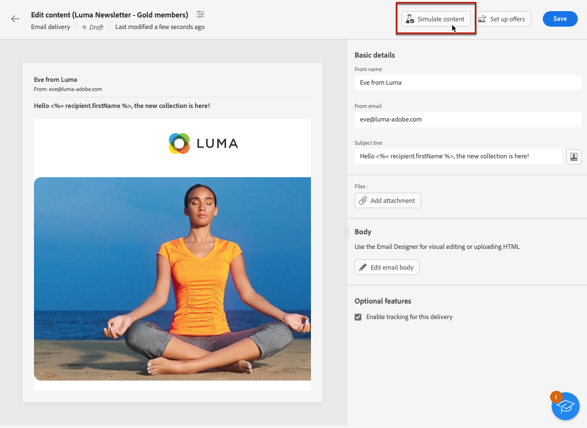
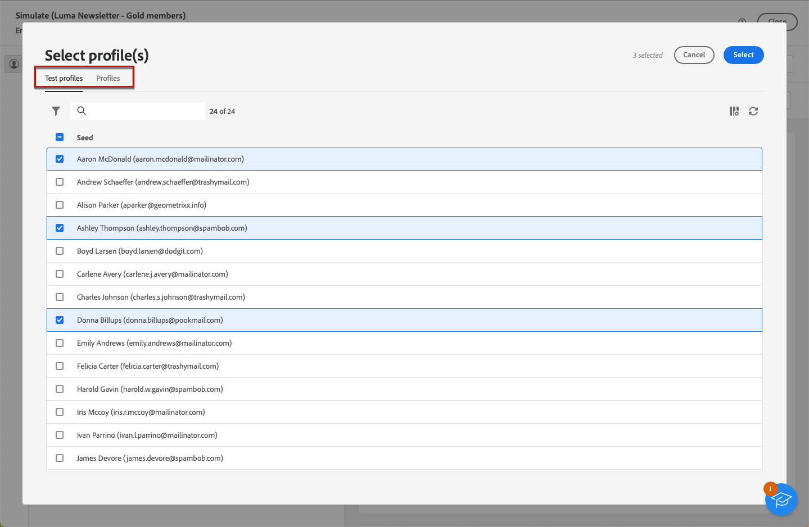
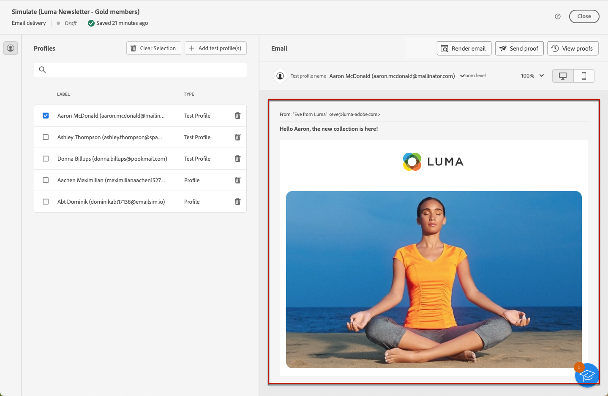

# 預覽電子郵件內容 {#preview-content}

使用 [!DNL Campaign] 內容模擬功能，可在傳送電子郵件前預覽電子郵件內容。 這可讓您控制個人化，並檢查其向收件者顯示的方式。

若要預覽電子郵件內容，請遵循下列步驟。

1. 瀏覽至電子郵件 [編輯內容](../content/edit-content.md) 畫面或 [電子郵件設計工具](../content/get-started-email-designer.md).

1. 按一下 **[!UICONTROL 模擬內容]** 按鈕。

   

1. 使用 **[!UICONTROL 新增測試設定檔]** 按鈕來選取將用來預覽個人化內容的設定檔。

1. 您可以結合測試設定檔和設定檔來預覽您的電子郵件。

   * 「**[!UICONTROL 測試設定檔]**」索引標籤會列出所有種子地址，這些地址是資料庫中額外和虛構的收件者。

     >[!NOTE]
     >
     >測試設定檔可在 [!DNL Campaign] 主控台進入 **[!UICONTROL 資源]** > **[!UICONTROL Campaign Management]** > **[!UICONTROL 種子地址]** 資料夾。 進一步瞭解 [Campaign v8 （主控台）檔案](https://experienceleague.adobe.com/docs/campaign-classic/using/sending-messages/using-seed-addresses/creating-seed-addresses.html){target="_blank"}

   * 「**[!UICONTROL 設定檔]**」索引標籤會列出儲存在 主控台「**[!UICONTROL 設定檔和目標]**」資料夾中的所有收件者。[!DNL Campaign][了解更多](https://experienceleague.adobe.com/docs/campaign/campaign-v8/audience/view-profiles.html){target="_blank"}

   

1. 按一下 **[!UICONTROL 選取]** 以確認您在兩個標籤中的選取。

   電子郵件的預覽會顯示在 **[!UICONTROL 模擬]** 畫面。 個人化元素會以來自在左窗格中選取之設定檔的資料取代。

   

1. 如果您已新增多個設定檔，您可以在清單中切換它們以預覽對應的電子郵件內容。您也可以使用左窗格中的對應按鈕，新增更多測試設定檔並清除選取專案。

1. 您可以調整 **[!UICONTROL 縮放等級]** 並使用右上角的專用圖示在案頭或行動裝置上預覽您的內容。

1. 從 **[!UICONTROL 模擬]** 熒幕您也可以：
   * 檢查常見電子郵件使用者端中的電子郵件呈現 —  [瞭解更多](email-rendering.md)
   * 傳送測試電子郵件給特定收件者進行驗證 —  [瞭解更多](proofs.md)

