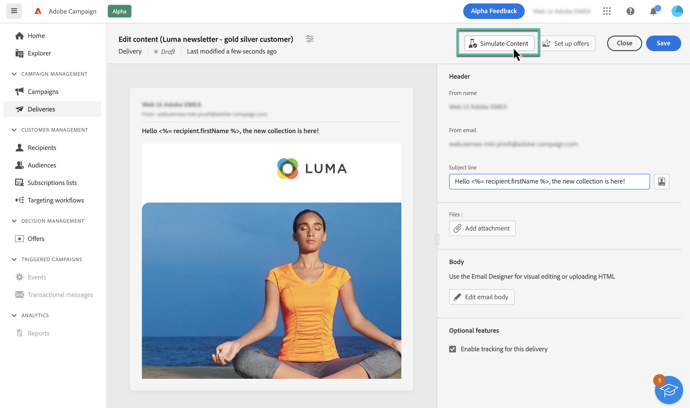

# About email preview and test {#about-preview-proofs}

Before sending an email, it is important to review and test its content to ensure that it is accurate and free of errors in content or personalization settings.

To do this, Adobe Campaign allows you to:

* [Preview the email content and personalization](#preview),
<!--* [Check the email rendering](#rendering) in popular desktop, mobile and web-based clients,-->
* [Send test emails](#send-proofs) to specific recipients for testing and validation.

These actions can be performed from the **[!UICONTROL Simulate content]** button which is accessible when creating the content of your email of from the Email Designer:

>[!NOTE]
>
>Content simulation is also available from the delivery summary after clicking the **[!UICONTROL Review and send]** button.
