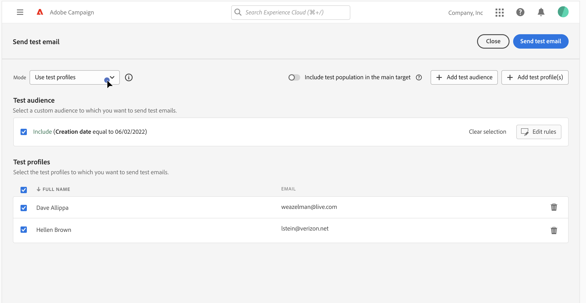

# 傳送校樣 {#send-proofs}

>[!NOTE]
>
>本檔案正在建置中，且經常更新。 此內容的最終版本將於2023年1月推出。

傳送校樣可讓您驗證電子郵件，並檢查各種元素，例如連結、選擇退出連結和鏡像頁面、影像，以及偵測可能的錯誤。

校樣可傳送給兩種收件者：

* **測試設定檔/對象**:將校樣傳送至種子地址，種子地址是資料庫中不屬於電子郵件目標的其他收件者，

* **替代配置檔案**:使用現有的設定檔將校樣傳送至特定電子郵件地址。 這可讓您將自己置於設定檔的位置，並取得設定檔將收到之訊息的精確表示。

## 選取校樣收件者 {#recipients}

1. 存取電子郵件內容建立畫面，然後按一下 **[!UICONTROL 模擬內容]**.

1. 按一下 **[!UICONTROL 測試]** 按鈕，然後使用 **[!UICONTROL 模式]** 下拉式清單，選擇將接收校樣的收件者類型：

<!-- to check: by default, profiles selected in previous screen are pre-selected for proofs. Can add addtitional profiles + remove preselected?-->

### 傳送校樣至測試設定檔

1. 選擇 **[!UICONTROL 使用測試設定檔]** 模式。

1. 新增將接收測試電子郵件的測試設定檔。

   您也可以建立對象，以根據您自己的條件，使用 **[!UICONTROL 新增測試對象]** 按鈕。

   

### 將校樣傳送至替代設定檔

1. 選擇 **[!UICONTROL 目標替代]** 模式。

1. 新增將接收校樣的電子郵件地址。

   >[!NOTE]
   >
   >您可以指定任何電子郵件地址。 這可讓您傳送校樣給任何使用者，即使他們不是Adobe Campaign V8的使用者亦然。

1. 對於每個電子郵件地址，從目標中選取要使用的設定檔。 您也可以讓Adobe Campaign從目標中選取隨機設定檔。

   

選取校樣收件者後，您就可以傳送測試電子郵件。 [了解如何傳送校樣](#send)

>[!NOTE]
>
>如果您想要傳送最終電子郵件訊息給校樣的收件者，請啟用 **[!UICONTROL 在主目標中包含測試母體]** 選項。

## 傳送校樣 {#send}

若要將校樣傳送至選取的收件者，請按一下 **[!UICONTROL 傳送測試電子郵件]** 然後確認傳送。

傳送校樣後，您即可從 **[!UICONTROL 檢視測試電子郵件記錄]** 按鈕。 這些記錄可讓您存取已傳送的校樣，以及與校樣傳送相關的特定統計資料。

視需要傳送多份校樣，直到完成傳送內容為止。 完成此操作後，您就可以將電子郵件傳送至主要目標。 [了解如何準備和傳送您的電子郵件](../monitor/prepare-send.md)
